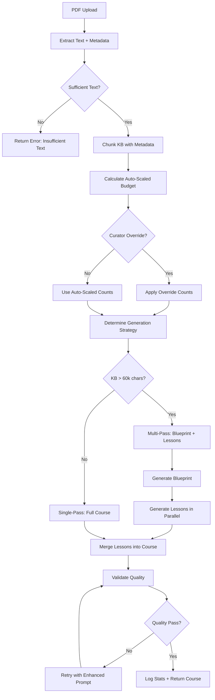
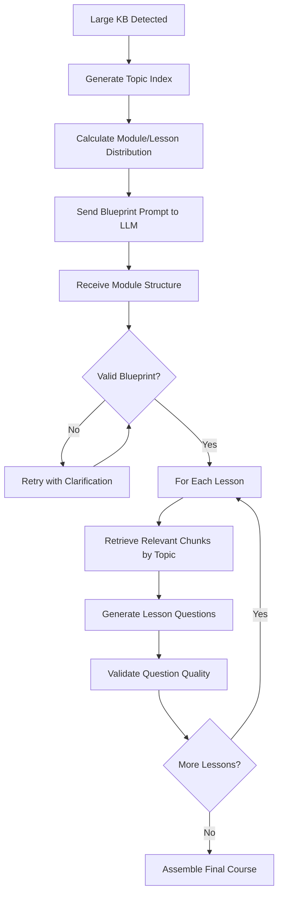

# Course Generation Logic - Quality, Scaling, and No Hardcoded Limits

## Overview

This design addresses the core problems with AI course generation from PDF/KB materials: insufficient question counts, hardcoded logic, weak multiple-choice distractors, and insufficient grounding in source material. The solution implements dynamic scaling, improved prompt engineering, multi-pass generation for large content, and comprehensive quality validation.

## Problem Statement

### Current Issues
1. **Insufficient question generation**: Large PDFs (40+ pages) produce only 10-20 questions instead of expected 40-120
2. **Hardcoded limits**: Traces of fixed question counts (e.g., always 4 or 7 questions regardless of content volume)
3. **Poor KB grounding**: Generated questions sometimes ignore knowledge base content
4. **Weak MCQ distractors**: Options are obviously wrong or have inconsistent formatting
5. **Content-heavy approach**: Too many "content-only" steps instead of question-first learning

### Constraints
- Maintain existing API routes and business logic
- Preserve current UX flow (improvements behind existing screens/settings)
- No gamification features
- No changes to routing unless necessary for DoD

## Solution Architecture

### A. Unified Input Contract

#### Knowledge Payload Structure

All course generation requests must provide a standardized knowledge payload regardless of source type (PDF, text, DOCX):

| Field | Type | Description | Source |
|-------|------|-------------|---------|
| `extracted_text_chunks[]` | Array | Text fragments from source material | PDF parser, text splitter |
| `chunk_id` | Integer | Unique chunk identifier | Auto-generated during chunking |
| `text` | String | Chunk content (200-1800 chars) | Extracted from source |
| `page_range` | String (optional) | Page numbers if from PDF | PDF metadata |
| `char_count` | Integer | Character count for chunk | Calculated |
| `section_title` | String (optional) | Detected heading/section | Structure detection |

#### Pre-Generation Metadata

Before invoking LLM, system must compute and pass:

| Metadata Field | Calculation Method | Purpose |
|----------------|-------------------|---------|
| `total_chars` | Sum of all chunk `char_count` | Scaling basis |
| `total_chunks` | Count of chunks array | Retrieval planning |
| `estimated_pages` | From PDF metadata or chars/2500 | User feedback |
| `language` | Language detection on sample | Prompt localization |
| `content_density` | Heading count / total_chunks | Complexity factor |

#### Validation Rules

**Empty or Insufficient Text Handling:**
- If `total_chars < 500`: Return error state with message "Не удалось извлечь текст из PDF / слишком мало текста"
- Suggest alternative: "Загрузите текстовый PDF или предоставьте текст вручную"
- Do not generate generic placeholder course

**Quality Checks:**
- Verify all chunks have non-empty `text` field
- Ensure `chunk_id` uniqueness
- Validate `char_count` matches actual text length

### B. Dynamic Question Count Logic

#### Scaling Formula

Remove all hardcoded question caps. Implement auto-scaling based on content volume and complexity.

**Base Scaling Tiers:**

| KB Size (chars) | Question Range | Module Range | Reasoning |
|----------------|----------------|--------------|-----------|
| < 8,000 | 7-12 | 1-2 | Short document, focused content |
| 8,000-25,000 | 12-25 | 2-3 | Medium document, multiple topics |
| 25,000-60,000 | 25-45 | 3-5 | Substantial manual/guide |
| 60,000-120,000 | 45-80 | 5-7 | Comprehensive training material |
| 120,000+ | 80-140+ | 7-10 | Large corpus, may require multi-pass |

**Complexity Adjustment:**

Multiply base question count by complexity factor:

```
complexity_factor = 1.0 + (0.3 * density_score)

where density_score = min(1.0, heading_count / (total_chunks * 0.15))
```

Rationale: Content with more structure (headings, sections) covers more distinct topics and warrants more questions.

**Final Question Count:**

```
target_questions = base_questions * complexity_factor
target_questions = round(target_questions)
```

#### Curator Override Controls

Provide two override mechanisms during course creation:

**Option 1: Preset Sizes**

| Preset | Description | Question Multiplier | Module Multiplier |
|--------|-------------|-------------------|------------------|
| Small | Quick overview, key concepts only | 0.6x | 0.7x |
| Medium | Standard training, balanced coverage | 1.0x (default) | 1.0x |
| Large | Comprehensive, deep dive | 1.5x | 1.3x |

**Option 2: Explicit Counts (Advanced)**

Curator specifies exact targets:

| Field | Type | Default Behavior |
|-------|------|-----------------|
| `quiz_count` | Integer (optional) | If set, AI must generate exactly this many MCQs |
| `open_count` | Integer (optional) | If set, AI must generate exactly this many open questions |
| `roleplay_count` | Integer (0-1) | 0 or 1 (MVP limitation) |
| `content_steps_max` | Integer (optional) | Cap on pure content steps |

**Priority Logic:**
1. If explicit counts provided, use them (curator override)
2. Else if preset selected, apply multiplier to auto-scaled counts
3. Else use auto-scaled counts

**Validation:**
- If curator sets `quiz_count = 50` but KB has only 5000 chars, warn: "Запрошено слишком много вопросов для данного объёма материала. Рекомендуемое количество: 10-15."
- Allow curator to proceed but log warning

### C. Module Grouping Strategy

#### Auto-Module Creation Rules

**Trigger Condition:**
- If `total_questions > 15`, automatically create modules

**Module Count Calculation:**

| Total Questions | Module Count | Steps per Module |
|----------------|--------------|------------------|
| 16-30 | 2-3 | 5-10 |
| 31-60 | 3-5 | 6-12 |
| 61-100 | 5-7 | 8-14 |
| 100+ | 7-10 | 10-15 |

**Module Structure:**

Each module contains:

| Field | Description | Example |
|-------|-------------|---------|
| `title` | Concise topic name (≤ 50 chars) | "Обработка возражений клиента" |
| `goal` | Learning objective (1 sentence) | "Научиться распознавать и отрабатывать стандартные возражения" |
| `module_tag` | Short identifier for analytics | "objections_handling" |
| `steps[]` | Array of questions/content | 8-12 items |

#### Topic-Based Clustering

For module organization, group questions by semantic topics:

**Topic Extraction Process:**
1. Run KB through topic detection (existing KB index generation)
2. Assign each generated question to 1-2 topics based on `kb_refs`
3. Cluster questions with same topic into modules
4. Balance module sizes (avoid 3-question or 25-question modules)

**Fallback (if modules too complex for MVP):**
- Tag each question with `module_label` (e.g., "Тема 1: Основы")
- UI can later group by `module_label`

### D. Question Quality Rules

#### 1. Question-First Approach

**Ratio Target:**
- Content-only steps: ≤ 20% of total steps
- Question steps (MCQ, open, scenario): ≥ 80%

**Content Step Format (when used):**

| Field | Max Length | Purpose |
|-------|-----------|---------|
| `text` | 700 chars (2-4 sentences) | Brief context setting |
| `bullets[]` | 3 items max | Key points only |
| `do[]` | 2 items max | Action guidelines |
| `dont[]` | 2 items max | Common mistakes |

**Rule:** If content step exceeds 700 chars, split into content + follow-up question.

#### 2. Grounding Requirements

**Every question must include:**

| Field | Type | Purpose | Validation |
|-------|------|---------|------------|
| `kb_refs` | Integer[] | Chunk IDs used as evidence | Must reference ≥1 valid chunk |
| `source_hint` | String (internal only) | Page range or section title | For debugging, not shown to users |

**Grounding Validation:**
- During generation, verify each question's `kb_refs` exist in provided chunks
- If LLM generates question without `kb_refs`, retry with reminder prompt
- If retry fails, mark question with `kb_gap: true` flag

**KB Gap Handling:**
- Questions marked `kb_gap: true` excluded from final course
- Log warning: "Вопрос отклонён: отсутствует обоснование в KB"
- Reduce question count accordingly

#### 3. Multiple-Choice Quality Standards

**Distractor Quality Rules:**

| Rule | Description | Example Violation | Correct Example |
|------|-------------|-------------------|-----------------|
| Plausibility | All options must be "near misses" | A) Correct concept B) Nonsense C) Joke D) "All above" | A) Method A B) Method B (common mistake) C) Method C (partial solution) D) Method D (wrong context) |
| Length consistency | Options within 2x length of each other | A) Yes (3 chars) B) Yes, but only if temperature exceeds threshold and protocol permits... (95 chars) | All options 20-40 chars |
| Same data type | All options same category | A) 10 minutes B) Red C) Manager D) 500 rubles | A) 10 minutes B) 30 minutes C) 1 hour D) 2 hours |
| No obvious giveaways | Avoid "always", "never", extreme absolutes | A) Always refuse B) Consider context (correct) C) Never ask D) Ignore policy | A) Ask follow-up question B) Acknowledge concern (correct) C) Escalate immediately D) Offer discount |
| Randomized position | Correct answer not always first | Correct always at index 0 | Correct index randomized |

**Distractor Generation Prompt Guidelines:**

Include in LLM system prompt:
- "Generate 3 plausible wrong answers (distractors) that represent common misconceptions or partial understanding"
- "Distractors must be factually incorrect but semantically similar to correct answer"
- "Avoid joke options, 'all of the above', or 'none of the above'"
- "Ensure all 4 options are same grammatical structure and similar length"

**Validation:**
- If any option < 5 chars or > 150 chars, flag as low-quality
- If correct answer > 2x any distractor length, flag
- If distractor contains "неверно", "все вышеперечисленное", flag

#### 4. Open-Ended Answer Rubrics

**Rubric Structure:**

Each open question must include:

| Field | Content | Max Items | Purpose |
|-------|---------|-----------|---------|
| `required_key_points[]` | Essential concepts to mention | 3-6 | Core grading criteria |
| `common_mistakes[]` | Typical wrong approaches | 2-4 | Deduction triggers |
| `scoring_guide` | Mapping from point coverage to score | 0/5/10 scale | Partial credit logic |
| `sample_good_answer` | Example of 9-10/10 answer | ≤ 450 chars | Student reference |

**Scoring Formula:**

```
matched_points = count of required_key_points covered by answer
partial_points = count of partially covered points

score = round(10 * (matched_points + 0.5 * partial_points) / total_required_points)
```

**Validation:**
- Ensure `required_key_points` extracted from KB chunks (not invented)
- Each key point must have `source_quote` from KB

#### 5. Difficulty Distribution

**Default Mix (can be adjusted by curator):**

| Difficulty Level | Definition | Target Percentage |
|-----------------|------------|------------------|
| Practical/Application | Apply concept to scenario | 60% |
| Recall/Definition | Remember fact or term | 25% |
| Analysis/Evaluation | Compare or judge | 15% |

**Profile-Based Adjustment:**

For sales/support/retail courses, increase practical to 75%, reduce recall to 15%.

### E. Roleplay Generation (If Enabled)

#### Roleplay Structure

If `roleplay_count = 1`:

| Field | Specification | Example |
|-------|---------------|---------|
| `scenario` | Real-world situation (≤ 600 chars) | "Клиент звонит с жалобой: заказ не пришёл через 3 дня после обещанной даты доставки. Он расстроен и требует возврата денег." |
| `employee_role` | Learner's role | "Специалист службы поддержки" |
| `goal` | Desired outcome | "Успокоить клиента, выяснить детали, предложить решение" |
| `ai_role` | AI character | "Недовольный клиент" |
| `turns_total` | Conversation length | 6 (3 employee + 3 AI) |
| `rubric[]` | Evaluation criteria | ["Выразил эмпатию", "Задал уточняющие вопросы", "Предложил компенсацию"] |

#### Domain Profile Integration

Select roleplay style based on course content:

| Domain | Employee Role | AI Behavior | Evaluation Focus |
|--------|---------------|-------------|------------------|
| Sales | Sales rep | Skeptical buyer | Objection handling, value communication |
| Support | Support agent | Frustrated customer | Empathy, problem-solving, de-escalation |
| Retail | Store associate | Indecisive shopper | Product knowledge, upselling |
| General | Employee | Neutral | Policy compliance, communication clarity |

**Auto-Detection:**
Analyze KB for keywords to determine domain:
- If KB contains "продажи", "клиент", "сделка" → Sales
- If KB contains "поддержка", "жалоба", "возврат" → Support
- Else → General

### F. LLM Prompting Strategy

#### Two-Pass Generation Architecture

For large KBs (> 60,000 chars), use multi-pass approach:

**Pass 1: Blueprint Generation**

Purpose: Create high-level structure without actual question content.

Input to LLM:
- KB topic index (generated via `generateKBIndex`)
- Desired module/question counts
- Learning objectives

Output from LLM:
```
{
  "blueprint": {
    "modules": [
      {
        "module_id": "M1",
        "title": "...",
        "lessons": [
          {
            "lesson_id": "M1L1",
            "question_budget": 6,
            "topic_refs": ["topic_1", "topic_3"]
          }
        ]
      }
    ]
  }
}
```

**Pass 2-N: Lesson Generation**

For each lesson in blueprint:
- Retrieve relevant KB chunks matching `topic_refs`
- Generate `question_budget` questions using only those chunks
- Validate and merge into final course

Benefits:
- Prevents token limit issues with large KBs
- Ensures comprehensive topic coverage
- Allows parallel generation of lessons

#### System Prompt Template

**Core Principles (included in all generation prompts):**

```
You are a senior corporate trainer and instructional designer.

Anti-hallucination rules:
- Use ONLY information from provided KB chunks
- Every question must cite kb_refs (chunk IDs)
- If KB lacks information: mark kb_gap=true, do NOT invent facts
- Do NOT use terminology, examples, or procedures not in KB

Output format:
- ONLY valid JSON, no markdown, no comments
- Follow exact schema provided
- Language: Russian

MCQ quality:
- All 4 options plausible (no obvious correct answer)
- Similar length (max 2x difference)
- Same data type (all numbers, all actions, etc.)
- Correct answer randomized position
- Distractors are common misconceptions, not nonsense
```

#### User Prompt Template

**Blueprint Generation:**

```
Create course blueprint from Knowledge Base.

Title: "{title}"
Target: {target_question_count} questions, {module_count} modules
KB Statistics:
- Characters: {total_chars}
- Chunks: {total_chunks}
- Pages: {estimated_pages}
- Complexity: {complexity_factor}

KB Topics (use these ONLY):
{topic_list}

Requirements:
- Plan module structure covering all topics
- Assign question budgets per lesson
- Reference topic IDs, do NOT generate questions yet

Output JSON with blueprint schema.
```

**Lesson Generation:**

```
Generate lesson: "{lesson_title}"

Objective: {lesson_objective}
Question Budget: {question_budget} questions

Question Type Mix:
- Multiple choice: {mcq_count}
- Open answer: {open_count}
- Scenario: {scenario_count}

KB Chunks (use these ONLY):
{chunk_list}

Requirements:
- Generate EXACTLY {question_budget} questions
- Every question must have kb_refs array
- MCQ options must be plausible (no obvious correct)
- Open questions must have rubric with scoring guide
- If KB lacks info for any question: mark kb_gap=true

Output JSON with lesson schema.
```

#### Retry Logic

**JSON Parse Failure:**
1. First attempt: Standard generation
2. If parse fails: Append retry prompt
   ```
   "ОТВЕТ БЫЛ НЕКОРРЕКТНЫМ. Верни ТОЛЬКО валидный JSON без markdown."
   ```
3. If second parse fails: Log error, return failure state

**Insufficient Question Count:**

If LLM returns fewer questions than requested:

1. Calculate shortage: `shortage = requested - generated`
2. If `shortage > 20%` of requested:
   - Log warning
   - Append follow-up prompt:
     ```
     "Сгенерировано только {generated} вопросов, нужно {requested}. Добавь ещё {shortage} вопросов по оставшимся темам KB."
     ```
3. If retry still insufficient: Accept lower count but log for review

**Quality Validation Failure:**

After receiving LLM response, validate:
- MCQ has exactly 4 options
- All questions have `kb_refs`
- No questions marked `kb_gap` (or < 10% marked)

If validation fails on > 25% of questions:
- Log failure details
- Retry with quality reminder prompt

### G. Debugging and Logging

#### AI Interaction Logging

For every generation request, log to `ai_logs` table:

| Field | Content | Purpose |
|-------|---------|---------|
| `correlation_id` | Unique request ID | Track multi-pass generations |
| `action_type` | "blueprint" / "lesson_generate" / "generate_course" | Identify generation stage |
| `kb_enabled` | true | Confirm KB was used |
| `retrieved_chunk_ids` | Array of chunk IDs | Verify grounding |
| `prompt_text` | System + user prompt (truncated) | Debug prompt issues |
| `response_text` | LLM JSON response (truncated) | Verify output quality |
| `latency_ms` | Request duration | Performance monitoring |
| `status` | "success" / "error" | Track failure rate |
| `metadata.requested_counts` | {quiz: N, open: M, ...} | Scaling audit |
| `metadata.generated_counts` | {quiz: X, open: Y, ...} | Compare against request |
| `metadata.quality_flags` | {low_mcq_quality: 3, kb_gaps: 1} | Quality metrics |

#### Generation Statistics

Compute and log after each successful generation:

```
{
  "scaling_analysis": {
    "kb_chars": 85000,
    "target_questions": 65,
    "generated_questions": 62,
    "delta": -3,
    "scaling_factor": 1.2,
    "complexity_factor": 1.15
  },
  "quality_metrics": {
    "mcq_with_4_options": 42,
    "mcq_with_plausible_distractors": 38,
    "questions_with_kb_refs": 61,
    "questions_with_kb_gap": 1,
    "avg_distractor_length_ratio": 1.3
  },
  "type_distribution": {
    "content": 5,
    "quiz": 42,
    "open": 14,
    "roleplay": 1
  }
}
```

#### Error States and User Feedback

**Insufficient Text Error:**

```
{
  "error_code": "INSUFFICIENT_TEXT",
  "message": "Не удалось извлечь текст из PDF / слишком мало текста",
  "details": {
    "extracted_chars": 230,
    "minimum_required": 500
  },
  "suggestions": [
    "Загрузите PDF с текстовым слоем (не отсканированный)",
    "Экспортируйте документ в .txt или .md формат",
    "Вставьте текст вручную в поле 'База знаний'"
  ]
}
```

**Generation Failure Error:**

```
{
  "error_code": "GENERATION_FAILED",
  "message": "Не удалось сгенерировать курс требуемого качества",
  "details": {
    "requested_questions": 50,
    "generated_questions": 12,
    "quality_issues": ["mcq_low_distractor_quality", "insufficient_kb_grounding"]
  },
  "suggestions": [
    "Попробуйте уменьшить количество вопросов (preset: Small)",
    "Проверьте качество загруженного материала",
    "Обратитесь в поддержку с correlation_id: {id}"
  ]
}
```

### H. Acceptance Testing Criteria

#### Test Case 1: Small Document (2 pages, ~3,500 chars)

**Setup:**
- Upload 2-page PDF with clear training content
- Use default settings (no curator override)

**Expected Results:**
- Generated questions: 7-12 (within scaling range)
- Modules: 1-2
- All questions reference KB chunks (verified via `kb_refs`)
- MCQ distractors pass plausibility check (manual review of 5 random questions)

**Pass Criteria:**
- ✅ Question count in range
- ✅ No hardcoded limit detected (verify different 2-page docs produce different counts)
- ✅ ≥ 90% of questions have valid `kb_refs`

#### Test Case 2: Large PDF (40 pages, ~100,000 chars)

**Setup:**
- Upload 40-page comprehensive manual
- Preset: Large

**Expected Results:**
- Generated questions: 90-120 (with 1.5x multiplier)
- Modules: 7-10
- Module titles reflect different sections of manual
- Questions distributed across all modules

**Pass Criteria:**
- ✅ Question count ≥ 60 (minimum for Large preset)
- ✅ Modules properly grouped with 8-15 questions each
- ✅ Coverage: All major KB topics represented (verify via topic index)

#### Test Case 3: No Hardcoded Cap

**Setup:**
- Review codebase for patterns like:
  - `questions = 4`
  - `if file_size > X then questions = 7`
  - Fixed arrays of length 4

**Expected Results:**
- No hardcoded question counts in generation logic
- All question counts derived from `calculateCourseBudget()` or curator override

**Pass Criteria:**
- ✅ Code review confirms removal of hardcoded limits
- ✅ Multiple test PDFs of varying sizes produce proportional question counts

#### Test Case 4: MCQ Quality Spot Check

**Setup:**
- Generate course from any KB
- Extract 10 random MCQs

**Expected Results:**
For each MCQ:
- All 4 options present
- Correct answer not always at index 0
- Distractor lengths within 2x of each other
- No obvious "joke" or "all of the above" options

**Pass Criteria:**
- ✅ ≥ 8/10 MCQs pass all quality checks
- ✅ Distractors semantically related to question topic

#### Test Case 5: Open Question Rubric Quality

**Setup:**
- Generate course from any KB
- Extract 3 open questions

**Expected Results:**
For each open question:
- `rubric` contains 3-6 concrete key points
- Each key point has `source_quote` from KB
- `sample_good_answer` provided

**Pass Criteria:**
- ✅ All 3 questions have complete rubrics
- ✅ Key points traceable to KB content

#### Test Case 6: Curator Override

**Setup:**
- Upload 20-page PDF (~50,000 chars)
- Set explicit counts: `quiz_count = 30`, `open_count = 10`

**Expected Results:**
- Generated course has exactly 30 MCQs and 10 open questions
- Ignore auto-scaling suggestions

**Pass Criteria:**
- ✅ Question type counts match curator specification
- ✅ Warning shown if requested counts unrealistic for KB size

## Implementation Changes

### Modified Files

**`server/ai/prompts.ts`:**
- Update `COURSE_GENERATION_SYSTEM_PROMPT` with quality rules
- Update `BLUEPRINT_SYSTEM_PROMPT` and `LESSON_SYSTEM_PROMPT`
- Add quality validation guidance to all system prompts

**`server/ai/parsers.ts`:**
- Update `calculateCourseBudget()` with new scaling tiers
- Add `calculateComplexityFactor()` function
- Update question count ranges

**`server/ai/kb-service.ts`:**
- Enhance `generateBlueprint()` to include question type distribution
- Update `generateLesson()` to enforce exact question counts
- Add post-generation validation functions

**`server/ai/routes.ts`:**
- Add curator override parameter handling in `/api/ai/generate-track`
- Implement retry logic for insufficient question counts
- Add quality validation before returning course

**`shared/schema.ts`:**
- Add fields to `tracks` table for generation metadata:
  - `generation_metadata: jsonb` (stores requested vs. generated counts)

### New Functions

**`calculateComplexityFactor(chunks: KBChunk[]): number`**
- Analyzes KB structure to determine content density
- Returns multiplier for question count scaling

**`validateCourseQuality(course: any, kbChunks: any[]): ValidationResult`**
- Checks MCQ distractor quality
- Verifies KB grounding (all questions have `kb_refs`)
- Returns list of quality issues

**`applyCuratorOverride(autoScaled: CourseBudget, override: CuratorOverride): CourseBudget`**
- Merges auto-scaled counts with curator-specified counts
- Validates override reasonableness

## Data Flow

### Standard Generation Flow



### Blueprint Generation (Large KB)



## Quality Assurance Mechanisms

### Pre-Generation Validation

| Check | Failure Action | Error Message |
|-------|----------------|---------------|
| KB text < 500 chars | Abort generation | "Не удалось извлечь текст из PDF" |
| No valid chunks created | Abort generation | "Материал не содержит структурированного текста" |
| Requested questions > 3x auto-scaled | Show warning | "Слишком много вопросов для объёма материала" |

### Post-Generation Validation

| Check | Threshold | Failure Action |
|-------|-----------|----------------|
| Questions with kb_refs | ≥ 90% | Flag low-quality course |
| MCQs with 4 options | 100% | Remove invalid MCQs |
| Distractor length ratio | < 2.5x | Mark for manual review |
| Questions marked kb_gap | < 10% | Acceptable, log count |
| Generated vs. requested question delta | ≤ 20% | Retry generation |

### Curator Feedback

After generation, show curator summary:

```
Курс успешно создан!

Статистика:
- Модулей: 6
- Вопросов: 58 из 60 запрошенных
- Типы: 38 тестовых, 18 открытых, 2 сценария
- Покрытие базы знаний: 95%

Предупреждения:
- 2 вопроса помечены низким качеством дистракторов (ID: 12, 34)
- 1 вопрос не имеет ссылки на KB (ID: 45)

[Просмотреть детали] [Принять курс] [Регенерировать]
```

## Configuration and Tuning

### Scaling Parameters (Adjustable)

Located in `server/ai/parsers.ts`:

```typescript
// Adjust these constants to tune question generation
const SCALING_TIERS = [
  { maxChars: 8000, questionsMin: 7, questionsMax: 12 },
  { maxChars: 25000, questionsMin: 12, questionsMax: 25 },
  { maxChars: 60000, questionsMin: 25, questionsMax: 45 },
  { maxChars: 120000, questionsMin: 45, questionsMax: 80 },
  { maxChars: Infinity, questionsMin: 80, questionsMax: 140 }
];

const COMPLEXITY_WEIGHT = 0.3; // Increase for more emphasis on structure
const MIN_QUESTIONS_PER_MODULE = 5;
const MAX_QUESTIONS_PER_MODULE = 15;
```

### Prompt Templates (Adjustable)

Prompts stored in `server/ai/prompts.ts`. Key tunables:

```typescript
// MCQ quality instructions (adjust emphasis)
const MCQ_QUALITY_RULES = `
- All 4 options must be plausible (weight: HIGH)
- Similar length (max 2x difference) (weight: MEDIUM)
- Correct answer randomized (weight: MEDIUM)
`;

// Content-first vs. question-first ratio
const CONTENT_STEP_RATIO = 0.2; // 20% max content steps

// Open question rubric depth
const MIN_KEY_POINTS = 3;
const MAX_KEY_POINTS = 6;
```

### Curator Presets (Customizable)

Add/modify presets in configuration:

```typescript
const CURATOR_PRESETS = {
  small: { questionMultiplier: 0.6, moduleMultiplier: 0.7 },
  medium: { questionMultiplier: 1.0, moduleMultiplier: 1.0 },
  large: { questionMultiplier: 1.5, moduleMultiplier: 1.3 },
  // Add custom presets:
  quick_review: { questionMultiplier: 0.4, contentRatio: 0.5 },
  deep_dive: { questionMultiplier: 2.0, openRatio: 0.4 }
};
```

## Performance Considerations

### Generation Time Estimates

| KB Size | Question Count | Generation Strategy | Estimated Time |
|---------|---------------|-------------------|----------------|
| < 10k chars | 7-15 | Single-pass | 15-30 seconds |
| 10-30k | 15-30 | Single-pass | 30-60 seconds |
| 30-60k | 30-50 | Single-pass or 2-pass | 45-90 seconds |
| 60-120k | 50-80 | Multi-pass (2-4 lessons) | 90-180 seconds |
| 120k+ | 80-140 | Multi-pass (4-8 lessons) | 120-300 seconds |

### Timeout Handling

- Set timeout to 120 seconds for single-pass
- For multi-pass, set timeout per lesson to 60 seconds
- If timeout occurs, return partial course with warning

### Token Limit Management

- GigaChat limit: ~8000 tokens per request
- Blueprint prompt: ~2000 tokens (safe)
- Lesson prompt with 20 chunks: ~5000 tokens (safe)
- If KB chunks exceed token limit, truncate oldest chunks, prioritize by relevance score

## Migration Path

### Phase 1: Update Scaling Logic (Non-breaking)
- Implement new `calculateCourseBudget()` with dynamic tiers
- Update prompts to include quality rules
- Deploy, monitor generation logs

### Phase 2: Add Curator Controls (Additive)
- Add preset selection UI (optional, defaults to "medium")
- Add explicit count inputs (advanced mode, optional)
- Deploy, curators can opt-in

### Phase 3: Enable Multi-Pass for Large KBs (Conditional)
- Implement blueprint generation for KB > 60k
- Add parallel lesson generation
- Deploy, only triggers for large KBs

### Phase 4: Quality Validation Enforcement (Gradual)
- Enable post-generation validation (warning mode)
- Collect data on failure rates
- Switch to strict mode after 2 weeks

## Monitoring and Metrics

### Key Performance Indicators

| Metric | Target | Alert Threshold |
|--------|--------|-----------------|
| Avg questions generated per 10k chars KB | 8-15 | < 5 or > 20 |
| MCQ distractor quality score | > 0.8 | < 0.6 |
| Questions with valid kb_refs | > 90% | < 80% |
| Generation failure rate | < 5% | > 10% |
| Curator satisfaction (feedback) | > 4.0/5.0 | < 3.0 |

### Dashboard Queries

```sql
-- Average questions per KB size bracket
SELECT 
  CASE 
    WHEN kb_chars < 10000 THEN '< 10k'
    WHEN kb_chars < 30000 THEN '10-30k'
    WHEN kb_chars < 60000 THEN '30-60k'
    ELSE '60k+'
  END as kb_size_bracket,
  AVG(generated_questions) as avg_questions,
  COUNT(*) as courses_generated
FROM (
  SELECT 
    (metadata->>'kb_chars')::int as kb_chars,
    (metadata->>'generated_questions')::int as generated_questions
  FROM ai_logs
  WHERE action_type = 'generate_course'
  AND status = 'success'
  AND created_at > NOW() - INTERVAL '7 days'
) subquery
GROUP BY kb_size_bracket;
```

## Success Criteria

### Quantitative
- ✅ Large PDF (40 pages) generates ≥ 45 questions (baseline: 10-20)
- ✅ No hardcoded question limits in codebase
- ✅ ≥ 90% of questions have valid KB references
- ✅ MCQ distractor quality score > 0.7 (manual review of 100 random questions)
- ✅ Generation success rate > 95%

### Qualitative
- ✅ Curators report improved course depth
- ✅ Employees report more comprehensive training
- ✅ Generated questions cover full breadth of KB topics
- ✅ MCQ options are difficult to answer without KB knowledge

## Future Enhancements

### Beyond MVP
1. **Adaptive Difficulty**: Generate harder questions for advanced learners based on performance history
2. **Image/Diagram Inclusion**: Parse images from PDF and embed in content steps
3. **Video Transcript Integration**: Generate courses from video transcripts
4. **Multi-Language Support**: Auto-detect KB language and generate in matching language
5. **Incremental Course Updates**: Add questions to existing course when KB updated
6. **A/B Testing Question Types**: Experiment with question ratios to optimize learning outcomes


## Quality Assurance Mechanisms

### Pre-Generation Validation

| Check | Failure Action | Error Message |
|-------|----------------|---------------|
| KB text < 500 chars | Abort generation | "Не удалось извлечь текст из PDF" |
| No valid chunks created | Abort generation | "Материал не содержит структурированного текста" |
| Requested questions > 3x auto-scaled | Show warning | "Слишком много вопросов для объёма материала" |

### Post-Generation Validation

| Check | Threshold | Failure Action |
|-------|-----------|----------------|
| Questions with kb_refs | ≥ 90% | Flag low-quality course |
| MCQs with 4 options | 100% | Remove invalid MCQs |
| Distractor length ratio | < 2.5x | Mark for manual review |
| Questions marked kb_gap | < 10% | Acceptable, log count |
| Generated vs. requested question delta | ≤ 20% | Retry generation |

### Curator Feedback

After generation, show curator summary:

```
Курс успешно создан!

Статистика:
- Модулей: 6
- Вопросов: 58 из 60 запрошенных
- Типы: 38 тестовых, 18 открытых, 2 сценария
- Покрытие базы знаний: 95%

Предупреждения:
- 2 вопроса помечены низким качеством дистракторов (ID: 12, 34)
- 1 вопрос не имеет ссылки на KB (ID: 45)

[Просмотреть детали] [Принять курс] [Регенерировать]
```

## Configuration and Tuning

### Scaling Parameters (Adjustable)

Located in `server/ai/parsers.ts`:

```typescript
// Adjust these constants to tune question generation
const SCALING_TIERS = [
  { maxChars: 8000, questionsMin: 7, questionsMax: 12 },
  { maxChars: 25000, questionsMin: 12, questionsMax: 25 },
  { maxChars: 60000, questionsMin: 25, questionsMax: 45 },
  { maxChars: 120000, questionsMin: 45, questionsMax: 80 },
  { maxChars: Infinity, questionsMin: 80, questionsMax: 140 }
];

const COMPLEXITY_WEIGHT = 0.3; // Increase for more emphasis on structure
const MIN_QUESTIONS_PER_MODULE = 5;
const MAX_QUESTIONS_PER_MODULE = 15;
```

### Prompt Templates (Adjustable)

Prompts stored in `server/ai/prompts.ts`. Key tunables:

```typescript
// MCQ quality instructions (adjust emphasis)
const MCQ_QUALITY_RULES = `
- All 4 options must be plausible (weight: HIGH)
- Similar length (max 2x difference) (weight: MEDIUM)
- Correct answer randomized (weight: MEDIUM)
`;

// Content-first vs. question-first ratio
const CONTENT_STEP_RATIO = 0.2; // 20% max content steps

// Open question rubric depth
const MIN_KEY_POINTS = 3;
const MAX_KEY_POINTS = 6;
```

### Curator Presets (Customizable)

Add/modify presets in configuration:

```typescript
const CURATOR_PRESETS = {
  small: { questionMultiplier: 0.6, moduleMultiplier: 0.7 },
  medium: { questionMultiplier: 1.0, moduleMultiplier: 1.0 },
  large: { questionMultiplier: 1.5, moduleMultiplier: 1.3 },
  // Add custom presets:
  quick_review: { questionMultiplier: 0.4, contentRatio: 0.5 },
  deep_dive: { questionMultiplier: 2.0, openRatio: 0.4 }
};
```

## Performance Considerations

### Generation Time Estimates

| KB Size | Question Count | Generation Strategy | Estimated Time |
|---------|---------------|-------------------|----------------|
| < 10k chars | 7-15 | Single-pass | 15-30 seconds |
| 10-30k | 15-30 | Single-pass | 30-60 seconds |
| 30-60k | 30-50 | Single-pass or 2-pass | 45-90 seconds |
| 60-120k | 50-80 | Multi-pass (2-4 lessons) | 90-180 seconds |
| 120k+ | 80-140 | Multi-pass (4-8 lessons) | 120-300 seconds |

### Timeout Handling

- Set timeout to 120 seconds for single-pass
- For multi-pass, set timeout per lesson to 60 seconds
- If timeout occurs, return partial course with warning

### Token Limit Management

- GigaChat limit: ~8000 tokens per request
- Blueprint prompt: ~2000 tokens (safe)
- Lesson prompt with 20 chunks: ~5000 tokens (safe)
- If KB chunks exceed token limit, truncate oldest chunks, prioritize by relevance score

## Migration Path

### Phase 1: Update Scaling Logic (Non-breaking)
- Implement new `calculateCourseBudget()` with dynamic tiers
- Update prompts to include quality rules
- Deploy, monitor generation logs

### Phase 2: Add Curator Controls (Additive)
- Add preset selection UI (optional, defaults to "medium")
- Add explicit count inputs (advanced mode, optional)
- Deploy, curators can opt-in

### Phase 3: Enable Multi-Pass for Large KBs (Conditional)
- Implement blueprint generation for KB > 60k
- Add parallel lesson generation
- Deploy, only triggers for large KBs

### Phase 4: Quality Validation Enforcement (Gradual)
- Enable post-generation validation (warning mode)
- Collect data on failure rates
- Switch to strict mode after 2 weeks

## Monitoring and Metrics

### Key Performance Indicators

| Metric | Target | Alert Threshold |
|--------|--------|-----------------|
| Avg questions generated per 10k chars KB | 8-15 | < 5 or > 20 |
| MCQ distractor quality score | > 0.8 | < 0.6 |
| Questions with valid kb_refs | > 90% | < 80% |
| Generation failure rate | < 5% | > 10% |
| Curator satisfaction (feedback) | > 4.0/5.0 | < 3.0 |

### Dashboard Queries

```sql
-- Average questions per KB size bracket
SELECT 
  CASE 
    WHEN kb_chars < 10000 THEN '< 10k'
    WHEN kb_chars < 30000 THEN '10-30k'
    WHEN kb_chars < 60000 THEN '30-60k'
    ELSE '60k+'
  END as kb_size_bracket,
  AVG(generated_questions) as avg_questions,
  COUNT(*) as courses_generated
FROM (
  SELECT 
    (metadata->>'kb_chars')::int as kb_chars,
    (metadata->>'generated_questions')::int as generated_questions
  FROM ai_logs
  WHERE action_type = 'generate_course'
  AND status = 'success'
  AND created_at > NOW() - INTERVAL '7 days'
) subquery
GROUP BY kb_size_bracket;
```

## Success Criteria

### Quantitative
- ✅ Large PDF (40 pages) generates ≥ 45 questions (baseline: 10-20)
- ✅ No hardcoded question limits in codebase
- ✅ ≥ 90% of questions have valid KB references
- ✅ MCQ distractor quality score > 0.7 (manual review of 100 random questions)
- ✅ Generation success rate > 95%

### Qualitative
- ✅ Curators report improved course depth
- ✅ Employees report more comprehensive training
- ✅ Generated questions cover full breadth of KB topics
- ✅ MCQ options are difficult to answer without KB knowledge

## Future Enhancements

### Beyond MVP
1. **Adaptive Difficulty**: Generate harder questions for advanced learners based on performance history
2. **Image/Diagram Inclusion**: Parse images from PDF and embed in content steps
3. **Video Transcript Integration**: Generate courses from video transcripts
4. **Multi-Language Support**: Auto-detect KB language and generate in matching language
5. **Incremental Course Updates**: Add questions to existing course when KB updated
6. **A/B Testing Question Types**: Experiment with question ratios to optimize learning outcomes


## Quality Assurance Mechanisms

### Pre-Generation Validation

| Check | Failure Action | Error Message |
|-------|----------------|---------------|
| KB text < 500 chars | Abort generation | "Не удалось извлечь текст из PDF" |
| No valid chunks created | Abort generation | "Материал не содержит структурированного текста" |
| Requested questions > 3x auto-scaled | Show warning | "Слишком много вопросов для объёма материала" |

### Post-Generation Validation

| Check | Threshold | Failure Action |
|-------|-----------|----------------|
| Questions with kb_refs | ≥ 90% | Flag low-quality course |
| MCQs with 4 options | 100% | Remove invalid MCQs |
| Distractor length ratio | < 2.5x | Mark for manual review |
| Questions marked kb_gap | < 10% | Acceptable, log count |
| Generated vs. requested question delta | ≤ 20% | Retry generation |

### Curator Feedback

After generation, show curator summary:

```
Курс успешно создан!

Статистика:
- Модулей: 6
- Вопросов: 58 из 60 запрошенных
- Типы: 38 тестовых, 18 открытых, 2 сценария
- Покрытие базы знаний: 95%

Предупреждения:
- 2 вопроса помечены низким качеством дистракторов (ID: 12, 34)
- 1 вопрос не имеет ссылки на KB (ID: 45)

[Просмотреть детали] [Принять курс] [Регенерировать]
```

## Configuration and Tuning

### Scaling Parameters (Adjustable)

Located in `server/ai/parsers.ts`:

```typescript
// Adjust these constants to tune question generation
const SCALING_TIERS = [
  { maxChars: 8000, questionsMin: 7, questionsMax: 12 },
  { maxChars: 25000, questionsMin: 12, questionsMax: 25 },
  { maxChars: 60000, questionsMin: 25, questionsMax: 45 },
  { maxChars: 120000, questionsMin: 45, questionsMax: 80 },
  { maxChars: Infinity, questionsMin: 80, questionsMax: 140 }
];

const COMPLEXITY_WEIGHT = 0.3; // Increase for more emphasis on structure
const MIN_QUESTIONS_PER_MODULE = 5;
const MAX_QUESTIONS_PER_MODULE = 15;
```

### Prompt Templates (Adjustable)

Prompts stored in `server/ai/prompts.ts`. Key tunables:

```typescript
// MCQ quality instructions (adjust emphasis)
const MCQ_QUALITY_RULES = `
- All 4 options must be plausible (weight: HIGH)
- Similar length (max 2x difference) (weight: MEDIUM)
- Correct answer randomized (weight: MEDIUM)
`;

// Content-first vs. question-first ratio
const CONTENT_STEP_RATIO = 0.2; // 20% max content steps

// Open question rubric depth
const MIN_KEY_POINTS = 3;
const MAX_KEY_POINTS = 6;
```

### Curator Presets (Customizable)

Add/modify presets in configuration:

```typescript
const CURATOR_PRESETS = {
  small: { questionMultiplier: 0.6, moduleMultiplier: 0.7 },
  medium: { questionMultiplier: 1.0, moduleMultiplier: 1.0 },
  large: { questionMultiplier: 1.5, moduleMultiplier: 1.3 },
  // Add custom presets:
  quick_review: { questionMultiplier: 0.4, contentRatio: 0.5 },
  deep_dive: { questionMultiplier: 2.0, openRatio: 0.4 }
};
```

## Performance Considerations

### Generation Time Estimates

| KB Size | Question Count | Generation Strategy | Estimated Time |
|---------|---------------|-------------------|----------------|
| < 10k chars | 7-15 | Single-pass | 15-30 seconds |
| 10-30k | 15-30 | Single-pass | 30-60 seconds |
| 30-60k | 30-50 | Single-pass or 2-pass | 45-90 seconds |
| 60-120k | 50-80 | Multi-pass (2-4 lessons) | 90-180 seconds |
| 120k+ | 80-140 | Multi-pass (4-8 lessons) | 120-300 seconds |

### Timeout Handling

- Set timeout to 120 seconds for single-pass
- For multi-pass, set timeout per lesson to 60 seconds
- If timeout occurs, return partial course with warning

### Token Limit Management

- GigaChat limit: ~8000 tokens per request
- Blueprint prompt: ~2000 tokens (safe)
- Lesson prompt with 20 chunks: ~5000 tokens (safe)
- If KB chunks exceed token limit, truncate oldest chunks, prioritize by relevance score

## Migration Path

### Phase 1: Update Scaling Logic (Non-breaking)
- Implement new `calculateCourseBudget()` with dynamic tiers
- Update prompts to include quality rules
- Deploy, monitor generation logs

### Phase 2: Add Curator Controls (Additive)
- Add preset selection UI (optional, defaults to "medium")
- Add explicit count inputs (advanced mode, optional)
- Deploy, curators can opt-in

### Phase 3: Enable Multi-Pass for Large KBs (Conditional)
- Implement blueprint generation for KB > 60k
- Add parallel lesson generation
- Deploy, only triggers for large KBs

### Phase 4: Quality Validation Enforcement (Gradual)
- Enable post-generation validation (warning mode)
- Collect data on failure rates
- Switch to strict mode after 2 weeks

## Monitoring and Metrics

### Key Performance Indicators

| Metric | Target | Alert Threshold |
|--------|--------|-----------------|
| Avg questions generated per 10k chars KB | 8-15 | < 5 or > 20 |
| MCQ distractor quality score | > 0.8 | < 0.6 |
| Questions with valid kb_refs | > 90% | < 80% |
| Generation failure rate | < 5% | > 10% |
| Curator satisfaction (feedback) | > 4.0/5.0 | < 3.0 |

### Dashboard Queries

```sql
-- Average questions per KB size bracket
SELECT 
  CASE 
    WHEN kb_chars < 10000 THEN '< 10k'
    WHEN kb_chars < 30000 THEN '10-30k'
    WHEN kb_chars < 60000 THEN '30-60k'
    ELSE '60k+'
  END as kb_size_bracket,
  AVG(generated_questions) as avg_questions,
  COUNT(*) as courses_generated
FROM (
  SELECT 
    (metadata->>'kb_chars')::int as kb_chars,
    (metadata->>'generated_questions')::int as generated_questions
  FROM ai_logs
  WHERE action_type = 'generate_course'
  AND status = 'success'
  AND created_at > NOW() - INTERVAL '7 days'
) subquery
GROUP BY kb_size_bracket;
```

## Success Criteria

### Quantitative
- ✅ Large PDF (40 pages) generates ≥ 45 questions (baseline: 10-20)
- ✅ No hardcoded question limits in codebase
- ✅ ≥ 90% of questions have valid KB references
- ✅ MCQ distractor quality score > 0.7 (manual review of 100 random questions)
- ✅ Generation success rate > 95%

### Qualitative
- ✅ Curators report improved course depth
- ✅ Employees report more comprehensive training
- ✅ Generated questions cover full breadth of KB topics
- ✅ MCQ options are difficult to answer without KB knowledge

## Future Enhancements

### Beyond MVP
1. **Adaptive Difficulty**: Generate harder questions for advanced learners based on performance history
2. **Image/Diagram Inclusion**: Parse images from PDF and embed in content steps
3. **Video Transcript Integration**: Generate courses from video transcripts
4. **Multi-Language Support**: Auto-detect KB language and generate in matching language
5. **Incremental Course Updates**: Add questions to existing course when KB updated
6. **A/B Testing Question Types**: Experiment with question ratios to optimize learning outcomes
