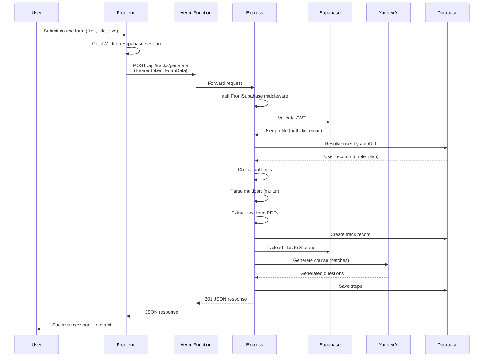
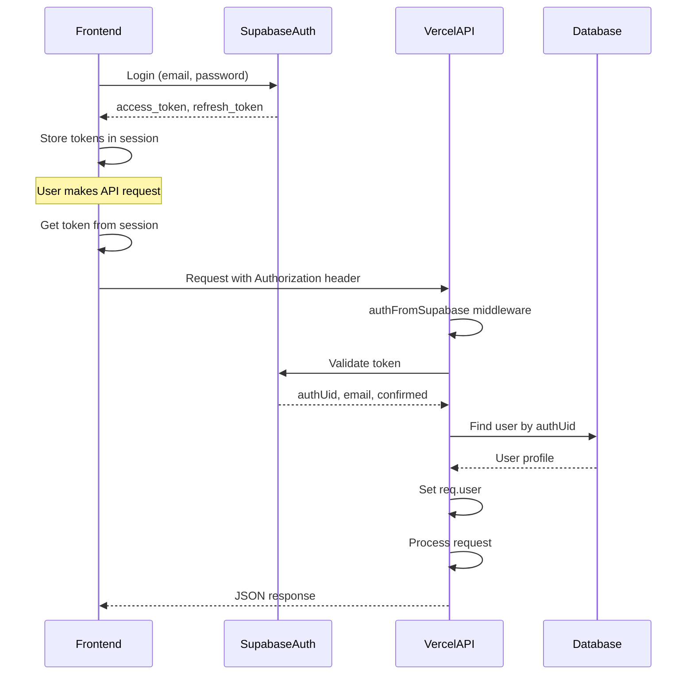

# Design: Fix Vercel Production API Routes and Authentication

## Executive Summary

This design addresses critical production failures on Vercel deployment:
- 401 Unauthorized errors on `/api/user` and `/api/tracks` routes
- 404 Not Found on `/api/tracks/generate` endpoint
- HTML error pages returned instead of JSON responses causing frontend crashes
- PDF course generation pipeline failures in serverless environment

**Root Causes Identified:**
1. **Missing Authorization Headers:** Frontend not consistently passing JWT Bearer tokens to API
2. **Serverless Route Registration:** `/api/tracks/generate` handler exists but multipart FormData parsing may fail in cold starts
3. **No Safe JSON Parsing:** Frontend crashes when receiving HTML error pages (401/404) expecting JSON
4. **Environment Variables:** Possible VITE_ prefix mismatch between dev and production
5. **Trust Proxy Configuration:** Already set but cookie/session behavior needs verification

## Problem Analysis

### Issue 1: 401 Unauthorized on API Routes

**Symptoms:**
- Console errors: `Failed to load resource: 401 (Unauthorized)` on `/api/user`, `/api/tracks`
- User authenticated via Supabase but API calls fail

**Root Cause:**
Frontend code has **inconsistent auth header injection**:
- `use-auth.ts` uses `fetchWithAuth()` helper that adds JWT token ✓
- `use-tracks.ts` uses plain `fetch()` with only `credentials: "include"` ✗
- `library.tsx` course creation uses `getAuthHeaders()` correctly ✓

The Supabase JWT middleware (`authFromSupabase`) expects `Authorization: Bearer <token>` header but many requests don't include it.

**Why This Works Locally But Fails on Vercel:**
- Development may use session cookies as fallback (Passport.js)
- Production Vercel deployment relies solely on JWT authentication
- Session storage may not persist across serverless function invocations

### Issue 2: 404 Not Found on `/api/tracks/generate`

**Analysis:**
- Route IS registered in `server/routes.ts` line 362: `app.post(api.tracks.generate.path, ...)`
- Vercel serverless adapter at `/api/[...path].ts` should forward all `/api/*` requests to Express
- The 404 suggests either:
  - Cold start failure loading `server-app.cjs`
  - Multer middleware failing to initialize in serverless
  - Route path mismatch between shared schema and actual endpoint

**Verification Needed:**
Check `shared/routes.ts` to confirm `api.tracks.generate.path` value matches frontend expectations.

### Issue 3: HTML Errors Crashing Frontend

**Current Behavior:**
When API returns 401/404, Vercel may serve HTML error page. Frontend does:
```typescript
const response = await fetch('/api/tracks/generate', {...});
return response.json(); // throws SyntaxError if HTML received
```

**Impact:**
Toast shows: `"Unexpected token 'T', 'The page c...' is not valid JSON"`

### Issue 4: PDF Generation Failures

**Current Implementation Analysis:**
- File upload uses `multer.memoryStorage()` ✓ (correct for serverless)
- PDF parsing via `pdf-parse` with Buffer ✓
- Knowledge source storage has Supabase fallback ✓
- No test fixture file reads in production code ✓

**Potential Issues:**
- Multer body size limits (50MB) may exceed Vercel limits (default 5MB for serverless)
- Cold start timeout (current: 60s maxDuration) may be insufficient for large PDFs
- Memory allocation (current: 1024MB) may be insufficient for batch processing

## Solution Design

### Strategy Overview

**Priority 1: Fix Authentication (401 Errors)**
- Centralize auth header injection across all API calls
- Add fallback handling when JWT not available

**Priority 2: Fix Error Handling (HTML vs JSON)**
- Implement safe JSON parsing wrapper
- Ensure all API errors return JSON with proper status codes

**Priority 3: Verify Route Registration (404 Errors)**
- Add diagnostic logging to Vercel function
- Implement `/api/health` comprehensive checks

**Priority 4: Optimize PDF Generation**
- Adjust Vercel function configuration
- Add progress logging for debugging

### Component 1: Centralized API Client

**Location:** `client/src/lib/api-client.ts` (new file)

**Purpose:** 
Single source of truth for all API requests with consistent auth headers, error handling, and JSON parsing.

**Key Features:**
- Automatic JWT token injection from Supabase session
- Safe JSON parsing with fallback for HTML errors
- Structured error responses
- Request/response logging (development only)

**Interface:**
```
safeFetch(url: string, options?: RequestInit): Promise<ApiResponse>

Where ApiResponse = {
  ok: boolean
  status: number
  data?: any
  error?: { code: string, message: string }
}
```

**Behavior:**
1. Check Supabase session for access token
2. Add `Authorization: Bearer <token>` header if available
3. Add `credentials: 'include'` for cookie fallback
4. Execute fetch request
5. Check Content-Type header
6. If `application/json`: parse and return
7. If HTML/other: return structured error with text content
8. Handle network errors gracefully

**Integration:**
- Refactor `use-tracks.ts` to use `safeFetch`
- Refactor `library.tsx` to use `safeFetch`
- Keep `use-auth.ts` using existing `fetchWithAuth` (simpler auth flow)

### Component 2: Environment Variable Validation

**Issue:**
Frontend needs `VITE_SUPABASE_URL` and `VITE_SUPABASE_ANON_KEY` but production may only have non-prefixed versions.

**Solution:**
Add startup validation in `client/src/main.tsx`:

**Validation Logic:**
```
if (!import.meta.env.VITE_SUPABASE_URL) {
  console.error('Missing VITE_SUPABASE_URL')
}
if (!import.meta.env.VITE_SUPABASE_ANON_KEY) {
  console.error('Missing VITE_SUPABASE_ANON_KEY')
}
```

**Vercel Configuration:**
Ensure environment variables are set with correct prefixes:
- `VITE_SUPABASE_URL` → client build
- `DATABASE_FILE_STORAGE_URL` → server runtime
- `VITE_SUPABASE_ANON_KEY` → client build  
- `SUPABASE_ANON_KEY` → server runtime

### Component 3: Enhanced `/api/health` Endpoint

**Current State:** Basic health check exists at line 118 of `server/app.ts`

**Enhancements:**
Add route registration verification:

**New Checks:**
- Test route resolution for critical paths:
  - `/api/tracks/generate`
  - `/api/tracks` (list)
  - `/api/user`
- Verify multer middleware initialization
- Check file upload capability (memory storage)
- Test PDF parsing library availability

**Response Format:**
```
{
  ok: boolean
  nodeEnv: string
  timestamp: ISO8601
  config: {
    hasDatabase: boolean
    hasSupabase: boolean
    hasSessionSecret: boolean
  }
  dependencies: {
    multer: boolean
    pdfParse: boolean
    mammoth: boolean
  }
  routes: {
    tracksGenerate: 'registered' | 'missing'
    tracksList: 'registered' | 'missing'
  }
  errors: string[]
}
```

**Purpose:**
Diagnostic tool to verify deployment success via `curl https://domain/api/health`

### Component 4: Vercel Function Configuration

**File:** `vercel.json`

**Current Configuration Analysis:**
- `maxDuration: 60` → May be insufficient for large PDF processing
- `memory: 1024` → Adequate for most files
- `includeFiles: "api/server-app.cjs"` → Correct bundling

**Proposed Changes:**

**Increase Timeout:**
Change `maxDuration: 60` to `maxDuration: 300` (5 minutes)
- Rationale: LLM course generation can take 60-90s per batch
- V2 generator processes multiple batches sequentially
- Need buffer for Yandex API latency

**Add Body Size Limit:**
Add function-level configuration:
```json
{
  "functions": {
    "api/[...path].ts": {
      "maxDuration": 300,
      "memory": 1024,
      "includeFiles": "api/server-app.cjs"
    }
  }
}
```

Note: Vercel has 4.5MB default body limit for Hobby plan. Document workaround:
- Option A: Use Supabase Storage for large files (client-side upload)
- Option B: Implement chunked upload for files >4MB
- Option C: Upgrade Vercel plan for higher limits

**Current Implementation Already Supports Option A:**
Code at line 513-548 in `server/routes.ts` has Supabase Storage fallback.

### Component 5: Request/Response Logging

**Purpose:** Debug production issues without access to Vercel logs UI

**Implementation:** Add to `server/app.ts` request middleware

**Logging Strategy:**
- Log all 4xx/5xx responses with request details
- Log route registration on cold start
- Log auth middleware decisions (token present/valid/profile found)
- DO NOT log tokens, passwords, or PII

**Key Log Points:**

**Cold Start:**
```
[Vercel Function] Loading from compiled bundle...
[Vercel Function] Express app created
[Routes] Registered POST /api/tracks/generate
[Auth Middleware] Supabase client initialized
```

**Per Request:**
```
[Request] POST /api/tracks/generate auth=present(Bearer) userId=123
[Auth Middleware] JWT valid, email confirmed, profile loaded
[Track Gen] Upload received: files=2, courseSize=M
```

**Errors:**
```
[Auth Middleware] Invalid token: jwt expired
[Track Gen] PDF parse failed: file corrupted
[API Error] 401 UNAUTHORIZED /api/tracks/generate
```

### Component 6: Server-Side Error Response Format

**Current State:** Express error handler returns JSON (line 202-248 of `app.ts`)

**Issue:** Some errors may bypass handler and return HTML (Vercel edge errors)

**Solution:** Ensure ALL API routes return JSON

**Pattern:**
Wrap all route handlers with try-catch:
```
try {
  // handler logic
} catch (err) {
  console.error('[Route Error]', err);
  return res.status(500).json({
    code: 'INTERNAL_ERROR',
    message: 'Error description',
    canRetry: true
  });
}
```

**Verification:**
Audit `server/routes.ts` for routes that might throw without JSON response.

### Component 7: Frontend Error Boundary

**Purpose:** Graceful degradation when API completely fails

**Implementation:** Add error boundary to track-related pages

**Behavior:**
- Catch React rendering errors from failed API calls
- Display user-friendly message
- Provide retry mechanism
- Log error to console for debugging

## Data Flow

### Successful Course Generation Flow



### Authentication Flow (JWT)



## Configuration Changes

### Vercel Environment Variables

**Required Variables:**

**Frontend (Client Build):**
- `VITE_SUPABASE_URL` → Supabase project URL
- `VITE_SUPABASE_ANON_KEY` → Public anon key

**Backend (Serverless Runtime):**
- `DATABASE_URL` → PostgreSQL connection string
- `DATABASE_FILE_STORAGE_URL` → Supabase URL (for auth)
- `SUPABASE_ANON_KEY` → Public anon key (for JWT validation)
- `SESSION_SECRET` → Random 32+ char string
- `YANDEX_FOLDER_ID` → Yandex Cloud folder
- `YANDEX_API_KEY` → Yandex AI key
- `YANDEX_PROMPT_ID` → AI prompt template ID

**Validation:**
All variables must be set in Vercel project settings for Production, Preview, and Development environments.

### Build Configuration

**File:** `vercel.json`

**Current:**
```json
{
  "buildCommand": "npm run build",
  "outputDirectory": "dist/public"
}
```

**Verification Needed:**
Ensure `npm run build` produces:
- `dist/public/` → Vite frontend assets
- `api/server-app.cjs` → Bundled Express app

**Build Script:** Check `package.json` for build command

### Function Configuration

**Updated `vercel.json`:**

```json
{
  "$schema": "https://openapi.vercel.sh/vercel.json",
  "buildCommand": "npm run build",
  "outputDirectory": "dist/public",
  "installCommand": "npm install",
  "headers": [
    {
      "source": "/assets/(.*)",
      "headers": [
        { "key": "Cache-Control", "value": "public, max-age=31536000, immutable" }
      ]
    },
    {
      "source": "/(favicon\\..*|robots\\.txt|sitemap\\.xml)",
      "headers": [
        { "key": "Cache-Control", "value": "public, max-age=31536000, immutable" }
      ]
    },
    {
      "source": "/(.*)\\.(js|css|woff2|png|jpg|jpeg|svg|webp|ico)",
      "headers": [
        { "key": "Cache-Control", "value": "public, max-age=31536000, immutable" }
      ]
    },
    {
      "source": "/index.html",
      "headers": [
        { "key": "Cache-Control", "value": "no-cache, must-revalidate" }
      ]
    }
  ],
  "rewrites": [
    { "source": "/api/:path*", "destination": "/api/[...path]" },
    { "source": "/((?!api/).*)", "destination": "/index.html" }
  ],
  "functions": {
    "api/[...path].ts": {
      "maxDuration": 300,
      "memory": 1024,
      "includeFiles": "api/server-app.cjs"
    }
  }
}
```

**Changes:**
- Add explicit `/api/:path*` rewrite to catch-all function
- Increase `maxDuration` from 60 to 300 seconds
- Keep 1024MB memory (sufficient for most workloads)

## Error Handling Strategy

### Frontend Error Handling

**Pattern: Safe JSON Parsing**

All API calls must use helper that:
1. Checks response `Content-Type` header
2. If not `application/json`, treats as error
3. Returns structured error object
4. Never throws on parse failure

**User-Facing Messages:**

| Error Type | Status | Message | Action |
|------------|--------|---------|--------|
| Network Error | - | Проверьте интернет-соединение | Retry button |
| 401 Unauthorized | 401 | Сессия истекла. Войдите снова. | Redirect to /auth |
| 403 Forbidden | 403 | Доступ запрещён | Show message |
| 404 Not Found | 404 | Ресурс не найден | Go back |
| 500 Server Error | 500 | Ошибка сервера. Попробуйте позже. | Retry button |
| HTML Error Page | 200 | Ошибка обработки запроса | Retry button |

### Backend Error Handling

**Pattern: Always Return JSON**

Every route must have try-catch:
```
app.post('/api/example', async (req, res) => {
  try {
    // business logic
    res.json({ success: true, data: {...} });
  } catch (err) {
    console.error('[Route] Error:', err);
    res.status(500).json({
      code: 'INTERNAL_ERROR',
      message: 'User-friendly message',
      canRetry: true
    });
  }
});
```

**Error Codes:**

| Code | Status | Meaning |
|------|--------|---------|
| UNAUTHORIZED | 401 | No valid JWT or session |
| EMAIL_NOT_CONFIRMED | 403 | User exists but email not verified |
| FORBIDDEN | 403 | Authenticated but insufficient permissions |
| NOT_FOUND | 404 | Resource doesn't exist |
| BAD_REQUEST | 400 | Invalid input data |
| COURSE_LIMIT_REACHED | 403 | Trial user hit course creation limit |
| EMPLOYEE_LIMIT_REACHED | 403 | Course at max employee capacity |
| INTERNAL_ERROR | 500 | Unexpected server error |

## Testing Strategy

### Pre-Deployment Tests

**Local Development:**
1. Run `npm run dev`
2. Test course creation with 2-3 PDF files
3. Verify authentication works (login/logout)
4. Check browser console for errors

**Local Production Build:**
1. Run `npm run build`
2. Serve `dist/public` with static server
3. Start serverless function emulator
4. Test all critical flows

### Post-Deployment Verification

**Step 1: Health Check**
```bash
curl -i https://YOUR_DOMAIN/api/health
```

Expected: `200 OK` with JSON showing all checks passing

**Step 2: Authentication Test**
```bash
# Login via frontend
# Copy JWT token from browser DevTools → Application → Session Storage
export TOKEN="<paste_token>"

curl -i https://YOUR_DOMAIN/api/user \
  -H "Authorization: Bearer $TOKEN"
```

Expected: `200 OK` with user profile JSON

**Step 3: Tracks List**
```bash
curl -i https://YOUR_DOMAIN/api/tracks \
  -H "Authorization: Bearer $TOKEN"
```

Expected: `200 OK` with array of tracks

**Step 4: Course Generation**
```bash
curl -i https://YOUR_DOMAIN/api/tracks/generate \
  -X POST \
  -H "Authorization: Bearer $TOKEN" \
  -F "title=Test Course" \
  -F "courseSize=S" \
  -F "files=@test.pdf"
```

Expected: `201 Created` with track + steps JSON

**Step 5: End-to-End UI Test**
1. Open app in browser
2. Login as curator
3. Create new course with PDF upload
4. Wait for generation to complete
5. Verify course appears in library
6. Click course → view generated questions

### Monitoring

**Key Metrics:**
- API response times (P50, P95, P99)
- Error rates by endpoint
- Cold start frequency
- PDF processing duration
- LLM generation success rate

**Logging:**
Enable verbose logging temporarily after deployment:
- Set environment variable `LOG_LEVEL=debug`
- Monitor Vercel function logs
- Check for error patterns

## Rollback Plan

**If Deployment Fails:**

1. **Immediate:** Revert to previous Vercel deployment via dashboard
2. **Investigate:** Check Vercel function logs for error messages
3. **Fix:** Address specific error in code
4. **Redeploy:** Push fix and verify with health check

**Common Failure Modes:**

| Symptom | Likely Cause | Fix |
|---------|--------------|-----|
| Build fails | Missing dependency | Check package.json, run `npm install` |
| 500 on all routes | server-app.cjs not found | Verify build script copies file |
| 401 on all routes | Missing env vars | Check Vercel env settings |
| Timeout on generation | maxDuration too low | Increase in vercel.json |
| Out of memory | Files too large | Reduce file size or increase memory |

## Success Criteria

**Deployment is considered successful when:**

1. ✅ `/api/health` returns 200 with no errors
2. ✅ User can login and see profile (`/api/user` works)
3. ✅ Curator can list existing tracks (`/api/tracks` works)
4. ✅ Curator can create new course with PDF upload
5. ✅ PDF text extraction succeeds (visible in logs)
6. ✅ AI course generation completes without timeout
7. ✅ Generated questions saved to database
8. ✅ Frontend displays course in library
9. ✅ No HTML error pages in browser console
10. ✅ Employee can join course with code

**Performance Benchmarks:**

- Course creation (S size, 1 PDF): < 90 seconds
- Course creation (M size, 3 PDFs): < 180 seconds
- PDF text extraction: < 10 seconds per 5MB file
- API response time (non-generation): < 500ms

## Implementation Checklist

### Phase 1: Frontend Auth Fix
- [ ] Create `client/src/lib/api-client.ts` with safeFetch
- [ ] Refactor `use-tracks.ts` to use safeFetch
- [ ] Refactor `library.tsx` to use safeFetch
- [ ] Add env validation to `main.tsx`
- [ ] Test locally with JWT auth

### Phase 2: Backend Improvements
- [ ] Enhance `/api/health` endpoint with route checks
- [ ] Add request logging middleware
- [ ] Audit all routes for JSON error responses
- [ ] Update `vercel.json` with new timeout
- [ ] Test PDF upload with 10MB+ files

### Phase 3: Deployment
- [ ] Verify all Vercel env variables set
- [ ] Push changes to main branch
- [ ] Monitor deployment logs
- [ ] Run post-deployment verification tests
- [ ] Create test course in production

### Phase 4: Monitoring
- [ ] Check Vercel analytics dashboard
- [ ] Review function logs for errors
- [ ] Test from multiple networks
- [ ] Verify mobile browser compatibility
- [ ] Document any remaining issues

## Open Questions

1. **Body Size Limits:** Current Vercel plan limit for request body?
   - Need to document: "Files larger than 4.5MB require Supabase Storage direct upload"

2. **Cold Start Performance:** How long does Express app take to initialize?
   - Measure: Add timing logs to `/api/[...path].ts`

3. **Session Cookie Domain:** Should cookies be set for specific domain or wildcard?
   - Current: `trust proxy: 1` should handle this
   - Verify: Test on actual Vercel domain

4. **Rate Limiting:** Should we add rate limits to expensive endpoints?
   - Recommendation: Add later if abuse detected
   - Not blocking for MVP

## References

- Vercel Serverless Functions: https://vercel.com/docs/functions
- Supabase Auth: https://supabase.com/docs/guides/auth
- Express.js on Vercel: https://vercel.com/guides/using-express-with-vercel
- Multer Documentation: https://github.com/expressjs/multer

**Backend (Serverless Runtime):**
- `DATABASE_URL` → PostgreSQL connection string
- `DATABASE_FILE_STORAGE_URL` → Supabase URL (for auth)
- `SUPABASE_ANON_KEY` → Public anon key (for JWT validation)
- `SESSION_SECRET` → Random 32+ char string
- `YANDEX_FOLDER_ID` → Yandex Cloud folder
- `YANDEX_API_KEY` → Yandex AI key
- `YANDEX_PROMPT_ID` → AI prompt template ID

**Validation:**
All variables must be set in Vercel project settings for Production, Preview, and Development environments.

### Build Configuration

**File:** `vercel.json`

**Current:**
```json
{
  "buildCommand": "npm run build",
  "outputDirectory": "dist/public"
}
```

**Verification Needed:**
Ensure `npm run build` produces:
- `dist/public/` → Vite frontend assets
- `api/server-app.cjs` → Bundled Express app

**Build Script:** Check `package.json` for build command

### Function Configuration

**Updated `vercel.json`:**

```json
{
  "$schema": "https://openapi.vercel.sh/vercel.json",
  "buildCommand": "npm run build",
  "outputDirectory": "dist/public",
  "installCommand": "npm install",
  "headers": [
    {
      "source": "/assets/(.*)",
      "headers": [
        { "key": "Cache-Control", "value": "public, max-age=31536000, immutable" }
      ]
    },
    {
      "source": "/(favicon\\..*|robots\\.txt|sitemap\\.xml)",
      "headers": [
        { "key": "Cache-Control", "value": "public, max-age=31536000, immutable" }
      ]
    },
    {
      "source": "/(.*)\\.(js|css|woff2|png|jpg|jpeg|svg|webp|ico)",
      "headers": [
        { "key": "Cache-Control", "value": "public, max-age=31536000, immutable" }
      ]
    },
    {
      "source": "/index.html",
      "headers": [
        { "key": "Cache-Control", "value": "no-cache, must-revalidate" }
      ]
    }
  ],
  "rewrites": [
    { "source": "/api/:path*", "destination": "/api/[...path]" },
    { "source": "/((?!api/).*)", "destination": "/index.html" }
  ],
  "functions": {
    "api/[...path].ts": {
      "maxDuration": 300,
      "memory": 1024,
      "includeFiles": "api/server-app.cjs"
    }
  }
}
```

**Changes:**
- Add explicit `/api/:path*` rewrite to catch-all function
- Increase `maxDuration` from 60 to 300 seconds
- Keep 1024MB memory (sufficient for most workloads)

## Error Handling Strategy

### Frontend Error Handling

**Pattern: Safe JSON Parsing**

All API calls must use helper that:
1. Checks response `Content-Type` header
2. If not `application/json`, treats as error
3. Returns structured error object
4. Never throws on parse failure

**User-Facing Messages:**

| Error Type | Status | Message | Action |
|------------|--------|---------|--------|
| Network Error | - | Проверьте интернет-соединение | Retry button |
| 401 Unauthorized | 401 | Сессия истекла. Войдите снова. | Redirect to /auth |
| 403 Forbidden | 403 | Доступ запрещён | Show message |
| 404 Not Found | 404 | Ресурс не найден | Go back |
| 500 Server Error | 500 | Ошибка сервера. Попробуйте позже. | Retry button |
| HTML Error Page | 200 | Ошибка обработки запроса | Retry button |

### Backend Error Handling

**Pattern: Always Return JSON**

Every route must have try-catch:
```
app.post('/api/example', async (req, res) => {
  try {
    // business logic
    res.json({ success: true, data: {...} });
  } catch (err) {
    console.error('[Route] Error:', err);
    res.status(500).json({
      code: 'INTERNAL_ERROR',
      message: 'User-friendly message',
      canRetry: true
    });
  }
});
```

**Error Codes:**

| Code | Status | Meaning |
|------|--------|---------|
| UNAUTHORIZED | 401 | No valid JWT or session |
| EMAIL_NOT_CONFIRMED | 403 | User exists but email not verified |
| FORBIDDEN | 403 | Authenticated but insufficient permissions |
| NOT_FOUND | 404 | Resource doesn't exist |
| BAD_REQUEST | 400 | Invalid input data |
| COURSE_LIMIT_REACHED | 403 | Trial user hit course creation limit |
| EMPLOYEE_LIMIT_REACHED | 403 | Course at max employee capacity |
| INTERNAL_ERROR | 500 | Unexpected server error |

## Testing Strategy

### Pre-Deployment Tests

**Local Development:**
1. Run `npm run dev`
2. Test course creation with 2-3 PDF files
3. Verify authentication works (login/logout)
4. Check browser console for errors

**Local Production Build:**
1. Run `npm run build`
2. Serve `dist/public` with static server
3. Start serverless function emulator
4. Test all critical flows

### Post-Deployment Verification

**Step 1: Health Check**
```bash
curl -i https://YOUR_DOMAIN/api/health
```

Expected: `200 OK` with JSON showing all checks passing

**Step 2: Authentication Test**
```bash
# Login via frontend
# Copy JWT token from browser DevTools → Application → Session Storage
export TOKEN="<paste_token>"

curl -i https://YOUR_DOMAIN/api/user \
  -H "Authorization: Bearer $TOKEN"
```

Expected: `200 OK` with user profile JSON

**Step 3: Tracks List**
```bash
curl -i https://YOUR_DOMAIN/api/tracks \
  -H "Authorization: Bearer $TOKEN"
```

Expected: `200 OK` with array of tracks

**Step 4: Course Generation**
```bash
curl -i https://YOUR_DOMAIN/api/tracks/generate \
  -X POST \
  -H "Authorization: Bearer $TOKEN" \
  -F "title=Test Course" \
  -F "courseSize=S" \
  -F "files=@test.pdf"
```

Expected: `201 Created` with track + steps JSON

**Step 5: End-to-End UI Test**
1. Open app in browser
2. Login as curator
3. Create new course with PDF upload
4. Wait for generation to complete
5. Verify course appears in library
6. Click course → view generated questions

### Monitoring

**Key Metrics:**
- API response times (P50, P95, P99)
- Error rates by endpoint
- Cold start frequency
- PDF processing duration
- LLM generation success rate

**Logging:**
Enable verbose logging temporarily after deployment:
- Set environment variable `LOG_LEVEL=debug`
- Monitor Vercel function logs
- Check for error patterns

## Rollback Plan

**If Deployment Fails:**

1. **Immediate:** Revert to previous Vercel deployment via dashboard
2. **Investigate:** Check Vercel function logs for error messages
3. **Fix:** Address specific error in code
4. **Redeploy:** Push fix and verify with health check

**Common Failure Modes:**

| Symptom | Likely Cause | Fix |
|---------|--------------|-----|
| Build fails | Missing dependency | Check package.json, run `npm install` |
| 500 on all routes | server-app.cjs not found | Verify build script copies file |
| 401 on all routes | Missing env vars | Check Vercel env settings |
| Timeout on generation | maxDuration too low | Increase in vercel.json |
| Out of memory | Files too large | Reduce file size or increase memory |

## Success Criteria

**Deployment is considered successful when:**

1. ✅ `/api/health` returns 200 with no errors
2. ✅ User can login and see profile (`/api/user` works)
3. ✅ Curator can list existing tracks (`/api/tracks` works)
4. ✅ Curator can create new course with PDF upload
5. ✅ PDF text extraction succeeds (visible in logs)
6. ✅ AI course generation completes without timeout
7. ✅ Generated questions saved to database
8. ✅ Frontend displays course in library
9. ✅ No HTML error pages in browser console
10. ✅ Employee can join course with code

**Performance Benchmarks:**

- Course creation (S size, 1 PDF): < 90 seconds
- Course creation (M size, 3 PDFs): < 180 seconds
- PDF text extraction: < 10 seconds per 5MB file
- API response time (non-generation): < 500ms

## Implementation Checklist

### Phase 1: Frontend Auth Fix
- [ ] Create `client/src/lib/api-client.ts` with safeFetch
- [ ] Refactor `use-tracks.ts` to use safeFetch
- [ ] Refactor `library.tsx` to use safeFetch
- [ ] Add env validation to `main.tsx`
- [ ] Test locally with JWT auth

### Phase 2: Backend Improvements
- [ ] Enhance `/api/health` endpoint with route checks
- [ ] Add request logging middleware
- [ ] Audit all routes for JSON error responses
- [ ] Update `vercel.json` with new timeout
- [ ] Test PDF upload with 10MB+ files

### Phase 3: Deployment
- [ ] Verify all Vercel env variables set
- [ ] Push changes to main branch
- [ ] Monitor deployment logs
- [ ] Run post-deployment verification tests
- [ ] Create test course in production

### Phase 4: Monitoring
- [ ] Check Vercel analytics dashboard
- [ ] Review function logs for errors
- [ ] Test from multiple networks
- [ ] Verify mobile browser compatibility
- [ ] Document any remaining issues

## Open Questions

1. **Body Size Limits:** Current Vercel plan limit for request body?
   - Need to document: "Files larger than 4.5MB require Supabase Storage direct upload"

2. **Cold Start Performance:** How long does Express app take to initialize?
   - Measure: Add timing logs to `/api/[...path].ts`

3. **Session Cookie Domain:** Should cookies be set for specific domain or wildcard?
   - Current: `trust proxy: 1` should handle this
   - Verify: Test on actual Vercel domain

4. **Rate Limiting:** Should we add rate limits to expensive endpoints?
   - Recommendation: Add later if abuse detected
   - Not blocking for MVP

## References

- Vercel Serverless Functions: https://vercel.com/docs/functions
- Supabase Auth: https://supabase.com/docs/guides/auth
- Express.js on Vercel: https://vercel.com/guides/using-express-with-vercel
- Multer Documentation: https://github.com/expressjs/multer

**Backend (Serverless Runtime):**
- `DATABASE_URL` → PostgreSQL connection string
- `DATABASE_FILE_STORAGE_URL` → Supabase URL (for auth)
- `SUPABASE_ANON_KEY` → Public anon key (for JWT validation)
- `SESSION_SECRET` → Random 32+ char string
- `YANDEX_FOLDER_ID` → Yandex Cloud folder
- `YANDEX_API_KEY` → Yandex AI key
- `YANDEX_PROMPT_ID` → AI prompt template ID

**Validation:**
All variables must be set in Vercel project settings for Production, Preview, and Development environments.

### Build Configuration

**File:** `vercel.json`

**Current:**
```json
{
  "buildCommand": "npm run build",
  "outputDirectory": "dist/public"
}
```

**Verification Needed:**
Ensure `npm run build` produces:
- `dist/public/` → Vite frontend assets
- `api/server-app.cjs` → Bundled Express app

**Build Script:** Check `package.json` for build command

### Function Configuration

**Updated `vercel.json`:**

```json
{
  "$schema": "https://openapi.vercel.sh/vercel.json",
  "buildCommand": "npm run build",
  "outputDirectory": "dist/public",
  "installCommand": "npm install",
  "headers": [
    {
      "source": "/assets/(.*)",
      "headers": [
        { "key": "Cache-Control", "value": "public, max-age=31536000, immutable" }
      ]
    },
    {
      "source": "/(favicon\\..*|robots\\.txt|sitemap\\.xml)",
      "headers": [
        { "key": "Cache-Control", "value": "public, max-age=31536000, immutable" }
      ]
    },
    {
      "source": "/(.*)\\.(js|css|woff2|png|jpg|jpeg|svg|webp|ico)",
      "headers": [
        { "key": "Cache-Control", "value": "public, max-age=31536000, immutable" }
      ]
    },
    {
      "source": "/index.html",
      "headers": [
        { "key": "Cache-Control", "value": "no-cache, must-revalidate" }
      ]
    }
  ],
  "rewrites": [
    { "source": "/api/:path*", "destination": "/api/[...path]" },
    { "source": "/((?!api/).*)", "destination": "/index.html" }
  ],
  "functions": {
    "api/[...path].ts": {
      "maxDuration": 300,
      "memory": 1024,
      "includeFiles": "api/server-app.cjs"
    }
  }
}
```

**Changes:**
- Add explicit `/api/:path*` rewrite to catch-all function
- Increase `maxDuration` from 60 to 300 seconds
- Keep 1024MB memory (sufficient for most workloads)

## Error Handling Strategy

### Frontend Error Handling

**Pattern: Safe JSON Parsing**

All API calls must use helper that:
1. Checks response `Content-Type` header
2. If not `application/json`, treats as error
3. Returns structured error object
4. Never throws on parse failure

**User-Facing Messages:**

| Error Type | Status | Message | Action |
|------------|--------|---------|--------|
| Network Error | - | Проверьте интернет-соединение | Retry button |
| 401 Unauthorized | 401 | Сессия истекла. Войдите снова. | Redirect to /auth |
| 403 Forbidden | 403 | Доступ запрещён | Show message |
| 404 Not Found | 404 | Ресурс не найден | Go back |
| 500 Server Error | 500 | Ошибка сервера. Попробуйте позже. | Retry button |
| HTML Error Page | 200 | Ошибка обработки запроса | Retry button |

### Backend Error Handling

**Pattern: Always Return JSON**

Every route must have try-catch:
```
app.post('/api/example', async (req, res) => {
  try {
    // business logic
    res.json({ success: true, data: {...} });
  } catch (err) {
    console.error('[Route] Error:', err);
    res.status(500).json({
      code: 'INTERNAL_ERROR',
      message: 'User-friendly message',
      canRetry: true
    });
  }
});
```

**Error Codes:**

| Code | Status | Meaning |
|------|--------|---------|
| UNAUTHORIZED | 401 | No valid JWT or session |
| EMAIL_NOT_CONFIRMED | 403 | User exists but email not verified |
| FORBIDDEN | 403 | Authenticated but insufficient permissions |
| NOT_FOUND | 404 | Resource doesn't exist |
| BAD_REQUEST | 400 | Invalid input data |
| COURSE_LIMIT_REACHED | 403 | Trial user hit course creation limit |
| EMPLOYEE_LIMIT_REACHED | 403 | Course at max employee capacity |
| INTERNAL_ERROR | 500 | Unexpected server error |

## Testing Strategy

### Pre-Deployment Tests

**Local Development:**
1. Run `npm run dev`
2. Test course creation with 2-3 PDF files
3. Verify authentication works (login/logout)
4. Check browser console for errors

**Local Production Build:**
1. Run `npm run build`
2. Serve `dist/public` with static server
3. Start serverless function emulator
4. Test all critical flows

### Post-Deployment Verification

**Step 1: Health Check**
```bash
curl -i https://YOUR_DOMAIN/api/health
```

Expected: `200 OK` with JSON showing all checks passing

**Step 2: Authentication Test**
```bash
# Login via frontend
# Copy JWT token from browser DevTools → Application → Session Storage
export TOKEN="<paste_token>"

curl -i https://YOUR_DOMAIN/api/user \
  -H "Authorization: Bearer $TOKEN"
```

Expected: `200 OK` with user profile JSON

**Step 3: Tracks List**
```bash
curl -i https://YOUR_DOMAIN/api/tracks \
  -H "Authorization: Bearer $TOKEN"
```

Expected: `200 OK` with array of tracks

**Step 4: Course Generation**
```bash
curl -i https://YOUR_DOMAIN/api/tracks/generate \
  -X POST \
  -H "Authorization: Bearer $TOKEN" \
  -F "title=Test Course" \
  -F "courseSize=S" \
  -F "files=@test.pdf"
```

Expected: `201 Created` with track + steps JSON

**Step 5: End-to-End UI Test**
1. Open app in browser
2. Login as curator
3. Create new course with PDF upload
4. Wait for generation to complete
5. Verify course appears in library
6. Click course → view generated questions

### Monitoring

**Key Metrics:**
- API response times (P50, P95, P99)
- Error rates by endpoint
- Cold start frequency
- PDF processing duration
- LLM generation success rate

**Logging:**
Enable verbose logging temporarily after deployment:
- Set environment variable `LOG_LEVEL=debug`
- Monitor Vercel function logs
- Check for error patterns

## Rollback Plan

**If Deployment Fails:**

1. **Immediate:** Revert to previous Vercel deployment via dashboard
2. **Investigate:** Check Vercel function logs for error messages
3. **Fix:** Address specific error in code
4. **Redeploy:** Push fix and verify with health check

**Common Failure Modes:**

| Symptom | Likely Cause | Fix |
|---------|--------------|-----|
| Build fails | Missing dependency | Check package.json, run `npm install` |
| 500 on all routes | server-app.cjs not found | Verify build script copies file |
| 401 on all routes | Missing env vars | Check Vercel env settings |
| Timeout on generation | maxDuration too low | Increase in vercel.json |
| Out of memory | Files too large | Reduce file size or increase memory |

## Success Criteria

**Deployment is considered successful when:**

1. ✅ `/api/health` returns 200 with no errors
2. ✅ User can login and see profile (`/api/user` works)
3. ✅ Curator can list existing tracks (`/api/tracks` works)
4. ✅ Curator can create new course with PDF upload
5. ✅ PDF text extraction succeeds (visible in logs)
6. ✅ AI course generation completes without timeout
7. ✅ Generated questions saved to database
8. ✅ Frontend displays course in library
9. ✅ No HTML error pages in browser console
10. ✅ Employee can join course with code

**Performance Benchmarks:**

- Course creation (S size, 1 PDF): < 90 seconds
- Course creation (M size, 3 PDFs): < 180 seconds
- PDF text extraction: < 10 seconds per 5MB file
- API response time (non-generation): < 500ms

## Implementation Checklist

### Phase 1: Frontend Auth Fix
- [ ] Create `client/src/lib/api-client.ts` with safeFetch
- [ ] Refactor `use-tracks.ts` to use safeFetch
- [ ] Refactor `library.tsx` to use safeFetch
- [ ] Add env validation to `main.tsx`
- [ ] Test locally with JWT auth

### Phase 2: Backend Improvements
- [ ] Enhance `/api/health` endpoint with route checks
- [ ] Add request logging middleware
- [ ] Audit all routes for JSON error responses
- [ ] Update `vercel.json` with new timeout
- [ ] Test PDF upload with 10MB+ files

### Phase 3: Deployment
- [ ] Verify all Vercel env variables set
- [ ] Push changes to main branch
- [ ] Monitor deployment logs
- [ ] Run post-deployment verification tests
- [ ] Create test course in production

### Phase 4: Monitoring
- [ ] Check Vercel analytics dashboard
- [ ] Review function logs for errors
- [ ] Test from multiple networks
- [ ] Verify mobile browser compatibility
- [ ] Document any remaining issues

## Open Questions

1. **Body Size Limits:** Current Vercel plan limit for request body?
   - Need to document: "Files larger than 4.5MB require Supabase Storage direct upload"

2. **Cold Start Performance:** How long does Express app take to initialize?
   - Measure: Add timing logs to `/api/[...path].ts`

3. **Session Cookie Domain:** Should cookies be set for specific domain or wildcard?
   - Current: `trust proxy: 1` should handle this
   - Verify: Test on actual Vercel domain

4. **Rate Limiting:** Should we add rate limits to expensive endpoints?
   - Recommendation: Add later if abuse detected
   - Not blocking for MVP

## References

- Vercel Serverless Functions: https://vercel.com/docs/functions
- Supabase Auth: https://supabase.com/docs/guides/auth
- Express.js on Vercel: https://vercel.com/guides/using-express-with-vercel
- Multer Documentation: https://github.com/expressjs/multer
