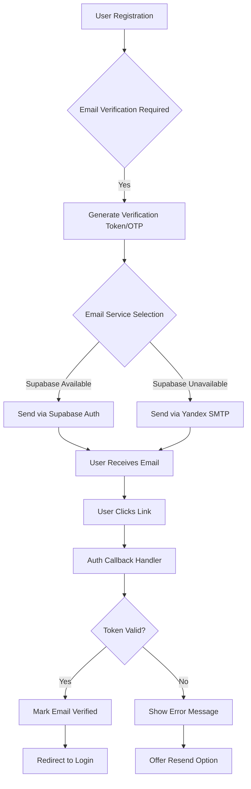
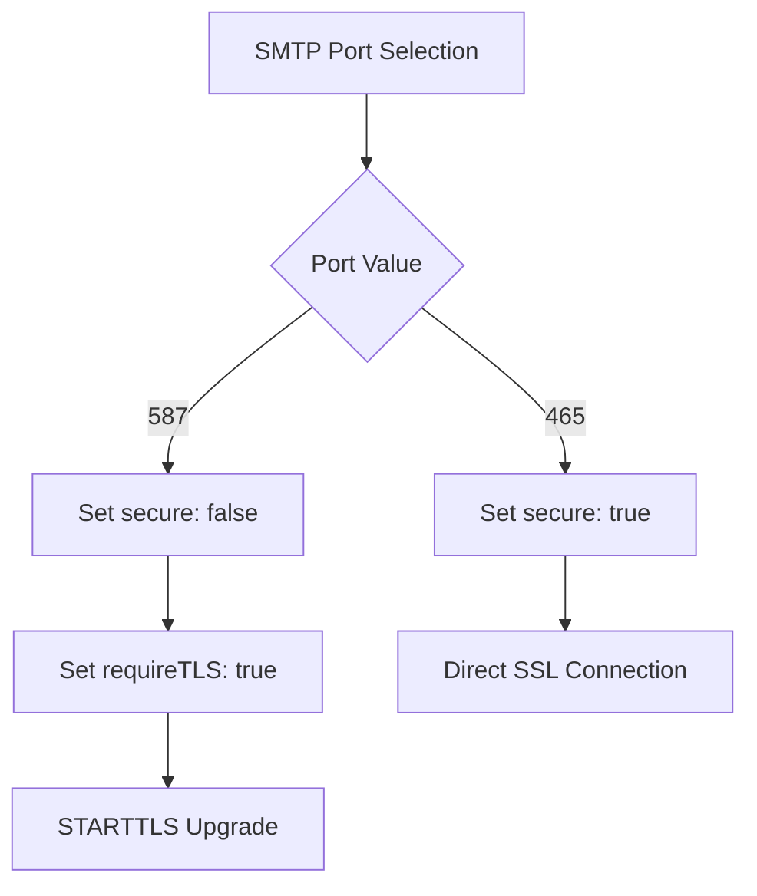
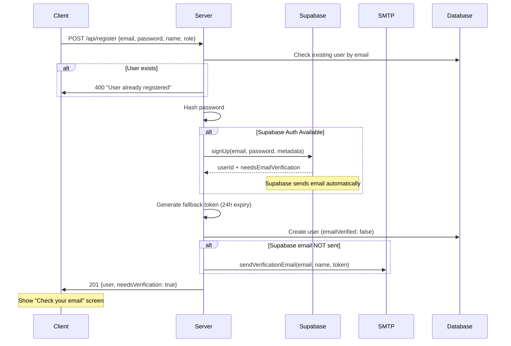
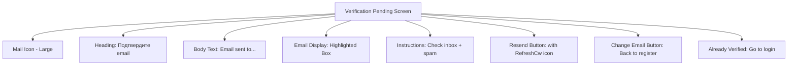

# Design Document: Fix Email Confirmation Flow with Yandex SMTP

## Problem Statement

The current email verification system experiences frequent `otp_expired` errors (403 "email link is invalid or has expired") when users click confirmation links from Supabase default SMTP. Additionally, the existing `email.ts` module contains a critical bug: it uses the incorrect nodemailer method name `createTransporter` instead of the correct `createTransport`. The system needs a robust, production-ready email confirmation flow using Yandex SMTP while maintaining Supabase Auth integration.

## Design Goals

1. Implement a correct registration flow requiring email confirmation before access
2. Integrate Yandex SMTP (smtp.yandex.ru) with proper authentication using APP PASSWORD
3. Eliminate `otp_expired` errors through proper redirect URL handling
4. Maintain backward compatibility with Supabase Auth
5. Ensure the solution works reliably in localhost development environment

## System Architecture Overview

### Email Delivery Strategy

The system employs a dual-path email delivery strategy:

| Path | Priority | Use Case | Configuration |
|------|----------|----------|---------------|
| **Supabase Auth Native** | Primary (when available) | Leverages Supabase's managed email service with built-in verification flow | Requires SUPABASE_ANON_KEY + optional Custom SMTP in dashboard |
| **Direct Yandex SMTP** | Fallback | Custom email delivery using nodemailer when Supabase is unavailable or fails | Requires SMTP_* environment variables |

### Authentication Flow



### URL Redirect Architecture

```mermaid
graph LR
    A[Email Link] --> B[/auth/callback]
    B --> C{Parse Query Params}
    C -->|token_hash + type| D[Verify with Supabase]
    C -->|error param| E[Show Error Screen]
    D --> F[Update DB: emailVerified=true]
    F --> G[Redirect to /auth?verified=true]
    E --> H[Redirect to /auth?error=code]
```

## Component Design

### 1. SMTP Configuration Module (server/email.ts)

**Current Issues:**
- Bug: `nodemailer.createTransporter` should be `nodemailer.createTransport`
- Missing STARTTLS support for port 587
- No `requireTLS` flag when secure=false

**Design Changes:**

| Configuration Field | Purpose | Validation Rule |
|---------------------|---------|-----------------|
| SMTP_HOST | Yandex SMTP server | Must be 'smtp.yandex.ru' for production |
| SMTP_PORT | Connection port | 465 (SSL) or 587 (STARTTLS) |
| SMTP_USER | Yandex email address | Must match from address (adapt-ai@yandex.com) |
| SMTP_PASSWORD | Yandex APP PASSWORD | Generated from Yandex ID security settings |
| SMTP_FROM | Display name + email | Format: "ADAPT <adapt-ai@yandex.com>" |

**Port-Specific Behavior:**



**Email Service Initialization Logic:**

The transporter initialization follows this decision tree:
1. Check if all required environment variables exist (SMTP_HOST, SMTP_PORT, SMTP_USER, SMTP_PASSWORD)
2. If any missing → return null, log warning "SMTP not configured"
3. If port is 465 → use `secure: true` (direct SSL)
4. If port is 587 → use `secure: false` + `requireTLS: true` (STARTTLS upgrade)
5. Initialize transporter singleton and return

**Graceful Degradation:**
- When SMTP configuration is incomplete, the system logs a clear message but does not crash
- Email sending functions return `false` to indicate failure
- Callers must handle the failure case and potentially retry or alert the user

### 2. Authentication Callback Handler (server/auth.ts)

**Endpoint:** `GET /auth/callback`

**Query Parameters Handled:**

| Parameter | Source | Purpose | Example |
|-----------|--------|---------|---------|
| token_hash | Supabase | OTP token for verification | `abc123...` |
| type | Supabase | Verification type | `signup`, `recovery` |
| error | Supabase | Error code from failed verification | `otp_expired` |
| error_description | Supabase | Human-readable error | `email link is invalid...` |

**Processing Flow:**

1. **Error Handling Branch:**
   - If `error` parameter exists → log error details
   - Redirect to `/auth?error={encodeURIComponent(error)}`
   - Frontend displays user-friendly error message

2. **Success Verification Branch:**
   - If `token_hash` + `type=signup` present:
     - Call `supabaseClient.auth.verifyOtp({ token_hash, type })`
     - Extract user email from response
     - Query local database for user by email
     - Update user record: `emailVerified: true`, clear verification token
     - Log successful verification
   - Redirect to `/auth?verified=true`

3. **Fallback:**
   - If no recognizable parameters → redirect to `/auth` (frontend handles URL hash)

**Critical Design Decision:** The callback handler MUST NOT make redundant verification calls. Each token can only be verified once; a second call will always return `otp_expired`. The handler processes the token exactly once and immediately redirects.

### 3. Registration Flow (server/auth.ts - /api/register)

**Process Sequence:**



**User Record Fields:**

| Field | Initial Value | Purpose |
|-------|---------------|---------|
| emailVerified | false | Blocks login until confirmed |
| emailVerificationToken | random 32-byte hex | Fallback token for custom flow |
| emailVerificationExpires | now + 24 hours | Token expiration timestamp |

**Metadata Passed to Supabase:**
- name: User's display name
- role: curator or employee

This metadata is stored in Supabase's `user_metadata` field for potential future use.

### 4. Email Resend Mechanism (server/auth.ts - /api/resend-verification)

**Endpoint:** `POST /api/resend-verification`

**Request Body:**
```
{
  "email": "user@example.com"
}
```

**Logic Flow:**

1. Validate email parameter exists
2. Query database for user by email
3. Return 404 if user not found
4. Return 200 "Already verified" if emailVerified is true
5. Attempt Supabase resend:
   - Call `supabaseClient.auth.resend({ type: 'signup', email, options: { emailRedirectTo } })`
   - If success → return 200 "Email sent"
   - If failure → log warning and proceed to fallback
6. Fallback: Generate new custom token
   - Create new 32-byte verification token
   - Set expiration to now + 24 hours
   - Update user record in database
   - Send email via Yandex SMTP
   - Return 200 even if SMTP fails (graceful degradation)

**Rate Limiting Consideration:** Currently not implemented. Future enhancement should add rate limiting (e.g., max 3 resends per hour per email) to prevent abuse.

### 5. Login Protection (server/auth.ts - LocalStrategy)

**Verification Check Integration:**

The passport LocalStrategy includes an email verification gate:

```
1. Authenticate credentials (email + password)
2. If credentials valid:
   a. Check user.emailVerified flag
   b. If false → return done(null, false, { message: "EMAIL_NOT_VERIFIED" })
   c. If true → return done(null, user)
3. Establish session
```

**Response to Frontend:**

| Scenario | HTTP Status | Response Body | Frontend Action |
|----------|-------------|---------------|-----------------|
| Email not verified | 403 | `{ message: "Email не подтверждён", errorCode: "EMAIL_NOT_VERIFIED", canResend: true }` | Show error + "Resend email" button |
| Invalid credentials | 401 | `{ message: "Неверный email или пароль" }` | Show generic error |
| Success | 200 | User object | Redirect to dashboard |

### 6. Frontend Verification UX (client/src/pages/auth.tsx)

**Three-State UI Mode:**

| Mode | When Shown | UI Elements |
|------|------------|-------------|
| login | Default state | Email + password fields, "Login" button |
| register | User switches to registration | Name + email + password + role selection |
| verification-pending | After successful registration | Email sent confirmation, resend button, change email option |

**Verification Pending Screen Components:**



**URL Parameter Handling:**

On component mount, the frontend checks for:
- `?verified=true` → Show success toast "Email confirmed! You can now login"
- `?error=invalid_token` → Show error toast "Invalid or expired link"
- `?error=token_expired` → Show error toast "Link expired"

After displaying the toast, URL parameters are cleaned using `window.history.replaceState({}, '', '/auth')` to prevent duplicate toasts on page refresh.

**Resend Email Button Behavior:**

| State | Button Text | Icon | Disabled | Action |
|-------|-------------|------|----------|--------|
| Idle | "Отправить повторно" | RefreshCw | false | Call handleResendEmail |
| Loading | "Отправить повторно" | Loader2 (spinning) | true | No action |
| After success | "Отправить повторно" | RefreshCw | false | Can resend again |

## Environment Configuration

### Required Environment Variables

```
# Yandex SMTP Configuration (Direct Email Delivery)
SMTP_HOST=smtp.yandex.ru
SMTP_PORT=465
SMTP_USER=adapt-ai@yandex.com
SMTP_PASSWORD=your_yandex_app_password_here
SMTP_FROM=ADAPT <adapt-ai@yandex.com>

# Application Base URL (Critical for Redirect URLs)
APP_URL=http://localhost:5000

# Supabase Configuration (Optional - for managed email service)
DATABASE_FILE_STORAGE_URL=https://your-project.supabase.co
SUPABASE_ANON_KEY=your_anon_key_here
DATABASE_FILE_STORAGE_KEY=your_service_role_key_here
```

### Yandex APP PASSWORD Setup Instructions

To generate an APP PASSWORD for Yandex SMTP:

1. Navigate to Yandex ID Security Settings: https://id.yandex.ru/security
2. Locate "App passwords" section
3. Click "Create app password"
4. Select "Mail" as the application type
5. Enter a descriptive name (e.g., "ADAPT SMTP")
6. Copy the generated 16-character password
7. Use this password as SMTP_PASSWORD (NOT your regular Yandex password)

**Security Note:** APP PASSWORDs are scoped credentials that provide limited access. If compromised, they can be revoked individually without affecting the main account.

### Supabase Dashboard Custom SMTP Configuration

For production deployments using Supabase's email service:

| Dashboard Setting | Value | Location |
|-------------------|-------|----------|
| Enable Custom SMTP | ON | Project Settings → Auth → Email |
| SMTP Host | smtp.yandex.ru | Custom SMTP section |
| SMTP Port | 465 | Custom SMTP section |
| SMTP Username | adapt-ai@yandex.com | Custom SMTP section |
| SMTP Password | Yandex APP PASSWORD | Custom SMTP section |
| Sender Email | adapt-ai@yandex.com | Email Templates → Sender |
| Sender Name | ADAPT | Email Templates → Sender |

**Email Redirect URL Configuration:**

Navigate to: Project Settings → Auth → URL Configuration

| Field | Value | Purpose |
|-------|-------|---------|
| Site URL | http://localhost:5000 | Development base URL |
| Redirect URLs | http://localhost:5000/auth/callback | Allowed callback after email verification |

For production, update Site URL to production domain (e.g., https://adapt.example.com) and add corresponding callback URL.

## OTP Expired Error - Root Cause Analysis

### Three Primary Causes

1. **Redirect URL Mismatch**
   - Symptom: User clicks email link, gets immediate 403
   - Cause: The redirect URL specified in `emailRedirectTo` is not whitelisted in Supabase Dashboard → Auth → URL Configuration
   - Solution: Ensure `/auth/callback` is in the allowed redirect URLs list

2. **Token Reuse**
   - Symptom: First click works, subsequent clicks fail
   - Cause: Email verification tokens are single-use. Once consumed, they become invalid
   - Common trigger: Email security scanners pre-click links
   - Solution: Accept this behavior as normal; users who encounter this have likely already been verified

3. **Token Expiration**
   - Symptom: Error after waiting several hours
   - Cause: Tokens have a limited lifetime (typically 1 hour for Supabase OTPs)
   - Solution: Use resend functionality to generate a new token

### Diagnostic Logging Strategy

Add structured logging at key points:

**At Registration:**
```
console.log(`[Auth] Signup initiated: email=${email}`)
console.log(`[Auth] Supabase redirect URL: ${appUrl}/auth/callback`)
console.log(`[Auth] Current APP_URL env: ${process.env.APP_URL}`)
```

**At Callback:**
```
console.log(`[Auth Callback] Received params:`, { token_hash, type, error })
console.log(`[Auth Callback] Request origin: ${req.headers.origin}`)
```

**At Verification:**
```
console.log(`[Auth] Email verified successfully: ${email}`)
// OR
console.error(`[Auth] Verification failed: ${error.message}`)
```

This logging enables rapid diagnosis of misconfiguration in production.

## Migration Path for Existing Users

**Current State:** Some users may have been created before the email verification system was enforced.

**Handling Strategy:**

| User State | emailVerified Value | Login Behavior | Action Required |
|------------|---------------------|----------------|-----------------|
| Existing pre-migration users | NULL or false | Blocked if strict check enabled | Data migration OR grandfather clause |
| New post-migration users | false (required) | Blocked until verification | Must verify email |
| Verified users | true | Allowed | Normal flow |

**Recommended Migration:**

Option A (Strict): Set all existing users' `emailVerified` to `true` via SQL migration, then enforce going forward.

```
UPDATE users SET email_verified = true WHERE email_verified IS NULL OR email_verified = false;
```

Option B (Gradual): Add a `createdAt < migration_date` exemption in the LocalStrategy check, allowing old users to login while requiring verification for new signups.

## Error Handling Matrix

| Error Scenario | Detection Point | User-Facing Message | Technical Log | Recovery Action |
|----------------|-----------------|---------------------|---------------|-----------------|
| SMTP not configured | Email sending | Silent (no email sent) | "[Email] SMTP not configured" | Use Supabase or manual verification |
| SMTP connection failure | transporter.verify() | "Failed to send email" | "[Email] SMTP connection failed: {error}" | Check network/credentials |
| Invalid Yandex credentials | Email sending | "Failed to send email" | "[Email] Auth failed: {error}" | Verify APP PASSWORD |
| Supabase OTP expired | /auth/callback | "Link expired, please resend" | "[Auth Callback] otp_expired" | Use resend button |
| Invalid token | /auth/callback | "Invalid verification link" | "[Auth Callback] invalid_token" | Contact support or re-register |
| User already exists | Registration | "User already registered. Please login." | "[Auth] Duplicate email: {email}" | Go to login page |
| Email not verified on login | Login | "Email not verified. Check your inbox." | "[Auth] Login blocked: email not verified" | Show resend option |

## Security Considerations

### Token Security

| Aspect | Implementation | Rationale |
|--------|---------------|-----------|
| Token generation | `randomBytes(32).toString('hex')` | 256 bits of entropy, cryptographically secure |
| Token storage | Stored as plaintext in database | Tokens are single-use and time-limited; hashing provides minimal additional security |
| Token transmission | Via HTTPS email links only | Prevents man-in-the-middle interception |
| Token expiration | 24 hours from generation | Balances usability with security |

### Password Security

| Aspect | Implementation |
|--------|---------------|
| Hashing algorithm | scrypt with per-user salt |
| Password storage | Never stored in plaintext |
| Yandex APP PASSWORD | Stored in environment variables, never committed to version control |

### Rate Limiting (Future Enhancement)

Currently not implemented. Recommended limits:
- Registration: 5 attempts per IP per hour
- Resend verification: 3 attempts per email per hour
- Login attempts: 10 attempts per IP per 15 minutes

## Testing Strategy

### Manual Testing Checklist

**1. Registration Flow:**
- [ ] Register with new email → Receive verification email
- [ ] Check email source (Supabase or Yandex SMTP) in logs
- [ ] Verify email content includes correct callback URL
- [ ] Click verification link → Redirected to /auth?verified=true
- [ ] See success toast message
- [ ] Login with credentials → Access granted

**2. Error Cases:**
- [ ] Try to login before verifying → See "Email not verified" error
- [ ] Click verification link twice → First succeeds, second shows error (expected)
- [ ] Wait 25 hours after registration → Click link → See "expired" error
- [ ] Use resend button → Receive new email

**3. SMTP Configuration:**
- [ ] Set invalid SMTP_PASSWORD → Registration succeeds but no email sent (logs show SMTP error)
- [ ] Remove SMTP config → System falls back to Supabase (if configured)
- [ ] Configure Yandex SMTP → Emails sent via Yandex (check email headers)

**4. URL Redirect:**
- [ ] Register from localhost:5000 → Callback URL is localhost:5000/auth/callback
- [ ] Check Supabase dashboard allowed URLs include this callback
- [ ] Verify no "redirect URL not allowed" errors in logs

### Automated Testing Approach

**Unit Tests (email.ts):**
- Test transporter initialization with various port configurations (465 vs 587)
- Test graceful degradation when SMTP variables are missing
- Mock nodemailer.sendMail and verify correct options passed

**Integration Tests (auth.ts):**
- Mock Supabase client and test registration flow
- Test callback handler with various query parameter combinations
- Verify database updates after successful verification

**End-to-End Tests:**
- Use mailhog or similar SMTP testing tool to capture emails
- Automate registration → email retrieval → link click → login sequence
- Verify no 403 errors in normal flow

## Performance Considerations

### Email Sending Latency

| Operation | Expected Duration | Optimization |
|-----------|------------------|--------------|
| SMTP connection | 200-500ms | Reuse transporter singleton |
| Email transmission | 300-1000ms | Non-blocking (async/await with fire-and-forget) |
| Supabase API call | 100-300ms | Already async |

**Design Decision:** Email sending does NOT block the registration response. The server responds immediately with HTTP 201, and email sending happens asynchronously. If email fails, the user can use the resend functionality.

### Database Query Optimization

Registration flow performs these queries:
1. Check existing user (indexed on email column)
2. Insert new user
3. Optional: Create Supabase auth user

All queries are necessary and already optimized via database indexes.

## Documentation Requirements

### For Deployment Team

Create README section: "Email Configuration Guide"

Content:
1. Overview of email delivery options (Supabase vs Direct SMTP)
2. Step-by-step Yandex SMTP setup (with screenshots)
3. Environment variable reference table
4. Supabase dashboard configuration walkthrough
5. Troubleshooting common issues (otp_expired, SMTP auth failures)

### For End Users

Create user-facing help article: "Email Verification FAQ"

Content:
1. Why email verification is required
2. How long verification links are valid
3. What to do if email doesn't arrive (check spam, use resend)
4. What "expired link" error means and how to resolve
5. Contact information if issues persist

### Code Comments

Add inline comments for critical sections:
- Explanation of why both Supabase and custom tokens are generated
- Clarification that emailRedirectTo must match Supabase allowed URLs
- Warning that OTP tokens are single-use
- Description of port 465 vs 587 behavior difference

## Rollout Plan

### Phase 1: Fix Critical Bugs (Week 1)
- [ ] Fix nodemailer method name in email.ts
- [ ] Add requireTLS support for port 587
- [ ] Test email sending with Yandex SMTP credentials
- [ ] Verify emails are received and formatted correctly

### Phase 2: Redirect URL Configuration (Week 1)
- [ ] Audit current APP_URL across all environments
- [ ] Update Supabase dashboard with correct callback URLs
- [ ] Add logging for redirect URL mismatches
- [ ] Test callback handler with real Supabase tokens

### Phase 3: User Experience Enhancements (Week 2)
- [ ] Implement verification-pending UI screen
- [ ] Add resend email functionality
- [ ] Improve error messages with actionable guidance
- [ ] Add URL parameter cleanup to prevent duplicate toasts

### Phase 4: Documentation and Monitoring (Week 2)
- [ ] Write deployment guide for email configuration
- [ ] Create user FAQ for email verification
- [ ] Set up logging dashboard for email delivery metrics
- [ ] Document troubleshooting procedures

### Phase 5: Production Deployment (Week 3)
- [ ] Deploy to staging environment
- [ ] Perform end-to-end testing with real email addresses
- [ ] Monitor logs for otp_expired errors
- [ ] Deploy to production with gradual rollout
- [ ] Monitor user feedback and error rates

## Success Metrics

| Metric | Current State | Target State | Measurement Method |
|--------|---------------|--------------|-------------------|
| otp_expired error rate | High (frequent 403s) | < 1% of verifications | Server logs, error tracking |
| Email delivery success rate | Unknown | > 98% | SMTP logs, bounce tracking |
| Time to verify email | N/A | < 2 minutes median | User analytics timestamp diff |
| Support tickets for email issues | Unknown | < 5 per week | Support ticket system |
| User drop-off at verification step | Unknown | < 10% | Registration funnel analytics |

## Alternative Approaches Considered

### Alternative 1: Use Only Supabase Auth (No Custom SMTP)

**Pros:**
- Simpler architecture, fewer moving parts
- Managed service handles deliverability
- Built-in rate limiting and abuse prevention

**Cons:**
- Dependency on Supabase infrastructure
- Limited customization of email templates
- Potential vendor lock-in

**Decision:** Rejected because the current otp_expired issues suggest Supabase's default SMTP may have reliability problems. Dual-path approach provides redundancy.

### Alternative 2: Use Only Custom SMTP (No Supabase Auth)

**Pros:**
- Complete control over email delivery
- No external dependencies for auth flow
- Easier to debug email issues

**Cons:**
- Must implement own token generation and validation
- Lose Supabase's session management features
- More code to maintain

**Decision:** Rejected because Supabase Auth provides valuable session management. Dual-path leverages both systems' strengths.

### Alternative 3: Magic Link Authentication (No Passwords)

**Pros:**
- Eliminates password management complexity
- Inherently requires email verification
- Better security (no passwords to leak)

**Cons:**
- Significant architectural change
- Users may prefer password-based login
- Requires email access every login

**Decision:** Rejected for current scope. Could be considered for future enhancement.

## Appendix: Configuration Reference

### Yandex SMTP Technical Specifications

| Parameter | Value |
|-----------|-------|
| Server hostname | smtp.yandex.ru |
| Supported ports | 25 (unsecured), 465 (SSL), 587 (STARTTLS) |
| Authentication | Required (username + APP PASSWORD) |
| Connection encryption | TLS 1.2 or higher |
| From address restriction | Must match authenticated user |
| Rate limits | 500 emails/day for free accounts, 10,000/day for business |

### Nodemailer Configuration Object

For port 465 (SSL):
```
{
  host: 'smtp.yandex.ru',
  port: 465,
  secure: true,
  auth: {
    user: 'adapt-ai@yandex.com',
    pass: 'app_password_here'
  }
}
```

For port 587 (STARTTLS):
```
{
  host: 'smtp.yandex.ru',
  port: 587,
  secure: false,
  requireTLS: true,
  auth: {
    user: 'adapt-ai@yandex.com',
    pass: 'app_password_here'
  }
}
```

### Supabase Auth verifyOtp Parameters

```
{
  token_hash: 'hash_from_url_parameter',
  type: 'signup' | 'recovery' | 'invite' | 'magiclink'
}
```

Response structure:
```
{
  data: {
    user: {
      id: string,
      email: string,
      email_confirmed_at: string | null,
      user_metadata: object
    },
    session: object | null
  },
  error: {
    message: string,
    status: number
  } | null
}
```
2. How long verification links are valid
3. What to do if email doesn't arrive (check spam, use resend)
4. What "expired link" error means and how to resolve
5. Contact information if issues persist

### Code Comments

Add inline comments for critical sections:
- Explanation of why both Supabase and custom tokens are generated
- Clarification that emailRedirectTo must match Supabase allowed URLs
- Warning that OTP tokens are single-use
- Description of port 465 vs 587 behavior difference

## Rollout Plan

### Phase 1: Fix Critical Bugs (Week 1)
- [ ] Fix nodemailer method name in email.ts
- [ ] Add requireTLS support for port 587
- [ ] Test email sending with Yandex SMTP credentials
- [ ] Verify emails are received and formatted correctly

### Phase 2: Redirect URL Configuration (Week 1)
- [ ] Audit current APP_URL across all environments
- [ ] Update Supabase dashboard with correct callback URLs
- [ ] Add logging for redirect URL mismatches
- [ ] Test callback handler with real Supabase tokens

### Phase 3: User Experience Enhancements (Week 2)
- [ ] Implement verification-pending UI screen
- [ ] Add resend email functionality
- [ ] Improve error messages with actionable guidance
- [ ] Add URL parameter cleanup to prevent duplicate toasts

### Phase 4: Documentation and Monitoring (Week 2)
- [ ] Write deployment guide for email configuration
- [ ] Create user FAQ for email verification
- [ ] Set up logging dashboard for email delivery metrics
- [ ] Document troubleshooting procedures

### Phase 5: Production Deployment (Week 3)
- [ ] Deploy to staging environment
- [ ] Perform end-to-end testing with real email addresses
- [ ] Monitor logs for otp_expired errors
- [ ] Deploy to production with gradual rollout
- [ ] Monitor user feedback and error rates

## Success Metrics

| Metric | Current State | Target State | Measurement Method |
|--------|---------------|--------------|-------------------|
| otp_expired error rate | High (frequent 403s) | < 1% of verifications | Server logs, error tracking |
| Email delivery success rate | Unknown | > 98% | SMTP logs, bounce tracking |
| Time to verify email | N/A | < 2 minutes median | User analytics timestamp diff |
| Support tickets for email issues | Unknown | < 5 per week | Support ticket system |
| User drop-off at verification step | Unknown | < 10% | Registration funnel analytics |

## Alternative Approaches Considered

### Alternative 1: Use Only Supabase Auth (No Custom SMTP)

**Pros:**
- Simpler architecture, fewer moving parts
- Managed service handles deliverability
- Built-in rate limiting and abuse prevention

**Cons:**
- Dependency on Supabase infrastructure
- Limited customization of email templates
- Potential vendor lock-in

**Decision:** Rejected because the current otp_expired issues suggest Supabase's default SMTP may have reliability problems. Dual-path approach provides redundancy.

### Alternative 2: Use Only Custom SMTP (No Supabase Auth)

**Pros:**
- Complete control over email delivery
- No external dependencies for auth flow
- Easier to debug email issues

**Cons:**
- Must implement own token generation and validation
- Lose Supabase's session management features
- More code to maintain

**Decision:** Rejected because Supabase Auth provides valuable session management. Dual-path leverages both systems' strengths.

### Alternative 3: Magic Link Authentication (No Passwords)

**Pros:**
- Eliminates password management complexity
- Inherently requires email verification
- Better security (no passwords to leak)

**Cons:**
- Significant architectural change
- Users may prefer password-based login
- Requires email access every login

**Decision:** Rejected for current scope. Could be considered for future enhancement.

## Appendix: Configuration Reference

### Yandex SMTP Technical Specifications

| Parameter | Value |
|-----------|-------|
| Server hostname | smtp.yandex.ru |
| Supported ports | 25 (unsecured), 465 (SSL), 587 (STARTTLS) |
| Authentication | Required (username + APP PASSWORD) |
| Connection encryption | TLS 1.2 or higher |
| From address restriction | Must match authenticated user |
| Rate limits | 500 emails/day for free accounts, 10,000/day for business |

### Nodemailer Configuration Object

For port 465 (SSL):
```
{
  host: 'smtp.yandex.ru',
  port: 465,
  secure: true,
  auth: {
    user: 'adapt-ai@yandex.com',
    pass: 'app_password_here'
  }
}
```

For port 587 (STARTTLS):
```
{
  host: 'smtp.yandex.ru',
  port: 587,
  secure: false,
  requireTLS: true,
  auth: {
    user: 'adapt-ai@yandex.com',
    pass: 'app_password_here'
  }
}
```

### Supabase Auth verifyOtp Parameters

```
{
  token_hash: 'hash_from_url_parameter',
  type: 'signup' | 'recovery' | 'invite' | 'magiclink'
}
```

Response structure:
```
{
  data: {
    user: {
      id: string,
      email: string,
      email_confirmed_at: string | null,
      user_metadata: object
    },
    session: object | null
  },
  error: {
    message: string,
    status: number
  } | null
}
```
2. How long verification links are valid
3. What to do if email doesn't arrive (check spam, use resend)
4. What "expired link" error means and how to resolve
5. Contact information if issues persist

### Code Comments

Add inline comments for critical sections:
- Explanation of why both Supabase and custom tokens are generated
- Clarification that emailRedirectTo must match Supabase allowed URLs
- Warning that OTP tokens are single-use
- Description of port 465 vs 587 behavior difference

## Rollout Plan

### Phase 1: Fix Critical Bugs (Week 1)
- [ ] Fix nodemailer method name in email.ts
- [ ] Add requireTLS support for port 587
- [ ] Test email sending with Yandex SMTP credentials
- [ ] Verify emails are received and formatted correctly

### Phase 2: Redirect URL Configuration (Week 1)
- [ ] Audit current APP_URL across all environments
- [ ] Update Supabase dashboard with correct callback URLs
- [ ] Add logging for redirect URL mismatches
- [ ] Test callback handler with real Supabase tokens

### Phase 3: User Experience Enhancements (Week 2)
- [ ] Implement verification-pending UI screen
- [ ] Add resend email functionality
- [ ] Improve error messages with actionable guidance
- [ ] Add URL parameter cleanup to prevent duplicate toasts

### Phase 4: Documentation and Monitoring (Week 2)
- [ ] Write deployment guide for email configuration
- [ ] Create user FAQ for email verification
- [ ] Set up logging dashboard for email delivery metrics
- [ ] Document troubleshooting procedures

### Phase 5: Production Deployment (Week 3)
- [ ] Deploy to staging environment
- [ ] Perform end-to-end testing with real email addresses
- [ ] Monitor logs for otp_expired errors
- [ ] Deploy to production with gradual rollout
- [ ] Monitor user feedback and error rates

## Success Metrics

| Metric | Current State | Target State | Measurement Method |
|--------|---------------|--------------|-------------------|
| otp_expired error rate | High (frequent 403s) | < 1% of verifications | Server logs, error tracking |
| Email delivery success rate | Unknown | > 98% | SMTP logs, bounce tracking |
| Time to verify email | N/A | < 2 minutes median | User analytics timestamp diff |
| Support tickets for email issues | Unknown | < 5 per week | Support ticket system |
| User drop-off at verification step | Unknown | < 10% | Registration funnel analytics |

## Alternative Approaches Considered

### Alternative 1: Use Only Supabase Auth (No Custom SMTP)

**Pros:**
- Simpler architecture, fewer moving parts
- Managed service handles deliverability
- Built-in rate limiting and abuse prevention

**Cons:**
- Dependency on Supabase infrastructure
- Limited customization of email templates
- Potential vendor lock-in

**Decision:** Rejected because the current otp_expired issues suggest Supabase's default SMTP may have reliability problems. Dual-path approach provides redundancy.

### Alternative 2: Use Only Custom SMTP (No Supabase Auth)

**Pros:**
- Complete control over email delivery
- No external dependencies for auth flow
- Easier to debug email issues

**Cons:**
- Must implement own token generation and validation
- Lose Supabase's session management features
- More code to maintain

**Decision:** Rejected because Supabase Auth provides valuable session management. Dual-path leverages both systems' strengths.

### Alternative 3: Magic Link Authentication (No Passwords)

**Pros:**
- Eliminates password management complexity
- Inherently requires email verification
- Better security (no passwords to leak)

**Cons:**
- Significant architectural change
- Users may prefer password-based login
- Requires email access every login

**Decision:** Rejected for current scope. Could be considered for future enhancement.

## Appendix: Configuration Reference

### Yandex SMTP Technical Specifications

| Parameter | Value |
|-----------|-------|
| Server hostname | smtp.yandex.ru |
| Supported ports | 25 (unsecured), 465 (SSL), 587 (STARTTLS) |
| Authentication | Required (username + APP PASSWORD) |
| Connection encryption | TLS 1.2 or higher |
| From address restriction | Must match authenticated user |
| Rate limits | 500 emails/day for free accounts, 10,000/day for business |

### Nodemailer Configuration Object

For port 465 (SSL):
```
{
  host: 'smtp.yandex.ru',
  port: 465,
  secure: true,
  auth: {
    user: 'adapt-ai@yandex.com',
    pass: 'app_password_here'
  }
}
```

For port 587 (STARTTLS):
```
{
  host: 'smtp.yandex.ru',
  port: 587,
  secure: false,
  requireTLS: true,
  auth: {
    user: 'adapt-ai@yandex.com',
    pass: 'app_password_here'
  }
}
```

### Supabase Auth verifyOtp Parameters

```
{
  token_hash: 'hash_from_url_parameter',
  type: 'signup' | 'recovery' | 'invite' | 'magiclink'
}
```

Response structure:
```
{
  data: {
    user: {
      id: string,
      email: string,
      email_confirmed_at: string | null,
      user_metadata: object
    },
    session: object | null
  },
  error: {
    message: string,
    status: number
  } | null
}
```
