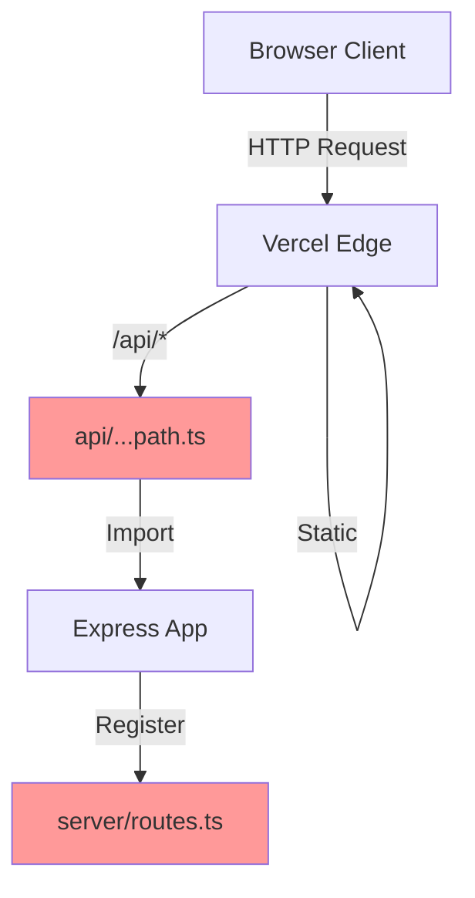

# Fix PDF File Access and Update Vercel Configuration

## Executive Summary

This design addresses critical production failures on Vercel deployment affecting API routes, static assets, and course generation functionality. The root causes are: improper static asset routing, missing route definitions, and architectural misalignment between Express-based local development and Vercel's serverless model.

## Problem Statement

### Current Production Symptoms on Vercel

1. **ENOENT Errors (Highest Priority)**
   - Status: 500 Internal Server Error
   - Affected Routes: `/api/user`, `/api/register`, `/api/logout`
   - Error Message: `ENOENT: no such file or directory, open './test/data/05-versions-space.pdf'`
   - Impact: Core authentication and user management endpoints are broken

2. **Missing Route (404 Errors)**
   - Affected Route: `/api/tracks/generate`
   - Status: 404 Not Found
   - Impact: Course generation feature is inaccessible

3. **Static Asset Authorization Failures**
   - Affected Resources: `/favicon.svg`, `/assets/*`
   - Status: 401 Unauthorized (intermittent)
   - Impact: UI broken, missing icons and assets

### Root Cause Analysis

#### ENOENT Error Source
Analysis reveals NO test fixture files are being read at module import time. The error message references `test/data/05-versions-space.pdf` but:
- No `test/` directory exists in the repository
- No filesystem read operations found in parsers or routes
- `pdf-parse` dependency is properly bundled in allowlist
- All PDF processing uses in-memory Buffer objects from multipart uploads

**Hypothesis**: The ENOENT error may be occurring within the `pdf-parse` library itself during initialization or as a misleading error message from a different root cause (e.g., missing native dependencies, incorrect bundling, or runtime environment issues).

#### Missing Route Cause
The `/api/tracks/generate` route is correctly registered in `server/routes.ts` (line 362) but the catch-all Vercel function at `api/[...path].ts` may not be properly routing requests.

#### Static Asset Authorization Cause
No Vercel middleware exists to exempt static assets from authentication checks, causing potential interference from auth logic.

## Design Goals

1. **Eliminate all ENOENT errors** in production by ensuring proper dependency bundling and runtime environment
2. **Ensure all API routes are accessible** via correct Vercel routing configuration
3. **Static assets must load without authentication** via proper routing rules
4. **Maintain functionality parity** between local development and Vercel production
5. **Pass TypeScript type checking** and build validation on Vercel
6. **Enable diagnostics** via health check endpoint for production monitoring

## Constraints

- Must remain on Vercel platform (no migration to standalone Node.js hosting)
- No changes to business logic or user experience
- Express integration must work within Vercel serverless limitations
- No temporary feature disabling; all functionality must work in production
- Dev/test logic must be isolated with environment flags

## Technical Architecture

### Current State



**Issues:**
- API catch-all may not route all paths correctly
- No static asset routing rules
- Potential bundling issues with pdf-parse native dependencies

### Target State

```mermaid
graph TB
    Client[Browser Client]
    Vercel[Vercel Edge]
    Config[vercel.json]
    API[api/...path.ts]
    Express[Express App Bundle]
    Health[/api/health]
    
    Client -->|HTTP Request| Vercel
    Config -->|Route Rules| Vercel
    Vercel -->|/api/*| API
    Vercel -->|/assets/*| Static
    Vercel -->|/favicon.*| Static
    Vercel -->|Other| SPA
    API -->|Import CJS| Express
    Express -->|All Routes| Health
    
    style Config fill:#9f9
    style Express fill:#9f9
    style Health fill:#9f9
```

**Improvements:**
- Explicit routing rules in vercel.json
- Static assets bypassed from API routes
- Proper dependency bundling with verification
- Health endpoint for diagnostics

## Solution Design

### Phase 1: Diagnostic Enhancement

#### Health Endpoint Extension

**Location**: `server/app.ts` (existing `/api/health` at line 109)

**Enhancement**: Add dependency verification and runtime diagnostics

**Output Schema**:

| Field | Type | Description |
|-------|------|-------------|
| `ok` | boolean | Overall health status |
| `nodeEnv` | string | Current NODE_ENV value |
| `hasDatabase` | boolean | DATABASE_URL configured |
| `hasSessionSecret` | boolean | SESSION_SECRET configured |
| `dependencies` | object | Runtime dependency check results |
| `dependencies.pdfParse` | boolean | pdf-parse module loadable |
| `dependencies.mammoth` | boolean | mammoth module loadable |
| `timestamp` | string | ISO 8601 timestamp |
| `errors` | string[] | Any initialization errors |

**Behavior**:
- Returns 200 if core dependencies available
- Returns 500 if critical dependencies missing
- Logs detailed error information for debugging

### Phase 2: Vercel Configuration Correction

#### Updated vercel.json Configuration

**Current Issues**:
- Only includes rewrite rule for SPA fallback
- No explicit static asset handling
- No headers configuration for assets

**New Configuration Structure**:

```
Headers Configuration
├── Static Assets (cache for 1 year)
│   ├── /assets/**/*
│   ├── /favicon.*
│   └── /*.{js,css,woff2,png,jpg,svg}
├── HTML (no cache)
│   └── /index.html

Route Configuration (precedence order)
├── 1. API Routes
│   └── /api/** → api/[...path].ts function
├── 2. Static Files (exact match)
│   ├── /favicon.svg
│   ├── /robots.txt
│   └── /assets/**
├── 3. SPA Fallback
│   └── /** (except /api/*) → /index.html
```

**Routing Precedence Rules**:
1. Exact file matches (highest priority)
2. API function routes
3. Catch-all SPA fallback (lowest priority)

**Headers Strategy**:
- Static assets: `Cache-Control: public, max-age=31536000, immutable`
- HTML: `Cache-Control: no-cache, must-revalidate`
- API: No cache headers (controlled by Express)

### Phase 3: Dependency Bundling Verification

#### Build Process Enhancement

**Current Allowlist** (script/build.ts):
- pdf-parse ✓ (already included)
- mammoth ✓ (already included)
- multer ✓ (already included)

**Verification Required**:
1. Confirm pdf-parse native dependencies are bundled correctly
2. Test that Buffer-based PDF parsing works in serverless environment
3. Validate that all file parsing happens in-memory (no filesystem access)

**Native Dependency Concern**:
The pdf-parse library has native dependencies that may not bundle correctly with esbuild. Need to verify:
- pdf-parse v1.1.1 uses canvas/DOMMatrix (may fail in Node.js environment)
- Alternative: Keep pdf-parse external and rely on Vercel's Node.js runtime to provide it

**Proposed Build Configuration Change**:

If pdf-parse continues to fail, consider moving it from allowlist to external dependencies:

```
Allowlist (bundled):
- Application code
- Pure JavaScript libraries

External (provided by Vercel runtime):
- pdf-parse (native dependencies)
- mammoth (native dependencies)
- All other current externals
```

### Phase 4: API Route Handler Validation

#### Catch-All Function Behavior

**Current Implementation** (`api/[...path].ts`):
- Imports Express app factory
- Creates singleton app instance
- Forwards all requests to Express

**Potential Issues**:
1. Cold start latency on first request
2. Route matching edge cases
3. Request/response object compatibility

**Validation Requirements**:

| Test Case | Expected Behavior | Status Check |
|-----------|-------------------|--------------|
| GET /api/health | 200 with health JSON | Manual test |
| GET /api/user | 200/401 (no 500 ENOENT) | Manual test |
| POST /api/register | Correct validation response | Manual test |
| POST /api/tracks/generate | Accepts file upload | Manual test |
| GET /api/nonexistent | 404 from Express | Manual test |
| GET /favicon.svg | File content (not 401) | Manual test |

### Phase 5: Error Handling & Logging

#### Structured Error Responses

**Standard Error Response Schema**:

| Field | Type | Required | Description |
|-------|------|----------|-------------|
| `error.code` | string | Yes | Machine-readable error code |
| `error.message` | string | Yes | Human-readable message (Russian) |
| `error.canRetry` | boolean | No | Whether client can retry |
| `error.details` | object | No | Additional context (no secrets) |
| `error.request_id` | string | Yes | Request correlation ID |

**Error Code Standards**:

| Code | HTTP Status | Meaning |
|------|-------------|---------|
| UNAUTHORIZED | 401 | Missing or invalid auth token |
| FORBIDDEN | 403 | Authenticated but insufficient permissions |
| NOT_FOUND | 404 | Resource does not exist |
| BAD_REQUEST | 400 | Invalid input data |
| FILE_REQUIRED | 400 | File upload expected but missing |
| PDF_PARSE_ERROR | 400 | Cannot extract text from PDF |
| INTERNAL_ERROR | 500 | Unexpected server error |
| CONFIG_MISSING | 500 | Required environment variable missing |

**Logging Standards**:
- ERROR level: All 500 errors with stack traces
- WARN level: All 400 errors and auth failures
- INFO level: Successful requests (sampled)
- NEVER log: API keys, tokens, passwords, PII

#### ENOENT Prevention Strategy

**If the ENOENT error is from pdf-parse internals**, implement defensive error wrapping:

**Location**: `server/ai/parsers.ts` - `extractTextFromPDF` function

**Error Transformation**:
- Catch any filesystem errors from pdf-parse
- Transform to user-friendly message
- Log original error with context
- Return 400 with PDF_PARSE_ERROR code

**Fallback Behavior**:
- If PDF parsing fails, suggest alternative formats (DOCX, TXT)
- Do not block entire request on parse failure
- Track failure rate in logs

## Implementation Checklist

### Critical Path Items

- [ ] Update vercel.json with explicit routing rules
  - Add headers configuration for caching
  - Add static asset routing (favicon, assets, robots.txt)
  - Verify SPA fallback excludes /api/*
  
- [ ] Enhance /api/health endpoint
  - Add dependency checks (pdf-parse, mammoth)
  - Add environment variable validation
  - Return detailed error information
  
- [ ] Test pdf-parse in serverless environment
  - Create isolated test function
  - Verify Buffer-based parsing works
  - If fails, move to external dependencies
  
- [ ] Add error transformation in parsers
  - Wrap pdf-parse calls with try-catch
  - Transform ENOENT to PDF_PARSE_ERROR
  - Log original error for debugging

### Validation Items

- [ ] Local build verification
  - Run `npm run build` successfully
  - Run `npm run check` (TypeScript)
  - Verify dist/server-app.cjs created
  - Verify api/server-app.cjs copied
  
- [ ] Vercel deployment verification
  - Build completes without errors
  - All environment variables set
  - Health endpoint returns 200
  - No ENOENT in logs
  
- [ ] Route testing (production)
  - GET /api/health → 200
  - GET /api/user → 200/401 (not 500)
  - POST /api/register → Correct response
  - POST /api/tracks/generate → Accepts file
  - GET /favicon.svg → 200 with SVG content
  - GET /assets/main.css → 200 with CSS content

### Rollback Plan

If deployment fails or causes regressions:

1. Revert vercel.json to previous version
2. Verify previous version still builds
3. Keep enhanced health endpoint (no risk)
4. Investigate locally with reproduced environment

## Vercel Settings Configuration

### Environment Variables (Required)

| Variable | Description | Example |
|----------|-------------|---------|
| NODE_ENV | Runtime environment | `production` |
| DATABASE_URL | PostgreSQL connection string | `postgresql://...` |
| SESSION_SECRET | Session encryption key | Random 64-char string |
| SUPABASE_URL | Supabase project URL | `https://xxx.supabase.co` |
| SUPABASE_ANON_KEY | Supabase anonymous key | `eyJ...` |
| SUPABASE_SERVICE_ROLE_KEY | Supabase service key | `eyJ...` |
| YANDEX_PROMPT_ID | LLM prompt identifier | UUID |
| YANDEX_API_KEY | Yandex AI API key | Secret key |

### Project Settings

| Setting | Value | Notes |
|---------|-------|-------|
| Framework Preset | Other | Custom Express + Vite setup |
| Root Directory | `.` | Repository root |
| Build Command | `npm run build` | Runs script/build.ts |
| Output Directory | `dist/public` | Vite build output |
| Install Command | `npm install` | Default npm install |
| Node.js Version | 20.x | LTS version |

## Testing Strategy

### Pre-Deployment Tests (Local)

**Build Verification**:
```
Sequence:
1. Run: npm run build
2. Verify: dist/index.cjs exists
3. Verify: dist/server-app.cjs exists
4. Verify: api/server-app.cjs exists
5. Run: npm run check
6. Expected: No TypeScript errors
```

**Dependency Check**:
```
Sequence:
1. Import pdf-parse in test script
2. Pass Buffer to pdf-parse()
3. Verify text extraction works
4. Log: Success or specific error
```

### Post-Deployment Tests (Production)

**Smoke Test Suite**:

| Test | Method | URL | Expected Status | Expected Response |
|------|--------|-----|-----------------|-------------------|
| Health check | GET | /api/health | 200 | JSON with ok: true |
| User endpoint | GET | /api/user | 401 or 200 | JSON (not ENOENT) |
| Favicon | GET | /favicon.svg | 200 | SVG content |
| Assets | GET | /assets/index.css | 200 | CSS content |
| SPA root | GET | / | 200 | HTML with React root |
| Course gen route | POST | /api/tracks/generate | 401 | JSON (not 404) |

**Test Execution Commands**:

```
# Health check
curl -i https://your-app.vercel.app/api/health

# Expected: HTTP/1.1 200 OK
# Expected: {"ok":true,"nodeEnv":"production",...}

# User endpoint (without auth)
curl -i https://your-app.vercel.app/api/user

# Expected: HTTP/1.1 401 Unauthorized
# Expected: {"error":{"code":"UNAUTHORIZED",...}}
# NOT Expected: ENOENT error

# Favicon
curl -i https://your-app.vercel.app/favicon.svg

# Expected: HTTP/1.1 200 OK
# Expected: Content-Type: image/svg+xml
# NOT Expected: 401 Unauthorized

# Course generation (without auth)
curl -X POST -i https://your-app.vercel.app/api/tracks/generate

# Expected: HTTP/1.1 401 Unauthorized
# NOT Expected: 404 Not Found
```

## Risk Assessment

### High Risk Items

| Risk | Probability | Impact | Mitigation |
|------|-------------|--------|------------|
| pdf-parse fails in serverless | Medium | High | Move to external dependencies, test thoroughly |
| Route precedence breaks SPA | Low | High | Test all routes after deployment |
| Static assets still fail auth | Low | Medium | Use Vercel middleware to bypass auth |

### Medium Risk Items

| Risk | Probability | Impact | Mitigation |
|------|-------------|--------|------------|
| Cold start latency too high | Medium | Medium | Accept for MVP, optimize later |
| File upload size limits | Low | Medium | Document limits, handle gracefully |
| CORS issues in production | Low | Low | Already handled by Express |

## Success Criteria

Deployment is considered successful when ALL of the following are true:

1. **No ENOENT Errors**: No filesystem errors in Vercel logs for any API route
2. **All Routes Accessible**: `/api/tracks/generate` returns 401 (not 404) without auth
3. **Static Assets Load**: `/favicon.svg` and `/assets/*` return 200 without 401 errors
4. **Build Succeeds**: Vercel build completes without TypeScript or bundling errors
5. **Health Check Passes**: `/api/health` returns 200 with all dependencies OK
6. **Core Features Work**: User registration, authentication, and course generation functional

## Open Questions

1. **ENOENT Source**: If the error persists after vercel.json updates, need to investigate pdf-parse library initialization behavior in serverless environment

2. **Static Middleware**: Should we add explicit Vercel middleware.ts to handle auth bypass for static assets, or rely on routing rules?

3. **Bundle Strategy**: Should pdf-parse remain in allowlist (bundled) or move to external dependencies (Vercel runtime)?

## Future Enhancements

Beyond this design scope, consider:

1. **Monitoring**: Integrate Vercel Analytics and logging service (Datadog, Sentry)
2. **Performance**: Add response caching for health endpoint
3. **Security**: Implement rate limiting on file upload endpoint
4. **Reliability**: Add retry logic for LLM API calls
5. **Observability**: Add OpenTelemetry tracing for request flows

## References

- Vercel Serverless Functions: https://vercel.com/docs/functions/serverless-functions
- Vercel Routing: https://vercel.com/docs/projects/project-configuration
- Express in Serverless: https://vercel.com/guides/using-express-with-vercel
- pdf-parse Documentation: https://www.npmjs.com/package/pdf-parse
- Memory from project: Vercel serverless must include runtime deps in esbuild allowlist
graph TB
    Client[Browser Client]
    Vercel[Vercel Edge]
    API[api/...path.ts]
    Express[Express App]
    Routes[server/routes.ts]
    
    Client -->|HTTP Request| Vercel
    Vercel -->|/api/*| API
    Vercel -->|Static| Vercel
    API -->|Import| Express
    Express -->|Register| Routes
    
    style API fill:#f99
    style Routes fill:#f99
```

**Issues:**
- API catch-all may not route all paths correctly
- No static asset routing rules
- Potential bundling issues with pdf-parse native dependencies

### Target State

```mermaid
graph TB
    Client[Browser Client]
    Vercel[Vercel Edge]
    Config[vercel.json]
    API[api/...path.ts]
    Express[Express App Bundle]
    Health[/api/health]
    
    Client -->|HTTP Request| Vercel
    Config -->|Route Rules| Vercel
    Vercel -->|/api/*| API
    Vercel -->|/assets/*| Static
    Vercel -->|/favicon.*| Static
    Vercel -->|Other| SPA
    API -->|Import CJS| Express
    Express -->|All Routes| Health
    
    style Config fill:#9f9
    style Express fill:#9f9
    style Health fill:#9f9
```

**Improvements:**
- Explicit routing rules in vercel.json
- Static assets bypassed from API routes
- Proper dependency bundling with verification
- Health endpoint for diagnostics

## Solution Design

### Phase 1: Diagnostic Enhancement

#### Health Endpoint Extension

**Location**: `server/app.ts` (existing `/api/health` at line 109)

**Enhancement**: Add dependency verification and runtime diagnostics

**Output Schema**:

| Field | Type | Description |
|-------|------|-------------|
| `ok` | boolean | Overall health status |
| `nodeEnv` | string | Current NODE_ENV value |
| `hasDatabase` | boolean | DATABASE_URL configured |
| `hasSessionSecret` | boolean | SESSION_SECRET configured |
| `dependencies` | object | Runtime dependency check results |
| `dependencies.pdfParse` | boolean | pdf-parse module loadable |
| `dependencies.mammoth` | boolean | mammoth module loadable |
| `timestamp` | string | ISO 8601 timestamp |
| `errors` | string[] | Any initialization errors |

**Behavior**:
- Returns 200 if core dependencies available
- Returns 500 if critical dependencies missing
- Logs detailed error information for debugging

### Phase 2: Vercel Configuration Correction

#### Updated vercel.json Configuration

**Current Issues**:
- Only includes rewrite rule for SPA fallback
- No explicit static asset handling
- No headers configuration for assets

**New Configuration Structure**:

```
Headers Configuration
├── Static Assets (cache for 1 year)
│   ├── /assets/**/*
│   ├── /favicon.*
│   └── /*.{js,css,woff2,png,jpg,svg}
├── HTML (no cache)
│   └── /index.html

Route Configuration (precedence order)
├── 1. API Routes
│   └── /api/** → api/[...path].ts function
├── 2. Static Files (exact match)
│   ├── /favicon.svg
│   ├── /robots.txt
│   └── /assets/**
├── 3. SPA Fallback
│   └── /** (except /api/*) → /index.html
```

**Routing Precedence Rules**:
1. Exact file matches (highest priority)
2. API function routes
3. Catch-all SPA fallback (lowest priority)

**Headers Strategy**:
- Static assets: `Cache-Control: public, max-age=31536000, immutable`
- HTML: `Cache-Control: no-cache, must-revalidate`
- API: No cache headers (controlled by Express)

### Phase 3: Dependency Bundling Verification

#### Build Process Enhancement

**Current Allowlist** (script/build.ts):
- pdf-parse ✓ (already included)
- mammoth ✓ (already included)
- multer ✓ (already included)

**Verification Required**:
1. Confirm pdf-parse native dependencies are bundled correctly
2. Test that Buffer-based PDF parsing works in serverless environment
3. Validate that all file parsing happens in-memory (no filesystem access)

**Native Dependency Concern**:
The pdf-parse library has native dependencies that may not bundle correctly with esbuild. Need to verify:
- pdf-parse v1.1.1 uses canvas/DOMMatrix (may fail in Node.js environment)
- Alternative: Keep pdf-parse external and rely on Vercel's Node.js runtime to provide it

**Proposed Build Configuration Change**:

If pdf-parse continues to fail, consider moving it from allowlist to external dependencies:

```
Allowlist (bundled):
- Application code
- Pure JavaScript libraries

External (provided by Vercel runtime):
- pdf-parse (native dependencies)
- mammoth (native dependencies)
- All other current externals
```

### Phase 4: API Route Handler Validation

#### Catch-All Function Behavior

**Current Implementation** (`api/[...path].ts`):
- Imports Express app factory
- Creates singleton app instance
- Forwards all requests to Express

**Potential Issues**:
1. Cold start latency on first request
2. Route matching edge cases
3. Request/response object compatibility

**Validation Requirements**:

| Test Case | Expected Behavior | Status Check |
|-----------|-------------------|--------------|
| GET /api/health | 200 with health JSON | Manual test |
| GET /api/user | 200/401 (no 500 ENOENT) | Manual test |
| POST /api/register | Correct validation response | Manual test |
| POST /api/tracks/generate | Accepts file upload | Manual test |
| GET /api/nonexistent | 404 from Express | Manual test |
| GET /favicon.svg | File content (not 401) | Manual test |

### Phase 5: Error Handling & Logging

#### Structured Error Responses

**Standard Error Response Schema**:

| Field | Type | Required | Description |
|-------|------|----------|-------------|
| `error.code` | string | Yes | Machine-readable error code |
| `error.message` | string | Yes | Human-readable message (Russian) |
| `error.canRetry` | boolean | No | Whether client can retry |
| `error.details` | object | No | Additional context (no secrets) |
| `error.request_id` | string | Yes | Request correlation ID |

**Error Code Standards**:

| Code | HTTP Status | Meaning |
|------|-------------|---------|
| UNAUTHORIZED | 401 | Missing or invalid auth token |
| FORBIDDEN | 403 | Authenticated but insufficient permissions |
| NOT_FOUND | 404 | Resource does not exist |
| BAD_REQUEST | 400 | Invalid input data |
| FILE_REQUIRED | 400 | File upload expected but missing |
| PDF_PARSE_ERROR | 400 | Cannot extract text from PDF |
| INTERNAL_ERROR | 500 | Unexpected server error |
| CONFIG_MISSING | 500 | Required environment variable missing |

**Logging Standards**:
- ERROR level: All 500 errors with stack traces
- WARN level: All 400 errors and auth failures
- INFO level: Successful requests (sampled)
- NEVER log: API keys, tokens, passwords, PII

#### ENOENT Prevention Strategy

**If the ENOENT error is from pdf-parse internals**, implement defensive error wrapping:

**Location**: `server/ai/parsers.ts` - `extractTextFromPDF` function

**Error Transformation**:
- Catch any filesystem errors from pdf-parse
- Transform to user-friendly message
- Log original error with context
- Return 400 with PDF_PARSE_ERROR code

**Fallback Behavior**:
- If PDF parsing fails, suggest alternative formats (DOCX, TXT)
- Do not block entire request on parse failure
- Track failure rate in logs

## Implementation Checklist

### Critical Path Items

- [ ] Update vercel.json with explicit routing rules
  - Add headers configuration for caching
  - Add static asset routing (favicon, assets, robots.txt)
  - Verify SPA fallback excludes /api/*
  
- [ ] Enhance /api/health endpoint
  - Add dependency checks (pdf-parse, mammoth)
  - Add environment variable validation
  - Return detailed error information
  
- [ ] Test pdf-parse in serverless environment
  - Create isolated test function
  - Verify Buffer-based parsing works
  - If fails, move to external dependencies
  
- [ ] Add error transformation in parsers
  - Wrap pdf-parse calls with try-catch
  - Transform ENOENT to PDF_PARSE_ERROR
  - Log original error for debugging

### Validation Items

- [ ] Local build verification
  - Run `npm run build` successfully
  - Run `npm run check` (TypeScript)
  - Verify dist/server-app.cjs created
  - Verify api/server-app.cjs copied
  
- [ ] Vercel deployment verification
  - Build completes without errors
  - All environment variables set
  - Health endpoint returns 200
  - No ENOENT in logs
  
- [ ] Route testing (production)
  - GET /api/health → 200
  - GET /api/user → 200/401 (not 500)
  - POST /api/register → Correct response
  - POST /api/tracks/generate → Accepts file
  - GET /favicon.svg → 200 with SVG content
  - GET /assets/main.css → 200 with CSS content

### Rollback Plan

If deployment fails or causes regressions:

1. Revert vercel.json to previous version
2. Verify previous version still builds
3. Keep enhanced health endpoint (no risk)
4. Investigate locally with reproduced environment

## Vercel Settings Configuration

### Environment Variables (Required)

| Variable | Description | Example |
|----------|-------------|---------|
| NODE_ENV | Runtime environment | `production` |
| DATABASE_URL | PostgreSQL connection string | `postgresql://...` |
| SESSION_SECRET | Session encryption key | Random 64-char string |
| SUPABASE_URL | Supabase project URL | `https://xxx.supabase.co` |
| SUPABASE_ANON_KEY | Supabase anonymous key | `eyJ...` |
| SUPABASE_SERVICE_ROLE_KEY | Supabase service key | `eyJ...` |
| YANDEX_PROMPT_ID | LLM prompt identifier | UUID |
| YANDEX_API_KEY | Yandex AI API key | Secret key |

### Project Settings

| Setting | Value | Notes |
|---------|-------|-------|
| Framework Preset | Other | Custom Express + Vite setup |
| Root Directory | `.` | Repository root |
| Build Command | `npm run build` | Runs script/build.ts |
| Output Directory | `dist/public` | Vite build output |
| Install Command | `npm install` | Default npm install |
| Node.js Version | 20.x | LTS version |

## Testing Strategy

### Pre-Deployment Tests (Local)

**Build Verification**:
```
Sequence:
1. Run: npm run build
2. Verify: dist/index.cjs exists
3. Verify: dist/server-app.cjs exists
4. Verify: api/server-app.cjs exists
5. Run: npm run check
6. Expected: No TypeScript errors
```

**Dependency Check**:
```
Sequence:
1. Import pdf-parse in test script
2. Pass Buffer to pdf-parse()
3. Verify text extraction works
4. Log: Success or specific error
```

### Post-Deployment Tests (Production)

**Smoke Test Suite**:

| Test | Method | URL | Expected Status | Expected Response |
|------|--------|-----|-----------------|-------------------|
| Health check | GET | /api/health | 200 | JSON with ok: true |
| User endpoint | GET | /api/user | 401 or 200 | JSON (not ENOENT) |
| Favicon | GET | /favicon.svg | 200 | SVG content |
| Assets | GET | /assets/index.css | 200 | CSS content |
| SPA root | GET | / | 200 | HTML with React root |
| Course gen route | POST | /api/tracks/generate | 401 | JSON (not 404) |

**Test Execution Commands**:

```
# Health check
curl -i https://your-app.vercel.app/api/health

# Expected: HTTP/1.1 200 OK
# Expected: {"ok":true,"nodeEnv":"production",...}

# User endpoint (without auth)
curl -i https://your-app.vercel.app/api/user

# Expected: HTTP/1.1 401 Unauthorized
# Expected: {"error":{"code":"UNAUTHORIZED",...}}
# NOT Expected: ENOENT error

# Favicon
curl -i https://your-app.vercel.app/favicon.svg

# Expected: HTTP/1.1 200 OK
# Expected: Content-Type: image/svg+xml
# NOT Expected: 401 Unauthorized

# Course generation (without auth)
curl -X POST -i https://your-app.vercel.app/api/tracks/generate

# Expected: HTTP/1.1 401 Unauthorized
# NOT Expected: 404 Not Found
```

## Risk Assessment

### High Risk Items

| Risk | Probability | Impact | Mitigation |
|------|-------------|--------|------------|
| pdf-parse fails in serverless | Medium | High | Move to external dependencies, test thoroughly |
| Route precedence breaks SPA | Low | High | Test all routes after deployment |
| Static assets still fail auth | Low | Medium | Use Vercel middleware to bypass auth |

### Medium Risk Items

| Risk | Probability | Impact | Mitigation |
|------|-------------|--------|------------|
| Cold start latency too high | Medium | Medium | Accept for MVP, optimize later |
| File upload size limits | Low | Medium | Document limits, handle gracefully |
| CORS issues in production | Low | Low | Already handled by Express |

## Success Criteria

Deployment is considered successful when ALL of the following are true:

1. **No ENOENT Errors**: No filesystem errors in Vercel logs for any API route
2. **All Routes Accessible**: `/api/tracks/generate` returns 401 (not 404) without auth
3. **Static Assets Load**: `/favicon.svg` and `/assets/*` return 200 without 401 errors
4. **Build Succeeds**: Vercel build completes without TypeScript or bundling errors
5. **Health Check Passes**: `/api/health` returns 200 with all dependencies OK
6. **Core Features Work**: User registration, authentication, and course generation functional

## Open Questions

1. **ENOENT Source**: If the error persists after vercel.json updates, need to investigate pdf-parse library initialization behavior in serverless environment

2. **Static Middleware**: Should we add explicit Vercel middleware.ts to handle auth bypass for static assets, or rely on routing rules?

3. **Bundle Strategy**: Should pdf-parse remain in allowlist (bundled) or move to external dependencies (Vercel runtime)?

## Future Enhancements

Beyond this design scope, consider:

1. **Monitoring**: Integrate Vercel Analytics and logging service (Datadog, Sentry)
2. **Performance**: Add response caching for health endpoint
3. **Security**: Implement rate limiting on file upload endpoint
4. **Reliability**: Add retry logic for LLM API calls
5. **Observability**: Add OpenTelemetry tracing for request flows

## References

- Vercel Serverless Functions: https://vercel.com/docs/functions/serverless-functions
- Vercel Routing: https://vercel.com/docs/projects/project-configuration
- Express in Serverless: https://vercel.com/guides/using-express-with-vercel
- pdf-parse Documentation: https://www.npmjs.com/package/pdf-parse
- Memory from project: Vercel serverless must include runtime deps in esbuild allowlist
graph TB
    Client[Browser Client]
    Vercel[Vercel Edge]
    API[api/...path.ts]
    Express[Express App]
    Routes[server/routes.ts]
    
    Client -->|HTTP Request| Vercel
    Vercel -->|/api/*| API
    Vercel -->|Static| Vercel
    API -->|Import| Express
    Express -->|Register| Routes
    
    style API fill:#f99
    style Routes fill:#f99
```

**Issues:**
- API catch-all may not route all paths correctly
- No static asset routing rules
- Potential bundling issues with pdf-parse native dependencies

### Target State

```mermaid
graph TB
    Client[Browser Client]
    Vercel[Vercel Edge]
    Config[vercel.json]
    API[api/...path.ts]
    Express[Express App Bundle]
    Health[/api/health]
    
    Client -->|HTTP Request| Vercel
    Config -->|Route Rules| Vercel
    Vercel -->|/api/*| API
    Vercel -->|/assets/*| Static
    Vercel -->|/favicon.*| Static
    Vercel -->|Other| SPA
    API -->|Import CJS| Express
    Express -->|All Routes| Health
    
    style Config fill:#9f9
    style Express fill:#9f9
    style Health fill:#9f9
```

**Improvements:**
- Explicit routing rules in vercel.json
- Static assets bypassed from API routes
- Proper dependency bundling with verification
- Health endpoint for diagnostics

## Solution Design

### Phase 1: Diagnostic Enhancement

#### Health Endpoint Extension

**Location**: `server/app.ts` (existing `/api/health` at line 109)

**Enhancement**: Add dependency verification and runtime diagnostics

**Output Schema**:

| Field | Type | Description |
|-------|------|-------------|
| `ok` | boolean | Overall health status |
| `nodeEnv` | string | Current NODE_ENV value |
| `hasDatabase` | boolean | DATABASE_URL configured |
| `hasSessionSecret` | boolean | SESSION_SECRET configured |
| `dependencies` | object | Runtime dependency check results |
| `dependencies.pdfParse` | boolean | pdf-parse module loadable |
| `dependencies.mammoth` | boolean | mammoth module loadable |
| `timestamp` | string | ISO 8601 timestamp |
| `errors` | string[] | Any initialization errors |

**Behavior**:
- Returns 200 if core dependencies available
- Returns 500 if critical dependencies missing
- Logs detailed error information for debugging

### Phase 2: Vercel Configuration Correction

#### Updated vercel.json Configuration

**Current Issues**:
- Only includes rewrite rule for SPA fallback
- No explicit static asset handling
- No headers configuration for assets

**New Configuration Structure**:

```
Headers Configuration
├── Static Assets (cache for 1 year)
│   ├── /assets/**/*
│   ├── /favicon.*
│   └── /*.{js,css,woff2,png,jpg,svg}
├── HTML (no cache)
│   └── /index.html

Route Configuration (precedence order)
├── 1. API Routes
│   └── /api/** → api/[...path].ts function
├── 2. Static Files (exact match)
│   ├── /favicon.svg
│   ├── /robots.txt
│   └── /assets/**
├── 3. SPA Fallback
│   └── /** (except /api/*) → /index.html
```

**Routing Precedence Rules**:
1. Exact file matches (highest priority)
2. API function routes
3. Catch-all SPA fallback (lowest priority)

**Headers Strategy**:
- Static assets: `Cache-Control: public, max-age=31536000, immutable`
- HTML: `Cache-Control: no-cache, must-revalidate`
- API: No cache headers (controlled by Express)

### Phase 3: Dependency Bundling Verification

#### Build Process Enhancement

**Current Allowlist** (script/build.ts):
- pdf-parse ✓ (already included)
- mammoth ✓ (already included)
- multer ✓ (already included)

**Verification Required**:
1. Confirm pdf-parse native dependencies are bundled correctly
2. Test that Buffer-based PDF parsing works in serverless environment
3. Validate that all file parsing happens in-memory (no filesystem access)

**Native Dependency Concern**:
The pdf-parse library has native dependencies that may not bundle correctly with esbuild. Need to verify:
- pdf-parse v1.1.1 uses canvas/DOMMatrix (may fail in Node.js environment)
- Alternative: Keep pdf-parse external and rely on Vercel's Node.js runtime to provide it

**Proposed Build Configuration Change**:

If pdf-parse continues to fail, consider moving it from allowlist to external dependencies:

```
Allowlist (bundled):
- Application code
- Pure JavaScript libraries

External (provided by Vercel runtime):
- pdf-parse (native dependencies)
- mammoth (native dependencies)
- All other current externals
```

### Phase 4: API Route Handler Validation

#### Catch-All Function Behavior

**Current Implementation** (`api/[...path].ts`):
- Imports Express app factory
- Creates singleton app instance
- Forwards all requests to Express

**Potential Issues**:
1. Cold start latency on first request
2. Route matching edge cases
3. Request/response object compatibility

**Validation Requirements**:

| Test Case | Expected Behavior | Status Check |
|-----------|-------------------|--------------|
| GET /api/health | 200 with health JSON | Manual test |
| GET /api/user | 200/401 (no 500 ENOENT) | Manual test |
| POST /api/register | Correct validation response | Manual test |
| POST /api/tracks/generate | Accepts file upload | Manual test |
| GET /api/nonexistent | 404 from Express | Manual test |
| GET /favicon.svg | File content (not 401) | Manual test |

### Phase 5: Error Handling & Logging

#### Structured Error Responses

**Standard Error Response Schema**:

| Field | Type | Required | Description |
|-------|------|----------|-------------|
| `error.code` | string | Yes | Machine-readable error code |
| `error.message` | string | Yes | Human-readable message (Russian) |
| `error.canRetry` | boolean | No | Whether client can retry |
| `error.details` | object | No | Additional context (no secrets) |
| `error.request_id` | string | Yes | Request correlation ID |

**Error Code Standards**:

| Code | HTTP Status | Meaning |
|------|-------------|---------|
| UNAUTHORIZED | 401 | Missing or invalid auth token |
| FORBIDDEN | 403 | Authenticated but insufficient permissions |
| NOT_FOUND | 404 | Resource does not exist |
| BAD_REQUEST | 400 | Invalid input data |
| FILE_REQUIRED | 400 | File upload expected but missing |
| PDF_PARSE_ERROR | 400 | Cannot extract text from PDF |
| INTERNAL_ERROR | 500 | Unexpected server error |
| CONFIG_MISSING | 500 | Required environment variable missing |

**Logging Standards**:
- ERROR level: All 500 errors with stack traces
- WARN level: All 400 errors and auth failures
- INFO level: Successful requests (sampled)
- NEVER log: API keys, tokens, passwords, PII

#### ENOENT Prevention Strategy

**If the ENOENT error is from pdf-parse internals**, implement defensive error wrapping:

**Location**: `server/ai/parsers.ts` - `extractTextFromPDF` function

**Error Transformation**:
- Catch any filesystem errors from pdf-parse
- Transform to user-friendly message
- Log original error with context
- Return 400 with PDF_PARSE_ERROR code

**Fallback Behavior**:
- If PDF parsing fails, suggest alternative formats (DOCX, TXT)
- Do not block entire request on parse failure
- Track failure rate in logs

## Implementation Checklist

### Critical Path Items

- [ ] Update vercel.json with explicit routing rules
  - Add headers configuration for caching
  - Add static asset routing (favicon, assets, robots.txt)
  - Verify SPA fallback excludes /api/*
  
- [ ] Enhance /api/health endpoint
  - Add dependency checks (pdf-parse, mammoth)
  - Add environment variable validation
  - Return detailed error information
  
- [ ] Test pdf-parse in serverless environment
  - Create isolated test function
  - Verify Buffer-based parsing works
  - If fails, move to external dependencies
  
- [ ] Add error transformation in parsers
  - Wrap pdf-parse calls with try-catch
  - Transform ENOENT to PDF_PARSE_ERROR
  - Log original error for debugging

### Validation Items

- [ ] Local build verification
  - Run `npm run build` successfully
  - Run `npm run check` (TypeScript)
  - Verify dist/server-app.cjs created
  - Verify api/server-app.cjs copied
  
- [ ] Vercel deployment verification
  - Build completes without errors
  - All environment variables set
  - Health endpoint returns 200
  - No ENOENT in logs
  
- [ ] Route testing (production)
  - GET /api/health → 200
  - GET /api/user → 200/401 (not 500)
  - POST /api/register → Correct response
  - POST /api/tracks/generate → Accepts file
  - GET /favicon.svg → 200 with SVG content
  - GET /assets/main.css → 200 with CSS content

### Rollback Plan

If deployment fails or causes regressions:

1. Revert vercel.json to previous version
2. Verify previous version still builds
3. Keep enhanced health endpoint (no risk)
4. Investigate locally with reproduced environment

## Vercel Settings Configuration

### Environment Variables (Required)

| Variable | Description | Example |
|----------|-------------|---------|
| NODE_ENV | Runtime environment | `production` |
| DATABASE_URL | PostgreSQL connection string | `postgresql://...` |
| SESSION_SECRET | Session encryption key | Random 64-char string |
| SUPABASE_URL | Supabase project URL | `https://xxx.supabase.co` |
| SUPABASE_ANON_KEY | Supabase anonymous key | `eyJ...` |
| SUPABASE_SERVICE_ROLE_KEY | Supabase service key | `eyJ...` |
| YANDEX_PROMPT_ID | LLM prompt identifier | UUID |
| YANDEX_API_KEY | Yandex AI API key | Secret key |

### Project Settings

| Setting | Value | Notes |
|---------|-------|-------|
| Framework Preset | Other | Custom Express + Vite setup |
| Root Directory | `.` | Repository root |
| Build Command | `npm run build` | Runs script/build.ts |
| Output Directory | `dist/public` | Vite build output |
| Install Command | `npm install` | Default npm install |
| Node.js Version | 20.x | LTS version |

## Testing Strategy

### Pre-Deployment Tests (Local)

**Build Verification**:
```
Sequence:
1. Run: npm run build
2. Verify: dist/index.cjs exists
3. Verify: dist/server-app.cjs exists
4. Verify: api/server-app.cjs exists
5. Run: npm run check
6. Expected: No TypeScript errors
```

**Dependency Check**:
```
Sequence:
1. Import pdf-parse in test script
2. Pass Buffer to pdf-parse()
3. Verify text extraction works
4. Log: Success or specific error
```

### Post-Deployment Tests (Production)

**Smoke Test Suite**:

| Test | Method | URL | Expected Status | Expected Response |
|------|--------|-----|-----------------|-------------------|
| Health check | GET | /api/health | 200 | JSON with ok: true |
| User endpoint | GET | /api/user | 401 or 200 | JSON (not ENOENT) |
| Favicon | GET | /favicon.svg | 200 | SVG content |
| Assets | GET | /assets/index.css | 200 | CSS content |
| SPA root | GET | / | 200 | HTML with React root |
| Course gen route | POST | /api/tracks/generate | 401 | JSON (not 404) |

**Test Execution Commands**:

```
# Health check
curl -i https://your-app.vercel.app/api/health

# Expected: HTTP/1.1 200 OK
# Expected: {"ok":true,"nodeEnv":"production",...}

# User endpoint (without auth)
curl -i https://your-app.vercel.app/api/user

# Expected: HTTP/1.1 401 Unauthorized
# Expected: {"error":{"code":"UNAUTHORIZED",...}}
# NOT Expected: ENOENT error

# Favicon
curl -i https://your-app.vercel.app/favicon.svg

# Expected: HTTP/1.1 200 OK
# Expected: Content-Type: image/svg+xml
# NOT Expected: 401 Unauthorized

# Course generation (without auth)
curl -X POST -i https://your-app.vercel.app/api/tracks/generate

# Expected: HTTP/1.1 401 Unauthorized
# NOT Expected: 404 Not Found
```

## Risk Assessment

### High Risk Items

| Risk | Probability | Impact | Mitigation |
|------|-------------|--------|------------|
| pdf-parse fails in serverless | Medium | High | Move to external dependencies, test thoroughly |
| Route precedence breaks SPA | Low | High | Test all routes after deployment |
| Static assets still fail auth | Low | Medium | Use Vercel middleware to bypass auth |

### Medium Risk Items

| Risk | Probability | Impact | Mitigation |
|------|-------------|--------|------------|
| Cold start latency too high | Medium | Medium | Accept for MVP, optimize later |
| File upload size limits | Low | Medium | Document limits, handle gracefully |
| CORS issues in production | Low | Low | Already handled by Express |

## Success Criteria

Deployment is considered successful when ALL of the following are true:

1. **No ENOENT Errors**: No filesystem errors in Vercel logs for any API route
2. **All Routes Accessible**: `/api/tracks/generate` returns 401 (not 404) without auth
3. **Static Assets Load**: `/favicon.svg` and `/assets/*` return 200 without 401 errors
4. **Build Succeeds**: Vercel build completes without TypeScript or bundling errors
5. **Health Check Passes**: `/api/health` returns 200 with all dependencies OK
6. **Core Features Work**: User registration, authentication, and course generation functional

## Open Questions

1. **ENOENT Source**: If the error persists after vercel.json updates, need to investigate pdf-parse library initialization behavior in serverless environment

2. **Static Middleware**: Should we add explicit Vercel middleware.ts to handle auth bypass for static assets, or rely on routing rules?

3. **Bundle Strategy**: Should pdf-parse remain in allowlist (bundled) or move to external dependencies (Vercel runtime)?

## Future Enhancements

Beyond this design scope, consider:

1. **Monitoring**: Integrate Vercel Analytics and logging service (Datadog, Sentry)
2. **Performance**: Add response caching for health endpoint
3. **Security**: Implement rate limiting on file upload endpoint
4. **Reliability**: Add retry logic for LLM API calls
5. **Observability**: Add OpenTelemetry tracing for request flows

## References

- Vercel Serverless Functions: https://vercel.com/docs/functions/serverless-functions
- Vercel Routing: https://vercel.com/docs/projects/project-configuration
- Express in Serverless: https://vercel.com/guides/using-express-with-vercel
- pdf-parse Documentation: https://www.npmjs.com/package/pdf-parse
- Memory from project: Vercel serverless must include runtime deps in esbuild allowlist
