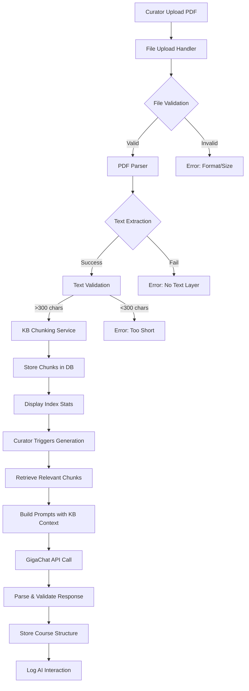

# Feature Design: Fix PDF Parsing and Course Generation

## Overview

Fix the end-to-end course generation pipeline to properly parse PDF files, chunk knowledge base content, retrieve context via RAG, and generate comprehensive training courses with scalable question counts.

## Problem Statement

### Current Failures

**A) PDF Parsing Broken**
- PDF upload succeeds but text extraction fails or returns empty content
- Extraction errors show "text not readable / empty text" even for valid PDFs
- Knowledge base becomes empty, preventing proper course generation
- No validation of extracted text quality or length

**B) Course Generation Uses Hardcoded Logic**
- All courses generate approximately 4 questions regardless of KB size
- Question count based on incorrect hardcoded file size heuristics
- KB content not effectively used in RAG pipeline
- No visible grounding of generated content to KB chunks
- Generated courses lack depth and variety in question types

**C) Missing Observability**
- PDF parsing failures occur silently without user feedback
- No logging of AI interactions for debugging
- Cannot trace why course generation produces poor results
- No KB indexing statistics shown to curator

## Goals

### Success Criteria

**Must Have:**
1. PDF text extraction succeeds for typical corporate documents with text layer
2. Extracted text validated for minimum length (300 characters)
3. KB text chunked deterministically and stored in database
4. Course generation retrieves 12-24 KB chunks for context
5. Generated courses scale with KB size: 2-8 modules, 6+ lessons, 20+ questions
6. All AI interactions logged to ai_logs table
7. User-facing error messages for all failure modes
8. UI displays "Indexed: X chunks • Y characters" after upload

**Should Have:**
- Clear error message for scanned PDFs without text layer
- Curator view of AI debug logs
- KB chunk retrieval statistics in logs

**Nice to Have:**
- Semantic chunk retrieval using embeddings
- Configurable target duration and difficulty

## Architecture

### System Components



### Data Flow

**Phase 1: PDF Upload and Parsing**

| Step | Component | Input | Output | Error Handling |
|------|-----------|-------|--------|----------------|
| 1 | File Upload | PDF file via multer | File buffer | File too large error |
| 2 | PDF Parser | File buffer | Extracted text, page count, char count | Invalid PDF, encrypted, no text layer |
| 3 | Text Validation | Extracted text | Valid flag | Text too short (<300 chars) |
| 4 | Track Creation | Title, validated text | Track record | Database error |
| 5 | KB Chunking | Raw text | Array of chunks | Empty text error |
| 6 | Chunk Storage | Chunks, track ID | Stored chunk records | Database error |
| 7 | UI Feedback | Chunk count, char count | Display in UI | N/A |

**Phase 2: Course Generation with RAG**

| Step | Component | Input | Output | Error Handling |
|------|-----------|-------|--------|----------------|
| 1 | Budget Calculation | KB size, target duration | Module/lesson/question counts | N/A |
| 2 | Chunk Retrieval | Track ID, query keywords | Top 12-24 chunks | Empty KB warning |
| 3 | Prompt Building | System prompt, KB chunks, budget | Full prompt text | N/A |
| 4 | GigaChat Call | Messages, options | JSON course structure | API error, timeout |
| 5 | JSON Parsing | Response text | Parsed course object | Retry with fix prompt |
| 6 | Structure Validation | Course object | Valid flag | Too small course, missing fields |
| 7 | Course Storage | Validated course | Stored modules/lessons/steps | Database error |
| 8 | AI Logging | All interaction data | Log record | Log failure (non-blocking) |

## Detailed Design

### PDF Parsing Enhancement

**Objective:** Reliably extract text from PDFs with proper error handling and validation.

**Changes to `/server/ai/parsers.ts`:**

The existing `extractTextFromPDF` function uses pdf-parse library correctly but lacks comprehensive validation. Enhance as follows:

**Validation Logic:**
- After extraction, check `data.text` length
- If length < 300 characters, throw user-friendly error
- Return metadata object instead of plain string

**Return Structure:**
```
{
  fullText: string
  pageCount: number
  extractedCharCount: number
  metadata: {
    pdfVersion: string (if available)
    encrypted: boolean
  }
}
```

**Error Messages (Russian):**
- Empty text: "PDF не содержит текстового слоя. Это может быть отсканированный документ. Экспортируйте PDF с текстом или используйте TXT/DOCX."
- Too short: "Извлечено слишком мало текста ({count} символов). Проверьте качество файла или загрузите более полный документ."
- Encrypted: "PDF защищён паролем. Загрузите незащищённую версию."

**Update File Upload Handler in `/server/routes.ts`:**

Modify the `/api/tracks/generate` endpoint to:
1. Call enhanced parser
2. Validate extracted character count
3. Store extraction metadata with track
4. Return clear error response on failure

### KB Chunking and Storage

**Objective:** Deterministically split KB text into overlapping chunks and store in database.

**Chunking Parameters (already implemented in kb-service.ts):**
- Chunk size: 1000 characters (target)
- Overlap: 120 characters
- Max chunk size: 1200 characters (force split)
- Sentence-aware splitting when possible

**Enhancement to `/server/ai/kb-service.ts`:**

Current implementation is solid. Add validation:
- Reject KB text with < 300 characters total
- Log chunk statistics
- Return metadata object

**Database Schema (already exists in schema.ts):**

The `kbChunks` table contains:
- trackId: foreign key to tracks
- chunkIndex: sequential index
- content: chunk text
- metadata: JSON with length, wordCount

No changes needed to schema.

**Integration Point:**

After track creation in `/server/routes.ts`, call:
```
const chunkCount = await storeKBChunks(trackId, extractedText);
```

Return in API response:
```
{
  track: { id, title, ... },
  kbStats: {
    totalChars: extractedCharCount,
    chunkCount: chunkCount
  }
}
```

### RAG Retrieval Strategy

**Objective:** Retrieve most relevant KB chunks for course generation prompt context.

**Approach:** Keyword-based retrieval (already implemented in kb-service.ts).

The existing `retrieveRelevantChunks` function:
- Extracts keywords from query
- Scores chunks by keyword matches
- Returns top K chunks sorted by score

**Enhancement:**

For course generation, retrieve more chunks to provide comprehensive context:
- Increase top K from 5 to 20 for course generation
- For large KB (>50k chars), retrieve up to 24 chunks
- Include chunk IDs in AI logs for traceability

**Query Strategy:**

When generating course, use training title + key KB topics as query:
```
const query = `${title} ${extractTopicsFromKB(knowledgeBase)}`;
const chunks = await retrieveRelevantChunks(trackId, query, topK);
```

Where `extractTopicsFromKB` extracts 5-10 most frequent meaningful words from KB.

### Dynamic Question Budget

**Objective:** Scale course size based on KB length and target duration.

**Remove Hardcoded Counts:**

Delete hardcoded logic that forces 4 questions or depends on file size bytes.

**Budget Calculation Function:**

Create helper in `/server/ai/parsers.ts`:

```
calculateCourseBudget(params: {
  kbCharCount: number
  targetDurationMinutes: number (default 45)
  difficultyLevel: string (default 'mixed')
}) -> {
  modulesMin: number
  modulesMax: number
  lessonsPerModuleMin: number
  lessonsPerModuleMax: number
  questionsPerLessonMin: number
  questionsPerLessonMax: number
}
```

**Budget Rules:**

| KB Size | Modules | Lessons/Module | Questions/Lesson | Total Questions |
|---------|---------|----------------|------------------|-----------------|
| < 10k chars | 2-4 | 3-5 | 2-4 | 12-80 |
| 10k-30k | 3-5 | 4-6 | 3-5 | 36-150 |
| 30k-60k | 4-6 | 5-7 | 3-5 | 60-210 |
| > 60k | 6-8 | 6-8 | 4-6 | 144-384 |

These are guidance ranges. The model can adjust within +/- 20% based on content.

**Validation:**

After course generation, validate minimums:
- At least 2 modules
- At least 6 lessons total
- At least 20 questions for medium/large KB
- At least 10 questions for small KB

If below threshold, make one retry with "expand" instruction.

### GigaChat Prompting Strategy

**Objective:** Provide comprehensive prompts that ground generation in KB and produce structured output.

**System Prompt (already defined in prompts.ts):**

The existing `COURSE_GENERATION_SYSTEM_PROMPT` is comprehensive and includes:
- Anti-hallucination rules
- KB grounding requirements
- JSON schema for output
- Quality criteria

Keep as-is with minor enhancement: emphasize KB chunk references.

**User Prompt Builder Enhancement:**

Update `buildCourseGenerationUserPrompt` in `/server/ai/prompts.ts` to include:

1. Training title and description
2. KB size metadata
3. Budget guidance (modules, lessons, questions)
4. Retrieved KB chunks formatted as:

```
Knowledge Base Excerpts (use ONLY these):

[Chunk 1 - ID: 42]
{chunk content}

[Chunk 2 - ID: 43]
{chunk content}

...
```

5. Hard constraints reminder:
   - Minimum structure requirements
   - Must cite chunk IDs in kb_refs
   - Mark KB_GAP if information missing

**Response Format Requirements:**

Existing schema in prompt is good. Ensure validation enforces:
- Each step has `kb_refs` array with chunk IDs or `KB_GAP: true`
- Multiple choice has exactly 4 options
- Correct index is 0-3
- Explanation provided for all quiz questions
- Rubric provided for open and roleplay questions

### Course Structure Persistence

**Objective:** Store generated course structure in database with proper field mapping.

**Existing Database Schema:**

The `steps` table supports:
- trackId: foreign key
- type: 'content' | 'quiz' | 'open' | 'roleplay'
- tag: theme/skill identifier
- content: JSONB field for step-specific data
- orderIndex: sequential order

**Mapping AI Response to Database:**

The API response from GigaChat returns nested structure:
```
{
  course: {
    modules: [
      {
        title, goal, module_tag,
        steps: [ { type, tag, objective, content, kb_refs } ]
      }
    ]
  }
}
```

**Flattening Strategy:**

Convert nested modules/lessons/steps into flat steps array:

1. Iterate through modules
2. For each module, add a "content" type step as module header
3. Iterate through steps within module
4. Assign sequential orderIndex
5. Store module context in step metadata

**Content Field Structure by Type:**

**Content Step:**
```
{
  text: string,
  bullets?: string[],
  do?: string[],
  dont?: string[],
  kb_refs: number[]
}
```

**Quiz Step:**
```
{
  question: string,
  options: string[4],
  correctIndex: 0-3,
  explanation: string,
  kb_refs: number[]
}
```

**Open Step:**
```
{
  question: string,
  ideal_answer: string,
  key_points: string[],
  rubric?: string[],
  kb_refs: number[]
}
```

**Roleplay Step:**
```
{
  scenario: string,
  user_role?: string,
  task: string,
  ideal_answer: string,
  rubric: string[],
  kb_refs: number[]
}
```

**Storage Logic in `/server/ai/routes.ts`:**

After successful generation and validation:
1. Parse course structure
2. Flatten to steps array
3. Insert all steps in single transaction
4. Return track with step count

### AI Interaction Logging

**Objective:** Capture all AI requests/responses for debugging and observability.

**Log Schema (already defined in schema.ts):**

The `aiLogs` table captures:
- correlationId: unique request identifier
- userId, trackId: context
- actionType: 'generate_course' | 'evaluate' | 'test' | etc.
- kbEnabled: whether KB was used
- retrievedChunkIds: array of chunk IDs used
- retrievedChunkPreviews: first 100 chars of each chunk
- promptText: sanitized prompt (max 5000 chars)
- responseText: sanitized response (max 3000 chars)
- latencyMs: request duration
- status: 'success' | 'error'
- errorMessage: error details if failed
- createdAt: timestamp

**Integration Points:**

The existing `logAIInteraction` function in `/server/ai/kb-service.ts` handles logging. Call it:

1. At start of `/api/ai/generate-track` endpoint
2. After successful GigaChat response
3. On error (with error details)

**What to Log:**

For course generation:
```
{
  correlationId: randomUUID().substring(0, 8),
  userId: (req.user as any).id,
  trackId: track.id,
  actionType: 'generate_course',
  kbEnabled: true,
  retrievedChunkIds: chunks.map(c => c.chunk.id),
  retrievedChunks: chunks.map(c => ({ id: c.chunk.id, content: c.chunk.content })),
  promptText: systemPrompt + '\n\n' + userPrompt,
  responseText: JSON.stringify(courseData),
  latencyMs: Date.now() - startTime,
  status: 'success' | 'error',
  errorMessage: error.message (if error)
}
```

### User Interface Updates

**Objective:** Provide clear feedback on KB indexing and errors.

**After PDF Upload Success:**

Display in UI (curator library page):
```
✓ Indexed: {chunkCount} chunks • {totalChars} characters
```

Show as muted text below file name.

**On PDF Parsing Error:**

Show error banner with specific message:
- File format not supported
- PDF has no text layer (scanned document)
- Text too short
- File corrupted

**On Course Generation Error:**

Show error banner:
- "Generation returned invalid structure. Try again."
- "AI service temporarily unavailable. Try later."
- Include correlation ID for debugging

**AI Debug Logs View (Curator Only):**

Add minimal page at `/curator/ai-logs` to display:
- Last 50 AI logs
- Filterable by trackId, actionType, status
- Expandable details showing:
  - Prompt (truncated)
  - Response (truncated)
  - Retrieved chunks
  - Latency
  - Error message

Already implemented in `/client/src/pages/curator/ai-logs.tsx`.

## Implementation Sequence

### Phase 1: Fix PDF Parsing (High Priority)

**Tasks:**
1. Enhance `extractTextFromPDF` in parsers.ts to return metadata object
2. Add character count validation (min 300 chars)
3. Update error messages to be user-friendly
4. Modify upload handler in routes.ts to use enhanced parser
5. Return extraction metadata in API response
6. Update UI to display "PDF has no text layer" error clearly

**Testing:**
- Upload valid PDF with text → extraction succeeds
- Upload scanned PDF → shows clear error
- Upload tiny PDF → shows "too short" error

### Phase 2: KB Chunking and Storage (High Priority)

**Tasks:**
1. Integrate `storeKBChunks` call after track creation
2. Return KB stats in upload API response
3. Update UI to show "Indexed: X chunks • Y chars"
4. Add validation for empty KB

**Testing:**
- Upload large PDF → shows chunk count (e.g., 45 chunks)
- Upload small PDF → shows smaller chunk count (e.g., 3 chunks)
- Database query confirms chunks stored correctly

### Phase 3: RAG Retrieval for Course Generation (High Priority)

**Tasks:**
1. Add `retrieveRelevantChunks` call before course generation
2. Increase top K to 20-24 for course generation
3. Format chunks in user prompt with chunk IDs
4. Log retrieved chunk IDs in ai_logs

**Testing:**
- Generate course → verify chunks retrieved (check logs)
- Inspect AI log → confirm chunk IDs present
- Generated content references KB chunks

### Phase 4: Dynamic Question Budget (Medium Priority)

**Tasks:**
1. Create `calculateCourseBudget` helper function
2. Remove hardcoded question counts from legacy route
3. Update user prompt to include budget guidance
4. Implement server-side validation of minimum structure
5. Add retry logic if structure too small

**Testing:**
- Small KB (5k chars) → generates 2-3 modules, 12+ questions
- Medium KB (30k chars) → generates 4-5 modules, 30+ questions
- Large KB (80k chars) → generates 6-8 modules, 50+ questions

### Phase 5: Enhanced Prompting (Medium Priority)

**Tasks:**
1. Update `buildCourseGenerationUserPrompt` to include chunk excerpts
2. Add KB chunk references to prompt format
3. Test prompt length stays within GigaChat limits (validate total < 15k chars)
4. Ensure response schema validation checks kb_refs

**Testing:**
- Generated courses cite chunk IDs in content
- Inspect response JSON → confirm kb_refs arrays present
- No hallucinated content outside KB

### Phase 6: Course Persistence (Medium Priority)

**Tasks:**
1. Implement module-to-steps flattening logic
2. Map AI response fields to database content structure
3. Store steps with proper orderIndex
4. Return step count in API response

**Testing:**
- Generated course stored in database
- UI renders all modules and lessons
- Step content displays correctly
- More than 4 questions appear

### Phase 7: AI Logging Integration (Medium Priority)

**Tasks:**
1. Add logAIInteraction calls to generate-track endpoint
2. Include retrieved chunks and metadata
3. Test log entries created for success and error cases
4. Verify curator can view logs in AI logs page

**Testing:**
- Generate course → log entry created
- Trigger error → error log created with details
- View AI logs page → see recent course generations

### Phase 8: UI Enhancements (Low Priority)

**Tasks:**
1. Display KB indexing stats after upload
2. Show clear error banners for all failure modes
3. Add correlation ID to error messages
4. Polish AI logs view with filtering

**Testing:**
- Upload PDF → see "Indexed: X chunks" message
- Trigger parsing error → see clear error message
- View AI logs → can filter and expand details

## Testing Strategy

### Unit Tests

**PDF Parser Tests:**
- Test valid text-based PDF extraction
- Test encrypted PDF rejection
- Test empty PDF handling
- Test character count validation

**Chunking Tests:**
- Test sentence-aware splitting
- Test overlap correctness
- Test minimum chunk size filtering
- Test empty text handling

**Budget Calculation Tests:**
- Test small KB budget
- Test large KB budget
- Test edge cases (very small, very large)

### Integration Tests

**End-to-End Upload and Generation:**
1. Upload valid PDF with 10 pages of text
2. Verify chunks stored in database
3. Trigger course generation
4. Verify course structure meets minimums:
   - At least 2 modules
   - At least 6 lessons
   - At least 20 questions
5. Verify AI log created
6. Verify UI displays course correctly

**Error Handling Tests:**
1. Upload scanned PDF → verify error shown
2. Upload corrupted file → verify error shown
3. Simulate GigaChat failure → verify error logged and shown
4. Simulate JSON parse failure → verify retry attempted

### Manual QA Scenarios

**Scenario 1: Normal PDF (Medium KB)**
- Upload corporate handbook PDF (20-30 pages)
- Expected: 25-40 chunks indexed
- Expected: 4-6 modules, 8-12 lessons, 30-50 questions
- Expected: Questions reference KB content
- Expected: No hallucinated facts

**Scenario 2: Small PDF**
- Upload 2-page policy document
- Expected: 3-5 chunks indexed
- Expected: 2-3 modules, 4-6 lessons, 10-15 questions
- Expected: Course still coherent

**Scenario 3: Large PDF**
- Upload training manual (80-100 pages)
- Expected: 80-100 chunks indexed
- Expected: 6-8 modules, 12-16 lessons, 60-80 questions
- Expected: Generation completes without timeout

**Scenario 4: Scanned PDF**
- Upload scanned image-only PDF
- Expected: Clear error "PDF не содержит текстового слоя"
- Expected: Suggestion to use text-based PDF

### Performance Targets

| Operation | Target | Max Acceptable |
|-----------|--------|----------------|
| PDF parsing (10MB file) | < 3s | < 10s |
| Chunking (50k chars) | < 1s | < 3s |
| Chunk storage (100 chunks) | < 2s | < 5s |
| Chunk retrieval | < 500ms | < 2s |
| Course generation (GigaChat call) | < 30s | < 90s |
| Total upload to indexed | < 15s | < 30s |
| Total generation flow | < 45s | < 120s |

## Migration and Rollout

### Database Changes

No schema changes required. The `kbChunks` and `aiLogs` tables already exist.

### Backward Compatibility

The legacy `/api/tracks/generate` endpoint will be enhanced but maintains same API contract:
- Accepts: FormData with title and files
- Returns: { track, steps }

Add optional fields to response:
- kbStats: { totalChars, chunkCount }

Existing clients will ignore these fields.

### Deployment Steps

1. Deploy backend changes (parsers, kb-service, routes, prompts)
2. Run database migration if any indexes needed
3. Deploy frontend changes (UI feedback)
4. Monitor AI logs for errors
5. Iterate on prompt tuning based on generation quality

### Rollback Plan

If critical issues arise:
1. Revert to previous version via git
2. Legacy hardcoded generation still functional as fallback
3. No data corruption risk (chunks stored separately from tracks)

## Risks and Mitigations

| Risk | Impact | Probability | Mitigation |
|------|--------|-------------|------------|
| pdf-parse fails on certain PDF types | High | Medium | Clear error messages, recommend alternative formats |
| GigaChat timeout on large KB | High | Low | Set 90s timeout, implement retry with smaller chunk set |
| Generated JSON invalid | Medium | Medium | Implement retry with fix prompt, fallback to smaller course |
| KB too large for prompt | Medium | Low | Limit chunks to top 24, truncate chunk content to 800 chars |
| Chunking produces poor splits | Low | Low | Current sentence-aware logic is solid, can tune parameters |
| AI logs table grows large | Low | Medium | Implement log rotation, keep last 30 days |

## Success Metrics

### Quantitative Metrics

- PDF parsing success rate > 95% (excluding scanned PDFs)
- Average chunk count for 50-page PDF: 40-60 chunks
- Course generation success rate > 90%
- Average question count for medium KB: 30-50 questions
- Average generation time < 45s
- Zero silent failures (all errors logged and shown)

### Qualitative Metrics

- User feedback: "Course covers all KB topics"
- User feedback: "Questions are grounded in KB"
- User feedback: "Error messages are clear"
- Curator can debug generation issues via AI logs

## Future Enhancements

### Out of Scope for This Quest

- Semantic embeddings for chunk retrieval
- OCR for scanned PDFs
- Configurable target duration in UI
- Difficulty level selection
- Multi-language support
- Voice-based question generation
- Real-time generation progress indicator
- Chunk content preview in UI
- KB versioning and updates
- Bulk course generation

These can be addressed in follow-up quests once core pipeline is stable.

## Glossary

| Term | Definition |
|------|------------|
| KB | Knowledge Base - the raw text extracted from uploaded documents |
| Chunk | Fixed-size segment of KB text with overlap for context continuity |
| RAG | Retrieval-Augmented Generation - technique of providing relevant context to LLM |
| Grounding | Ensuring generated content is based on provided KB, not hallucinated |
| Budget | Guidance ranges for module/lesson/question counts based on KB size |
| Correlation ID | Unique identifier for tracing a request through the system |

