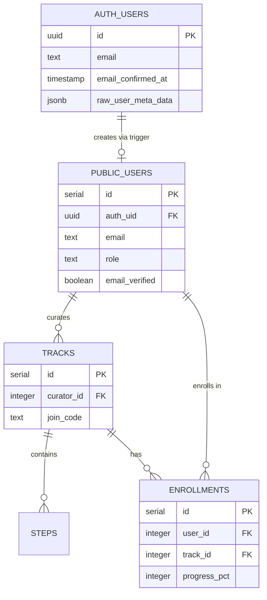
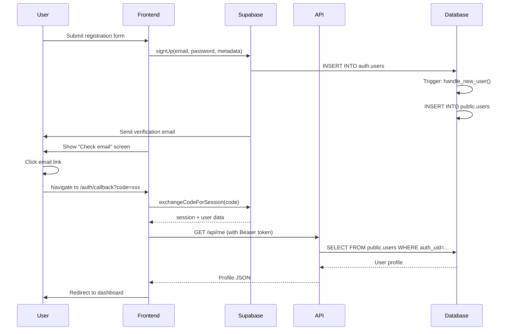

# Vercel Deployment Stabilization and Authentication Flow Fix

## Overview

This design addresses critical production deployment issues on Vercel where the application works locally but fails in production with API import errors, authentication problems, and incomplete email verification flow.

## Problem Statement

### Current Issues

1. **Vercel API Import Failure**: ERR_MODULE_NOT_FOUND for `/var/task/server/app` when API routes try to import Express application
2. **Authentication Flow Incomplete**: User registration creates Supabase auth record but not `public.users` profile, causing "Profile load failed" errors
3. **Email Verification Missing UI**: No confirmation screen shown after registration, unclear user flow
4. **Asset Authentication Errors**: 401 errors on favicon and static assets due to middleware interference
5. **TypeScript Build Errors**: Type mismatches in `auth-supabase.ts` and potential Drizzle query issues
6. **Environment Variable Handling**: Mismatch between local (.env file) and production (Vercel env vars)

### Success Criteria

**Local Development**:
- `npm run dev` works with full auth flow
- Email verification screen displays after registration
- Profile creation succeeds after email confirmation

**Production (Vercel)**:
- SPA routing works for all application routes (no 404)
- `/api/*` endpoints respond correctly (no 500/404)
- Email registration → verification → profile creation flow completes
- No module import errors
- Static assets serve without authentication errors

## Architecture Strategy

### Deployment Model

Adopt **Static Frontend + Serverless API** pattern optimized for Vercel:

- **Frontend**: Vite-built SPA served from `dist/public`
- **Backend**: Express app bundled and exposed via serverless function in `/api/[...path].ts`
- **Database**: Supabase PostgreSQL with direct connection
- **Authentication**: Hybrid Supabase Auth (JWT) + Express session

### Key Architectural Decisions

| Decision | Rationale |
|----------|-----------|
| Keep Express on Vercel Serverless | No migration to Next.js; maintain existing stack |
| Use database triggers for profile creation | More reliable than application-level logic for auth sync |
| Separate build outputs for app and API | App in `dist/server-app.cjs`, server in `dist/index.cjs` |
| PKCE flow for email verification | More secure than implicit token flow |

## Component Design

### 1. Vercel Configuration

#### vercel.json Structure

The configuration must handle three concerns:

**Build Configuration**:
- Output directory: `dist/public` (Vite build output)
- Build command: `npm run build`
- Node.js runtime: 20.x for serverless functions

**Routing Rules** (order matters):
1. Filesystem handler (serves static assets first)
2. API passthrough: `/api/(.*)` → `/api/$1` (prevents SPA fallback)
3. SPA fallback: `/(.*)`→ `/index.html` (wouter client-side routing)

**Serverless Function Settings**:
- Max duration: 60 seconds (for AI operations)
- Memory: 1024 MB
- Target: `api/**/*.ts`

#### Middleware Constraints

If Edge Middleware exists, it must exclude:
- `/assets/*` (static files)
- `/favicon.ico` (browser requests)
- `/api/*` (API routes)
- `/index.html` (SPA entry point)

Recommendation: Remove middleware entirely if not essential for business logic.

### 2. API Serverless Function

#### Module Import Resolution

**Problem**: Production cannot find `../server/app` module.

**Solution Pattern**:

The serverless function must import from the compiled bundle:

```
api/[...path].ts
  → imports createApp from '../dist/server-app.cjs' (production)
  → imports createApp from '../server/app' (development)
```

**Implementation Strategy**:

| Environment | Import Source | Bundling |
|-------------|--------------|----------|
| Development | TypeScript source via tsx | No bundling |
| Production/Vercel | Compiled CJS bundle | esbuild output |

**Critical Requirements**:
- `server/app.ts` exports `createApp()` factory function
- Factory returns Express app instance without calling `.listen()`
- Build script produces `dist/server-app.cjs` with CJS format
- Type declarations copied to `dist/server-app.d.ts`

#### Request Handler Pattern

The serverless function acts as an adapter:

1. Lazy-load Express app on cold start (singleton pattern)
2. Forward VercelRequest → Express app
3. Let Express handle routing, middleware, and response
4. Catch errors and return JSON error response

**Error Handling**:
- Log full error details to console (Vercel logs)
- Return sanitized error to client (no stack traces)
- Handle case where headers already sent

### 3. Email Verification Flow

#### Current Flow Problems

| Stage | Current Behavior | Desired Behavior |
|-------|-----------------|------------------|
| Registration | Creates Supabase auth user | Creates Supabase auth user |
| UI Feedback | No confirmation screen | Show "Check your email" screen |
| Email Click | Redirects with token | Redirects to `/auth/callback` |
| Callback | Manual sync call | Automatic profile creation via trigger |
| Profile | Not created → error | Created automatically |

#### Database Trigger Solution

**Trigger Function**: `public.handle_new_user()`

When a user is inserted into `auth.users`:
1. Extract user metadata (name, role) from `raw_user_meta_data`
2. Extract email from auth user record
3. Determine email verification status from `email_confirmed_at`
4. Insert record into `public.users` with:
   - `auth_uid` = auth.users.id (UUID)
   - `email` = extracted email
   - `name` = metadata.name or email prefix
   - `role` = metadata.role (default: 'employee')
   - `email_verified` = true/false based on confirmation status
   - `password` = NULL (managed by Supabase)

**Trigger Definition**:

```
Event: AFTER INSERT on auth.users
For: EACH ROW
Execute: public.handle_new_user()
```

**RLS Policies on public.users**:

| Operation | Policy |
|-----------|--------|
| SELECT | auth.uid() = users.auth_uid |
| UPDATE | auth.uid() = users.auth_uid |
| INSERT | Blocked (trigger handles) |
| DELETE | Blocked |

#### Email Verification Sync

**Sync Strategy**: Update `email_verified` when Supabase confirms email.

**Option 1 - Trigger on Update** (Recommended):

Create second trigger on `auth.users` UPDATE:
- Detect when `email_confirmed_at` changes from NULL to timestamp
- Update corresponding `public.users.email_verified = true`
- Clear verification token fields

**Option 2 - Middleware Sync** (Fallback):

In `auth-supabase.ts` middleware:
- Check if `emailConfirmed` (from Supabase) differs from `profile.emailVerified` (local DB)
- If Supabase shows confirmed but DB shows unconfirmed → update DB
- Already implemented in lines 119-132

#### Frontend Flow Updates

**Registration Screen** (`client/src/pages/auth.tsx`):

| Component | Behavior |
|-----------|----------|
| Form submission | Call Supabase `signUp({ email, password, options: { data: { name, role }, emailRedirectTo } })` |
| Success handler | Switch to `verify-email` mode, store email in state |
| Verify screen | Display email, show "Check inbox" message |

**Email Redirect Configuration**:

```
emailRedirectTo = `${window.location.origin}/auth/callback`
```

**Callback Route** (`/auth/callback`):

Already implemented. Enhancements needed:
1. Ensure PKCE code exchange is primary flow
2. After successful verification, call `/api/me` to confirm profile exists
3. If profile missing, show error with retry option
4. Redirect based on user role (curator → `/curator`, employee → `/app/join`)

### 4. Type Safety Fixes

#### auth-supabase.ts Issues

**Problem 1**: `AuthUser.emailConfirmed` property doesn't exist in base types.

**Solution**:
- Define custom `AuthUser` interface with all required fields
- Use type predicate for `hasAuthUser()` function
- Cast `req.user` safely in middleware

**Problem 2**: Accessing non-existent properties on Supabase User type.

**Solution**:
- Use `user.email_confirmed_at` from Supabase auth
- Map `user.user_metadata.role` to profile role
- Never access `user.role` or `user.emailConfirmed` directly

**Type Definitions Needed**:

```
interface AuthUser {
  id: number              // Internal DB ID
  authUid: string         // Supabase auth.users.id (UUID)
  email: string
  role: 'curator' | 'employee'
  name: string
  emailConfirmed: boolean // Derived from Supabase email_confirmed_at
}

function hasAuthUser(req: Request): req is Request & { user: AuthUser }
```

#### Drizzle Count Query Fix

Issue in `storage.ts` line 508-521: `count()` helper usage.

**Correct Pattern**:

The Drizzle `count()` helper returns an object with `count` property. Access result correctly:

```
const result = await db
  .select({ count: count() })
  .from(courseMembers)
  .where(conditions);

return result[0]?.count || 0;
```

Verify all count queries follow this pattern.

### 5. Environment Configuration

#### Variable Inventory

**Server-Side Variables** (Vercel Environment Variables):

| Variable | Purpose | Required |
|----------|---------|----------|
| DATABASE_URL | PostgreSQL connection string | Yes |
| DATABASE_FILE_STORAGE_URL | Supabase project URL | Yes |
| DATABASE_FILE_STORAGE_KEY | Supabase service role key | Yes |
| SUPABASE_ANON_KEY | Supabase anon key for JWT validation | Yes |
| SESSION_SECRET | Express session encryption | Yes |
| APP_URL | Application URL for email links | Yes (prod domain) |
| YANDEX_CLOUD_API_KEY | AI service | Yes |
| YANDEX_CLOUD_PROJECT_FOLDER_ID | AI service | Yes |
| YANDEX_PROMPT_ID | AI service | Yes |
| SMTP_HOST | Email sending | Yes |
| SMTP_PORT | Email sending | Yes |
| SMTP_USER | Email sending | Yes |
| SMTP_PASSWORD | Email sending | Yes |
| SMTP_FROM | Email sender address | Yes |
| NODE_ENV | Runtime environment | Auto-set by Vercel |
| COOKIE_SECURE | Set to "true" in production | Yes |

**Client-Side Variables** (VITE_ prefix, bundled into frontend):

| Variable | Purpose | Required |
|----------|---------|----------|
| VITE_SUPABASE_URL | Supabase URL for client SDK | Yes |
| VITE_SUPABASE_ANON_KEY | Anon key for client SDK | Yes |

#### Configuration Loading Strategy

**Development**:
- Load from `.env` file via `tsx --env-file=.env`
- Validate all required variables on startup

**Production (Vercel)**:
- Read from `process.env` (no .env file)
- Validate in server startup or create config module

**Validation Module** (`server/config.ts`):

Create centralized config with Zod validation:

```
Purpose: Validate and export typed environment variables
Validation: Throw error if required variable missing
Export: Typed config object
```

## Implementation Plan

### Phase 1: Vercel Configuration

**Tasks**:
1. Update `vercel.json` with correct routes and rewrites
2. Remove or constrain Edge Middleware
3. Verify build command produces `dist/public`
4. Test static asset serving

**Validation**:
- Deploy to Vercel
- Access `/` → should load HTML
- Access `/favicon.ico` → no 401
- Access `/assets/*` → correct MIME types

### Phase 2: API Function Fix

**Tasks**:
1. Verify `script/build.ts` produces `dist/server-app.cjs`
2. Update `api/[...path].ts` import logic for production
3. Ensure `server/app.ts` exports `createApp` factory
4. Test serverless function cold start

**Validation**:
- Deploy and call `/api/health` → 200 response with JSON
- Call `/api/login` → correct response (not 404)
- Check Vercel logs → no ERR_MODULE_NOT_FOUND

### Phase 3: Database Migration

**Tasks**:
1. Create migration `0007_profile_auto_creation.sql` with:
   - `public.handle_new_user()` function
   - Trigger on `auth.users` after insert
   - Optional: trigger on update for email verification sync
2. Update RLS policies on `public.users`
3. Test locally with new registration
4. Apply migration to production database

**Validation**:
- Register new user via Supabase
- Check `public.users` → record exists
- Verify `auth_uid` matches `auth.users.id`

### Phase 4: Email Verification UI

**Tasks**:
1. Update registration handler to include `emailRedirectTo`
2. Verify `verify-email` screen renders correctly
3. Test callback flow with token exchange
4. Ensure profile sync after verification

**Validation**:
- Register → see verification screen
- Check email → click link
- Redirect to `/auth/callback` → success screen
- Login → profile loads without error

### Phase 5: Type Safety

**Tasks**:
1. Fix `AuthUser` interface and type predicates in `auth-supabase.ts`
2. Review all Drizzle count queries in `storage.ts`
3. Run TypeScript check: `npm run check`
4. Fix any remaining type errors

**Validation**:
- `npm run check` → no errors
- Vercel build → TypeScript compilation succeeds

### Phase 6: Environment Variables

**Tasks**:
1. Create `server/config.ts` with Zod validation
2. Update `.env.example` with all required variables
3. Add environment variables to Vercel project settings
4. Document variables in deployment guide

**Validation**:
- Local: `npm run dev` validates config on startup
- Vercel: deployment logs show successful config load

## Data Model Changes

### Migration: 0007_profile_auto_creation.sql

**Tables Modified**: None (schema already correct)

**Functions Created**:

| Function | Purpose | Returns |
|----------|---------|---------|
| `handle_new_user()` | Auto-create profile on auth signup | trigger |
| `sync_email_verification()` | Sync email verification status | trigger |

**Triggers Created**:

| Trigger | Event | Function |
|---------|-------|----------|
| `on_auth_user_created` | AFTER INSERT on auth.users | handle_new_user() |
| `on_auth_email_confirmed` | AFTER UPDATE on auth.users | sync_email_verification() |

**Schema Alignment**:

Ensure `public.users` schema matches:
- `auth_uid UUID UNIQUE` (links to auth.users.id)
- `email TEXT NOT NULL UNIQUE`
- `email_verified BOOLEAN DEFAULT FALSE`
- `password TEXT` (nullable for Supabase users)

## Security Considerations

### Authentication Security

| Concern | Mitigation |
|---------|-----------|
| Token exposure in URL | Use PKCE code flow, clear URL after callback |
| Session fixation | Express session with secure cookies |
| CSRF | Include credentials for same-origin requests |

### Environment Variables

| Concern | Mitigation |
|---------|-----------|
| Secrets in frontend | Only `VITE_*` variables exposed to client |
| Service role key exposure | Server-side only, never in frontend |
| Production secrets | Stored in Vercel settings, not in repo |

### Database Access

| Concern | Mitigation |
|---------|-----------|
| Direct DB access from client | RLS policies enforce auth.uid() checks |
| Profile tampering | UPDATE policy only allows own profile |
| Privilege escalation | Role field cannot be updated by user |

## Testing Strategy

### Local Testing Checklist

- [ ] Fresh registration creates Supabase user
- [ ] Verification screen displays with correct email
- [ ] Mock email link triggers callback correctly
- [ ] Profile record exists in `public.users` after trigger
- [ ] Login succeeds and loads profile
- [ ] Role-based redirect works (curator vs employee)

### Production Testing Checklist

- [ ] Deploy completes without TypeScript errors
- [ ] `/api/health` returns 200 with environment flags
- [ ] Registration flow completes end-to-end
- [ ] Real email delivery works
- [ ] Email link redirects to correct callback URL
- [ ] Profile loads without "Profile not found" error
- [ ] SPA routing works (refresh on `/curator` doesn't 404)
- [ ] Static assets serve correctly

### Rollback Plan

If deployment fails:

1. **API Errors**: Revert `api/[...path].ts` import changes
2. **Auth Errors**: Disable database triggers, use middleware sync
3. **Database Issues**: Roll back migration, use application-level profile creation
4. **Complete Failure**: Revert to previous Vercel deployment

## Performance Considerations

### Cold Start Optimization

**Current Strategy** (from `script/build.ts`):
- Bundle frequently-used dependencies (drizzle, express, etc.)
- Externalize rarely-used dependencies
- Separate bundles for server and app

**Recommendations**:
- Keep bundle size under 5MB
- Lazy-load AI modules (Yandex client)
- Cache database connections across invocations

### Database Connection Pooling

Serverless functions reuse connections:
- Use pg pool (already implemented)
- Set `max: 20` connections for production
- Enable connection reuse in warm containers

## Monitoring and Observability

### Logging Strategy

**Application Logs**:
- Auth middleware logs user resolution steps
- API handler logs request/response in debug mode
- Profile creation logged by database trigger

**Vercel Platform Logs**:
- Function execution time
- Cold start frequency
- Error stack traces

### Key Metrics to Track

| Metric | Target | Alert Threshold |
|--------|--------|-----------------|
| API response time | < 500ms | > 2000ms |
| Function cold start | < 3s | > 10s |
| Registration success rate | > 95% | < 80% |
| Email delivery rate | > 98% | < 90% |

## Documentation Updates

### Files to Create/Update

**New Files**:
- `docs/VERCEL_DEPLOYMENT.md` - Deployment guide with environment variables
- `migrations/0007_profile_auto_creation.sql` - Database migration

**Updated Files**:
- `.env.example` - Complete variable list with comments
- `vercel.json` - Correct routing configuration
- `README.md` - Add Vercel deployment section

### Deployment Checklist Document

Create step-by-step guide:
1. Set up Vercel project
2. Configure environment variables
3. Run database migration
4. Deploy and verify
5. Test registration flow
6. Monitor logs for errors

## Risk Assessment

| Risk | Probability | Impact | Mitigation |
|------|------------|--------|------------|
| Module import fails | High | Critical | Test bundling locally, verify paths |
| Profile not created | Medium | High | Database trigger + middleware fallback |
| Email not delivered | Low | High | Test SMTP config, use reliable provider |
| Type errors in build | Medium | Medium | Run `npm run check` before deploy |
| Cold start timeout | Low | Medium | Optimize bundle size, increase timeout |

## Success Metrics

### Technical Metrics

- Zero TypeScript compilation errors
- All API routes respond with correct status codes
- Database trigger executes successfully on user creation
- Email delivery rate > 98%

### User Experience Metrics

- Registration completion rate > 90%
- Average time from signup to first login < 5 minutes
- Profile load errors < 1%
- Zero authentication-related support tickets

## Appendices

### A. Environment Variable Reference

See `.env.example` for complete list with descriptions.

### B. API Routes Inventory

| Route | Method | Auth Required | Purpose |
|-------|--------|---------------|---------|
| /api/health | GET | No | Health check |
| /api/login | POST | No | Login |
| /api/register | POST | No | Registration |
| /api/me | GET | Yes | Current user profile |
| /api/tracks | GET | Yes | List courses |
| /api/auth/confirm-sync | POST | Yes | Sync verification |

### C. Database Schema Diagram



### D. Authentication Flow Sequence


## Problem Statement

### Current Issues

1. **Vercel API Import Failure**: ERR_MODULE_NOT_FOUND for `/var/task/server/app` when API routes try to import Express application
2. **Authentication Flow Incomplete**: User registration creates Supabase auth record but not `public.users` profile, causing "Profile load failed" errors
3. **Email Verification Missing UI**: No confirmation screen shown after registration, unclear user flow
4. **Asset Authentication Errors**: 401 errors on favicon and static assets due to middleware interference
5. **TypeScript Build Errors**: Type mismatches in `auth-supabase.ts` and potential Drizzle query issues
6. **Environment Variable Handling**: Mismatch between local (.env file) and production (Vercel env vars)

### Success Criteria

**Local Development**:
- `npm run dev` works with full auth flow
- Email verification screen displays after registration
- Profile creation succeeds after email confirmation

**Production (Vercel)**:
- SPA routing works for all application routes (no 404)
- `/api/*` endpoints respond correctly (no 500/404)
- Email registration → verification → profile creation flow completes
- No module import errors
- Static assets serve without authentication errors

## Architecture Strategy

### Deployment Model

Adopt **Static Frontend + Serverless API** pattern optimized for Vercel:

- **Frontend**: Vite-built SPA served from `dist/public`
- **Backend**: Express app bundled and exposed via serverless function in `/api/[...path].ts`
- **Database**: Supabase PostgreSQL with direct connection
- **Authentication**: Hybrid Supabase Auth (JWT) + Express session

### Key Architectural Decisions

| Decision | Rationale |
|----------|-----------|
| Keep Express on Vercel Serverless | No migration to Next.js; maintain existing stack |
| Use database triggers for profile creation | More reliable than application-level logic for auth sync |
| Separate build outputs for app and API | App in `dist/server-app.cjs`, server in `dist/index.cjs` |
| PKCE flow for email verification | More secure than implicit token flow |

## Component Design

### 1. Vercel Configuration

#### vercel.json Structure

The configuration must handle three concerns:

**Build Configuration**:
- Output directory: `dist/public` (Vite build output)
- Build command: `npm run build`
- Node.js runtime: 20.x for serverless functions

**Routing Rules** (order matters):
1. Filesystem handler (serves static assets first)
2. API passthrough: `/api/(.*)` → `/api/$1` (prevents SPA fallback)
3. SPA fallback: `/(.*)`→ `/index.html` (wouter client-side routing)

**Serverless Function Settings**:
- Max duration: 60 seconds (for AI operations)
- Memory: 1024 MB
- Target: `api/**/*.ts`

#### Middleware Constraints

If Edge Middleware exists, it must exclude:
- `/assets/*` (static files)
- `/favicon.ico` (browser requests)
- `/api/*` (API routes)
- `/index.html` (SPA entry point)

Recommendation: Remove middleware entirely if not essential for business logic.

### 2. API Serverless Function

#### Module Import Resolution

**Problem**: Production cannot find `../server/app` module.

**Solution Pattern**:

The serverless function must import from the compiled bundle:

```
api/[...path].ts
  → imports createApp from '../dist/server-app.cjs' (production)
  → imports createApp from '../server/app' (development)
```

**Implementation Strategy**:

| Environment | Import Source | Bundling |
|-------------|--------------|----------|
| Development | TypeScript source via tsx | No bundling |
| Production/Vercel | Compiled CJS bundle | esbuild output |

**Critical Requirements**:
- `server/app.ts` exports `createApp()` factory function
- Factory returns Express app instance without calling `.listen()`
- Build script produces `dist/server-app.cjs` with CJS format
- Type declarations copied to `dist/server-app.d.ts`

#### Request Handler Pattern

The serverless function acts as an adapter:

1. Lazy-load Express app on cold start (singleton pattern)
2. Forward VercelRequest → Express app
3. Let Express handle routing, middleware, and response
4. Catch errors and return JSON error response

**Error Handling**:
- Log full error details to console (Vercel logs)
- Return sanitized error to client (no stack traces)
- Handle case where headers already sent

### 3. Email Verification Flow

#### Current Flow Problems

| Stage | Current Behavior | Desired Behavior |
|-------|-----------------|------------------|
| Registration | Creates Supabase auth user | Creates Supabase auth user |
| UI Feedback | No confirmation screen | Show "Check your email" screen |
| Email Click | Redirects with token | Redirects to `/auth/callback` |
| Callback | Manual sync call | Automatic profile creation via trigger |
| Profile | Not created → error | Created automatically |

#### Database Trigger Solution

**Trigger Function**: `public.handle_new_user()`

When a user is inserted into `auth.users`:
1. Extract user metadata (name, role) from `raw_user_meta_data`
2. Extract email from auth user record
3. Determine email verification status from `email_confirmed_at`
4. Insert record into `public.users` with:
   - `auth_uid` = auth.users.id (UUID)
   - `email` = extracted email
   - `name` = metadata.name or email prefix
   - `role` = metadata.role (default: 'employee')
   - `email_verified` = true/false based on confirmation status
   - `password` = NULL (managed by Supabase)

**Trigger Definition**:

```
Event: AFTER INSERT on auth.users
For: EACH ROW
Execute: public.handle_new_user()
```

**RLS Policies on public.users**:

| Operation | Policy |
|-----------|--------|
| SELECT | auth.uid() = users.auth_uid |
| UPDATE | auth.uid() = users.auth_uid |
| INSERT | Blocked (trigger handles) |
| DELETE | Blocked |

#### Email Verification Sync

**Sync Strategy**: Update `email_verified` when Supabase confirms email.

**Option 1 - Trigger on Update** (Recommended):

Create second trigger on `auth.users` UPDATE:
- Detect when `email_confirmed_at` changes from NULL to timestamp
- Update corresponding `public.users.email_verified = true`
- Clear verification token fields

**Option 2 - Middleware Sync** (Fallback):

In `auth-supabase.ts` middleware:
- Check if `emailConfirmed` (from Supabase) differs from `profile.emailVerified` (local DB)
- If Supabase shows confirmed but DB shows unconfirmed → update DB
- Already implemented in lines 119-132

#### Frontend Flow Updates

**Registration Screen** (`client/src/pages/auth.tsx`):

| Component | Behavior |
|-----------|----------|
| Form submission | Call Supabase `signUp({ email, password, options: { data: { name, role }, emailRedirectTo } })` |
| Success handler | Switch to `verify-email` mode, store email in state |
| Verify screen | Display email, show "Check inbox" message |

**Email Redirect Configuration**:

```
emailRedirectTo = `${window.location.origin}/auth/callback`
```

**Callback Route** (`/auth/callback`):

Already implemented. Enhancements needed:
1. Ensure PKCE code exchange is primary flow
2. After successful verification, call `/api/me` to confirm profile exists
3. If profile missing, show error with retry option
4. Redirect based on user role (curator → `/curator`, employee → `/app/join`)

### 4. Type Safety Fixes

#### auth-supabase.ts Issues

**Problem 1**: `AuthUser.emailConfirmed` property doesn't exist in base types.

**Solution**:
- Define custom `AuthUser` interface with all required fields
- Use type predicate for `hasAuthUser()` function
- Cast `req.user` safely in middleware

**Problem 2**: Accessing non-existent properties on Supabase User type.

**Solution**:
- Use `user.email_confirmed_at` from Supabase auth
- Map `user.user_metadata.role` to profile role
- Never access `user.role` or `user.emailConfirmed` directly

**Type Definitions Needed**:

```
interface AuthUser {
  id: number              // Internal DB ID
  authUid: string         // Supabase auth.users.id (UUID)
  email: string
  role: 'curator' | 'employee'
  name: string
  emailConfirmed: boolean // Derived from Supabase email_confirmed_at
}

function hasAuthUser(req: Request): req is Request & { user: AuthUser }
```

#### Drizzle Count Query Fix

Issue in `storage.ts` line 508-521: `count()` helper usage.

**Correct Pattern**:

The Drizzle `count()` helper returns an object with `count` property. Access result correctly:

```
const result = await db
  .select({ count: count() })
  .from(courseMembers)
  .where(conditions);

return result[0]?.count || 0;
```

Verify all count queries follow this pattern.

### 5. Environment Configuration

#### Variable Inventory

**Server-Side Variables** (Vercel Environment Variables):

| Variable | Purpose | Required |
|----------|---------|----------|
| DATABASE_URL | PostgreSQL connection string | Yes |
| DATABASE_FILE_STORAGE_URL | Supabase project URL | Yes |
| DATABASE_FILE_STORAGE_KEY | Supabase service role key | Yes |
| SUPABASE_ANON_KEY | Supabase anon key for JWT validation | Yes |
| SESSION_SECRET | Express session encryption | Yes |
| APP_URL | Application URL for email links | Yes (prod domain) |
| YANDEX_CLOUD_API_KEY | AI service | Yes |
| YANDEX_CLOUD_PROJECT_FOLDER_ID | AI service | Yes |
| YANDEX_PROMPT_ID | AI service | Yes |
| SMTP_HOST | Email sending | Yes |
| SMTP_PORT | Email sending | Yes |
| SMTP_USER | Email sending | Yes |
| SMTP_PASSWORD | Email sending | Yes |
| SMTP_FROM | Email sender address | Yes |
| NODE_ENV | Runtime environment | Auto-set by Vercel |
| COOKIE_SECURE | Set to "true" in production | Yes |

**Client-Side Variables** (VITE_ prefix, bundled into frontend):

| Variable | Purpose | Required |
|----------|---------|----------|
| VITE_SUPABASE_URL | Supabase URL for client SDK | Yes |
| VITE_SUPABASE_ANON_KEY | Anon key for client SDK | Yes |

#### Configuration Loading Strategy

**Development**:
- Load from `.env` file via `tsx --env-file=.env`
- Validate all required variables on startup

**Production (Vercel)**:
- Read from `process.env` (no .env file)
- Validate in server startup or create config module

**Validation Module** (`server/config.ts`):

Create centralized config with Zod validation:

```
Purpose: Validate and export typed environment variables
Validation: Throw error if required variable missing
Export: Typed config object
```

## Implementation Plan

### Phase 1: Vercel Configuration

**Tasks**:
1. Update `vercel.json` with correct routes and rewrites
2. Remove or constrain Edge Middleware
3. Verify build command produces `dist/public`
4. Test static asset serving

**Validation**:
- Deploy to Vercel
- Access `/` → should load HTML
- Access `/favicon.ico` → no 401
- Access `/assets/*` → correct MIME types

### Phase 2: API Function Fix

**Tasks**:
1. Verify `script/build.ts` produces `dist/server-app.cjs`
2. Update `api/[...path].ts` import logic for production
3. Ensure `server/app.ts` exports `createApp` factory
4. Test serverless function cold start

**Validation**:
- Deploy and call `/api/health` → 200 response with JSON
- Call `/api/login` → correct response (not 404)
- Check Vercel logs → no ERR_MODULE_NOT_FOUND

### Phase 3: Database Migration

**Tasks**:
1. Create migration `0007_profile_auto_creation.sql` with:
   - `public.handle_new_user()` function
   - Trigger on `auth.users` after insert
   - Optional: trigger on update for email verification sync
2. Update RLS policies on `public.users`
3. Test locally with new registration
4. Apply migration to production database

**Validation**:
- Register new user via Supabase
- Check `public.users` → record exists
- Verify `auth_uid` matches `auth.users.id`

### Phase 4: Email Verification UI

**Tasks**:
1. Update registration handler to include `emailRedirectTo`
2. Verify `verify-email` screen renders correctly
3. Test callback flow with token exchange
4. Ensure profile sync after verification

**Validation**:
- Register → see verification screen
- Check email → click link
- Redirect to `/auth/callback` → success screen
- Login → profile loads without error

### Phase 5: Type Safety

**Tasks**:
1. Fix `AuthUser` interface and type predicates in `auth-supabase.ts`
2. Review all Drizzle count queries in `storage.ts`
3. Run TypeScript check: `npm run check`
4. Fix any remaining type errors

**Validation**:
- `npm run check` → no errors
- Vercel build → TypeScript compilation succeeds

### Phase 6: Environment Variables

**Tasks**:
1. Create `server/config.ts` with Zod validation
2. Update `.env.example` with all required variables
3. Add environment variables to Vercel project settings
4. Document variables in deployment guide

**Validation**:
- Local: `npm run dev` validates config on startup
- Vercel: deployment logs show successful config load

## Data Model Changes

### Migration: 0007_profile_auto_creation.sql

**Tables Modified**: None (schema already correct)

**Functions Created**:

| Function | Purpose | Returns |
|----------|---------|---------|
| `handle_new_user()` | Auto-create profile on auth signup | trigger |
| `sync_email_verification()` | Sync email verification status | trigger |

**Triggers Created**:

| Trigger | Event | Function |
|---------|-------|----------|
| `on_auth_user_created` | AFTER INSERT on auth.users | handle_new_user() |
| `on_auth_email_confirmed` | AFTER UPDATE on auth.users | sync_email_verification() |

**Schema Alignment**:

Ensure `public.users` schema matches:
- `auth_uid UUID UNIQUE` (links to auth.users.id)
- `email TEXT NOT NULL UNIQUE`
- `email_verified BOOLEAN DEFAULT FALSE`
- `password TEXT` (nullable for Supabase users)

## Security Considerations

### Authentication Security

| Concern | Mitigation |
|---------|-----------|
| Token exposure in URL | Use PKCE code flow, clear URL after callback |
| Session fixation | Express session with secure cookies |
| CSRF | Include credentials for same-origin requests |

### Environment Variables

| Concern | Mitigation |
|---------|-----------|
| Secrets in frontend | Only `VITE_*` variables exposed to client |
| Service role key exposure | Server-side only, never in frontend |
| Production secrets | Stored in Vercel settings, not in repo |

### Database Access

| Concern | Mitigation |
|---------|-----------|
| Direct DB access from client | RLS policies enforce auth.uid() checks |
| Profile tampering | UPDATE policy only allows own profile |
| Privilege escalation | Role field cannot be updated by user |

## Testing Strategy

### Local Testing Checklist

- [ ] Fresh registration creates Supabase user
- [ ] Verification screen displays with correct email
- [ ] Mock email link triggers callback correctly
- [ ] Profile record exists in `public.users` after trigger
- [ ] Login succeeds and loads profile
- [ ] Role-based redirect works (curator vs employee)

### Production Testing Checklist

- [ ] Deploy completes without TypeScript errors
- [ ] `/api/health` returns 200 with environment flags
- [ ] Registration flow completes end-to-end
- [ ] Real email delivery works
- [ ] Email link redirects to correct callback URL
- [ ] Profile loads without "Profile not found" error
- [ ] SPA routing works (refresh on `/curator` doesn't 404)
- [ ] Static assets serve correctly

### Rollback Plan

If deployment fails:

1. **API Errors**: Revert `api/[...path].ts` import changes
2. **Auth Errors**: Disable database triggers, use middleware sync
3. **Database Issues**: Roll back migration, use application-level profile creation
4. **Complete Failure**: Revert to previous Vercel deployment

## Performance Considerations

### Cold Start Optimization

**Current Strategy** (from `script/build.ts`):
- Bundle frequently-used dependencies (drizzle, express, etc.)
- Externalize rarely-used dependencies
- Separate bundles for server and app

**Recommendations**:
- Keep bundle size under 5MB
- Lazy-load AI modules (Yandex client)
- Cache database connections across invocations

### Database Connection Pooling

Serverless functions reuse connections:
- Use pg pool (already implemented)
- Set `max: 20` connections for production
- Enable connection reuse in warm containers

## Monitoring and Observability

### Logging Strategy

**Application Logs**:
- Auth middleware logs user resolution steps
- API handler logs request/response in debug mode
- Profile creation logged by database trigger

**Vercel Platform Logs**:
- Function execution time
- Cold start frequency
- Error stack traces

### Key Metrics to Track

| Metric | Target | Alert Threshold |
|--------|--------|-----------------|
| API response time | < 500ms | > 2000ms |
| Function cold start | < 3s | > 10s |
| Registration success rate | > 95% | < 80% |
| Email delivery rate | > 98% | < 90% |

## Documentation Updates

### Files to Create/Update

**New Files**:
- `docs/VERCEL_DEPLOYMENT.md` - Deployment guide with environment variables
- `migrations/0007_profile_auto_creation.sql` - Database migration

**Updated Files**:
- `.env.example` - Complete variable list with comments
- `vercel.json` - Correct routing configuration
- `README.md` - Add Vercel deployment section

### Deployment Checklist Document

Create step-by-step guide:
1. Set up Vercel project
2. Configure environment variables
3. Run database migration
4. Deploy and verify
5. Test registration flow
6. Monitor logs for errors

## Risk Assessment

| Risk | Probability | Impact | Mitigation |
|------|------------|--------|------------|
| Module import fails | High | Critical | Test bundling locally, verify paths |
| Profile not created | Medium | High | Database trigger + middleware fallback |
| Email not delivered | Low | High | Test SMTP config, use reliable provider |
| Type errors in build | Medium | Medium | Run `npm run check` before deploy |
| Cold start timeout | Low | Medium | Optimize bundle size, increase timeout |

## Success Metrics

### Technical Metrics

- Zero TypeScript compilation errors
- All API routes respond with correct status codes
- Database trigger executes successfully on user creation
- Email delivery rate > 98%

### User Experience Metrics

- Registration completion rate > 90%
- Average time from signup to first login < 5 minutes
- Profile load errors < 1%
- Zero authentication-related support tickets

## Appendices

### A. Environment Variable Reference

See `.env.example` for complete list with descriptions.

### B. API Routes Inventory

| Route | Method | Auth Required | Purpose |
|-------|--------|---------------|---------|
| /api/health | GET | No | Health check |
| /api/login | POST | No | Login |
| /api/register | POST | No | Registration |
| /api/me | GET | Yes | Current user profile |
| /api/tracks | GET | Yes | List courses |
| /api/auth/confirm-sync | POST | Yes | Sync verification |

### C. Database Schema Diagram


### D. Authentication Flow Sequence


## Problem Statement

### Current Issues

1. **Vercel API Import Failure**: ERR_MODULE_NOT_FOUND for `/var/task/server/app` when API routes try to import Express application
2. **Authentication Flow Incomplete**: User registration creates Supabase auth record but not `public.users` profile, causing "Profile load failed" errors
3. **Email Verification Missing UI**: No confirmation screen shown after registration, unclear user flow
4. **Asset Authentication Errors**: 401 errors on favicon and static assets due to middleware interference
5. **TypeScript Build Errors**: Type mismatches in `auth-supabase.ts` and potential Drizzle query issues
6. **Environment Variable Handling**: Mismatch between local (.env file) and production (Vercel env vars)

### Success Criteria

**Local Development**:
- `npm run dev` works with full auth flow
- Email verification screen displays after registration
- Profile creation succeeds after email confirmation

**Production (Vercel)**:
- SPA routing works for all application routes (no 404)
- `/api/*` endpoints respond correctly (no 500/404)
- Email registration → verification → profile creation flow completes
- No module import errors
- Static assets serve without authentication errors

## Architecture Strategy

### Deployment Model

Adopt **Static Frontend + Serverless API** pattern optimized for Vercel:

- **Frontend**: Vite-built SPA served from `dist/public`
- **Backend**: Express app bundled and exposed via serverless function in `/api/[...path].ts`
- **Database**: Supabase PostgreSQL with direct connection
- **Authentication**: Hybrid Supabase Auth (JWT) + Express session

### Key Architectural Decisions

| Decision | Rationale |
|----------|-----------|
| Keep Express on Vercel Serverless | No migration to Next.js; maintain existing stack |
| Use database triggers for profile creation | More reliable than application-level logic for auth sync |
| Separate build outputs for app and API | App in `dist/server-app.cjs`, server in `dist/index.cjs` |
| PKCE flow for email verification | More secure than implicit token flow |

## Component Design

### 1. Vercel Configuration

#### vercel.json Structure

The configuration must handle three concerns:

**Build Configuration**:
- Output directory: `dist/public` (Vite build output)
- Build command: `npm run build`
- Node.js runtime: 20.x for serverless functions

**Routing Rules** (order matters):
1. Filesystem handler (serves static assets first)
2. API passthrough: `/api/(.*)` → `/api/$1` (prevents SPA fallback)
3. SPA fallback: `/(.*)`→ `/index.html` (wouter client-side routing)

**Serverless Function Settings**:
- Max duration: 60 seconds (for AI operations)
- Memory: 1024 MB
- Target: `api/**/*.ts`

#### Middleware Constraints

If Edge Middleware exists, it must exclude:
- `/assets/*` (static files)
- `/favicon.ico` (browser requests)
- `/api/*` (API routes)
- `/index.html` (SPA entry point)

Recommendation: Remove middleware entirely if not essential for business logic.

### 2. API Serverless Function

#### Module Import Resolution

**Problem**: Production cannot find `../server/app` module.

**Solution Pattern**:

The serverless function must import from the compiled bundle:

```
api/[...path].ts
  → imports createApp from '../dist/server-app.cjs' (production)
  → imports createApp from '../server/app' (development)
```

**Implementation Strategy**:

| Environment | Import Source | Bundling |
|-------------|--------------|----------|
| Development | TypeScript source via tsx | No bundling |
| Production/Vercel | Compiled CJS bundle | esbuild output |

**Critical Requirements**:
- `server/app.ts` exports `createApp()` factory function
- Factory returns Express app instance without calling `.listen()`
- Build script produces `dist/server-app.cjs` with CJS format
- Type declarations copied to `dist/server-app.d.ts`

#### Request Handler Pattern

The serverless function acts as an adapter:

1. Lazy-load Express app on cold start (singleton pattern)
2. Forward VercelRequest → Express app
3. Let Express handle routing, middleware, and response
4. Catch errors and return JSON error response

**Error Handling**:
- Log full error details to console (Vercel logs)
- Return sanitized error to client (no stack traces)
- Handle case where headers already sent

### 3. Email Verification Flow

#### Current Flow Problems

| Stage | Current Behavior | Desired Behavior |
|-------|-----------------|------------------|
| Registration | Creates Supabase auth user | Creates Supabase auth user |
| UI Feedback | No confirmation screen | Show "Check your email" screen |
| Email Click | Redirects with token | Redirects to `/auth/callback` |
| Callback | Manual sync call | Automatic profile creation via trigger |
| Profile | Not created → error | Created automatically |

#### Database Trigger Solution

**Trigger Function**: `public.handle_new_user()`

When a user is inserted into `auth.users`:
1. Extract user metadata (name, role) from `raw_user_meta_data`
2. Extract email from auth user record
3. Determine email verification status from `email_confirmed_at`
4. Insert record into `public.users` with:
   - `auth_uid` = auth.users.id (UUID)
   - `email` = extracted email
   - `name` = metadata.name or email prefix
   - `role` = metadata.role (default: 'employee')
   - `email_verified` = true/false based on confirmation status
   - `password` = NULL (managed by Supabase)

**Trigger Definition**:

```
Event: AFTER INSERT on auth.users
For: EACH ROW
Execute: public.handle_new_user()
```

**RLS Policies on public.users**:

| Operation | Policy |
|-----------|--------|
| SELECT | auth.uid() = users.auth_uid |
| UPDATE | auth.uid() = users.auth_uid |
| INSERT | Blocked (trigger handles) |
| DELETE | Blocked |

#### Email Verification Sync

**Sync Strategy**: Update `email_verified` when Supabase confirms email.

**Option 1 - Trigger on Update** (Recommended):

Create second trigger on `auth.users` UPDATE:
- Detect when `email_confirmed_at` changes from NULL to timestamp
- Update corresponding `public.users.email_verified = true`
- Clear verification token fields

**Option 2 - Middleware Sync** (Fallback):

In `auth-supabase.ts` middleware:
- Check if `emailConfirmed` (from Supabase) differs from `profile.emailVerified` (local DB)
- If Supabase shows confirmed but DB shows unconfirmed → update DB
- Already implemented in lines 119-132

#### Frontend Flow Updates

**Registration Screen** (`client/src/pages/auth.tsx`):

| Component | Behavior |
|-----------|----------|
| Form submission | Call Supabase `signUp({ email, password, options: { data: { name, role }, emailRedirectTo } })` |
| Success handler | Switch to `verify-email` mode, store email in state |
| Verify screen | Display email, show "Check inbox" message |

**Email Redirect Configuration**:

```
emailRedirectTo = `${window.location.origin}/auth/callback`
```

**Callback Route** (`/auth/callback`):

Already implemented. Enhancements needed:
1. Ensure PKCE code exchange is primary flow
2. After successful verification, call `/api/me` to confirm profile exists
3. If profile missing, show error with retry option
4. Redirect based on user role (curator → `/curator`, employee → `/app/join`)

### 4. Type Safety Fixes

#### auth-supabase.ts Issues

**Problem 1**: `AuthUser.emailConfirmed` property doesn't exist in base types.

**Solution**:
- Define custom `AuthUser` interface with all required fields
- Use type predicate for `hasAuthUser()` function
- Cast `req.user` safely in middleware

**Problem 2**: Accessing non-existent properties on Supabase User type.

**Solution**:
- Use `user.email_confirmed_at` from Supabase auth
- Map `user.user_metadata.role` to profile role
- Never access `user.role` or `user.emailConfirmed` directly

**Type Definitions Needed**:

```
interface AuthUser {
  id: number              // Internal DB ID
  authUid: string         // Supabase auth.users.id (UUID)
  email: string
  role: 'curator' | 'employee'
  name: string
  emailConfirmed: boolean // Derived from Supabase email_confirmed_at
}

function hasAuthUser(req: Request): req is Request & { user: AuthUser }
```

#### Drizzle Count Query Fix

Issue in `storage.ts` line 508-521: `count()` helper usage.

**Correct Pattern**:

The Drizzle `count()` helper returns an object with `count` property. Access result correctly:

```
const result = await db
  .select({ count: count() })
  .from(courseMembers)
  .where(conditions);

return result[0]?.count || 0;
```

Verify all count queries follow this pattern.

### 5. Environment Configuration

#### Variable Inventory

**Server-Side Variables** (Vercel Environment Variables):

| Variable | Purpose | Required |
|----------|---------|----------|
| DATABASE_URL | PostgreSQL connection string | Yes |
| DATABASE_FILE_STORAGE_URL | Supabase project URL | Yes |
| DATABASE_FILE_STORAGE_KEY | Supabase service role key | Yes |
| SUPABASE_ANON_KEY | Supabase anon key for JWT validation | Yes |
| SESSION_SECRET | Express session encryption | Yes |
| APP_URL | Application URL for email links | Yes (prod domain) |
| YANDEX_CLOUD_API_KEY | AI service | Yes |
| YANDEX_CLOUD_PROJECT_FOLDER_ID | AI service | Yes |
| YANDEX_PROMPT_ID | AI service | Yes |
| SMTP_HOST | Email sending | Yes |
| SMTP_PORT | Email sending | Yes |
| SMTP_USER | Email sending | Yes |
| SMTP_PASSWORD | Email sending | Yes |
| SMTP_FROM | Email sender address | Yes |
| NODE_ENV | Runtime environment | Auto-set by Vercel |
| COOKIE_SECURE | Set to "true" in production | Yes |

**Client-Side Variables** (VITE_ prefix, bundled into frontend):

| Variable | Purpose | Required |
|----------|---------|----------|
| VITE_SUPABASE_URL | Supabase URL for client SDK | Yes |
| VITE_SUPABASE_ANON_KEY | Anon key for client SDK | Yes |

#### Configuration Loading Strategy

**Development**:
- Load from `.env` file via `tsx --env-file=.env`
- Validate all required variables on startup

**Production (Vercel)**:
- Read from `process.env` (no .env file)
- Validate in server startup or create config module

**Validation Module** (`server/config.ts`):

Create centralized config with Zod validation:

```
Purpose: Validate and export typed environment variables
Validation: Throw error if required variable missing
Export: Typed config object
```

## Implementation Plan

### Phase 1: Vercel Configuration

**Tasks**:
1. Update `vercel.json` with correct routes and rewrites
2. Remove or constrain Edge Middleware
3. Verify build command produces `dist/public`
4. Test static asset serving

**Validation**:
- Deploy to Vercel
- Access `/` → should load HTML
- Access `/favicon.ico` → no 401
- Access `/assets/*` → correct MIME types

### Phase 2: API Function Fix

**Tasks**:
1. Verify `script/build.ts` produces `dist/server-app.cjs`
2. Update `api/[...path].ts` import logic for production
3. Ensure `server/app.ts` exports `createApp` factory
4. Test serverless function cold start

**Validation**:
- Deploy and call `/api/health` → 200 response with JSON
- Call `/api/login` → correct response (not 404)
- Check Vercel logs → no ERR_MODULE_NOT_FOUND

### Phase 3: Database Migration

**Tasks**:
1. Create migration `0007_profile_auto_creation.sql` with:
   - `public.handle_new_user()` function
   - Trigger on `auth.users` after insert
   - Optional: trigger on update for email verification sync
2. Update RLS policies on `public.users`
3. Test locally with new registration
4. Apply migration to production database

**Validation**:
- Register new user via Supabase
- Check `public.users` → record exists
- Verify `auth_uid` matches `auth.users.id`

### Phase 4: Email Verification UI

**Tasks**:
1. Update registration handler to include `emailRedirectTo`
2. Verify `verify-email` screen renders correctly
3. Test callback flow with token exchange
4. Ensure profile sync after verification

**Validation**:
- Register → see verification screen
- Check email → click link
- Redirect to `/auth/callback` → success screen
- Login → profile loads without error

### Phase 5: Type Safety

**Tasks**:
1. Fix `AuthUser` interface and type predicates in `auth-supabase.ts`
2. Review all Drizzle count queries in `storage.ts`
3. Run TypeScript check: `npm run check`
4. Fix any remaining type errors

**Validation**:
- `npm run check` → no errors
- Vercel build → TypeScript compilation succeeds

### Phase 6: Environment Variables

**Tasks**:
1. Create `server/config.ts` with Zod validation
2. Update `.env.example` with all required variables
3. Add environment variables to Vercel project settings
4. Document variables in deployment guide

**Validation**:
- Local: `npm run dev` validates config on startup
- Vercel: deployment logs show successful config load

## Data Model Changes

### Migration: 0007_profile_auto_creation.sql

**Tables Modified**: None (schema already correct)

**Functions Created**:

| Function | Purpose | Returns |
|----------|---------|---------|
| `handle_new_user()` | Auto-create profile on auth signup | trigger |
| `sync_email_verification()` | Sync email verification status | trigger |

**Triggers Created**:

| Trigger | Event | Function |
|---------|-------|----------|
| `on_auth_user_created` | AFTER INSERT on auth.users | handle_new_user() |
| `on_auth_email_confirmed` | AFTER UPDATE on auth.users | sync_email_verification() |

**Schema Alignment**:

Ensure `public.users` schema matches:
- `auth_uid UUID UNIQUE` (links to auth.users.id)
- `email TEXT NOT NULL UNIQUE`
- `email_verified BOOLEAN DEFAULT FALSE`
- `password TEXT` (nullable for Supabase users)

## Security Considerations

### Authentication Security

| Concern | Mitigation |
|---------|-----------|
| Token exposure in URL | Use PKCE code flow, clear URL after callback |
| Session fixation | Express session with secure cookies |
| CSRF | Include credentials for same-origin requests |

### Environment Variables

| Concern | Mitigation |
|---------|-----------|
| Secrets in frontend | Only `VITE_*` variables exposed to client |
| Service role key exposure | Server-side only, never in frontend |
| Production secrets | Stored in Vercel settings, not in repo |

### Database Access

| Concern | Mitigation |
|---------|-----------|
| Direct DB access from client | RLS policies enforce auth.uid() checks |
| Profile tampering | UPDATE policy only allows own profile |
| Privilege escalation | Role field cannot be updated by user |

## Testing Strategy

### Local Testing Checklist

- [ ] Fresh registration creates Supabase user
- [ ] Verification screen displays with correct email
- [ ] Mock email link triggers callback correctly
- [ ] Profile record exists in `public.users` after trigger
- [ ] Login succeeds and loads profile
- [ ] Role-based redirect works (curator vs employee)

### Production Testing Checklist

- [ ] Deploy completes without TypeScript errors
- [ ] `/api/health` returns 200 with environment flags
- [ ] Registration flow completes end-to-end
- [ ] Real email delivery works
- [ ] Email link redirects to correct callback URL
- [ ] Profile loads without "Profile not found" error
- [ ] SPA routing works (refresh on `/curator` doesn't 404)
- [ ] Static assets serve correctly

### Rollback Plan

If deployment fails:

1. **API Errors**: Revert `api/[...path].ts` import changes
2. **Auth Errors**: Disable database triggers, use middleware sync
3. **Database Issues**: Roll back migration, use application-level profile creation
4. **Complete Failure**: Revert to previous Vercel deployment

## Performance Considerations

### Cold Start Optimization

**Current Strategy** (from `script/build.ts`):
- Bundle frequently-used dependencies (drizzle, express, etc.)
- Externalize rarely-used dependencies
- Separate bundles for server and app

**Recommendations**:
- Keep bundle size under 5MB
- Lazy-load AI modules (Yandex client)
- Cache database connections across invocations

### Database Connection Pooling

Serverless functions reuse connections:
- Use pg pool (already implemented)
- Set `max: 20` connections for production
- Enable connection reuse in warm containers

## Monitoring and Observability

### Logging Strategy

**Application Logs**:
- Auth middleware logs user resolution steps
- API handler logs request/response in debug mode
- Profile creation logged by database trigger

**Vercel Platform Logs**:
- Function execution time
- Cold start frequency
- Error stack traces

### Key Metrics to Track

| Metric | Target | Alert Threshold |
|--------|--------|-----------------|
| API response time | < 500ms | > 2000ms |
| Function cold start | < 3s | > 10s |
| Registration success rate | > 95% | < 80% |
| Email delivery rate | > 98% | < 90% |

## Documentation Updates

### Files to Create/Update

**New Files**:
- `docs/VERCEL_DEPLOYMENT.md` - Deployment guide with environment variables
- `migrations/0007_profile_auto_creation.sql` - Database migration

**Updated Files**:
- `.env.example` - Complete variable list with comments
- `vercel.json` - Correct routing configuration
- `README.md` - Add Vercel deployment section

### Deployment Checklist Document

Create step-by-step guide:
1. Set up Vercel project
2. Configure environment variables
3. Run database migration
4. Deploy and verify
5. Test registration flow
6. Monitor logs for errors

## Risk Assessment

| Risk | Probability | Impact | Mitigation |
|------|------------|--------|------------|
| Module import fails | High | Critical | Test bundling locally, verify paths |
| Profile not created | Medium | High | Database trigger + middleware fallback |
| Email not delivered | Low | High | Test SMTP config, use reliable provider |
| Type errors in build | Medium | Medium | Run `npm run check` before deploy |
| Cold start timeout | Low | Medium | Optimize bundle size, increase timeout |

## Success Metrics

### Technical Metrics

- Zero TypeScript compilation errors
- All API routes respond with correct status codes
- Database trigger executes successfully on user creation
- Email delivery rate > 98%

### User Experience Metrics

- Registration completion rate > 90%
- Average time from signup to first login < 5 minutes
- Profile load errors < 1%
- Zero authentication-related support tickets

## Appendices

### A. Environment Variable Reference

See `.env.example` for complete list with descriptions.

### B. API Routes Inventory

| Route | Method | Auth Required | Purpose |
|-------|--------|---------------|---------|
| /api/health | GET | No | Health check |
| /api/login | POST | No | Login |
| /api/register | POST | No | Registration |
| /api/me | GET | Yes | Current user profile |
| /api/tracks | GET | Yes | List courses |
| /api/auth/confirm-sync | POST | Yes | Sync verification |

### C. Database Schema Diagram


### D. Authentication Flow Sequence


