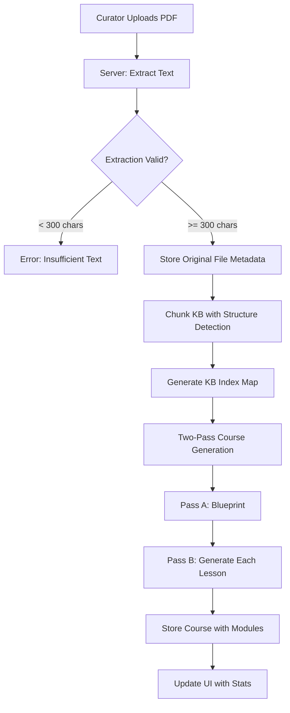
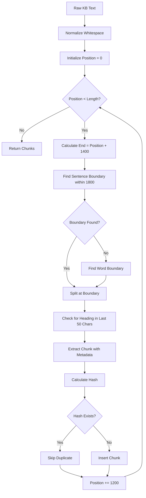
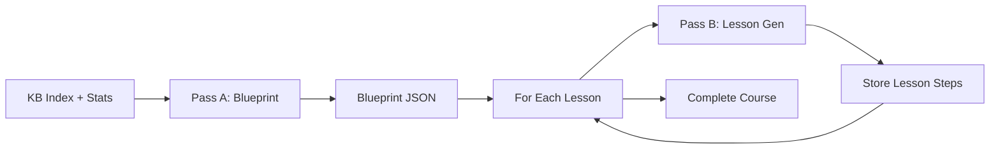

# Knowledge Base PDF Handling - Feature Design

## 1. Overview

### Purpose
Transform the existing course generation system from a flat, small-scale approach to a robust, scalable solution that properly handles PDF knowledge bases and generates comprehensive, structured courses with proper RAG grounding.

### Problem Statement
The current system exhibits critical deficiencies:
- PDF text extraction fails, resulting in empty or corrupted content
- Course generation produces minimal output (approximately 17 questions for 40-page documents)
- Generated courses lack hierarchical structure (no modules)
- RAG grounding is inconsistent or absent
- MCQ distractors are obviously incorrect
- UI displays entire KB text instead of file metadata
- No observability for debugging generation failures

### Success Criteria
- Curator uploads PDF, system reliably extracts text (validation: minimum 300 characters)
- Course generation scales with KB size (large KB yields 60+ questions across 6+ modules)
- All content is grounded in KB with explicit references
- MCQ options are plausible and pass quality validation
- UI shows file metadata and indexed stats, not raw text
- AI logs capture prompts, retrieval context, and responses for debugging

---

## 2. System Architecture

### High-Level Flow



### Component Interaction

| Component | Responsibility | Input | Output |
|-----------|---------------|-------|--------|
| **PDF Parser** | Extract text with metadata | File buffer | `{fullText, pageCount, charCount, encrypted}` |
| **KB Chunker** | Split text into coherent segments | Raw text | Array of chunks with metadata |
| **KB Indexer** | Build topic map for retrieval | Chunks | Topic map with chunk references |
| **Blueprint Generator** | Create module/lesson structure | Title, KB index, stats | Course blueprint JSON |
| **Lesson Generator** | Generate individual lessons | Module plan, KB chunks | Lesson steps with questions |
| **Quality Validator** | Check MCQ quality | MCQ options | Pass/fail with retry signal |
| **AI Logger** | Record all interactions | Prompts, responses, metadata | Log entry ID |

---

## 3. Data Model

### New Tables

#### knowledge_sources
Stores metadata about uploaded knowledge base files.

| Field | Type | Purpose | Constraints |
|-------|------|---------|-------------|
| id | serial | Primary key | NOT NULL |
| course_id | integer | Reference to track | NOT NULL, FK |
| filename | text | Original filename | NOT NULL |
| storage_path | text | File storage location | NOT NULL |
| mimetype | text | File MIME type | NOT NULL |
| size_bytes | integer | File size | NOT NULL |
| page_count | integer | Number of pages (PDF only) | NULL |
| extracted_char_count | integer | Characters extracted | NOT NULL |
| status | text | Processing status | ENUM('uploaded', 'parsing', 'indexed', 'failed') |
| error_message | text | Parsing error if any | NULL |
| created_at | timestamp | Upload time | DEFAULT NOW() |

#### knowledge_chunks (Enhanced)
Extended from existing schema to support section metadata.

| Field | Type | Purpose | Constraints |
|-------|------|---------|-------------|
| id | serial | Primary key | NOT NULL |
| course_id | integer | Reference to track | NOT NULL, FK |
| source_id | integer | Reference to source file | NOT NULL, FK |
| chunk_index | integer | Order position | NOT NULL |
| section_title | text | Detected heading | NULL |
| content | text | Chunk text | NOT NULL |
| content_hash | text | SHA-256 hash (first 16 chars) | NOT NULL |
| metadata | jsonb | `{wordCount, hasHeading, topics[]}` | NULL |
| created_at | timestamp | Creation time | DEFAULT NOW() |

#### kb_index
Stores topic mapping for efficient retrieval.

| Field | Type | Purpose | Constraints |
|-------|------|---------|-------------|
| id | serial | Primary key | NOT NULL |
| course_id | integer | Reference to track | NOT NULL, FK |
| topics | jsonb | Topic map structure | NOT NULL |
| version | integer | Index version for updates | DEFAULT 1 |
| created_at | timestamp | Generation time | DEFAULT NOW() |

Structure of `topics` JSONB field:
```
{
  "topics": [
    {
      "title": "Topic name",
      "description": "Brief summary (<= 180 chars)",
      "chunk_ids": [12, 45, 67],
      "keywords": ["keyword1", "keyword2"]
    }
  ]
}
```

#### ai_logs (Enhanced)
Extended from existing schema to support KB operations.

| Field | Type | Purpose | Additional Values |
|-------|------|---------|-------------------|
| action_type | text | Type of operation | Add: 'kb_index', 'blueprint', 'lesson_generate' |
| kb_source_ids | integer[] | Source file references | NEW |
| blueprint_id | integer | Reference to blueprint log | NEW |

### Enhanced Existing Tables

#### tracks (courses)
Add module structure support.

| Field | Type | Purpose | Constraints |
|-------|------|---------|-------------|
| course_structure | jsonb | Module hierarchy | NULL (legacy courses) |

Structure of `course_structure` JSONB field:
```
{
  "modules": [
    {
      "module_id": "M1",
      "title": "Module Title",
      "objective": "Learning objective",
      "lesson_ids": [101, 102, 103]
    }
  ]
}
```

---

## 4. Feature Implementation Steps

### STEP 1: Locate and Remove Hardcoding

#### Objective
Identify all locations where course size is artificially limited and remove these constraints.

#### Affected Files
- `server/routes.ts`: Line 76-77 (hardcoded minSteps/maxSteps)
- `server/ai/routes.ts`: Lines 146-156 (courseBudget calculation)
- `server/ai/parsers.ts`: Lines 227-245 (getRecommendedStepCount function)
- `server/ai/prompts.ts`: Lines 79-102 (system prompt with fixed ranges)

#### Changes Required
- Remove fixed step count calculations based on arbitrary KB size thresholds
- Replace with dynamic scaling algorithm that considers:
  - KB character count
  - Target duration (default 60 minutes, not 45)
  - Detected topic count from KB index
  - Minimum guarantees: Large KB >= 60 questions, Medium >= 40, Small >= 20

#### Decision Points
Should we preserve any minimum thresholds for very small KBs (< 5000 chars)?
- **Recommendation**: Yes, enforce minimum 2 modules / 6 lessons / 20 questions even for small KBs to maintain training quality

---

### STEP 2: Real PDF Support

#### A. Store Original File

**Objective**: Preserve original uploaded files with metadata.

**Storage Strategy**:
- Use existing file system storage in dedicated `/storage/kb-files/` directory
- Store with unique filename: `{trackId}_{timestamp}_{originalname}`
- Record metadata in `knowledge_sources` table

**Upload Flow**:
1. Curator uploads PDF via existing multer endpoint (`/api/tracks/generate`)
2. Save file buffer to disk with unique path
3. Create `knowledge_sources` record with status='parsing'
4. Proceed to parsing step

**Error Handling**:
- File size exceeds 20MB: Return "Файл слишком большой. Максимум 20 МБ."
- Disk write fails: Return "Ошибка сохранения файла. Попробуйте снова."
- Duplicate upload: Allow (create new version with timestamp)

#### B. Parse PDF Reliably

**Objective**: Extract text with robust error handling and validation.

**Implementation** (already exists in `server/ai/parsers.ts`):
- Use `pdf-parse` library via dynamic import
- Return structured result: `{fullText, pageCount, extractedCharCount, metadata}`

**Validation Rules**:
| Condition | Action | User Message |
|-----------|--------|--------------|
| extractedCharCount < 300 | Fail with specific error | "Извлечено слишком мало текста ({count} символов). Попробуйте экспортировать PDF с текстовым слоем или загрузите TXT/DOCX." |
| Password protected | Fail immediately | "PDF защищён паролем. Загрузите незащищённую версию." |
| No text layer (scanned) | Fail with guidance | "PDF не содержит текстового слоя. Это отсканированный документ. Экспортируйте PDF с текстом." |
| Extraction exception | Log and fail | "Не удалось прочитать PDF. Проверьте, что файл не повреждён." |

**Update knowledge_sources status**:
- Success: status='indexed', extracted_char_count={count}
- Failure: status='failed', error_message={message}

**Logging**:
Every extraction attempt logs:
- filename, size_bytes, page_count
- extractedCharCount or error details
- parsing latency in milliseconds

#### C. UI for Materials

**Location**: `client/src/pages/curator/course-details.tsx` → Materials Tab

**Current State** (Line 312-328): Displays raw KB text in scrollable container

**New Design**:

Replace raw text dump with structured file card display:

**File Card Structure**:
| Element | Content | Style |
|---------|---------|-------|
| Icon | Document icon (FileText) | Color based on status |
| Filename | Original filename | Truncate with ellipsis if > 40 chars |
| File info | "{size} • {pageCount} pages" | Muted text |
| Upload time | "Uploaded {relative time}" | Small muted text |
| Status badge | "Indexed" / "Parsing" / "Failed" | Color-coded |
| Stats row | "📊 {chunkCount} chunks • {charCount} characters" | Info style |

**Status Color Mapping**:
- Uploaded: Gray
- Parsing: Yellow with spinner
- Indexed: Green
- Failed: Red

**Optional Preview**:
Add collapsible section "Preview Extracted Text" (collapsed by default):
- Show first 2000 characters
- Truncate with "... [Click to expand]"
- Expand opens dialog with full text (scrollable, max-height 600px)

**Multiple Files Support**:
If track has multiple sources (future enhancement), show list of cards vertically stacked.

---

### STEP 3: KB Indexing with Coherence

#### Objective
Split KB into chunks while preserving semantic coherence and document structure.

#### Chunking Configuration
| Parameter | Value | Rationale |
|-----------|-------|-----------|
| chunkSize | 1400 chars | Balance between context preservation and token limits |
| overlap | 200 chars | Prevent information loss at boundaries |
| maxChunkSize | 1800 chars | Hard limit before forced split |
| minChunkSize | 200 chars | Filter out trivial fragments |

#### Structure Detection

Detect section headings using pattern matching:

**Heading Patterns**:
- All caps line (>= 3 words): "CHAPTER ONE: INTRODUCTION"
- Numbered sections: "1. Introduction", "1.1 Background", "Глава 1"
- Keyword prefixes: "Раздел:", "Тема:", "Chapter", "Section"

**Implementation Logic**:
```
For each potential split point:
  1. Check if previous 50 chars contain heading pattern
  2. If yes, store as section_title in chunk metadata
  3. Prefer splitting AFTER headings (start new chunk with heading)
```

#### Deduplication

**Hash-based Detection**:
- Calculate SHA-256 hash of normalized content (lowercase, no excess whitespace)
- Store first 16 characters as content_hash
- Before inserting chunk, check if hash exists for same course_id
- If duplicate found, skip insertion and log

**Similarity Threshold** (future enhancement):
For near-duplicates (not implemented in MVP):
- Use Levenshtein distance or fuzzy matching
- Threshold: 90% similarity = duplicate

#### Chunking Process



#### Metadata Storage

Each chunk stores:
```
{
  "section_title": "Detected heading or null",
  "wordCount": 245,
  "charCount": 1456,
  "hasHeading": true,
  "position": {
    "start": 12400,
    "end": 13856
  }
}
```

#### Persistence

Update `server/ai/kb-service.ts` `storeKBChunks` function:
- Add section_title extraction
- Add content_hash calculation
- Add metadata enrichment
- Add duplicate detection query
- Return stats: `{totalChunks, uniqueChunks, duplicatesSkipped}`

#### UI Feedback

After indexing completes, display in Materials tab:
```
✅ Indexed: 142 chunks • 56,789 characters • 42 pages
```

---

### STEP 4: Build KB Index (Topics Map)

#### Objective
Create a lightweight semantic index of KB topics to guide course generation and retrieval.

#### Index Generation Trigger
- Execute immediately after successful chunking
- Store result in `kb_index` table
- Use for all subsequent course generation requests

#### GigaChat Prompt for Index Generation

**System Prompt**:
```
You are an expert content analyst. Analyze the Knowledge Base and extract major topics with supporting evidence.

Output ONLY valid JSON with no markdown:
{
  "topics": [
    {
      "title": "Topic name (3-8 words)",
      "description": "Brief summary (<= 180 chars)",
      "chunk_ids": [12, 45, 67],
      "keywords": ["keyword1", "keyword2", "keyword3"]
    }
  ]
}

Rules:
- Extract 12-40 topics depending on KB size
- Every topic MUST reference 3-8 chunk_ids as evidence
- Topics must cover ALL major themes in KB
- Do not invent topics without chunk support
- Descriptions must be concise and specific
```

**User Prompt**:
```
Analyze this Knowledge Base and extract all major topics.

KB Statistics:
- Total chunks: {chunkCount}
- Total characters: {charCount}
- Pages: {pageCount}

KB Chunks (with IDs):
[Chunk 1 - ID: 12]
{first 600 chars of chunk}

[Chunk 2 - ID: 13]
{first 600 chars of chunk}

...

Extract topics with supporting chunk IDs.
```

#### Topic Count Scaling

| KB Size (chars) | Min Topics | Max Topics |
|-----------------|------------|------------|
| < 10,000 | 8 | 12 |
| 10,000 - 30,000 | 12 | 20 |
| 30,000 - 60,000 | 18 | 30 |
| > 60,000 | 25 | 40 |

#### Validation Rules

After receiving topics from GigaChat:
1. Ensure topics array has at least minimum count
2. Validate each topic has:
   - Non-empty title
   - Description <= 200 chars
   - At least 2 chunk_ids
   - All chunk_ids exist in kb_chunks table
3. If validation fails: Retry once with clarification prompt
4. If second attempt fails: Log error and use fallback (keyword-based topic extraction)

#### Fallback Strategy

If GigaChat index generation fails:
- Use simple keyword frequency analysis
- Group chunks by top keywords
- Create basic topic map with top 10 keywords as "topics"
- Store with version=0 (indicating fallback)

#### Storage

Insert into `kb_index` table:
```
{
  course_id: 42,
  topics: {topics: [...]},
  version: 1,
  created_at: now()
}
```

#### Retrieval Optimization

When generating lessons:
- Query: "SELECT chunk_ids from topics WHERE title = '{topic_name}'"
- Returns: [12, 45, 67]
- Fetch those specific chunks from kb_chunks
- Pass to lesson generation prompt

This avoids scanning all chunks and ensures relevant context.

---

### STEP 5: Two-Pass Course Generation

#### Objective
Replace single-shot generation with structured pipeline that scales with KB size.

#### Why Two Passes?

| Problem with Single-Pass | Solution with Two-Pass |
|---------------------------|------------------------|
| Token limit exceeded for large KBs | Blueprint only plans, lessons generate separately |
| Inconsistent question distribution | Blueprint allocates budget upfront |
| Poor topic coverage | Blueprint analyzes full KB index first |
| Model "forgets" earlier context | Each lesson gets fresh, focused context |
| Difficult to scale | Each pass has independent sizing |

#### Architecture



---

### PASS A: Blueprint Generation

#### Input Parameters
| Parameter | Source | Example |
|-----------|--------|---------|
| trainingTitle | User input | "Cybersecurity Fundamentals" |
| targetDurationMinutes | Default or user | 60 |
| kbStats | Metadata | `{pages: 42, chars: 67891, chunks: 142}` |
| kb_index | From kb_index table | `{topics: [...]}` |

#### Scaling Rules

**Module Count**:
| KB Chars | Min Modules | Max Modules |
|----------|-------------|-------------|
| < 10,000 | 2 | 4 |
| 10,000 - 30,000 | 4 | 6 |
| 30,000 - 60,000 | 6 | 8 |
| > 60,000 | 8 | 12 |

**Lessons per Module**:
| KB Chars | Min | Max |
|----------|-----|-----|
| < 10,000 | 3 | 5 |
| 10,000 - 30,000 | 4 | 6 |
| > 30,000 | 5 | 8 |

**Questions per Lesson**:
- MCQ: 2-4
- Open Answer: 1-2
- Scenario/Drill: 1

Total per lesson: 4-7 questions

**Total Question Targets**:
| KB Chars | Min Questions | Target Questions |
|----------|---------------|------------------|
| < 10,000 | 20 | 30-50 |
| 10,000 - 30,000 | 40 | 50-90 |
| 30,000 - 60,000 | 60 | 80-140 |
| > 60,000 | 80 | 120-200 |

#### GigaChat Prompt

**System Prompt**:
```
You are an expert instructional designer creating corporate training courses.

Task: Create a BLUEPRINT (structure only) for a training course.

Rules:
- Use ONLY topics from the provided KB index
- Do NOT generate actual questions yet (that comes next)
- Plan modules, lessons, and question budgets
- Output ONLY valid JSON (no markdown)
- Language: Russian

Anti-hallucination:
- Every lesson MUST reference specific topics from KB index
- If KB lacks information for a topic: mark with "kb_gap": true
- Do NOT invent facts outside KB

Output JSON schema:
{
  "blueprint": {
    "title": "Course title",
    "summary": "2-3 sentence overview (<= 500 chars)",
    "modules": [
      {
        "module_id": "M1",
        "title": "Module title",
        "objective": "What learners will achieve",
        "lessons": [
          {
            "lesson_id": "M1L1",
            "title": "Lesson title",
            "objective": "Specific learning goal",
            "question_budget": 6,
            "topic_refs": ["topic_title_1", "topic_title_2"],
            "kb_gap": false
          }
        ]
      }
    ],
    "targets": {
      "modules": 6,
      "lessons": 24,
      "questions": 96
    }
  }
}
```

**User Prompt**:
```
Create a course blueprint grounded in the Knowledge Base.

Training Title: "{title}"
Target Duration: {targetDurationMinutes} minutes
KB Statistics:
- Pages: {pageCount}
- Characters: {charCount}
- Chunks: {chunkCount}

Minimum Requirements:
- Modules: {modulesMin}-{modulesMax}
- Lessons: {lessonsMin}-{lessonsMax}
- Questions: {questionsMin}+

KB Topics (use these ONLY):
{topics.map(t => `- ${t.title}: ${t.description} [chunks: ${t.chunk_ids.join(',')}]`).join('\n')}

CRITICAL: Every lesson must reference topic_refs from the list above.
Do NOT generate questions yet, only plan the structure.
```

#### Validation

After receiving blueprint:
1. Check required fields: title, modules[], targets
2. Validate module count >= minimum
3. Validate lesson count >= minimum
4. Validate sum of question_budgets >= minimum questions
5. Check all topic_refs exist in KB index
6. If any lesson has kb_gap=true: Log warning (allowed but flagged)
7. If validation fails: Retry with clarification

#### Retry Logic

If blueprint is invalid:
```
Previous response was invalid. Required:
- Modules: at least {min}
- Lessons: at least {min}
- Questions: at least {min}
- All topic_refs must be from: {validTopics.join(', ')}

Provide corrected JSON only.
```

Max retries: 2
If both fail: Use fallback structure (evenly distributed modules/lessons)

#### Storage

Store blueprint in `ai_logs`:
```
{
  action_type: 'blueprint',
  course_id: 42,
  promptText: {system + user prompts},
  responseText: {blueprint JSON},
  latencyMs: 3200,
  status: 'success'
}
```

Reference blueprint_id in subsequent lesson generation logs.

---

### PASS B: Lesson Generation (Per Lesson)

#### Input Parameters
| Parameter | Source | Example |
|-----------|--------|---------|
| module_title | From blueprint | "Network Security Basics" |
| lesson_title | From blueprint | "Firewalls and Access Control" |
| lesson_objective | From blueprint | "Understand firewall rules and ACLs" |
| question_budget | From blueprint | 6 |
| topic_refs | From blueprint | ["firewalls", "access_control"] |
| kb_chunks | Retrieved via topic_refs | Array of 12-20 chunks |

#### Chunk Retrieval Strategy

For each topic_ref in lesson:
1. Query kb_index: `topics WHERE title = '{topic_ref}'`
2. Extract chunk_ids from that topic
3. Fetch those chunks from kb_chunks table
4. If topic has >10 chunks: Take top 10 by relevance score (keyword match with lesson_objective)
5. Combine all chunks (max 20 total per lesson)

#### GigaChat Prompt

**System Prompt**:
```
You are an expert corporate trainer and assessment writer.

Task: Generate a SINGLE lesson with mixed question types.

Rules:
- Use ONLY the provided KB chunks as evidence
- Generate exactly {question_budget} questions
- Mix types: MCQ (2-4) + Open Answer (1-2) + Scenario (1)
- All content must cite kb_refs (chunk IDs)
- Language: Russian
- Output ONLY valid JSON

Anti-hallucination:
- Every answer/explanation must reference specific chunks
- If KB lacks info for a question: mark "kb_gap": true
- Do NOT invent facts, terminology, or examples outside chunks

MCQ Quality Rules:
- All 4 options must be plausible (no obvious correct answer)
- Options similar length (max 2x difference)
- No "все вышеперечисленное", "неверно", or joke options
- Correct answer randomized (not always A)
- Distractors are "near misses" (common misconceptions)

Output JSON schema:
{
  "lesson": {
    "title": "Lesson title",
    "objective": "Learning objective",
    "estimated_minutes": 3,
    "steps": [
      {
        "type": "content",
        "text": "2-4 sentences (<= 700 chars)",
        "kb_refs": [12, 45]
      },
      {
        "type": "multiple_choice",
        "question": "Question text (<= 240 chars)",
        "options": ["A", "B", "C", "D"],
        "correct_index": 0,
        "explanation": "Why correct (<= 400 chars)",
        "kb_refs": [12]
      },
      {
        "type": "open_answer",
        "prompt": "Question requiring detailed answer",
        "rubric": [
          {"score": 0, "criteria": "Incomplete or incorrect"},
          {"score": 5, "criteria": "Partially correct"},
          {"score": 10, "criteria": "Complete and accurate"}
        ],
        "sample_good_answer": "Example answer (<= 450 chars)",
        "kb_refs": [45]
      },
      {
        "type": "scenario_drill",
        "scenario": "Real-world situation (<= 600 chars)",
        "user_task": "What should you do? (<= 200 chars)",
        "evaluation": {
          "rubric": [
            {"score": 0, "criteria": "Does not address situation"},
            {"score": 5, "criteria": "Addresses but incomplete"},
            {"score": 10, "criteria": "Correct and comprehensive"}
          ],
          "common_mistakes": ["mistake 1", "mistake 2"],
          "coach_hint": "Hint if struggling (<= 300 chars)"
        },
        "kb_refs": [12, 45]
      }
    ],
    "quality": {
      "mcq_pass": true,
      "kb_grounded": true,
      "kb_gaps": []
    }
  }
}
```

**User Prompt**:
```
Generate lesson: "{lesson_title}"

Objective: {lesson_objective}
Question Budget: {question_budget}
Topics: {topic_refs.join(', ')}

KB Chunks (use these ONLY):
[Chunk ID: 12]
{chunk content}

[Chunk ID: 45]
{chunk content}

...

Requirements:
- Generate {question_budget} questions total
- Mix: 2-4 MCQ, 1-2 open, 1 scenario
- Every step must have kb_refs array
- MCQ options must be plausible (no obvious correct)
- If KB lacks info: mark kb_gap=true

Generate JSON only.
```

#### Post-Generation Validation

Run quality checks on generated lesson:

**MCQ Quality Check**:
| Check | Rule | Action if Failed |
|-------|------|------------------|
| Option length balance | maxLen / minLen <= 2.2 | Regenerate MCQ |
| Correct index distribution | Not >40% same position in batch | Shuffle or regenerate |
| Distractor quality | No obvious markers ("всегда", "никогда", "неверно", "очевидно") | Regenerate |
| KB references | All steps have kb_refs | Reject and retry |
| Question count | Matches question_budget ± 1 | Accept if within range, else retry |

**Retry Strategy**:
- If validation fails: Append to conversation:
  ```
  Previous lesson had quality issues:
  - {issue description}
  
  Please regenerate this lesson with corrections. Keep same structure but fix issues.
  ```
- Max retries: 1 per lesson
- If retry fails: Accept with quality_warning flag and log for manual review

#### Progress Tracking

During generation, update UI:
- "Building blueprint… ✓"
- "Generating module 2/6, lesson 3/4…" (with spinner)
- "Finalizing course structure…"

Estimate: ~2-3 seconds per lesson, so 24 lessons ≈ 60 seconds total.

#### Storage

For each lesson:
1. Insert steps into `steps` table with trackId
2. Link to module via course_structure in tracks table
3. Log to ai_logs with action_type='lesson_generate', blueprint_id reference

Course structure update:
```
UPDATE tracks 
SET course_structure = {
  "modules": [
    {
      "module_id": "M1",
      "title": "...",
      "lesson_ids": [101, 102, 103]
    }
  ]
}
WHERE id = {trackId}
```

---

### STEP 6: Fix Training Title Mismatch

#### Problem
Model generates content from title only when KB exists but is not used.

#### Solution: KB-Grounded Mode Enforcement

**Rule**: If track has any records in knowledge_sources table → KB-GROUNDED MODE MANDATORY

**Implementation**:

In all generation prompts, add conditional logic:

```
IF kb_sources.count > 0:
  System prompt includes:
  "KB-GROUNDED MODE ACTIVE
  - You MUST use ONLY information from provided KB chunks
  - Training title is a LABEL only, not a content source
  - If KB lacks information: output KB_GAP, do NOT invent
  - Every fact, term, process must cite kb_refs"
  
ELSE:
  System prompt allows:
  "Use general knowledge to create training on topic: {title}"
```

**Validation in Blueprint Generation**:
- Check: `SELECT COUNT(*) FROM knowledge_sources WHERE course_id = X`
- If count > 0 AND blueprint has lessons with empty topic_refs → REJECT
- Error message: "All lessons must reference KB topics. Found lessons without KB grounding."

**Validation in Lesson Generation**:
- Check: Every step has non-empty kb_refs array
- If any step missing kb_refs → REJECT
- Retry prompt: "All steps MUST include kb_refs array with chunk IDs as evidence."

#### UI Indicator

In course details, show badge:
- KB-grounded courses: "📚 KB-Grounded" (green badge)
- Non-KB courses: "💡 General Knowledge" (gray badge)

This makes the distinction visible to curators.

---

### STEP 7: MCQ Quality Enhancement

#### Objective
Eliminate obviously correct answers and ensure plausible distractors.

#### Enhanced Generation Rules

Added to lesson generation system prompt:

```
MCQ QUALITY REQUIREMENTS (CRITICAL):

1. Option Length Balance:
   - All options must be similar length
   - Maximum ratio: 2.2x between longest and shortest
   - Example BAD: ["да" (2 chars) vs "комплексный процесс..." (45 chars)]
   - Example GOOD: All options 20-35 characters

2. Distractor Plausibility:
   - Distractors must be "near misses" from KB domain
   - Use common misconceptions or partially correct statements
   - NO absolute markers: "всегда", "никогда", "очевидно", "неверно"
   - NO joke/absurd options
   - NO "все вышеперечисленное", "ничего из перечисленного"

3. Correct Answer Position:
   - Randomize across A, B, C, D
   - In a batch of 10 MCQs: no more than 4 with same correct index
   - Avoid patterns (A, B, C, D, A, B, C, D...)

4. KB Grounding:
   - Correct answer must cite specific chunk
   - Distractors should reference related but incorrect info from KB
   - Explanation must quote or paraphrase chunk content

5. Explanation Quality:
   - State why correct option is right (with KB reference)
   - Briefly note why common distractors are wrong
   - Length: 200-400 characters
```

#### Post-Generation Validator

Implemented as server-side function: `validateMCQ(mcq: MCQStep): ValidationResult`

```
function validateMCQ(mcq):
  issues = []
  
  // Check option length balance
  lengths = mcq.options.map(o => o.length)
  ratio = max(lengths) / min(lengths)
  if ratio > 2.2:
    issues.push("Option length imbalance: ${ratio.toFixed(1)}x")
  
  // Check for obvious markers
  obvMarkers = ["всегда", "никогда", "очевидно", "неверно", "все вышеперечисленное"]
  correctOpt = mcq.options[mcq.correct_index]
  for marker in obvMarkers:
    if any distractor contains marker AND correct does not:
      issues.push("Distractor contains obvious marker: ${marker}")
  
  // Check KB references
  if !mcq.kb_refs or mcq.kb_refs.length === 0:
    issues.push("Missing KB references")
  
  // Check explanation length
  if mcq.explanation.length < 100:
    issues.push("Explanation too short")
  
  return {
    pass: issues.length === 0,
    issues: issues
  }
```

#### Retry Logic

If validator fails:
1. Log validation issues
2. Append to conversation:
   ```
   MCQ quality issues found:
   {issues.join('\n')}
   
   Please regenerate this MCQ following all quality rules.
   ```
3. Max retries: 1
4. If still fails: Accept with warning flag and log for manual curator review

#### Batch Position Checking

After generating all lessons in a module:
```
function checkCorrectIndexDistribution(mcqs):
  counts = {0: 0, 1: 0, 2: 0, 3: 0}
  for mcq in mcqs:
    counts[mcq.correct_index]++
  
  total = mcqs.length
  for index, count in counts:
    if count / total > 0.45:  // More than 45% on same position
      return {
        pass: false,
        suggestion: "Shuffle some correct answers to avoid pattern"
      }
  
  return {pass: true}
```

If distribution check fails:
- Randomly shuffle correct_index for flagged MCQs (swap options)
- Update database records
- Log adjustment

---

### STEP 8: Observability Implementation

#### Objective
Capture complete AI interaction pipeline for debugging and quality assurance.

#### ai_logs Table Enhancement

Already exists, add new action_types:
- 'kb_index': KB topic map generation
- 'blueprint': Course structure planning
- 'lesson_generate': Individual lesson creation

#### Logging Points

| Event | When | Data Captured |
|-------|------|---------------|
| KB Index Start | Before GigaChat call | course_id, kb_source_ids, chunk count |
| KB Index Complete | After response | topics JSON, latency, status |
| Blueprint Start | Before generation | course_id, kb_stats, target params |
| Blueprint Complete | After validation | blueprint JSON, latency, status |
| Lesson Start | For each lesson | module_id, lesson_id, topic_refs, retrieved chunks |
| Lesson Complete | After validation | lesson JSON, quality metrics, latency |
| Quality Issue | Validation failure | step type, issue description, retry count |

#### Enhanced Log Schema

Already defined in ai_logs table, ensure all fields populated:

```
{
  correlationId: "abc123xyz",  // Links related operations
  userId: 42,
  trackId: 17,
  courseId: null,
  actionType: "lesson_generate",
  kbEnabled: true,
  kbSourceIds: [5],
  retrievedChunkIds: [12, 45, 67, 89, 101],
  retrievedChunkPreviews: [
    "[12] First 100 chars of chunk...",
    "[45] First 100 chars of chunk...",
    ...
  ],
  promptText: "System + User prompts (trimmed to 5000 chars)",
  promptHash: "a3f5d8c9e2b1",
  responseText: "JSON response (trimmed to 3000 chars)",
  responseHash: "b7c2e8a4f1d3",
  latencyMs: 3245,
  status: "success",
  errorMessage: null,
  createdAt: "2024-01-05T14:32:17Z"
}
```

#### Correlation ID Strategy

Use consistent format: `{actionType}_{timestamp}_{random4chars}`

Examples:
- `kb_index_1704465137_a3f5`
- `blueprint_1704465142_b8e2`
- `lesson_M1L1_1704465145_c9d7`

Link related operations:
- Blueprint log stores: `correlationId: "blueprint_XXX"`
- All lesson logs reference: `metadata: {blueprintCorrelationId: "blueprint_XXX"}`

#### AI Debug Logs UI

**Location**: New page at `/curator/ai-logs` (add to sidebar)

**Table Columns**:
| Column | Content | Width |
|--------|---------|-------|
| Time | Relative time ("2m ago") | 100px |
| Action | Badge with action_type | 150px |
| Course | Track title (link) | 200px |
| Status | ✅ Success / ❌ Error | 100px |
| Latency | "{ms}ms" with color (green < 2s, yellow < 5s, red >= 5s) | 80px |
| Details | "View" button | 80px |

**Filters** (top of page):
- Action Type dropdown: All / kb_index / blueprint / lesson_generate / evaluate
- Status: All / Success / Error
- Time Range: Last hour / Last day / Last week
- Course: Dropdown of curator's courses

**Detail Modal**:
Opens when clicking "View" button:
- Full prompt text (syntax highlighted, collapsible)
- Retrieved chunks (if applicable, with IDs and previews)
- Full response text (syntax highlighted)
- Metadata: latency, timestamp, correlation ID
- If error: full error message and stack trace

**Default View**: Last 50 logs, newest first

#### Performance Monitoring

Add aggregate stats at top of AI Logs page:

| Metric | Calculation | Display |
|--------|-------------|---------|
| Success Rate | (success / total) * 100 | "94% Success Rate" with trend |
| Avg Latency | AVG(latencyMs) WHERE status='success' | "2.4s avg response" |
| Error Rate Trend | Count by hour for last 24h | Mini sparkline chart |
| Top Error | Most common errorMessage | "PDF parsing: 12 errors" |

---

## 5. Implementation Sequence

### Phase 1: Foundation (Days 1-2)
- [ ] Extend database schema (knowledge_sources, kb_index, enhanced ai_logs)
- [ ] Run migrations
- [ ] Update storage.ts interfaces
- [ ] Add file storage system for PDFs

### Phase 2: PDF & Chunking (Days 3-4)
- [ ] Implement knowledge_sources CRUD
- [ ] Enhance kb-service.ts with section detection
- [ ] Add deduplication logic
- [ ] Update /api/tracks/generate endpoint to store files
- [ ] Add error handling and validation

### Phase 3: KB Indexing (Day 5)
- [ ] Implement KB index generation in kb-service.ts
- [ ] Add GigaChat integration for topic extraction
- [ ] Add fallback topic generation
- [ ] Store index in kb_index table

### Phase 4: Two-Pass Generation (Days 6-8)
- [ ] Create blueprint generator in ai/routes.ts
- [ ] Implement lesson generator with chunk retrieval
- [ ] Add validation logic for both passes
- [ ] Update tracks table to store course_structure
- [ ] Implement progress tracking

### Phase 5: Quality Enhancement (Day 9)
- [ ] Add MCQ validator function
- [ ] Enhance prompts with quality rules
- [ ] Implement retry logic
- [ ] Add batch position checking

### Phase 6: UI Updates (Days 10-11)
- [ ] Update Materials tab with file cards
- [ ] Add indexed stats display
- [ ] Implement collapsible preview
- [ ] Add generation progress indicators
- [ ] Update course details to show modules

### Phase 7: Observability (Day 12)
- [ ] Enhance ai_logs inserts throughout pipeline
- [ ] Create AI Logs page UI
- [ ] Add filtering and search
- [ ] Implement detail modal
- [ ] Add aggregate stats dashboard

### Phase 8: Testing & Refinement (Days 13-14)
- [ ] Test with various PDF sizes
- [ ] Verify scaling rules
- [ ] Check MCQ quality across multiple courses
- [ ] Test error scenarios
- [ ] Performance optimization

---

## 6. API Contracts

### POST /api/tracks/generate (Enhanced)

**Request**:
- Content-Type: multipart/form-data
- Body:
  - title: string (required)
  - description: string (optional)
  - files: File[] (required, 1-20 files)
  - strictMode: boolean (default true)
  - targetDuration: number (default 60)

**Response** (Success):
```json
{
  "track": {
    "id": 42,
    "title": "Course Title",
    "joinCode": "ABC123",
    "course_structure": {
      "modules": [...]
    }
  },
  "steps": [...],
  "kbStats": {
    "totalChars": 67891,
    "chunkCount": 142,
    "pageCount": 42,
    "sourceFiles": [
      {
        "id": 5,
        "filename": "training_manual.pdf",
        "status": "indexed",
        "extracted_char_count": 67891
      }
    ]
  },
  "indexStats": {
    "topicCount": 18,
    "indexLatencyMs": 2100
  },
  "generationStats": {
    "blueprintLatencyMs": 3200,
    "lessonsGenerated": 24,
    "totalLatencyMs": 68900
  }
}
```

**Response** (Error):
```json
{
  "message": "Error description in Russian",
  "code": "KB_EXTRACTION_FAILED | KB_TOO_SMALL | GENERATION_FAILED",
  "details": {
    "filename": "document.pdf",
    "extracted_chars": 120,
    "required_min": 300
  }
}
```

### GET /api/tracks/:id (Enhanced Response)

**Response**:
```json
{
  "track": {
    "id": 42,
    "title": "...",
    "course_structure": {
      "modules": [
        {
          "module_id": "M1",
          "title": "Module Title",
          "objective": "Learning goal",
          "lesson_ids": [101, 102, 103]
        }
      ]
    }
  },
  "steps": [...],
  "kbSources": [
    {
      "id": 5,
      "filename": "manual.pdf",
      "size_bytes": 2456789,
      "page_count": 42,
      "extracted_char_count": 67891,
      "status": "indexed",
      "created_at": "2024-01-05T10:30:00Z"
    }
  ],
  "kbIndex": {
    "topicCount": 18,
    "version": 1
  }
}
```

### GET /api/ai/logs (New)

**Query Parameters**:
- trackId: number (optional)
- actionType: string (optional)
- status: 'success' | 'error' (optional)
- limit: number (default 50, max 100)
- offset: number (default 0)

**Response**:
```json
{
  "logs": [
    {
      "id": 1234,
      "correlationId": "blueprint_abc123",
      "actionType": "blueprint",
      "trackId": 42,
      "status": "success",
      "latencyMs": 3200,
      "createdAt": "2024-01-05T14:32:17Z",
      "preview": "Generated blueprint with 6 modules..."
    }
  ],
  "total": 156,
  "page": 1,
  "pageSize": 50
}
```

### GET /api/ai/logs/:correlationId (New)

**Response**:
```json
{
  "id": 1234,
  "correlationId": "blueprint_abc123",
  "userId": 42,
  "trackId": 17,
  "actionType": "blueprint",
  "kbEnabled": true,
  "kbSourceIds": [5],
  "retrievedChunkIds": [12, 45, 67, 89],
  "retrievedChunkPreviews": ["[12] Chunk preview...", ...],
  "promptText": "Full prompt...",
  "responseText": "Full response...",
  "latencyMs": 3200,
  "status": "success",
  "errorMessage": null,
  "createdAt": "2024-01-05T14:32:17Z",
  "metadata": {
    "kbStats": {...},
    "validationResult": {...}
  }
}
```

---

## 7. Error Handling Strategy

### Error Categories

| Category | HTTP Status | User Message Pattern | Log Level | Recovery Action |
|----------|-------------|----------------------|-----------|-----------------|
| File Upload | 400 | "Файл {name}: {specific_issue}" | WARN | Show specific guidance |
| PDF Parsing | 400 | "PDF не удалось прочитать: {reason}" | WARN | Suggest alternatives (DOCX/TXT) |
| KB Too Small | 400 | "Недостаточно текста ({count} символов). Минимум 300." | INFO | Request larger document |
| Chunking Failure | 500 | "Ошибка обработки базы знаний. Попробуйте снова." | ERROR | Retry chunking |
| Index Generation Failed | 500 | "Не удалось проанализировать KB. Используется упрощенный режим." | WARN | Use fallback indexing |
| Blueprint Generation Failed | 500 | "Не удалось создать структуру курса. Попробуйте снова." | ERROR | Return to form with data preserved |
| Lesson Generation Failed | 500 | "Ошибка генерации урока {lesson_id}. Повторная попытка..." | WARN | Retry up to 2 times |
| Quality Validation Failed | 500 | "Вопрос не прошел проверку качества. Повторная генерация..." | INFO | Retry with clarification |
| GigaChat API Error | 503 | "Сервис AI временно недоступен. Повторите через 1 минуту." | ERROR | Show retry button |

### Retry Policies

| Operation | Max Retries | Backoff Strategy | Fallback |
|-----------|-------------|------------------|----------|
| PDF Parsing | 1 | Immediate | Fail with error |
| KB Indexing | 1 | 2s delay | Use keyword-based fallback |
| Blueprint | 2 | 5s exponential | Use template structure |
| Lesson | 1 per lesson | 3s delay | Skip lesson, log warning |
| MCQ Quality | 1 | Immediate | Accept with warning flag |

### User-Facing Error Messages

**PDF Extraction Failures**:
| Technical Error | User Message | Guidance |
|----------------|--------------|----------|
| extractedCharCount < 300 | "Извлечено слишком мало текста (120 символов). Минимум 300." | "Попробуйте экспортировать PDF с текстовым слоем или загрузите DOCX/TXT." |
| Password protected | "PDF защищён паролем. Загрузите незащищённую версию." | "Откройте PDF в Adobe Reader, снимите защиту (File → Properties), сохраните и загрузите снова." |
| No text layer | "PDF не содержит текста. Это отсканированный документ." | "Экспортируйте PDF с OCR (распознаванием текста) или используйте текстовый формат." |
| Corrupted file | "Не удалось прочитать PDF. Файл повреждён." | "Проверьте, что файл открывается в PDF-ридере. Попробуйте сохранить заново." |

**Generation Failures**:
| Stage | User Message | Guidance |
|-------|--------------|----------|
| KB Index | "Не удалось проанализировать содержание. Используется упрощенный режим." | Generation continues with keyword-based topics |
| Blueprint timeout | "Генерация структуры занимает больше времени. Попробуйте разбить базу знаний на части." | "Большие документы (>100 страниц) лучше загружать по разделам." |
| Lesson partial failure | "Курс создан, но {count} уроков требуют проверки." | "Откройте редактор и проверьте отмеченные уроки." |

---

## 8. Testing Strategy

### Unit Tests

| Component | Test Cases | Assertions |
|-----------|------------|-----------|
| PDF Parser | Valid PDF, encrypted PDF, scanned PDF, corrupted PDF | Correct text extraction or specific error |
| Chunker | Short text, long text, text with headings, no headings | Correct chunk count, overlap preservation, heading detection |
| KB Indexer | Small KB, medium KB, large KB | Topic count within range, all topics have chunk_ids |
| Blueprint Validator | Valid blueprint, missing modules, insufficient lessons | Validation pass/fail, specific issues identified |
| MCQ Validator | Balanced options, imbalanced options, obvious markers | Quality pass/fail, specific issues |

### Integration Tests

| Scenario | Steps | Expected Outcome |
|----------|-------|------------------|
| Small PDF upload | Upload 5-page PDF → Generate course | 2-4 modules, 20+ questions, indexed status |
| Large PDF upload | Upload 40-page PDF → Generate course | 6+ modules, 60+ questions, all topics covered |
| Multi-file upload | Upload 3 PDFs → Generate combined course | Combined KB, topics from all files |
| Encrypted PDF | Upload protected PDF | Clear error message with guidance |
| Scanned PDF | Upload image-based PDF | Specific error about text layer |
| Generation retry | Simulate API failure → Retry | Successful generation on second attempt |

### End-to-End Tests

| User Flow | Steps | Validation Points |
|-----------|-------|-------------------|
| Happy Path | Upload PDF → Review stats → Generate → View course | File metadata visible, modules structured, questions grounded |
| Error Recovery | Upload bad PDF → See error → Upload good PDF → Success | Appropriate error shown, retry works |
| Quality Check | Generate course → Review MCQs | No obvious correct answers, balanced options |
| Large Course | Upload 50-page manual → Generate | Generation completes in <3 minutes, >80 questions |

### Performance Benchmarks

| KB Size | Target Time | Max Time | Components |
|---------|-------------|----------|------------|
| Small (10 pages) | 30s | 60s | Parse: 2s, Index: 3s, Blueprint: 5s, Lessons: 20s |
| Medium (25 pages) | 60s | 120s | Parse: 5s, Index: 5s, Blueprint: 8s, Lessons: 42s |
| Large (50 pages) | 120s | 180s | Parse: 8s, Index: 10s, Blueprint: 12s, Lessons: 90s |

---

## 9. Migration Plan

### Database Migrations

**Migration 001_add_knowledge_sources.sql**:
```
CREATE TABLE knowledge_sources (
  id SERIAL PRIMARY KEY,
  course_id INTEGER NOT NULL REFERENCES tracks(id) ON DELETE CASCADE,
  filename TEXT NOT NULL,
  storage_path TEXT NOT NULL,
  mimetype TEXT NOT NULL,
  size_bytes INTEGER NOT NULL,
  page_count INTEGER,
  extracted_char_count INTEGER NOT NULL,
  status TEXT NOT NULL CHECK (status IN ('uploaded', 'parsing', 'indexed', 'failed')),
  error_message TEXT,
  created_at TIMESTAMP DEFAULT NOW()
);

CREATE INDEX idx_knowledge_sources_course ON knowledge_sources(course_id);
CREATE INDEX idx_knowledge_sources_status ON knowledge_sources(status);
```

**Migration 002_enhance_kb_chunks.sql**:
```
ALTER TABLE kb_chunks 
  ADD COLUMN source_id INTEGER REFERENCES knowledge_sources(id) ON DELETE CASCADE,
  ADD COLUMN section_title TEXT,
  ADD COLUMN content_hash TEXT;

CREATE INDEX idx_kb_chunks_source ON kb_chunks(source_id);
CREATE INDEX idx_kb_chunks_hash ON kb_chunks(content_hash);
```

**Migration 003_add_kb_index.sql**:
```
CREATE TABLE kb_index (
  id SERIAL PRIMARY KEY,
  course_id INTEGER NOT NULL REFERENCES tracks(id) ON DELETE CASCADE,
  topics JSONB NOT NULL,
  version INTEGER DEFAULT 1,
  created_at TIMESTAMP DEFAULT NOW()
);

CREATE INDEX idx_kb_index_course ON kb_index(course_id);
CREATE INDEX idx_kb_index_topics ON kb_index USING GIN(topics);
```

**Migration 004_enhance_tracks.sql**:
```
ALTER TABLE tracks
  ADD COLUMN course_structure JSONB;

CREATE INDEX idx_tracks_structure ON tracks USING GIN(course_structure);
```

**Migration 005_enhance_ai_logs.sql**:
```
ALTER TABLE ai_logs
  ADD COLUMN kb_source_ids INTEGER[],
  ADD COLUMN blueprint_id INTEGER;

CREATE INDEX idx_ai_logs_sources ON ai_logs USING GIN(kb_source_ids);
```

### Backward Compatibility

**For Existing Courses**:
- Courses without knowledge_sources: Display "Legacy Course" badge
- Courses without course_structure: Render steps as flat list (current behavior)
- No forced migration required

**Legacy Course Upgrade** (Optional Feature):
- Add "Upgrade Course" button in course details
- Curator can upload KB retroactively
- System re-chunks and generates course_structure
- Original steps preserved unless curator chooses "Regenerate All"

---

## 10. Monitoring & Observability

### Key Metrics

| Metric | Measurement | Alert Threshold | Action |
|--------|-------------|----------------|--------|
| PDF Parsing Success Rate | (successful / total) * 100 | < 85% | Investigate parser reliability |
| Average Generation Time | AVG(total_latency_ms) | > 180,000ms (3min) | Optimize or increase timeout |
| KB Index Fallback Rate | (fallback_count / total) * 100 | > 10% | Review GigaChat prompt effectiveness |
| MCQ Quality Failure Rate | (validation_fail / total_mcqs) * 100 | > 15% | Enhance quality prompt rules |
| Blueprint Retry Rate | (retries / total) * 100 | > 20% | Review blueprint prompt clarity |
| Error Rate by Type | Count by error_code | Any > 5% of total | Targeted debugging |

### Dashboard Panels

**Curator Dashboard** (curator/analytics):
- Total courses generated (last 7 days)
- Average generation time trend
- Success rate by KB size category
- Top 5 most common errors

**AI Logs Dashboard** (curator/ai-logs):
- Recent activity timeline (last 50 logs)
- Filter by action type, status, time range
- Latency distribution histogram
- Error breakdown pie chart

### Logging Best Practices

| Log Type | When | Include |
|----------|------|---------|
| INFO | Start of operation | correlationId, course_id, operation type |
| WARN | Retry attempt | Reason for failure, retry count |
| ERROR | Final failure | Full error stack, context data |
| DEBUG | Validation steps | Validation result details |

---

## 11. Security Considerations

### File Upload Security

| Risk | Mitigation | Implementation |
|------|------------|----------------|
| Malicious PDF | File type validation, size limits | Check MIME type, reject if >20MB |
| Code injection via filename | Sanitize filename before storage | Remove special chars, limit length to 255 |
| Path traversal | Use UUIDs for storage paths | Never use user-provided paths |
| Disk space exhaustion | Quota per curator | Implement storage limits (500MB per curator) |

### Data Privacy

| Concern | Solution |
|---------|----------|
| PII in uploaded documents | Warn curators to redact sensitive info before upload |
| KB content exposure | Restrict KB view to course owner only |
| AI logs visibility | Only curator role can access logs, filtered by ownership |
| Retention policy | Delete ai_logs older than 90 days (configurable) |

### API Security

| Endpoint | Protection | Validation |
|----------|-----------|------------|
| POST /api/tracks/generate | Authenticated curator only | Check role, rate limit 10/hour |
| GET /api/ai/logs | Authenticated curator only | Filter by user's courses only |
| File storage access | Signed URLs with expiration | Token valid for 1 hour |

---

## 12. Future Enhancements

### Phase 2 Features (Post-MVP)

| Feature | Description | Benefit | Complexity |
|---------|-------------|---------|------------|
| OCR Support | Extract text from scanned PDFs | Handle image-based documents | High |
| Multi-language Support | Detect KB language, generate in same language | International courses | Medium |
| Adaptive Difficulty | Adjust question complexity based on learner performance | Personalized training | High |
| Topic Dependency Graph | Model prerequisite relationships between topics | Optimized learning paths | Medium |
| KB Versioning | Track KB updates, regenerate only affected lessons | Maintain courses as KB evolves | Medium |
| Custom Blueprint Templates | Curator defines preferred course structure | Organizational consistency | Low |
| MCQ Distractor Bank | Reuse validated distractors across similar questions | Improved quality at scale | Medium |

### Technical Debt Items

| Item | Impact | Priority |
|------|--------|----------|
| Replace keyword-based retrieval with embeddings | Better semantic matching | High |
| Implement vector database for chunks | Faster, more accurate RAG | High |
| Add WebSocket for real-time generation progress | Better UX for long operations | Medium |
| Optimize chunk storage with compression | Reduce database size | Low |
| Add automated MCQ quality scoring | Reduce manual review | Medium |

---

## 13. Success Metrics

### Quantitative Metrics

| Metric | Current (As-Is) | Target (To-Be) | Measurement Method |
|--------|-----------------|----------------|-------------------|
| Course Size | ~17 questions/40-page KB | 80+ questions/40-page KB | Count steps per course |
| Module Count | 0 (flat structure) | 6+ for large KB | Count modules in course_structure |
| PDF Success Rate | ~40% (many fail) | >90% | (successful parses / total uploads) |
| Generation Time | ~30s (small output) | <180s (large output) | Total latency from upload to complete |
| MCQ Quality Score | Not measured | >85% pass validation | % of MCQs passing quality checks |
| KB Grounding Rate | Not measured | 100% for KB courses | % of steps with kb_refs |

### Qualitative Metrics

| Aspect | Success Indicator | Validation Method |
|--------|-------------------|-------------------|
| Curator Satisfaction | "Course quality improved significantly" | Post-implementation survey (1-5 scale, target >4.0) |
| Content Relevance | "Questions directly test KB material" | Sample review by domain experts |
| MCQ Plausibility | "Can't guess correct answer without knowledge" | Blind test with non-expert users (target <60% correct guessing) |
| Debugging Ease | "Can identify and fix generation issues quickly" | Time to resolve reported issues (target <30min with logs) |

---

## 14. Rollout Plan

### Phase 1: Internal Testing (Week 1)
- Deploy to staging environment
- Generate 5 test courses with varying KB sizes
- Review quality manually
- Collect internal feedback

### Phase 2: Beta Release (Week 2-3)
- Release to 3-5 pilot curators
- Provide direct support channel
- Monitor AI logs daily
- Collect structured feedback via form

### Phase 3: Full Release (Week 4)
- Announce feature to all curators
- Provide documentation and video tutorial
- Monitor success metrics
- Iterate based on usage patterns

### Rollback Criteria
If any of these occur, revert to previous version:
- PDF parsing success rate < 70%
- More than 30% of generations fail
- Average generation time > 5 minutes
- Critical security vulnerability discovered

---

## Confidence Assessment

**Confidence Level**: Medium

**Confidence Basis**:
- **High Confidence Areas**:
  - PDF extraction approach (proven library, well-tested)
  - Database schema design (straightforward extensions)
  - API structure (follows existing patterns)
  - UI components (similar to existing pages)

- **Medium Confidence Areas**:
  - Two-pass generation effectiveness (depends on GigaChat prompt quality and response consistency)
  - MCQ quality validation rules (may need tuning based on real outputs)
  - Performance at scale (50+ page documents, 150+ questions)
  - Topic map accuracy (semantic extraction quality varies)

- **Lower Confidence Areas**:
  - GigaChat API stability under load (external dependency)
  - Edge cases in PDF text extraction (unusual formats, mixed languages, complex layouts)
  - Optimal chunk size/overlap parameters (may require empirical tuning)

**Key Risks**:
1. **GigaChat Response Variability**: If API returns inconsistent JSON structure despite format specifications, may require additional parsing robustness
2. **Token Limits**: Large KBs may hit context window limits even with chunking; may need aggressive compression or multi-tier summarization
3. **Generation Time**: Two-pass approach with 20+ lessons could exceed user patience threshold (>3 minutes); may need progress streaming or background job queue

**Mitigation Strategies**:
- Implement comprehensive retry and fallback logic at every AI interaction point
- Add detailed logging to quickly identify and address edge cases
- Start with conservative size limits (40 pages) and gradually increase based on performance data
- Provide clear UX feedback during long operations ("This may take 2-3 minutes...")
