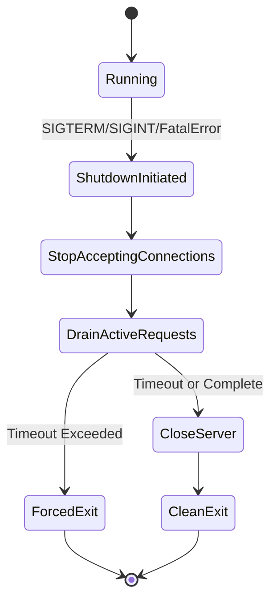
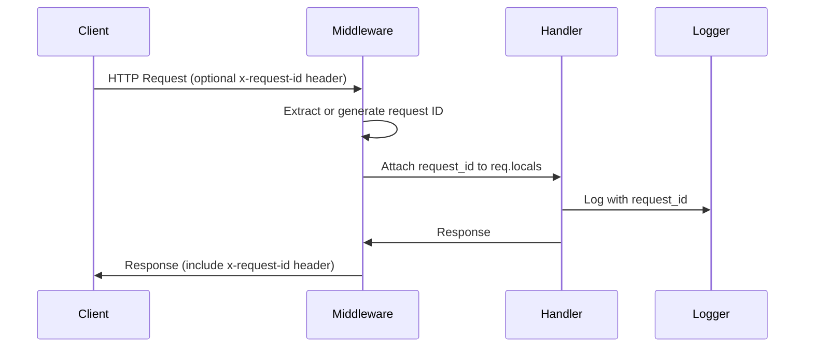

# Local Service Resilience and Observability Design

## Overview

Transform the ADAPT TypeScript/Node.js local service into a resilient, self-healing system with comprehensive observability capabilities. This design ensures the service remains operational under failure conditions while providing insights into system behavior without modifying any external integration clients (Supabase, SAP, Yandex AI Assistant).

### Scope Constraints

**Strictly Prohibited:**
- NO modifications to external integration client code (Supabase, SAP, Yandex AI Assistant)
- NO changes to integration method signatures, base URLs, or call patterns
- NO refactoring of business logic (course generation, question generation)
- NO alterations to integration invocation patterns

**Permitted:**
- Infrastructure-level error handling wrappers (middleware/handlers)
- Global process-level error handlers
- Observability instrumentation at middleware layer
- Health check endpoints
- Graceful shutdown mechanisms
- Containerization infrastructure

## Strategic Objectives

### Definition of Done

1. **Process Resilience**: Service recovers from typical runtime errors without process crashes
2. **Health Monitoring**: System provides health and readiness indicators
3. **Graceful Degradation**: Controlled shutdown under SIGTERM/SIGINT
4. **Observability**: Structured logging with request correlation
5. **Containerization**: Docker-based deployment with auto-restart
6. **Documentation**: Clear local development and deployment guidance

## Architecture Components

### 1. Global Error Recovery System

#### Purpose
Prevent process crashes from unhandled rejections and uncaught exceptions while maintaining service availability.

#### Process-Level Handlers

**Unhandled Promise Rejection Handler**
- Captures: Promise rejections not caught by application code
- Behavior: Log full error context, initiate graceful shutdown
- Rationale: Unhandled rejections indicate serious logic errors requiring restart

**Uncaught Exception Handler**
- Captures: Synchronous exceptions escaping all try-catch blocks
- Behavior: Log stack trace, initiate immediate graceful shutdown
- Rationale: Process state may be corrupted; safe restart required

#### Graceful Shutdown Flow



**Shutdown Parameters**
- Default timeout: 10 seconds (configurable via SHUTDOWN_TIMEOUT_MS)
- Actions during shutdown:
  1. Set readiness flag to false (readyz returns 503)
  2. Stop accepting new connections
  3. Wait for active requests to complete or timeout
  4. Close HTTP server
  5. Exit process with code 0 (clean) or 1 (forced)

### 2. Request-Level Error Handling

#### HTTP Error Handler Middleware

**Purpose**: Catch all errors thrown in request handlers and return consistent JSON error responses.

**Error Response Contract**

| Field | Type | Description |
|-------|------|-------------|
| error.code | string | Machine-readable error code (e.g., INTERNAL_ERROR, VALIDATION_ERROR) |
| error.message | string | Human-readable error description (sanitized) |
| error.request_id | string | Correlation ID for request tracing |

**Security Rules**
- Stack traces: Logged internally, NEVER exposed in HTTP response
- Internal error details: Sanitized before client response
- Request correlation: Always include request_id in error response

**HTTP Status Code Mapping**

| Error Type | HTTP Status | Error Code |
|------------|-------------|------------|
| Validation errors (Zod) | 400 | VALIDATION_ERROR |
| Authentication failures | 401 | UNAUTHORIZED |
| Authorization failures | 403 | FORBIDDEN |
| Resource not found | 404 | NOT_FOUND |
| Unhandled exceptions | 500 | INTERNAL_ERROR |
| Integration timeouts | 504 | GATEWAY_TIMEOUT |

### 3. Request Tracing System

#### Request ID Correlation

**Purpose**: Enable end-to-end request tracking across logs for debugging and incident investigation.

**Request ID Flow**



**Implementation Strategy**
- Check incoming `x-request-id` header
- If absent, generate using `crypto.randomUUID()` (fast, non-blocking)
- Store in `req.locals.requestId` or equivalent context storage
- Echo back in response header `x-request-id`
- Include in all log entries for that request

#### Request Logging Middleware

**Logged Attributes**

| Attribute | Description | Example |
|-----------|-------------|---------|
| request_id | Correlation identifier | "a3f2e1c4-..." |
| method | HTTP method | "POST" |
| path | Request path | "/api/courses" |
| status | Response status code | 200 |
| duration_ms | Request processing time | 342 |
| user_id | Authenticated user (if available) | 123 |
| error | Error code (if applicable) | "VALIDATION_ERROR" |

**Log Level Rules**
- 2xx responses: info level
- 4xx responses: warn level
- 5xx responses: error level
- Duration > 5s: warn level (performance concern)

### 4. Structured Logging System

#### Logging Technology

**Recommended Library**: Pino
- Rationale: Fastest JSON logger for Node.js, minimal overhead
- Output format: JSON lines (newline-delimited JSON)
- Asynchronous: Non-blocking I/O for log writes

#### Log Structure Contract

**Standard Log Entry Schema**

| Field | Type | Required | Description |
|-------|------|----------|-------------|
| timestamp | ISO8601 | Yes | Event timestamp |
| level | string | Yes | Severity: trace, debug, info, warn, error, fatal |
| msg | string | Yes | Human-readable message |
| request_id | string | Conditional | Present for request-scoped logs |
| context | string | Yes | Log source (e.g., "server", "course-gen", "db") |
| error | object | Conditional | Error details (message, stack, code) |
| duration_ms | number | Conditional | Operation duration |
| http | object | Conditional | HTTP request/response metadata |

**Example Log Entries**

Server startup:
```json
{
  "timestamp": "2026-01-24T18:15:00.123Z",
  "level": "info",
  "msg": "Server listening on port 5000",
  "context": "server",
  "port": 5000,
  "host": "0.0.0.0"
}
```

Request completion:
```json
{
  "timestamp": "2026-01-24T18:15:05.456Z",
  "level": "info",
  "msg": "Request completed",
  "context": "http",
  "request_id": "a3f2e1c4-b5d6-7e8f-9a0b-1c2d3e4f5a6b",
  "http": {
    "method": "POST",
    "path": "/api/courses",
    "status": 201,
    "duration_ms": 342
  }
}
```

Error:
```json
{
  "timestamp": "2026-01-24T18:15:10.789Z",
  "level": "error",
  "msg": "Course generation failed",
  "context": "course-gen",
  "request_id": "b4c3d2e1-f6a7-8b9c-0d1e-2f3a4b5c6d7e",
  "error": {
    "message": "LLM response validation failed",
    "code": "VALIDATION_ERROR",
    "stack": "Error: LLM response validation failed\n    at ..."
  }
}
```

#### Configuration via Environment

| Variable | Default | Description |
|----------|---------|-------------|
| LOG_LEVEL | info | Minimum log level (trace, debug, info, warn, error, fatal) |
| LOG_PRETTY | false | Enable pretty-printing for local dev (not recommended for production) |

### 5. Health Check Endpoints

#### GET /healthz (Liveness Probe)

**Purpose**: Indicates whether the process is alive and should remain running.

**Response Contract**

Success (200 OK):
```json
{
  "ok": true,
  "uptime_seconds": 3425,
  "timestamp": "2026-01-24T18:15:00.000Z"
}
```

**Behavior**
- Always returns 200 if process is running
- Does NOT check external dependencies
- Used by container orchestration to detect crashed processes
- Response time: < 10ms (no I/O operations)

#### GET /readyz (Readiness Probe)

**Purpose**: Indicates whether the service is ready to accept traffic.

**Response Contract**

Ready (200 OK):
```json
{
  "ready": true,
  "timestamp": "2026-01-24T18:15:00.000Z"
}
```

Not Ready (503 Service Unavailable):
```json
{
  "ready": false,
  "reason": "Server is shutting down",
  "timestamp": "2026-01-24T18:15:00.000Z"
}
```

**State Transitions**

| State | Readiness | Reason |
|-------|-----------|--------|
| Initial boot | false | "Initializing dependencies" |
| After server.listen() | true | - |
| During graceful shutdown | false | "Server is shutting down" |

**Implementation Strategy**
- Maintain boolean flag `isReady` in module scope
- Set to `false` initially
- Set to `true` after successful `httpServer.listen()` callback
- Set to `false` when graceful shutdown begins
- NO external dependency checks (Supabase, Yandex, etc.)

### 6. Configuration Management

#### Environment Variables Schema

| Variable | Required | Default | Description |
|----------|----------|---------|-------------|
| PORT | No | 5000 | HTTP server port |
| HOST | No | 0.0.0.0 | HTTP server bind address |
| NODE_ENV | No | development | Environment mode |
| LOG_LEVEL | No | info | Logging verbosity |
| LOG_PRETTY | No | false | Pretty-print logs |
| SHUTDOWN_TIMEOUT_MS | No | 10000 | Graceful shutdown timeout |
| DATABASE_URL | Yes | - | PostgreSQL connection string (existing) |
| SESSION_SECRET | Yes | - | Session signing key (existing) |
| YANDEX_* | No | - | Yandex AI integration (existing) |

**Configuration Loading Strategy**
- Use existing environment variable pattern
- Add validation for new resilience parameters
- Provide sensible defaults for all optional values
- Log configuration on startup (mask secrets)

## Containerization Architecture

### 7. Docker Multi-Stage Build

#### Build Strategy

**Stage 1: Dependency Installation**
- Base image: node:20-alpine
- Copy: package.json, package-lock.json
- Action: npm ci --only=production
- Output: node_modules with production dependencies only

**Stage 2: Build Artifacts**
- Base image: node:20-alpine
- Copy: All source code, tsconfig.json, build scripts
- Action: npm run build
- Output: Compiled dist/index.cjs and dist/public

**Stage 3: Runtime**
- Base image: node:20-alpine
- Copy: node_modules (from stage 1), dist (from stage 2)
- User: node (non-root for security)
- Health check: curl http://localhost:${PORT}/healthz
- Entry point: node dist/index.cjs

#### Dockerfile Structure Pattern

```
# Stage 1: Dependencies
FROM node:20-alpine AS deps
WORKDIR /app
COPY package*.json ./
RUN npm ci --only=production

# Stage 2: Build
FROM node:20-alpine AS builder
WORKDIR /app
COPY package*.json ./
RUN npm ci
COPY . .
RUN npm run build

# Stage 3: Runtime
FROM node:20-alpine AS runtime
RUN apk add --no-cache curl
WORKDIR /app
COPY --from=deps /app/node_modules ./node_modules
COPY --from=builder /app/dist ./dist
USER node
EXPOSE ${PORT}
HEALTHCHECK --interval=30s --timeout=3s --start-period=5s --retries=3 \
  CMD curl -f http://localhost:${PORT}/healthz || exit 1
CMD ["node", "dist/index.cjs"]
```

### 8. Docker Compose Configuration

#### Service Definition

**Restart Policy**: `unless-stopped`
- Rationale: Auto-restart on crashes, but respect manual stops

**Health Check**
- Test: curl http://localhost:${PORT}/healthz
- Interval: 30 seconds
- Timeout: 3 seconds
- Start period: 5 seconds (grace period for startup)
- Retries: 3

**Logging Configuration**

| Parameter | Value | Rationale |
|-----------|-------|-----------|
| driver | json-file | Standard Docker logging |
| max-size | 10m | Prevent unbounded log growth |
| max-file | 3 | Keep last 30MB of logs |

**Environment Management**
- Use `env_file: .env` for local development
- Override specific variables in docker-compose.yml if needed
- Never commit .env file (use .env.example as template)

**Port Binding**
- Map container port to host: `${PORT}:${PORT}`
- Allow configuration via .env

#### Docker Compose Structure Pattern

```yaml
version: '3.8'
services:
  adapt-app:
    build:
      context: .
      dockerfile: Dockerfile
    restart: unless-stopped
    ports:
      - "${PORT:-5000}:${PORT:-5000}"
    env_file:
      - .env
    environment:
      - NODE_ENV=production
    healthcheck:
      test: ["CMD", "curl", "-f", "http://localhost:${PORT}/healthz"]
      interval: 30s
      timeout: 3s
      retries: 3
      start_period: 5s
    logging:
      driver: "json-file"
      options:
        max-size: "10m"
        max-file: "3"
```

### 9. Docker Ignore Configuration

**Exclusion Categories**

**Development artifacts:**
- node_modules (rebuilt in container)
- dist (rebuilt in container)
- .vite cache directories

**Version control:**
- .git directory and .gitignore

**Environment files:**
- .env (injected at runtime)
- .env.local, .env.*.local

**IDE and OS files:**
- .vscode, .idea
- .DS_Store, Thumbs.db

**Documentation and metadata:**
- *.md (except critical deployment docs if needed)
- logs directory

## Implementation Roadmap

### Phase 1: Core Resilience Infrastructure

**Files to Create:**
- `server/lib/logger.ts` - Pino logger singleton
- `server/lib/shutdown.ts` - Graceful shutdown orchestration
- `server/middleware/request-id.ts` - Request ID generation/extraction
- `server/middleware/request-logger.ts` - HTTP request logging
- `server/middleware/error-handler.ts` - Global error handler

**Files to Modify:**
- `server/index.ts` - Integration of all resilience components

**Changes to server/index.ts:**
1. Replace console.log calls with structured logger
2. Add process-level error handlers (unhandledRejection, uncaughtException)
3. Add signal handlers (SIGTERM, SIGINT)
4. Integrate request-id middleware early in stack
5. Integrate request-logger middleware after request-id
6. Integrate error-handler middleware after all routes
7. Implement readiness flag management
8. Add /healthz and /readyz endpoints before route registration

### Phase 2: Health and Observability Endpoints

**Implementation Details:**

**Readiness State Management:**
- Global variable: `let isReady = false;`
- Set true after `httpServer.listen()` callback
- Set false on shutdown initiation

**Health Check Routes:**
- Mount at application level (not within /api prefix)
- No authentication required
- Minimal response time requirements

### Phase 3: Containerization

**Files to Create:**
- `Dockerfile` - Multi-stage build configuration
- `docker-compose.yml` - Local development orchestration
- `.dockerignore` - Build context exclusions
- `docs/LOCAL_RUN.md` - Deployment and operation guide

**Configuration Updates:**
- Extend `.env.example` with new resilience variables
- Add docker-related npm scripts to package.json

**Docker Build Validation:**
- Ensure build completes without errors
- Verify healthcheck endpoint accessibility
- Test restart behavior on crash simulation

### Phase 4: Documentation and Testing

**Documentation Requirements:**

**docs/LOCAL_RUN.md sections:**
1. Prerequisites (Node.js version, Docker version)
2. Local development without Docker (npm run dev)
3. Local development with Docker (docker compose up)
4. Health check verification (curl examples)
5. Log viewing (docker logs commands)
6. Troubleshooting common issues

**Testing Checklist:**
- [ ] Process survives unhandled promise rejection
- [ ] Process survives uncaught exception
- [ ] Graceful shutdown completes within timeout
- [ ] /healthz returns 200 when alive
- [ ] /readyz returns 503 during shutdown
- [ ] Request IDs propagate through logs
- [ ] Error responses include request_id
- [ ] Docker healthcheck detects crashed process
- [ ] Container auto-restarts on failure
- [ ] Logs rotate properly under load

## Integration Points (No Modifications)

The following integration areas remain UNCHANGED:

**Database Layer (server/db.ts):**
- PostgreSQL connection via Drizzle ORM
- Connection string from DATABASE_URL
- No retry logic changes
- No connection pool modifications

**Yandex AI Integration (server/ai/yandex-client.ts):**
- API endpoint URLs unchanged
- Method signatures unchanged
- Timeout configuration unchanged
- Error handling at boundaries only (wrapper logs, no behavioral changes)

**Supabase Integration:**
- Authentication flows unchanged
- Database queries unchanged
- No client configuration modifications

**Course Generation Logic (server/ai/course-gen-v2.ts):**
- Business logic unchanged
- Prompt generation unchanged
- Validation schemas unchanged
- Only: Enhanced error logging if generation fails (wrapper level)

## Operational Procedures

### Local Development Workflow

**Without Docker:**
1. Install dependencies: `npm install`
2. Copy environment template: `cp .env.example .env`
3. Configure environment variables in .env
4. Run development server: `npm run dev`
5. Verify health: `curl http://localhost:5000/healthz`

**With Docker:**
1. Copy environment template: `cp .env.example .env`
2. Configure environment variables in .env
3. Build and start: `docker compose up --build`
4. Verify health: `curl http://localhost:5000/healthz`
5. View logs: `docker compose logs -f adapt-app`
6. Stop: `docker compose down`

### Health Monitoring

**Check Service Liveness:**
```bash
curl http://localhost:5000/healthz
# Expected: {"ok":true,"uptime_seconds":123,"timestamp":"..."}
```

**Check Service Readiness:**
```bash
curl http://localhost:5000/readyz
# Expected: {"ready":true,"timestamp":"..."}
```

**Trigger Graceful Shutdown:**
```bash
docker compose stop
# Observe logs for graceful shutdown sequence
```

### Log Analysis

**View Real-Time Logs:**
```bash
docker compose logs -f adapt-app
```

**Search Logs by Request ID:**
```bash
docker compose logs adapt-app | grep "request_id\":\"a3f2e1c4"
```

**Filter Error-Level Logs:**
```bash
docker compose logs adapt-app | grep '"level":"error"'
```

## Success Metrics

**Resilience Indicators:**
- Zero process crashes from unhandled errors (target: 100%)
- Successful graceful shutdowns (target: 100%)
- Health check response time < 10ms (target: 99th percentile)

**Observability Indicators:**
- All requests have unique request_id (target: 100%)
- Error logs include stack traces (target: 100%)
- Request duration logged for all endpoints (target: 100%)

**Operational Indicators:**
- Container restart count per day (target: < 3 under normal load)
- Time to detect crashed process (target: < 30 seconds via healthcheck)
- Average recovery time from crash (target: < 10 seconds)

## Risk Mitigation

### Risk: Increased Latency from Logging

**Mitigation:**
- Use asynchronous logging (Pino default)
- Minimize log volume in hot paths
- Implement log sampling if needed (REQUEST_LOG_SAMPLE env var)

### Risk: Shutdown Timeout Too Short

**Mitigation:**
- Configurable SHUTDOWN_TIMEOUT_MS
- Default 10s should accommodate most requests
- Monitor "forced shutdown" occurrences in logs

### Risk: Health Check False Positives

**Mitigation:**
- /healthz only checks process liveness (minimal failure cases)
- /readyz reflects actual traffic readiness
- Container orchestration uses both probes appropriately

### Risk: Log Volume Explosion

**Mitigation:**
- Docker log rotation (max-size: 10m, max-file: 3)
- Configurable LOG_LEVEL to reduce verbosity
- Sample high-frequency logs if needed

## Non-Functional Requirements

**Performance:**
- Middleware overhead: < 1ms per request (p99)
- Health check latency: < 10ms (p99)
- Graceful shutdown: < configured timeout (default 10s)

**Security:**
- No stack traces in HTTP responses
- No secret leakage in logs (mask DATABASE_URL, API keys)
- Run container as non-root user (node)

**Maintainability:**
- All resilience code isolated in server/lib and server/middleware
- No mixed concerns with business logic
- Easily removable if requirements change

**Compatibility:**
- Node.js 20.x LTS
- Docker Engine 20.x+
- Docker Compose 2.x+
- Alpine Linux base image (minimal footprint)

## Future Enhancements (Out of Scope)

**Not included in this design but possible future work:**
- Prometheus /metrics endpoint for quantitative monitoring
- Distributed tracing (OpenTelemetry integration)
- Circuit breakers for external integrations
- Advanced retry strategies with exponential backoff
- Request rate limiting per user
- APM agent integration (Datadog, New Relic)

**Unhandled Promise Rejection Handler**
- Captures: Promise rejections not caught by application code
- Behavior: Log full error context, initiate graceful shutdown
- Rationale: Unhandled rejections indicate serious logic errors requiring restart

**Uncaught Exception Handler**
- Captures: Synchronous exceptions escaping all try-catch blocks
- Behavior: Log stack trace, initiate immediate graceful shutdown
- Rationale: Process state may be corrupted; safe restart required

#### Graceful Shutdown Flow


**Shutdown Parameters**
- Default timeout: 10 seconds (configurable via SHUTDOWN_TIMEOUT_MS)
- Actions during shutdown:
  1. Set readiness flag to false (readyz returns 503)
  2. Stop accepting new connections
  3. Wait for active requests to complete or timeout
  4. Close HTTP server
  5. Exit process with code 0 (clean) or 1 (forced)

### 2. Request-Level Error Handling

#### HTTP Error Handler Middleware

**Purpose**: Catch all errors thrown in request handlers and return consistent JSON error responses.

**Error Response Contract**

| Field | Type | Description |
|-------|------|-------------|
| error.code | string | Machine-readable error code (e.g., INTERNAL_ERROR, VALIDATION_ERROR) |
| error.message | string | Human-readable error description (sanitized) |
| error.request_id | string | Correlation ID for request tracing |

**Security Rules**
- Stack traces: Logged internally, NEVER exposed in HTTP response
- Internal error details: Sanitized before client response
- Request correlation: Always include request_id in error response

**HTTP Status Code Mapping**

| Error Type | HTTP Status | Error Code |
|------------|-------------|------------|
| Validation errors (Zod) | 400 | VALIDATION_ERROR |
| Authentication failures | 401 | UNAUTHORIZED |
| Authorization failures | 403 | FORBIDDEN |
| Resource not found | 404 | NOT_FOUND |
| Unhandled exceptions | 500 | INTERNAL_ERROR |
| Integration timeouts | 504 | GATEWAY_TIMEOUT |

### 3. Request Tracing System

#### Request ID Correlation

**Purpose**: Enable end-to-end request tracking across logs for debugging and incident investigation.

**Request ID Flow**


**Implementation Strategy**
- Check incoming `x-request-id` header
- If absent, generate using `crypto.randomUUID()` (fast, non-blocking)
- Store in `req.locals.requestId` or equivalent context storage
- Echo back in response header `x-request-id`
- Include in all log entries for that request

#### Request Logging Middleware

**Logged Attributes**

| Attribute | Description | Example |
|-----------|-------------|---------|
| request_id | Correlation identifier | "a3f2e1c4-..." |
| method | HTTP method | "POST" |
| path | Request path | "/api/courses" |
| status | Response status code | 200 |
| duration_ms | Request processing time | 342 |
| user_id | Authenticated user (if available) | 123 |
| error | Error code (if applicable) | "VALIDATION_ERROR" |

**Log Level Rules**
- 2xx responses: info level
- 4xx responses: warn level
- 5xx responses: error level
- Duration > 5s: warn level (performance concern)

### 4. Structured Logging System

#### Logging Technology

**Recommended Library**: Pino
- Rationale: Fastest JSON logger for Node.js, minimal overhead
- Output format: JSON lines (newline-delimited JSON)
- Asynchronous: Non-blocking I/O for log writes

#### Log Structure Contract

**Standard Log Entry Schema**

| Field | Type | Required | Description |
|-------|------|----------|-------------|
| timestamp | ISO8601 | Yes | Event timestamp |
| level | string | Yes | Severity: trace, debug, info, warn, error, fatal |
| msg | string | Yes | Human-readable message |
| request_id | string | Conditional | Present for request-scoped logs |
| context | string | Yes | Log source (e.g., "server", "course-gen", "db") |
| error | object | Conditional | Error details (message, stack, code) |
| duration_ms | number | Conditional | Operation duration |
| http | object | Conditional | HTTP request/response metadata |

**Example Log Entries**

Server startup:
```json
{
  "timestamp": "2026-01-24T18:15:00.123Z",
  "level": "info",
  "msg": "Server listening on port 5000",
  "context": "server",
  "port": 5000,
  "host": "0.0.0.0"
}
```

Request completion:
```json
{
  "timestamp": "2026-01-24T18:15:05.456Z",
  "level": "info",
  "msg": "Request completed",
  "context": "http",
  "request_id": "a3f2e1c4-b5d6-7e8f-9a0b-1c2d3e4f5a6b",
  "http": {
    "method": "POST",
    "path": "/api/courses",
    "status": 201,
    "duration_ms": 342
  }
}
```

Error:
```json
{
  "timestamp": "2026-01-24T18:15:10.789Z",
  "level": "error",
  "msg": "Course generation failed",
  "context": "course-gen",
  "request_id": "b4c3d2e1-f6a7-8b9c-0d1e-2f3a4b5c6d7e",
  "error": {
    "message": "LLM response validation failed",
    "code": "VALIDATION_ERROR",
    "stack": "Error: LLM response validation failed\n    at ..."
  }
}
```

#### Configuration via Environment

| Variable | Default | Description |
|----------|---------|-------------|
| LOG_LEVEL | info | Minimum log level (trace, debug, info, warn, error, fatal) |
| LOG_PRETTY | false | Enable pretty-printing for local dev (not recommended for production) |

### 5. Health Check Endpoints

#### GET /healthz (Liveness Probe)

**Purpose**: Indicates whether the process is alive and should remain running.

**Response Contract**

Success (200 OK):
```json
{
  "ok": true,
  "uptime_seconds": 3425,
  "timestamp": "2026-01-24T18:15:00.000Z"
}
```

**Behavior**
- Always returns 200 if process is running
- Does NOT check external dependencies
- Used by container orchestration to detect crashed processes
- Response time: < 10ms (no I/O operations)

#### GET /readyz (Readiness Probe)

**Purpose**: Indicates whether the service is ready to accept traffic.

**Response Contract**

Ready (200 OK):
```json
{
  "ready": true,
  "timestamp": "2026-01-24T18:15:00.000Z"
}
```

Not Ready (503 Service Unavailable):
```json
{
  "ready": false,
  "reason": "Server is shutting down",
  "timestamp": "2026-01-24T18:15:00.000Z"
}
```

**State Transitions**

| State | Readiness | Reason |
|-------|-----------|--------|
| Initial boot | false | "Initializing dependencies" |
| After server.listen() | true | - |
| During graceful shutdown | false | "Server is shutting down" |

**Implementation Strategy**
- Maintain boolean flag `isReady` in module scope
- Set to `false` initially
- Set to `true` after successful `httpServer.listen()` callback
- Set to `false` when graceful shutdown begins
- NO external dependency checks (Supabase, Yandex, etc.)

### 6. Configuration Management

#### Environment Variables Schema

| Variable | Required | Default | Description |
|----------|----------|---------|-------------|
| PORT | No | 5000 | HTTP server port |
| HOST | No | 0.0.0.0 | HTTP server bind address |
| NODE_ENV | No | development | Environment mode |
| LOG_LEVEL | No | info | Logging verbosity |
| LOG_PRETTY | No | false | Pretty-print logs |
| SHUTDOWN_TIMEOUT_MS | No | 10000 | Graceful shutdown timeout |
| DATABASE_URL | Yes | - | PostgreSQL connection string (existing) |
| SESSION_SECRET | Yes | - | Session signing key (existing) |
| YANDEX_* | No | - | Yandex AI integration (existing) |

**Configuration Loading Strategy**
- Use existing environment variable pattern
- Add validation for new resilience parameters
- Provide sensible defaults for all optional values
- Log configuration on startup (mask secrets)

## Containerization Architecture

### 7. Docker Multi-Stage Build

#### Build Strategy

**Stage 1: Dependency Installation**
- Base image: node:20-alpine
- Copy: package.json, package-lock.json
- Action: npm ci --only=production
- Output: node_modules with production dependencies only

**Stage 2: Build Artifacts**
- Base image: node:20-alpine
- Copy: All source code, tsconfig.json, build scripts
- Action: npm run build
- Output: Compiled dist/index.cjs and dist/public

**Stage 3: Runtime**
- Base image: node:20-alpine
- Copy: node_modules (from stage 1), dist (from stage 2)
- User: node (non-root for security)
- Health check: curl http://localhost:${PORT}/healthz
- Entry point: node dist/index.cjs

#### Dockerfile Structure Pattern

```
# Stage 1: Dependencies
FROM node:20-alpine AS deps
WORKDIR /app
COPY package*.json ./
RUN npm ci --only=production

# Stage 2: Build
FROM node:20-alpine AS builder
WORKDIR /app
COPY package*.json ./
RUN npm ci
COPY . .
RUN npm run build

# Stage 3: Runtime
FROM node:20-alpine AS runtime
RUN apk add --no-cache curl
WORKDIR /app
COPY --from=deps /app/node_modules ./node_modules
COPY --from=builder /app/dist ./dist
USER node
EXPOSE ${PORT}
HEALTHCHECK --interval=30s --timeout=3s --start-period=5s --retries=3 \
  CMD curl -f http://localhost:${PORT}/healthz || exit 1
CMD ["node", "dist/index.cjs"]
```

### 8. Docker Compose Configuration

#### Service Definition

**Restart Policy**: `unless-stopped`
- Rationale: Auto-restart on crashes, but respect manual stops

**Health Check**
- Test: curl http://localhost:${PORT}/healthz
- Interval: 30 seconds
- Timeout: 3 seconds
- Start period: 5 seconds (grace period for startup)
- Retries: 3

**Logging Configuration**

| Parameter | Value | Rationale |
|-----------|-------|-----------|
| driver | json-file | Standard Docker logging |
| max-size | 10m | Prevent unbounded log growth |
| max-file | 3 | Keep last 30MB of logs |

**Environment Management**
- Use `env_file: .env` for local development
- Override specific variables in docker-compose.yml if needed
- Never commit .env file (use .env.example as template)

**Port Binding**
- Map container port to host: `${PORT}:${PORT}`
- Allow configuration via .env

#### Docker Compose Structure Pattern

```yaml
version: '3.8'
services:
  adapt-app:
    build:
      context: .
      dockerfile: Dockerfile
    restart: unless-stopped
    ports:
      - "${PORT:-5000}:${PORT:-5000}"
    env_file:
      - .env
    environment:
      - NODE_ENV=production
    healthcheck:
      test: ["CMD", "curl", "-f", "http://localhost:${PORT}/healthz"]
      interval: 30s
      timeout: 3s
      retries: 3
      start_period: 5s
    logging:
      driver: "json-file"
      options:
        max-size: "10m"
        max-file: "3"
```

### 9. Docker Ignore Configuration

**Exclusion Categories**

**Development artifacts:**
- node_modules (rebuilt in container)
- dist (rebuilt in container)
- .vite cache directories

**Version control:**
- .git directory and .gitignore

**Environment files:**
- .env (injected at runtime)
- .env.local, .env.*.local

**IDE and OS files:**
- .vscode, .idea
- .DS_Store, Thumbs.db

**Documentation and metadata:**
- *.md (except critical deployment docs if needed)
- logs directory

## Implementation Roadmap

### Phase 1: Core Resilience Infrastructure

**Files to Create:**
- `server/lib/logger.ts` - Pino logger singleton
- `server/lib/shutdown.ts` - Graceful shutdown orchestration
- `server/middleware/request-id.ts` - Request ID generation/extraction
- `server/middleware/request-logger.ts` - HTTP request logging
- `server/middleware/error-handler.ts` - Global error handler

**Files to Modify:**
- `server/index.ts` - Integration of all resilience components

**Changes to server/index.ts:**
1. Replace console.log calls with structured logger
2. Add process-level error handlers (unhandledRejection, uncaughtException)
3. Add signal handlers (SIGTERM, SIGINT)
4. Integrate request-id middleware early in stack
5. Integrate request-logger middleware after request-id
6. Integrate error-handler middleware after all routes
7. Implement readiness flag management
8. Add /healthz and /readyz endpoints before route registration

### Phase 2: Health and Observability Endpoints

**Implementation Details:**

**Readiness State Management:**
- Global variable: `let isReady = false;`
- Set true after `httpServer.listen()` callback
- Set false on shutdown initiation

**Health Check Routes:**
- Mount at application level (not within /api prefix)
- No authentication required
- Minimal response time requirements

### Phase 3: Containerization

**Files to Create:**
- `Dockerfile` - Multi-stage build configuration
- `docker-compose.yml` - Local development orchestration
- `.dockerignore` - Build context exclusions
- `docs/LOCAL_RUN.md` - Deployment and operation guide

**Configuration Updates:**
- Extend `.env.example` with new resilience variables
- Add docker-related npm scripts to package.json

**Docker Build Validation:**
- Ensure build completes without errors
- Verify healthcheck endpoint accessibility
- Test restart behavior on crash simulation

### Phase 4: Documentation and Testing

**Documentation Requirements:**

**docs/LOCAL_RUN.md sections:**
1. Prerequisites (Node.js version, Docker version)
2. Local development without Docker (npm run dev)
3. Local development with Docker (docker compose up)
4. Health check verification (curl examples)
5. Log viewing (docker logs commands)
6. Troubleshooting common issues

**Testing Checklist:**
- [ ] Process survives unhandled promise rejection
- [ ] Process survives uncaught exception
- [ ] Graceful shutdown completes within timeout
- [ ] /healthz returns 200 when alive
- [ ] /readyz returns 503 during shutdown
- [ ] Request IDs propagate through logs
- [ ] Error responses include request_id
- [ ] Docker healthcheck detects crashed process
- [ ] Container auto-restarts on failure
- [ ] Logs rotate properly under load

## Integration Points (No Modifications)

The following integration areas remain UNCHANGED:

**Database Layer (server/db.ts):**
- PostgreSQL connection via Drizzle ORM
- Connection string from DATABASE_URL
- No retry logic changes
- No connection pool modifications

**Yandex AI Integration (server/ai/yandex-client.ts):**
- API endpoint URLs unchanged
- Method signatures unchanged
- Timeout configuration unchanged
- Error handling at boundaries only (wrapper logs, no behavioral changes)

**Supabase Integration:**
- Authentication flows unchanged
- Database queries unchanged
- No client configuration modifications

**Course Generation Logic (server/ai/course-gen-v2.ts):**
- Business logic unchanged
- Prompt generation unchanged
- Validation schemas unchanged
- Only: Enhanced error logging if generation fails (wrapper level)

## Operational Procedures

### Local Development Workflow

**Without Docker:**
1. Install dependencies: `npm install`
2. Copy environment template: `cp .env.example .env`
3. Configure environment variables in .env
4. Run development server: `npm run dev`
5. Verify health: `curl http://localhost:5000/healthz`

**With Docker:**
1. Copy environment template: `cp .env.example .env`
2. Configure environment variables in .env
3. Build and start: `docker compose up --build`
4. Verify health: `curl http://localhost:5000/healthz`
5. View logs: `docker compose logs -f adapt-app`
6. Stop: `docker compose down`

### Health Monitoring

**Check Service Liveness:**
```bash
curl http://localhost:5000/healthz
# Expected: {"ok":true,"uptime_seconds":123,"timestamp":"..."}
```

**Check Service Readiness:**
```bash
curl http://localhost:5000/readyz
# Expected: {"ready":true,"timestamp":"..."}
```

**Trigger Graceful Shutdown:**
```bash
docker compose stop
# Observe logs for graceful shutdown sequence
```

### Log Analysis

**View Real-Time Logs:**
```bash
docker compose logs -f adapt-app
```

**Search Logs by Request ID:**
```bash
docker compose logs adapt-app | grep "request_id\":\"a3f2e1c4"
```

**Filter Error-Level Logs:**
```bash
docker compose logs adapt-app | grep '"level":"error"'
```

## Success Metrics

**Resilience Indicators:**
- Zero process crashes from unhandled errors (target: 100%)
- Successful graceful shutdowns (target: 100%)
- Health check response time < 10ms (target: 99th percentile)

**Observability Indicators:**
- All requests have unique request_id (target: 100%)
- Error logs include stack traces (target: 100%)
- Request duration logged for all endpoints (target: 100%)

**Operational Indicators:**
- Container restart count per day (target: < 3 under normal load)
- Time to detect crashed process (target: < 30 seconds via healthcheck)
- Average recovery time from crash (target: < 10 seconds)

## Risk Mitigation

### Risk: Increased Latency from Logging

**Mitigation:**
- Use asynchronous logging (Pino default)
- Minimize log volume in hot paths
- Implement log sampling if needed (REQUEST_LOG_SAMPLE env var)

### Risk: Shutdown Timeout Too Short

**Mitigation:**
- Configurable SHUTDOWN_TIMEOUT_MS
- Default 10s should accommodate most requests
- Monitor "forced shutdown" occurrences in logs

### Risk: Health Check False Positives

**Mitigation:**
- /healthz only checks process liveness (minimal failure cases)
- /readyz reflects actual traffic readiness
- Container orchestration uses both probes appropriately

### Risk: Log Volume Explosion

**Mitigation:**
- Docker log rotation (max-size: 10m, max-file: 3)
- Configurable LOG_LEVEL to reduce verbosity
- Sample high-frequency logs if needed

## Non-Functional Requirements

**Performance:**
- Middleware overhead: < 1ms per request (p99)
- Health check latency: < 10ms (p99)
- Graceful shutdown: < configured timeout (default 10s)

**Security:**
- No stack traces in HTTP responses
- No secret leakage in logs (mask DATABASE_URL, API keys)
- Run container as non-root user (node)

**Maintainability:**
- All resilience code isolated in server/lib and server/middleware
- No mixed concerns with business logic
- Easily removable if requirements change

**Compatibility:**
- Node.js 20.x LTS
- Docker Engine 20.x+
- Docker Compose 2.x+
- Alpine Linux base image (minimal footprint)

## Future Enhancements (Out of Scope)

**Not included in this design but possible future work:**
- Prometheus /metrics endpoint for quantitative monitoring
- Distributed tracing (OpenTelemetry integration)
- Circuit breakers for external integrations
- Advanced retry strategies with exponential backoff
- Request rate limiting per user
- APM agent integration (Datadog, New Relic)

**Unhandled Promise Rejection Handler**
- Captures: Promise rejections not caught by application code
- Behavior: Log full error context, initiate graceful shutdown
- Rationale: Unhandled rejections indicate serious logic errors requiring restart

**Uncaught Exception Handler**
- Captures: Synchronous exceptions escaping all try-catch blocks
- Behavior: Log stack trace, initiate immediate graceful shutdown
- Rationale: Process state may be corrupted; safe restart required

#### Graceful Shutdown Flow


**Shutdown Parameters**
- Default timeout: 10 seconds (configurable via SHUTDOWN_TIMEOUT_MS)
- Actions during shutdown:
  1. Set readiness flag to false (readyz returns 503)
  2. Stop accepting new connections
  3. Wait for active requests to complete or timeout
  4. Close HTTP server
  5. Exit process with code 0 (clean) or 1 (forced)

### 2. Request-Level Error Handling

#### HTTP Error Handler Middleware

**Purpose**: Catch all errors thrown in request handlers and return consistent JSON error responses.

**Error Response Contract**

| Field | Type | Description |
|-------|------|-------------|
| error.code | string | Machine-readable error code (e.g., INTERNAL_ERROR, VALIDATION_ERROR) |
| error.message | string | Human-readable error description (sanitized) |
| error.request_id | string | Correlation ID for request tracing |

**Security Rules**
- Stack traces: Logged internally, NEVER exposed in HTTP response
- Internal error details: Sanitized before client response
- Request correlation: Always include request_id in error response

**HTTP Status Code Mapping**

| Error Type | HTTP Status | Error Code |
|------------|-------------|------------|
| Validation errors (Zod) | 400 | VALIDATION_ERROR |
| Authentication failures | 401 | UNAUTHORIZED |
| Authorization failures | 403 | FORBIDDEN |
| Resource not found | 404 | NOT_FOUND |
| Unhandled exceptions | 500 | INTERNAL_ERROR |
| Integration timeouts | 504 | GATEWAY_TIMEOUT |

### 3. Request Tracing System

#### Request ID Correlation

**Purpose**: Enable end-to-end request tracking across logs for debugging and incident investigation.

**Request ID Flow**


**Implementation Strategy**
- Check incoming `x-request-id` header
- If absent, generate using `crypto.randomUUID()` (fast, non-blocking)
- Store in `req.locals.requestId` or equivalent context storage
- Echo back in response header `x-request-id`
- Include in all log entries for that request

#### Request Logging Middleware

**Logged Attributes**

| Attribute | Description | Example |
|-----------|-------------|---------|
| request_id | Correlation identifier | "a3f2e1c4-..." |
| method | HTTP method | "POST" |
| path | Request path | "/api/courses" |
| status | Response status code | 200 |
| duration_ms | Request processing time | 342 |
| user_id | Authenticated user (if available) | 123 |
| error | Error code (if applicable) | "VALIDATION_ERROR" |

**Log Level Rules**
- 2xx responses: info level
- 4xx responses: warn level
- 5xx responses: error level
- Duration > 5s: warn level (performance concern)

### 4. Structured Logging System

#### Logging Technology

**Recommended Library**: Pino
- Rationale: Fastest JSON logger for Node.js, minimal overhead
- Output format: JSON lines (newline-delimited JSON)
- Asynchronous: Non-blocking I/O for log writes

#### Log Structure Contract

**Standard Log Entry Schema**

| Field | Type | Required | Description |
|-------|------|----------|-------------|
| timestamp | ISO8601 | Yes | Event timestamp |
| level | string | Yes | Severity: trace, debug, info, warn, error, fatal |
| msg | string | Yes | Human-readable message |
| request_id | string | Conditional | Present for request-scoped logs |
| context | string | Yes | Log source (e.g., "server", "course-gen", "db") |
| error | object | Conditional | Error details (message, stack, code) |
| duration_ms | number | Conditional | Operation duration |
| http | object | Conditional | HTTP request/response metadata |

**Example Log Entries**

Server startup:
```json
{
  "timestamp": "2026-01-24T18:15:00.123Z",
  "level": "info",
  "msg": "Server listening on port 5000",
  "context": "server",
  "port": 5000,
  "host": "0.0.0.0"
}
```

Request completion:
```json
{
  "timestamp": "2026-01-24T18:15:05.456Z",
  "level": "info",
  "msg": "Request completed",
  "context": "http",
  "request_id": "a3f2e1c4-b5d6-7e8f-9a0b-1c2d3e4f5a6b",
  "http": {
    "method": "POST",
    "path": "/api/courses",
    "status": 201,
    "duration_ms": 342
  }
}
```

Error:
```json
{
  "timestamp": "2026-01-24T18:15:10.789Z",
  "level": "error",
  "msg": "Course generation failed",
  "context": "course-gen",
  "request_id": "b4c3d2e1-f6a7-8b9c-0d1e-2f3a4b5c6d7e",
  "error": {
    "message": "LLM response validation failed",
    "code": "VALIDATION_ERROR",
    "stack": "Error: LLM response validation failed
    at ..."
  }
}
```

#### Configuration via Environment

| Variable | Default | Description |
|----------|---------|-------------|
| LOG_LEVEL | info | Minimum log level (trace, debug, info, warn, error, fatal) |
| LOG_PRETTY | false | Enable pretty-printing for local dev (not recommended for production) |

### 5. Health Check Endpoints

#### GET /healthz (Liveness Probe)

**Purpose**: Indicates whether the process is alive and should remain running.

**Response Contract**

Success (200 OK):
```json
{
  "ok": true,
  "uptime_seconds": 3425,
  "timestamp": "2026-01-24T18:15:00.000Z"
}
```

**Behavior**
- Always returns 200 if process is running
- Does NOT check external dependencies
- Used by container orchestration to detect crashed processes
- Response time: < 10ms (no I/O operations)

#### GET /readyz (Readiness Probe)

**Purpose**: Indicates whether the service is ready to accept traffic.

**Response Contract**

Ready (200 OK):
```json
{
  "ready": true,
  "timestamp": "2026-01-24T18:15:00.000Z"
}
```

Not Ready (503 Service Unavailable):
```json
{
  "ready": false,
  "reason": "Server is shutting down",
  "timestamp": "2026-01-24T18:15:00.000Z"
}
```

**State Transitions**

| State | Readiness | Reason |
|-------|-----------|--------|
| Initial boot | false | "Initializing dependencies" |
| After server.listen() | true | - |
| During graceful shutdown | false | "Server is shutting down" |

**Implementation Strategy**
- Maintain boolean flag `isReady` in module scope
- Set to `false` initially
- Set to `true` after successful `httpServer.listen()` callback
- Set to `false` when graceful shutdown begins
- NO external dependency checks (Supabase, Yandex, etc.)

### 6. Configuration Management

#### Environment Variables Schema

| Variable | Required | Default | Description |
|----------|----------|---------|-------------|
| PORT | No | 5000 | HTTP server port |
| HOST | No | 0.0.0.0 | HTTP server bind address |
| NODE_ENV | No | development | Environment mode |
| LOG_LEVEL | No | info | Logging verbosity |
| LOG_PRETTY | No | false | Pretty-print logs |
| SHUTDOWN_TIMEOUT_MS | No | 10000 | Graceful shutdown timeout |
| DATABASE_URL | Yes | - | PostgreSQL connection string (existing) |
| SESSION_SECRET | Yes | - | Session signing key (existing) |
| YANDEX_* | No | - | Yandex AI integration (existing) |

**Configuration Loading Strategy**
- Use existing environment variable pattern
- Add validation for new resilience parameters
- Provide sensible defaults for all optional values
- Log configuration on startup (mask secrets)

## Containerization Architecture

### 7. Docker Multi-Stage Build

#### Build Strategy

**Stage 1: Dependency Installation**
- Base image: node:20-alpine
- Copy: package.json, package-lock.json
- Action: npm ci --only=production
- Output: node_modules with production dependencies only

**Stage 2: Build Artifacts**
- Base image: node:20-alpine
- Copy: All source code, tsconfig.json, build scripts
- Action: npm run build
- Output: Compiled dist/index.cjs and dist/public

**Stage 3: Runtime**
- Base image: node:20-alpine
- Copy: node_modules (from stage 1), dist (from stage 2)
- User: node (non-root for security)
- Health check: curl http://localhost:${PORT}/healthz
- Entry point: node dist/index.cjs

#### Dockerfile Structure Pattern

```
# Stage 1: Dependencies
FROM node:20-alpine AS deps
WORKDIR /app
COPY package*.json ./
RUN npm ci --only=production

# Stage 2: Build
FROM node:20-alpine AS builder
WORKDIR /app
COPY package*.json ./
RUN npm ci
COPY . .
RUN npm run build

# Stage 3: Runtime
FROM node:20-alpine AS runtime
RUN apk add --no-cache curl
WORKDIR /app
COPY --from=deps /app/node_modules ./node_modules
COPY --from=builder /app/dist ./dist
USER node
EXPOSE ${PORT}
HEALTHCHECK --interval=30s --timeout=3s --start-period=5s --retries=3 \
  CMD curl -f http://localhost:${PORT}/healthz || exit 1
CMD ["node", "dist/index.cjs"]
```

### 8. Docker Compose Configuration

#### Service Definition

**Restart Policy**: `unless-stopped`
- Rationale: Auto-restart on crashes, but respect manual stops

**Health Check**
- Test: curl http://localhost:${PORT}/healthz
- Interval: 30 seconds
- Timeout: 3 seconds
- Start period: 5 seconds (grace period for startup)
- Retries: 3

**Logging Configuration**

| Parameter | Value | Rationale |
|-----------|-------|-----------|
| driver | json-file | Standard Docker logging |
| max-size | 10m | Prevent unbounded log growth |
| max-file | 3 | Keep last 30MB of logs |

**Environment Management**
- Use `env_file: .env` for local development
- Override specific variables in docker-compose.yml if needed
- Never commit .env file (use .env.example as template)

**Port Binding**
- Map container port to host: `${PORT}:${PORT}`
- Allow configuration via .env

#### Docker Compose Structure Pattern

```yaml
version: '3.8'
services:
  adapt-app:
    build:
      context: .
      dockerfile: Dockerfile
    restart: unless-stopped
    ports:
      - "${PORT:-5000}:${PORT:-5000}"
    env_file:
      - .env
    environment:
      - NODE_ENV=production
    healthcheck:
      test: ["CMD", "curl", "-f", "http://localhost:${PORT}/healthz"]
      interval: 30s
      timeout: 3s
      retries: 3
      start_period: 5s
    logging:
      driver: "json-file"
      options:
        max-size: "10m"
        max-file: "3"
```

### 9. Docker Ignore Configuration

**Exclusion Categories**

**Development artifacts:**
- node_modules (rebuilt in container)
- dist (rebuilt in container)
- .vite cache directories

**Version control:**
- .git directory and .gitignore

**Environment files:**
- .env (injected at runtime)
- .env.local, .env.*.local

**IDE and OS files:**
- .vscode, .idea
- .DS_Store, Thumbs.db

**Documentation and metadata:**
- *.md (except critical deployment docs if needed)
- logs directory

## Implementation Roadmap

### Phase 1: Core Resilience Infrastructure

**Files to Create:**
- `server/lib/logger.ts` - Pino logger singleton
- `server/lib/shutdown.ts` - Graceful shutdown orchestration
- `server/middleware/request-id.ts` - Request ID generation/extraction
- `server/middleware/request-logger.ts` - HTTP request logging
- `server/middleware/error-handler.ts` - Global error handler

**Files to Modify:**
- `server/index.ts` - Integration of all resilience components

**Changes to server/index.ts:**
1. Replace console.log calls with structured logger
2. Add process-level error handlers (unhandledRejection, uncaughtException)
3. Add signal handlers (SIGTERM, SIGINT)
4. Integrate request-id middleware early in stack
5. Integrate request-logger middleware after request-id
6. Integrate error-handler middleware after all routes
7. Implement readiness flag management
8. Add /healthz and /readyz endpoints before route registration

### Phase 2: Health and Observability Endpoints

**Implementation Details:**

**Readiness State Management:**
- Global variable: `let isReady = false;`
- Set true after `httpServer.listen()` callback
- Set false on shutdown initiation

**Health Check Routes:**
- Mount at application level (not within /api prefix)
- No authentication required
- Minimal response time requirements

### Phase 3: Containerization

**Files to Create:**
- `Dockerfile` - Multi-stage build configuration
- `docker-compose.yml` - Local development orchestration
- `.dockerignore` - Build context exclusions
- `docs/LOCAL_RUN.md` - Deployment and operation guide

**Configuration Updates:**
- Extend `.env.example` with new resilience variables
- Add docker-related npm scripts to package.json

**Docker Build Validation:**
- Ensure build completes without errors
- Verify healthcheck endpoint accessibility
- Test restart behavior on crash simulation

### Phase 4: Documentation and Testing

**Documentation Requirements:**

**docs/LOCAL_RUN.md sections:**
1. Prerequisites (Node.js version, Docker version)
2. Local development without Docker (npm run dev)
3. Local development with Docker (docker compose up)
4. Health check verification (curl examples)
5. Log viewing (docker logs commands)
6. Troubleshooting common issues

**Testing Checklist:**
- [ ] Process survives unhandled promise rejection
- [ ] Process survives uncaught exception
- [ ] Graceful shutdown completes within timeout
- [ ] /healthz returns 200 when alive
- [ ] /readyz returns 503 during shutdown
- [ ] Request IDs propagate through logs
- [ ] Error responses include request_id
- [ ] Docker healthcheck detects crashed process
- [ ] Container auto-restarts on failure
- [ ] Logs rotate properly under load

## Integration Points (No Modifications)

The following integration areas remain UNCHANGED:

**Database Layer (server/db.ts):**
- PostgreSQL connection via Drizzle ORM
- Connection string from DATABASE_URL
- No retry logic changes
- No connection pool modifications

**Yandex AI Integration (server/ai/yandex-client.ts):**
- API endpoint URLs unchanged
- Method signatures unchanged
- Timeout configuration unchanged
- Error handling at boundaries only (wrapper logs, no behavioral changes)

**Supabase Integration:**
- Authentication flows unchanged
- Database queries unchanged
- No client configuration modifications

**Course Generation Logic (server/ai/course-gen-v2.ts):**
- Business logic unchanged
- Prompt generation unchanged
- Validation schemas unchanged
- Only: Enhanced error logging if generation fails (wrapper level)

## Operational Procedures

### Local Development Workflow

**Without Docker:**
1. Install dependencies: `npm install`
2. Copy environment template: `cp .env.example .env`
3. Configure environment variables in .env
4. Run development server: `npm run dev`
5. Verify health: `curl http://localhost:5000/healthz`

**With Docker:**
1. Copy environment template: `cp .env.example .env`
2. Configure environment variables in .env
3. Build and start: `docker compose up --build`
4. Verify health: `curl http://localhost:5000/healthz`
5. View logs: `docker compose logs -f adapt-app`
6. Stop: `docker compose down`

### Health Monitoring

**Check Service Liveness:**
```bash
curl http://localhost:5000/healthz
# Expected: {"ok":true,"uptime_seconds":123,"timestamp":"..."}
```

**Check Service Readiness:**
```bash
curl http://localhost:5000/readyz
# Expected: {"ready":true,"timestamp":"..."}
```

**Trigger Graceful Shutdown:**
```bash
docker compose stop
# Observe logs for graceful shutdown sequence
```

### Log Analysis

**View Real-Time Logs:**
```bash
docker compose logs -f adapt-app
```

**Search Logs by Request ID:**
```bash
docker compose logs adapt-app | grep "request_id\":\"a3f2e1c4"
```

**Filter Error-Level Logs:**
```bash
docker compose logs adapt-app | grep '"level":"error"'
```

## Success Metrics

**Resilience Indicators:**
- Zero process crashes from unhandled errors (target: 100%)
- Successful graceful shutdowns (target: 100%)
- Health check response time < 10ms (target: 99th percentile)

**Observability Indicators:**
- All requests have unique request_id (target: 100%)
- Error logs include stack traces (target: 100%)
- Request duration logged for all endpoints (target: 100%)

**Operational Indicators:**
- Container restart count per day (target: < 3 under normal load)
- Time to detect crashed process (target: < 30 seconds via healthcheck)
- Average recovery time from crash (target: < 10 seconds)

## Risk Mitigation

### Risk: Increased Latency from Logging

**Mitigation:**
- Use asynchronous logging (Pino default)
- Minimize log volume in hot paths
- Implement log sampling if needed (REQUEST_LOG_SAMPLE env var)

### Risk: Shutdown Timeout Too Short

**Mitigation:**
- Configurable SHUTDOWN_TIMEOUT_MS
- Default 10s should accommodate most requests
- Monitor "forced shutdown" occurrences in logs

### Risk: Health Check False Positives

**Mitigation:**
- /healthz only checks process liveness (minimal failure cases)
- /readyz reflects actual traffic readiness
- Container orchestration uses both probes appropriately

### Risk: Log Volume Explosion

**Mitigation:**
- Docker log rotation (max-size: 10m, max-file: 3)
- Configurable LOG_LEVEL to reduce verbosity
- Sample high-frequency logs if needed

## Non-Functional Requirements

**Performance:**
- Middleware overhead: < 1ms per request (p99)
- Health check latency: < 10ms (p99)
- Graceful shutdown: < configured timeout (default 10s)

**Security:**
- No stack traces in HTTP responses
- No secret leakage in logs (mask DATABASE_URL, API keys)
- Run container as non-root user (node)

**Maintainability:**
- All resilience code isolated in server/lib and server/middleware
- No mixed concerns with business logic
- Easily removable if requirements change

**Compatibility:**
- Node.js 20.x LTS
- Docker Engine 20.x+
- Docker Compose 2.x+
- Alpine Linux base image (minimal footprint)

## Future Enhancements (Out of Scope)

**Not included in this design but possible future work:**
- Prometheus /metrics endpoint for quantitative monitoring
- Distributed tracing (OpenTelemetry integration)
- Circuit breakers for external integrations
- Advanced retry strategies with exponential backoff
- Request rate limiting per user
- APM agent integration (Datadog, New Relic)
