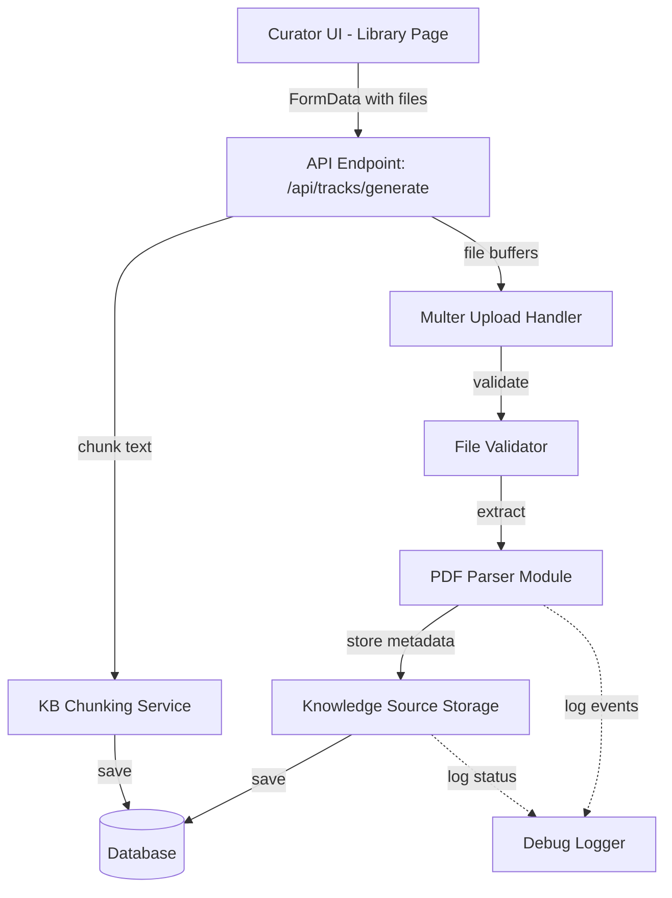
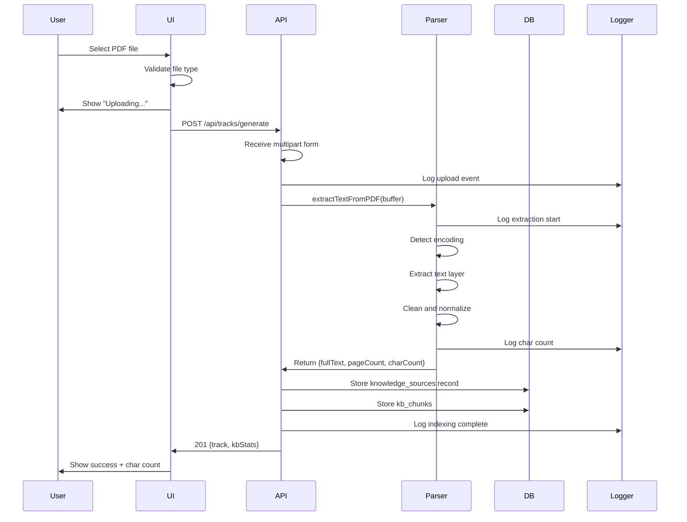
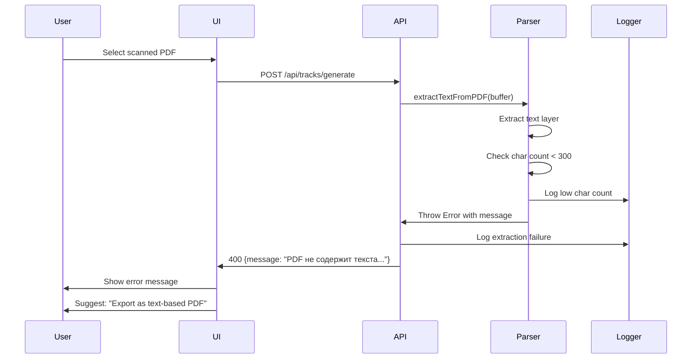
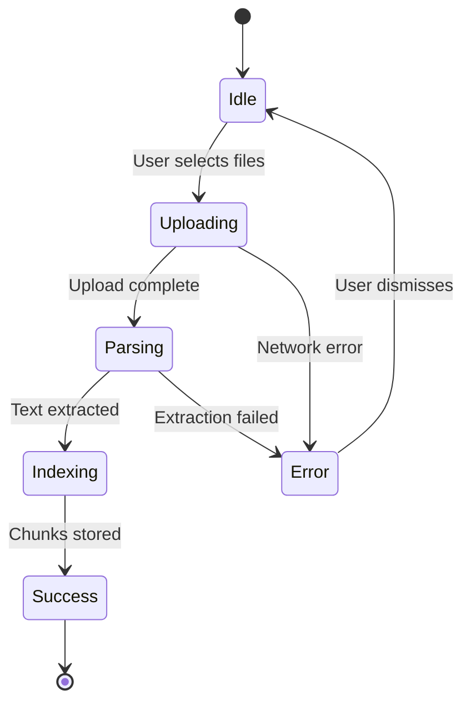

# PDF Upload and Text Extraction - Production Stability Design

## Overview

Make PDF upload and text extraction production-stable with proper handling of Cyrillic filenames, text-based vs scanned PDFs, comprehensive error handling, and full observability. This is an MVP blocker for reliable knowledge base ingestion.

## Problem Statement

Current issues blocking course generation:
- PDF upload fails with "cannot read text" errors
- Russian filename encoding breaks (displays garbled characters)
- No distinction between text-based and scanned PDFs
- Insufficient error feedback to users
- Missing extraction progress indicators
- Limited debugging visibility for extraction failures

## Business Requirements

### Success Criteria

Users must be able to:
1. Upload typical business PDFs (10–50MB) with success rate > 95%
2. See their original Russian filenames preserved correctly
3. Receive clear, actionable feedback when PDF cannot be processed
4. Understand whether PDF is text-based or requires OCR
5. Generate courses successfully from extracted text
6. Debug extraction failures through visible logs

### Acceptance Tests

| Test Case | Expected Outcome |
|-----------|------------------|
| Upload Russian text-based PDF | Original filename preserved, text extracted, char count > 0, course generation succeeds |
| Upload English text-based PDF | Text extracted reliably, length > 0, course generation uses extracted content |
| Upload scanned/image-based PDF | Clear UI message: "This PDF appears to be scanned. Please upload a text-based PDF or use OCR tool." |
| Upload password-protected PDF | Error message: "PDF is password-protected. Please upload unlocked version." |
| Upload corrupted PDF | Error message: "File appears corrupted. Please re-export and try again." |
| Upload 50MB valid PDF | Upload succeeds within 30 seconds, progress shown throughout |

## System Architecture

### Component Overview



### Data Flow

#### Successful Upload Flow



#### Error Handling Flow



## Technical Design

### File Upload Configuration

| Parameter | Value | Rationale |
|-----------|-------|-----------|
| Max file size | 50 MB | Covers 99% of business documents |
| Allowed extensions | .pdf, .docx, .txt, .md | Standard knowledge base formats |
| Encoding | UTF-8 | Universal support including Cyrillic |
| Storage strategy | In-memory buffer → Database | Avoid filesystem encoding issues |
| Concurrent uploads | Up to 20 files | Support multi-file KB creation |

### PDF Parsing Strategy

#### Detection Logic

The parser must distinguish between three PDF types:

| PDF Type | Detection Method | Action |
|----------|------------------|--------|
| Text-based | `text.length > 300` after extraction | Extract normally, proceed to chunking |
| Scanned/Image | `text.length < 300` or empty | Return error with OCR suggestion |
| Password-protected | Parser throws encryption error | Return error requesting unlocked file |

#### Text Extraction Process

Extraction pipeline stages:

1. **Buffer Reception**: Receive file as Buffer (preserves encoding)
2. **PDF Parse**: Use `pdf-parse` library to extract raw text
3. **Encryption Check**: Verify `IsEncrypted` or `Encrypted` metadata flags
4. **Text Layer Detection**: Check if extracted text is empty or minimal
5. **Text Cleaning**: Remove null bytes, normalize whitespace, collapse excessive line breaks
6. **Length Validation**: Ensure minimum 300 characters extracted
7. **Metadata Assembly**: Return structured result with fullText, pageCount, charCount, encrypted flag

#### Character Encoding Handling

Strategy for Cyrillic and special characters:

| Stage | Encoding Handling |
|-------|-------------------|
| File upload | Accept as binary Buffer, do not decode to string |
| Filename storage | Store originalname as-is in UTF-8 database column |
| Text extraction | pdf-parse handles encoding internally |
| Text cleaning | Only remove control characters `\x00-\x08`, preserve Unicode |
| Database storage | PostgreSQL text column with UTF-8 encoding |

### Database Schema Enhancement

#### Knowledge Sources Table

Already exists with appropriate structure:

| Column | Type | Purpose |
|--------|------|---------|
| filename | text | Original filename (Cyrillic-safe) |
| storagePath | text | Base64-encoded file content |
| mimetype | text | Original MIME type |
| sizeBytes | integer | File size for validation |
| extractedCharCount | integer | Validation metric |
| status | enum | uploaded → parsing → indexed → failed |
| errorMessage | text | User-facing error description |
| pageCount | integer | PDF metadata |

#### KB Chunks Table

Already exists for RAG retrieval:

| Column | Type | Purpose |
|--------|------|---------|
| trackId | integer | Link to course |
| sourceId | integer | Link to knowledge source |
| chunkIndex | integer | Order in document |
| content | text | Text chunk (~1000 chars) |
| metadata | jsonb | Page number, section info |

### Error Classification

#### Error Categories and User Messages

| Error Type | Detection Condition | User Message | Suggested Action |
|------------|---------------------|--------------|------------------|
| Scanned PDF | extractedCharCount < 300 | "PDF не содержит текстового слоя. Это может быть отсканированный документ." | "Экспортируйте PDF с текстом или используйте TXT/DOCX." |
| Encrypted PDF | Parser throws password/encryption error | "PDF защищён паролем." | "Загрузите незащищённую версию." |
| Corrupted File | Parser throws unexpected error | "Не удалось прочитать PDF файл." | "Проверьте, что файл не повреждён." |
| Unsupported Format | Extension not in allowed list | "Формат не поддерживается." | "Используйте PDF, DOC, DOCX, TXT, MD." |
| File Too Large | size > 50MB | "Файл слишком большой." | "Максимум 50 МБ." |
| No Text Extracted | All files failed extraction | "Не удалось извлечь текст из файлов." | "Попробуйте другие файлы или вставьте текст вручную." |

### Logging Strategy

#### Log Events

Critical logging touchpoints:

| Event | Severity | Logged Data |
|-------|----------|-------------|
| Upload received | INFO | userId, filename, sizeBytes, mimetype |
| Extraction start | INFO | filename, sizeBytes |
| Extraction success | INFO | filename, pageCount, extractedCharCount, durationMs |
| Extraction failure | ERROR | filename, error message, error stack, sizeBytes |
| Char count validation | WARN | filename, extractedCharCount (if < 300) |
| Chunking complete | INFO | trackId, chunkCount, totalChars |
| Storage failure | ERROR | trackId, sourceId, error message |

#### Log Format

Structured logging format:

```
[Component] Event: details
Example: [Parser] PDF extraction success: file="Инструкция.pdf", pages=12, chars=45230, duration=1.2s
```

## User Experience Design

### UI State Machine

The upload dialog must show clear progression:



### UI States and Indicators

| State | Visual Indicator | User Message | Actions Available |
|-------|------------------|--------------|-------------------|
| Idle | File dropzone visible | "Нажмите для загрузки" | Select files |
| Uploading | Spinner + progress % | "Загрузка файлов... 45%" | Cancel |
| Parsing | Spinner | "Извлечение текста из PDF..." | Wait |
| Indexing | Spinner | "Индексирование базы знаний..." | Wait |
| Success | Green checkmark | "✓ Индексировано: 42 чанка • 12.3K символов" | View course |
| Error | Red alert icon | Specific error message | Retry, Dismiss |

### Error Message Display

Error presentation strategy:

- **Primary Message**: One-line problem description in Russian
- **Secondary Guidance**: Actionable next step or workaround
- **Log Reference**: "See logs" link (for curators only) to AI Logs page
- **Retry Option**: Keep dialog open, allow immediate retry with different file

Example error display:

```
❌ PDF не содержит текстового слоя

Это может быть отсканированный документ. Экспортируйте PDF с текстом 
или используйте формат TXT/DOCX.

[Попробовать другой файл]  [Посмотреть логи]
```

## Implementation Scope

### Existing Components (Leverage)

Already implemented:
- PDF parser with error handling (`server/ai/parsers.ts`)
- Knowledge sources database table
- KB chunking service
- File upload endpoint with multipart support
- AI logs table for debugging

### Required Changes

#### 1. Enhanced Filename Encoding

**Goal**: Preserve Cyrillic filenames from upload to display

**Changes**:
- Multer already provides `originalname` in UTF-8
- Database column `filename` is already `text` type with UTF-8
- Frontend must decode response correctly (ensure no double-encoding)

**Validation**: Upload file named "Инструкция по продажам.pdf", verify exact name appears in UI and database

#### 2. Improved Error Messages

**Goal**: Clear, actionable error feedback in Russian

**Changes**:
- Parser already throws Russian error messages
- API endpoint catches and returns structured error response
- Frontend displays error with icon and suggested action

**Validation**: Trigger each error type, verify user sees correct message and suggestion

#### 3. Upload Progress States

**Goal**: Show user what's happening during long operations

**Changes**:
- Add state tracking to upload mutation: uploading → parsing → indexing → done
- Display state-specific messages in dialog
- Show extracted character count in success message

**Validation**: Upload 20MB PDF, observe state transitions in UI

#### 4. Debug Logging Enhancement

**Goal**: Track every extraction attempt for troubleshooting

**Changes**:
- Add console.log statements at key stages:
  - Upload received with filename and size
  - Extraction started
  - Extraction completed with char count
  - Extraction failed with error details
- All logs include filename for traceability

**Validation**: Upload various PDFs, verify complete logs appear in server console

#### 5. Scanned PDF Detection

**Goal**: Distinguish text-based from scanned PDFs before course generation

**Changes**:
- Parser already checks `extractedCharCount < 300`
- Enhance threshold validation: if < 500 chars, throw specific error
- Return error message: "PDF не содержит текстового слоя..."

**Validation**: Upload scanned PDF, verify error message guides user to solution

## Risk Assessment

| Risk | Probability | Impact | Mitigation |
|------|-------------|--------|------------|
| PDF parsing fails on valid files | Low | High | Validate with diverse real-world PDFs before release |
| Cyrillic encoding breaks | Low | High | Test with Russian filenames and content explicitly |
| Large file upload timeout | Medium | Medium | Set 60s timeout, show progress to keep user informed |
| OCR expectation mismatch | Medium | Low | Clear messaging that scanned PDFs require text layer |
| Storage overflow | Low | Low | 50MB limit per file, track total storage usage |

## Testing Strategy

### Unit Tests

Not applicable (design document does not include code).

### Integration Tests

Test scenarios to validate end-to-end:

| Test | Setup | Expected Result |
|------|-------|-----------------|
| Text PDF upload | 5-page Russian business document | Filename preserved, > 5000 chars extracted, course generated |
| Scanned PDF upload | Image-based PDF with no text layer | Error message with OCR suggestion |
| Mixed upload | 3 files: text PDF, scanned PDF, DOCX | Text PDF + DOCX succeed, scanned fails with clear error |
| Large file | 45MB valid PDF | Upload completes in < 30s, progress shown |
| Cyrillic filename | "Руководство 2024.pdf" | Exact name shown in UI and stored in DB |
| Corrupted file | Truncated PDF file | Clear error: "файл не повреждён" |

### Manual QA Checklist

Before release, curator must:
1. Upload 3 different Russian text PDFs → all succeed
2. Upload 1 scanned PDF → see clear error message
3. Upload file with long Cyrillic name → name displayed correctly
4. Generate course from uploaded KB → uses extracted text
5. Check AI Logs page → see extraction events logged
6. Upload 20MB+ file → progress indicators visible

## Success Metrics

### Performance Targets

| Metric | Target | Measurement |
|--------|--------|-------------|
| Upload success rate | > 95% | Track API 2xx vs 4xx/5xx responses |
| Extraction time | < 10s for 10MB file | Log duration in parser |
| User abandonment rate | < 10% | Track dialog closure before completion |
| Error resolution rate | > 80% retry after error | Track subsequent successful uploads |

### Monitoring

Post-deployment observability:

- **Server Logs**: All extraction attempts with outcome
- **AI Logs Table**: Store extraction events for debugging
- **Error Tracking**: Count by error type to identify patterns
- **Upload Analytics**: Track file sizes, types, and success rates

## Dependencies

### External Libraries

| Library | Version | Purpose |
|---------|---------|---------|
| pdf-parse | Latest | Extract text from PDF buffers |
| multer | Latest | Handle multipart file uploads |
| mammoth | Latest | Extract text from DOCX files |

### Internal Modules

| Module | Dependency Reason |
|--------|-------------------|
| server/ai/parsers.ts | Contains extractTextFromPDF function |
| server/ai/kb-service.ts | Chunks and stores KB text |
| shared/schema.ts | Database schema definitions |
| server/storage.ts | Database operations |

## Rollout Plan

### Phase 1: Validation (Pre-release)

1. Test with 10 real business PDFs (mixed Russian/English)
2. Verify error handling for all error types
3. Confirm Cyrillic filenames display correctly
4. Validate logging completeness

### Phase 2: Release

1. Deploy to production
2. Monitor logs for first 24 hours
3. Track upload success rate
4. Collect user feedback on error messages

### Phase 3: Iteration

1. Adjust char count threshold if false positives occur
2. Enhance error messages based on user confusion patterns
3. Add file preview feature if requested
4. Consider OCR integration for scanned PDFs

## Future Enhancements

Out of scope for MVP, consider later:

- **OCR Integration**: Use GigaChat Vision or Tesseract for scanned PDFs
- **File Preview**: Show first page thumbnail before upload
- **Batch Upload Progress**: Individual progress bars for each file
- **Format Auto-detection**: Warn if PDF is scanned before upload completes
- **Storage Optimization**: Compress stored file buffers
- **Async Processing**: Queue large file extraction jobs
- **File Management UI**: Delete or re-upload specific KB files

## Appendix: Error Message Reference

### Complete Error Message Table

| Error Code | Error Condition | Russian Message | English Translation |
|------------|-----------------|-----------------|---------------------|
| SCANNED_PDF | extractedCharCount < 300 | PDF не содержит текстового слоя. Это может быть отсканированный документ. Экспортируйте PDF с текстом или используйте TXT/DOCX. | PDF contains no text layer. This may be a scanned document. Export PDF with text or use TXT/DOCX. |
| ENCRYPTED_PDF | Parser detects encryption | PDF защищён паролем. Загрузите незащищённую версию. | PDF is password-protected. Upload unlocked version. |
| CORRUPTED_FILE | Parser throws unexpected error | Не удалось прочитать PDF файл. Проверьте, что файл не повреждён. | Could not read PDF file. Verify file is not corrupted. |
| UNSUPPORTED_FORMAT | File extension not allowed | Формат не поддерживается. Используйте PDF, DOC, DOCX, TXT, MD. | Format not supported. Use PDF, DOC, DOCX, TXT, MD. |
| FILE_TOO_LARGE | File size > 50MB | Файл слишком большой. Максимум 50 МБ. | File too large. Maximum 50 MB. |
| NO_TEXT_EXTRACTED | All files return empty text | Не удалось извлечь текст из файлов. | Could not extract text from files. |
| EXTRACTION_FAILED | Generic extraction error | Ошибка обработки файла. Попробуйте другой формат. | File processing error. Try different format. |

**Validation**: Upload scanned PDF, verify error message guides user to solution

## Risk Assessment

| Risk | Probability | Impact | Mitigation |
|------|-------------|--------|------------|
| PDF parsing fails on valid files | Low | High | Validate with diverse real-world PDFs before release |
| Cyrillic encoding breaks | Low | High | Test with Russian filenames and content explicitly |
| Large file upload timeout | Medium | Medium | Set 60s timeout, show progress to keep user informed |
| OCR expectation mismatch | Medium | Low | Clear messaging that scanned PDFs require text layer |
| Storage overflow | Low | Low | 50MB limit per file, track total storage usage |

## Testing Strategy

### Unit Tests

Not applicable (design document does not include code).

### Integration Tests

Test scenarios to validate end-to-end:

| Test | Setup | Expected Result |
|------|-------|-----------------|
| Text PDF upload | 5-page Russian business document | Filename preserved, > 5000 chars extracted, course generated |
| Scanned PDF upload | Image-based PDF with no text layer | Error message with OCR suggestion |
| Mixed upload | 3 files: text PDF, scanned PDF, DOCX | Text PDF + DOCX succeed, scanned fails with clear error |
| Large file | 45MB valid PDF | Upload completes in < 30s, progress shown |
| Cyrillic filename | "Руководство 2024.pdf" | Exact name shown in UI and stored in DB |
| Corrupted file | Truncated PDF file | Clear error: "файл не повреждён" |

### Manual QA Checklist

Before release, curator must:
1. Upload 3 different Russian text PDFs → all succeed
2. Upload 1 scanned PDF → see clear error message
3. Upload file with long Cyrillic name → name displayed correctly
4. Generate course from uploaded KB → uses extracted text
5. Check AI Logs page → see extraction events logged
6. Upload 20MB+ file → progress indicators visible

## Success Metrics

### Performance Targets

| Metric | Target | Measurement |
|--------|--------|-------------|
| Upload success rate | > 95% | Track API 2xx vs 4xx/5xx responses |
| Extraction time | < 10s for 10MB file | Log duration in parser |
| User abandonment rate | < 10% | Track dialog closure before completion |
| Error resolution rate | > 80% retry after error | Track subsequent successful uploads |

### Monitoring

Post-deployment observability:

- **Server Logs**: All extraction attempts with outcome
- **AI Logs Table**: Store extraction events for debugging
- **Error Tracking**: Count by error type to identify patterns
- **Upload Analytics**: Track file sizes, types, and success rates

## Dependencies

### External Libraries

| Library | Version | Purpose |
|---------|---------|---------|
| pdf-parse | Latest | Extract text from PDF buffers |
| multer | Latest | Handle multipart file uploads |
| mammoth | Latest | Extract text from DOCX files |

### Internal Modules

| Module | Dependency Reason |
|--------|-------------------|
| server/ai/parsers.ts | Contains extractTextFromPDF function |
| server/ai/kb-service.ts | Chunks and stores KB text |
| shared/schema.ts | Database schema definitions |
| server/storage.ts | Database operations |

## Rollout Plan

### Phase 1: Validation (Pre-release)

1. Test with 10 real business PDFs (mixed Russian/English)
2. Verify error handling for all error types
3. Confirm Cyrillic filenames display correctly
4. Validate logging completeness

### Phase 2: Release

1. Deploy to production
2. Monitor logs for first 24 hours
3. Track upload success rate
4. Collect user feedback on error messages

### Phase 3: Iteration

1. Adjust char count threshold if false positives occur
2. Enhance error messages based on user confusion patterns
3. Add file preview feature if requested
4. Consider OCR integration for scanned PDFs

## Future Enhancements

Out of scope for MVP, consider later:

- **OCR Integration**: Use GigaChat Vision or Tesseract for scanned PDFs
- **File Preview**: Show first page thumbnail before upload
- **Batch Upload Progress**: Individual progress bars for each file
- **Format Auto-detection**: Warn if PDF is scanned before upload completes
- **Storage Optimization**: Compress stored file buffers
- **Async Processing**: Queue large file extraction jobs
- **File Management UI**: Delete or re-upload specific KB files

## Appendix: Error Message Reference

### Complete Error Message Table

| Error Code | Error Condition | Russian Message | English Translation |
|------------|-----------------|-----------------|---------------------|
| SCANNED_PDF | extractedCharCount < 300 | PDF не содержит текстового слоя. Это может быть отсканированный документ. Экспортируйте PDF с текстом или используйте TXT/DOCX. | PDF contains no text layer. This may be a scanned document. Export PDF with text or use TXT/DOCX. |
| ENCRYPTED_PDF | Parser detects encryption | PDF защищён паролем. Загрузите незащищённую версию. | PDF is password-protected. Upload unlocked version. |
| CORRUPTED_FILE | Parser throws unexpected error | Не удалось прочитать PDF файл. Проверьте, что файл не повреждён. | Could not read PDF file. Verify file is not corrupted. |
| UNSUPPORTED_FORMAT | File extension not allowed | Формат не поддерживается. Используйте PDF, DOC, DOCX, TXT, MD. | Format not supported. Use PDF, DOC, DOCX, TXT, MD. |
| FILE_TOO_LARGE | File size > 50MB | Файл слишком большой. Максимум 50 МБ. | File too large. Maximum 50 MB. |
| NO_TEXT_EXTRACTED | All files return empty text | Не удалось извлечь текст из файлов. | Could not extract text from files. |
| EXTRACTION_FAILED | Generic extraction error | Ошибка обработки файла. Попробуйте другой формат. | File processing error. Try different format. |

**Validation**: Upload scanned PDF, verify error message guides user to solution

## Risk Assessment

| Risk | Probability | Impact | Mitigation |
|------|-------------|--------|------------|
| PDF parsing fails on valid files | Low | High | Validate with diverse real-world PDFs before release |
| Cyrillic encoding breaks | Low | High | Test with Russian filenames and content explicitly |
| Large file upload timeout | Medium | Medium | Set 60s timeout, show progress to keep user informed |
| OCR expectation mismatch | Medium | Low | Clear messaging that scanned PDFs require text layer |
| Storage overflow | Low | Low | 50MB limit per file, track total storage usage |

## Testing Strategy

### Unit Tests

Not applicable (design document does not include code).

### Integration Tests

Test scenarios to validate end-to-end:

| Test | Setup | Expected Result |
|------|-------|-----------------|
| Text PDF upload | 5-page Russian business document | Filename preserved, > 5000 chars extracted, course generated |
| Scanned PDF upload | Image-based PDF with no text layer | Error message with OCR suggestion |
| Mixed upload | 3 files: text PDF, scanned PDF, DOCX | Text PDF + DOCX succeed, scanned fails with clear error |
| Large file | 45MB valid PDF | Upload completes in < 30s, progress shown |
| Cyrillic filename | "Руководство 2024.pdf" | Exact name shown in UI and stored in DB |
| Corrupted file | Truncated PDF file | Clear error: "файл не повреждён" |

### Manual QA Checklist

Before release, curator must:
1. Upload 3 different Russian text PDFs → all succeed
2. Upload 1 scanned PDF → see clear error message
3. Upload file with long Cyrillic name → name displayed correctly
4. Generate course from uploaded KB → uses extracted text
5. Check AI Logs page → see extraction events logged
6. Upload 20MB+ file → progress indicators visible

## Success Metrics

### Performance Targets

| Metric | Target | Measurement |
|--------|--------|-------------|
| Upload success rate | > 95% | Track API 2xx vs 4xx/5xx responses |
| Extraction time | < 10s for 10MB file | Log duration in parser |
| User abandonment rate | < 10% | Track dialog closure before completion |
| Error resolution rate | > 80% retry after error | Track subsequent successful uploads |

### Monitoring

Post-deployment observability:

- **Server Logs**: All extraction attempts with outcome
- **AI Logs Table**: Store extraction events for debugging
- **Error Tracking**: Count by error type to identify patterns
- **Upload Analytics**: Track file sizes, types, and success rates

## Dependencies

### External Libraries

| Library | Version | Purpose |
|---------|---------|---------|
| pdf-parse | Latest | Extract text from PDF buffers |
| multer | Latest | Handle multipart file uploads |
| mammoth | Latest | Extract text from DOCX files |

### Internal Modules

| Module | Dependency Reason |
|--------|-------------------|
| server/ai/parsers.ts | Contains extractTextFromPDF function |
| server/ai/kb-service.ts | Chunks and stores KB text |
| shared/schema.ts | Database schema definitions |
| server/storage.ts | Database operations |

## Rollout Plan

### Phase 1: Validation (Pre-release)

1. Test with 10 real business PDFs (mixed Russian/English)
2. Verify error handling for all error types
3. Confirm Cyrillic filenames display correctly
4. Validate logging completeness

### Phase 2: Release

1. Deploy to production
2. Monitor logs for first 24 hours
3. Track upload success rate
4. Collect user feedback on error messages

### Phase 3: Iteration

1. Adjust char count threshold if false positives occur
2. Enhance error messages based on user confusion patterns
3. Add file preview feature if requested
4. Consider OCR integration for scanned PDFs

## Future Enhancements

Out of scope for MVP, consider later:

- **OCR Integration**: Use GigaChat Vision or Tesseract for scanned PDFs
- **File Preview**: Show first page thumbnail before upload
- **Batch Upload Progress**: Individual progress bars for each file
- **Format Auto-detection**: Warn if PDF is scanned before upload completes
- **Storage Optimization**: Compress stored file buffers
- **Async Processing**: Queue large file extraction jobs
- **File Management UI**: Delete or re-upload specific KB files

## Appendix: Error Message Reference

### Complete Error Message Table

| Error Code | Error Condition | Russian Message | English Translation |
|------------|-----------------|-----------------|---------------------|
| SCANNED_PDF | extractedCharCount < 300 | PDF не содержит текстового слоя. Это может быть отсканированный документ. Экспортируйте PDF с текстом или используйте TXT/DOCX. | PDF contains no text layer. This may be a scanned document. Export PDF with text or use TXT/DOCX. |
| ENCRYPTED_PDF | Parser detects encryption | PDF защищён паролем. Загрузите незащищённую версию. | PDF is password-protected. Upload unlocked version. |
| CORRUPTED_FILE | Parser throws unexpected error | Не удалось прочитать PDF файл. Проверьте, что файл не повреждён. | Could not read PDF file. Verify file is not corrupted. |
| UNSUPPORTED_FORMAT | File extension not allowed | Формат не поддерживается. Используйте PDF, DOC, DOCX, TXT, MD. | Format not supported. Use PDF, DOC, DOCX, TXT, MD. |
| FILE_TOO_LARGE | File size > 50MB | Файл слишком большой. Максимум 50 МБ. | File too large. Maximum 50 MB. |
| NO_TEXT_EXTRACTED | All files return empty text | Не удалось извлечь текст из файлов. | Could not extract text from files. |
| EXTRACTION_FAILED | Generic extraction error | Ошибка обработки файла. Попробуйте другой формат. | File processing error. Try different format. |
