# Roleplay Voice-to-Voice Training – Design Specification

## Overview

**Feature Name:** Roleplay Voice-to-Voice MVP  
**Target Users:** Sales and store employees (B2B training context)  
**Core Value:** Practice real customer objections in 90 seconds with clear scoring and actionable feedback  

**Design Principle:** Keep implementation simple. No complex gamification. Maintain current flows and patterns. Add one new step type that transforms static roleplay into interactive voice dialogue.

---

## Problem Statement

### Current Issues
- Audio controls appear globally across all lesson types, creating confusion about when voice input is appropriate
- Existing roleplay steps are single-turn interactions: employee answers once and receives feedback
- No realistic conversation flow that mimics actual customer interactions
- Employees cannot practice handling progressive customer responses or escalations

### Desired Outcome
- Single, focused roleplay step type where voice interaction is the primary mode
- Multi-turn dialogue (6 turns total: 3 AI + 3 employee) that simulates real customer conversations
- Clear, actionable feedback based on sales training principles
- No hallucinated company policies—all AI responses grounded in knowledge base

---

## Scope Definition

### In Scope (MVP)
- New step type: `ROLEPLAY_VOICE` with 6-turn dialogue structure
- Voice-to-voice as primary interaction mode with text fallback
- Scenario context presentation with TTS readout capability
- Turn-based conversation flow with transcript display
- Post-dialogue scoring and structured feedback
- Knowledge base integration for fact-grounding
- Removal of audio icons from non-roleplay step types
- Two scenario template categories: retail store and phone/B2B sales

### Out of Scope (Post-MVP)
- Multiple roleplay questions per module
- Complex branching dialogue trees
- Real-time sentiment analysis during conversation
- Video or avatar animations
- Separate chat application redesign
- New routing patterns
- Roleplay-specific analytics dashboard

---

## User Roles

| Role | Interaction with Feature |
|------|-------------------------|
| **Employee (Learner)** | Completes roleplay steps as part of course progression. Speaks responses via microphone or types as fallback. Receives immediate feedback after 6 turns. |
| **Curator (Course Designer)** | Configures roleplay scenarios through course generation or manual editing. Reviews knowledge base materials that ground AI customer behavior. |
| **AI Customer** | Role-played by LLM. Responds contextually based on employee replies, escalates or calms depending on quality of employee responses. Stays within scenario parameters. |

---

## Scenario Structure

### Scenario Card Components
Each roleplay step presents a compact scenario card with four structured sections:

| Section | Purpose | Length Guideline |
|---------|---------|------------------|
| **Ситуация** | Sets the context: what happened that triggered the interaction | 1–2 sentences |
| **Роль сотрудника** | Defines the employee's role in this scenario | 1 sentence |
| **Цель** | States the desired outcome of the conversation | 1 sentence |
| **Правила/Ограничения** | Lists 1–3 guidelines or constraints | Bulleted list, 1–3 items |

### Example Scenario (Retail Context)

**Ситуация:**  
Клиент недоволен качеством товара и хочет возврат.

**Роль сотрудника:**  
Вы — продавец-консультант.

**Цель:**  
Снять напряжение, уточнить проблему, предложить решение по правилам магазина.

**Правила:**
- Не спорить с клиентом
- Уточнить детали покупки и проблемы
- Предложить вариант: обмен, скидка на следующую покупку, или обращение в сервис

---

## Interaction Flow

### Phase 1: Context Presentation

**Initial State:**
- Scenario card displayed prominently
- Speaker button labeled "🔊 Озвучить сценарий" visible at top of card
- Primary action button (microphone) disabled until context acknowledged

**User Action:**
- User clicks speaker button to hear scenario read aloud via TTS
- TTS reads all four sections of scenario card sequentially

**Transition:**
- After TTS completes, system displays subtle hint: "Диалог начнётся автоматически"
- After 2-second pause, AI initiates Turn 1

**Alternative Path:**
- User may skip TTS and proceed directly (button: "Начать диалог")
- This immediately triggers AI Turn 1

---

### Phase 2: Multi-Turn Dialogue Loop

**Structure:**
6 total turns alternating between AI and employee:
1. AI speaks → 2. Employee responds → 3. AI speaks → 4. Employee responds → 5. AI speaks → 6. Employee responds

**Turn Display Pattern:**

```
Dialogue Transcript Area:
┌─────────────────────────────────────┐
│ [Клиент]                            │
│ "Я хочу вернуть товар, он           │
│  некачественный!"                   │
│ [🔈 Повторить]                      │
│                                     │
│                  [Вы]               │
│      "Понимаю ваше недовольство.    │
│       Расскажите, что случилось?"   │
│                                     │
│ [Клиент]                            │
│ "Купил вчера, а сегодня не          │
│  работает!"                         │
│ [🔈 Повторить]                      │
└─────────────────────────────────────┘

Status: Реплика 2/3 (вы) • Диалог 4/6
```

**AI Turn Behavior:**
- AI message appears as text transcript immediately
- System auto-plays AI message via TTS (Russian voice)
- While AI speaks, employee input is locked
- After AI TTS completes, employee input unlocks
- Optional "🔈 Повторить" button allows replay of AI message

**Employee Turn Behavior:**
- Large microphone button becomes active
- Button states:
  - **Idle:** "Нажмите и говорите"
  - **Recording:** "Слушаю…" with pulsing animation
  - **Processing:** "Проверяю…" with spinner
- Live partial transcript displayed as speech recognition processes
- Employee can cancel recording before completion
- Fallback: "Ввести текстом" link opens textarea input
- Once employee submits response, AI processes and generates next turn

**Turn Time Guidelines:**
- AI turns: 2–3 sentences maximum (enforced via prompt)
- Employee turns: Soft limit 10–20 seconds
  - No hard blocking, but hint shown if exceeding: "Коротко и по делу"

---

### Phase 3: Scoring and Feedback

**Trigger:**
After 6th turn (final employee response), system transitions to feedback panel.

**Feedback Panel Layout:**

```
┌─────────────────────────────────────────────┐
│  [Score Badge: 7/10]  [Verdict: Хорошо]     │
│                                             │
│  ✓ Что получилось                           │
│    • Выразили эмпатию                       │
│    • Задали уточняющий вопрос               │
│                                             │
│  ⚠ Что улучшить                             │
│    • Не предложили конкретное решение       │
│    • Можно было упомянуть гарантию          │
│                                             │
│  💡 Пример ответа лучше                     │
│    "Понимаю, это неприятно. Давайте         │
│     проверим чек и гарантийный талон,       │
│     и я оформлю обмен или возврат."         │
│                                             │
│  [Попробовать снова]  [Далее]               │
└─────────────────────────────────────────────┘
```

**Scoring Scale:**

| Score Range | Verdict Label | Visual Indicator |
|-------------|---------------|------------------|
| 0–3 | Слабовато | Red / Warning |
| 4–6 | Нормально | Orange / Neutral |
| 7–8 | Хорошо | Green / Positive |
| 9–10 | Отлично | Green / Excellent |

**Feedback Sections:**

1. **Что получилось (Strengths):**
   - 1–3 bullet points highlighting correct behaviors
   - Examples: acknowledged emotion, asked clarifying questions, stayed calm

2. **Что улучшить (Improvements):**
   - 1–3 bullet points identifying gaps or missteps
   - Examples: didn't offer solution, argued with customer, missed policy reference

3. **Пример ответа лучше (Better Script):**
   - One short exemplar response (2–3 sentences)
   - Demonstrates ideal phrasing or structure for this scenario

**Action Buttons:**
- **Secondary:** "Попробовать снова" — resets dialogue to Turn 1 with same scenario
- **Primary:** "Далее" — advances to next lesson step

---

## Content Quality Requirements

### Sales Training Principles

Roleplay scenarios must train these core competencies:

| Competency | Definition | Evaluation Criteria |
|------------|------------|---------------------|
| **Empathy Opening** | Acknowledge customer emotion before problem-solving | Did employee validate customer's feelings in Turn 1 or 2? |
| **Clarifying Questions** | Ask 1–2 questions to understand situation fully | Did employee ask at least one clarifying question? |
| **Solution Alignment** | Offer solution grounded in KB policies | Did employee reference or align with company policy from KB? |
| **Confidence and Structure** | Maintain calm, structured communication | Did employee avoid defensive language or rambling? |
| **No Blame** | Never argue or imply fault on customer's part | Did employee avoid phrases like "you should have" or "that's your fault"? |

### Scenario Template Library (MVP)

**Category 1: Retail Store (Offline)**

| Scenario Type | Customer Issue | Training Focus |
|---------------|----------------|----------------|
| Quality Complaint | Product defect or damage | Empathy + refund/exchange policy |
| Price Objection | "Too expensive" | Value communication, alternatives |
| Decision Delay | "I'll think about it" | Gentle closing, address concerns |

**Category 2: Phone Sales / B2B**

| Scenario Type | Customer Issue | Training Focus |
|---------------|----------------|----------------|
| Price Objection | "Your price is high" | Differentiation, ROI framing |
| Brushoff | "Send me info" or "No time" | Quick value pitch, scheduling |
| Competitor Comparison | "Competitor X is cheaper" | Feature comparison, unique value |

---

## AI Behavior Guidelines

### Customer Persona Characteristics

**Emotional Baseline:**
- Start with mild frustration or skepticism (not extreme anger)
- Realistic tone: short, sometimes vague, emotionally colored

**Responsiveness:**
- **If employee responds poorly** (e.g., defensive, no empathy): escalate slightly, become more impatient
- **If employee responds well** (e.g., empathetic, asks clarifying question): calm down, become more cooperative

**Constraints:**
- AI customer must stay in character for all 3 turns
- No sudden personality shifts unless triggered by employee behavior
- Responses limited to 2–3 sentences per turn

### Knowledge Base Integration

**Grounding Rule:**
- If course has KB materials, AI must reference only factual information from KB
- No invention of policies, pricing, or terms not present in KB

**KB Gap Handling:**
- If KB lacks necessary policy (e.g., refund terms), AI customer can still converse naturally
- Evaluation must flag: "Не хватило данных о правилах. Уточните у куратора."
- Optional: generate "question to curator" event for course improvement

---

## LLM Prompt Specifications

### Prompt 1: Scenario Generation

**Purpose:** Generate a single roleplay scenario with structured context and AI opening line.

**System Prompt:**
```
You are an expert sales trainer creating realistic roleplay scenarios for voice-to-voice practice.
If a knowledge base is provided, use it as the sole source of company rules and facts.
Do not invent policies, pricing, or procedures not present in the KB.
Output must be valid JSON following the exact schema provided.
```

**User Prompt Template:**
```
Course: {course_title}
Audience: {employee_role}
Knowledge base: {kb_snippets or "No KB provided"}

Create ONE roleplay scenario for voice-to-voice practice.

Requirements:
- Situation: 1-2 sentences describing what triggered the interaction
- Employee role: 1 sentence
- Goal: 1 sentence stating desired outcome
- Rules: 1-3 bullet points (constraints or guidelines)
- AI role: "Клиент"
- Total turns: 6 (3 AI + 3 employee)
- AI opening line: realistic customer opening statement (1-2 sentences)

Return JSON:
{
  "scenario": {
    "situation": "...",
    "employee_role": "...",
    "goal": "...",
    "rules": ["...", "..."],
    "ai_role": "Клиент",
    "turns_total": 6,
    "ai_opening_line": "..."
  }
}
```

**Expected Output Structure:**
```json
{
  "scenario": {
    "situation": "Клиент недоволен качеством товара и хочет возврат.",
    "employee_role": "Вы — продавец-консультант.",
    "goal": "Снять напряжение, уточнить проблему, предложить решение по правилам.",
    "rules": [
      "Не спорить",
      "Уточнить детали",
      "Предложить вариант: обмен/скидка/сервис"
    ],
    "ai_role": "Клиент",
    "turns_total": 6,
    "ai_opening_line": "Я хочу вернуть этот товар! Он не работает!"
  }
}
```

---

### Prompt 2: Next AI Turn

**Purpose:** Generate the next customer reply based on conversation history and employee's last response.

**System Prompt:**
```
You are roleplaying as a customer in a training scenario.
Keep replies short (1-3 sentences maximum).
Stay consistent with the scenario context and your emotional state.
If knowledge base is provided, reference only factual information from it.
If KB lacks needed info, avoid inventing details.
Output must be valid JSON.
```

**User Prompt Template:**
```
Scenario: {scenario_json}
Knowledge base: {kb_snippets or "No KB provided"}
Conversation so far:
{formatted_message_history}

Now produce the next customer reply (Turn {turn_number}).

Requirements:
- Stay in character as customer
- Respond naturally to employee's last statement
- If employee showed empathy/asked good question: become slightly more cooperative
- If employee was defensive/unhelpful: become slightly more frustrated
- 1-3 sentences maximum
- Do not invent company policies not in KB

Return JSON:
{
  "reply_text": "...",
  "should_escalate": false,
  "escalation_reason": ""
}
```

**Expected Output Structure:**
```json
{
  "reply_text": "Ну ладно, вот чек. Купил вчера, а сегодня не включается.",
  "should_escalate": false,
  "escalation_reason": ""
}
```

---

### Prompt 3: Evaluation

**Purpose:** Evaluate employee's three responses against scenario goal and KB policies. Provide structured feedback.

**System Prompt:**
```
You are a strict but fair sales coach.
Evaluate the employee's responses based on:
1. Empathy and acknowledgment of customer emotion
2. Clarifying questions to understand the situation
3. Solution offered aligned with KB policies
4. Confidence and structure (no rambling or defensiveness)
5. No blame or arguing with customer

If knowledge base is provided, evaluate alignment with stated policies.
Do not hallucinate policies or facts not in KB.
Output must be valid JSON following the exact schema.
```

**User Prompt Template:**
```
Scenario: {scenario_json}
Knowledge base: {kb_snippets or "No KB provided"}
Full conversation:
{formatted_conversation_all_6_turns}

Evaluate the employee's three responses.

Scoring criteria:
- 0-3: Слабовато (major issues: no empathy, no questions, no solution, or argued)
- 4-6: Нормально (partial: showed some empathy or asked question, but missed solution or was defensive)
- 7-8: Хорошо (good: empathy + question + solution attempt, minor gaps)
- 9-10: Отлично (excellent: empathy + clarifying questions + KB-aligned solution + confidence)

Return JSON:
{
  "score_0_10": 0,
  "verdict": "...",
  "strengths": ["...", "..."],
  "improvements": ["...", "..."],
  "better_example": "..."
}
```

**Expected Output Structure:**
```json
{
  "score_0_10": 7,
  "verdict": "Хорошо",
  "strengths": [
    "Выразили эмпатию в начале",
    "Задали уточняющий вопрос"
  ],
  "improvements": [
    "Не предложили конкретное решение по правилам магазина",
    "Можно было упомянуть гарантию"
  ],
  "better_example": "Понимаю, это неприятно. Давайте проверим чек и гарантийный талон, и я оформлю обмен или возврат по правилам."
}
```

---

## UI Specifications

### Audio Control Placement Rules

| Step Type | Audio Controls | Rationale |
|-----------|----------------|-----------|
| **content** | Speaker button: "🔊 Озвучить" (optional, only if `voiceEnabled`) | User may listen to theory content, but not required |
| **quiz** | No audio controls | Quiz is text-based selection, no voice needed |
| **open** | Voice input: microphone button with text fallback | User can speak or type answer |
| **ROLEPLAY_VOICE** | Full voice suite: TTS for scenario + AI turns, microphone for employee turns | This is the only step where voice is primary mode |

**Key Change:**
Remove speaker icons and auto-play behavior from all non-roleplay steps. Only `ROLEPLAY_VOICE` step should prominently feature voice interaction.

---

### Scenario Card Design

**Visual Hierarchy:**

```
┌──────────────────────────────────────────────┐
│  🔊 Озвучить сценарий                        │
│                                              │
│  СИТУАЦИЯ                                    │
│  Клиент недоволен качеством товара и хочет   │
│  возврат.                                    │
│                                              │
│  РОЛЬ СОТРУДНИКА                             │
│  Вы — продавец-консультант.                  │
│                                              │
│  ЦЕЛЬ                                        │
│  Снять напряжение, уточнить проблему,        │
│  предложить решение.                         │
│                                              │
│  ПРАВИЛА                                     │
│  • Не спорить                                │
│  • Уточнить детали                           │
│  • Предложить вариант: обмен/скидка/сервис   │
│                                              │
│  [Начать диалог]                             │
└──────────────────────────────────────────────┘
```

**Typography:**
- Section labels: bold, uppercase, 0.75rem, muted color
- Content text: regular, 1rem, default color
- Rules: bulleted list, 0.9rem

**Spacing:**
- 1rem between sections
- 0.5rem between label and content

---

### Dialogue Transcript Layout

**Container:**
- Vertical scrollable area
- Max height: 400px
- Auto-scroll to latest message when new turn appears

**Message Bubble Pattern:**

```
┌─────────────────────────────────────────┐
│  [Клиент]                               │
│  "Message text here"                    │
│  [🔈 Повторить]                         │
└─────────────────────────────────────────┘

            ┌──────────────────────────────┐
            │  [Вы]                        │
            │  "Your response text here"   │
            └──────────────────────────────┘
```

**Styling:**
- AI messages: aligned left, light gray background
- Employee messages: aligned right, light green background
- Both: rounded corners, padding 0.75rem
- Repeat button: small, ghost variant, only on AI messages

**Status Indicator:**
Display below transcript:
```
Реплика 2/3 (вы) • Диалог 4/6
```
- Font size: 0.85rem
- Color: muted
- Format: "Turn X/3 (you)" • "Dialogue Y/6"

---

### Voice Input Control

**Microphone Button States:**

| State | Visual | Label |
|-------|--------|-------|
| Idle | Green circular button, mic icon, no animation | "Нажмите и говорите" |
| Recording | Red circular button, mic icon, pulsing animation | "Слушаю…" |
| Processing | Gray circular button, spinner icon | "Проверяю…" |

**Button Dimensions:**
- Width/Height: 80px
- Border radius: 50%
- Icon size: 32px

**Live Transcript Display:**
While recording, show partial transcript in real-time below button:
```
┌─────────────────────────────────────────┐
│  🎙 Понимаю ваше недовольство. Расскаж...│
└─────────────────────────────────────────┘
```
- Background: light blue tint
- Font style: italic
- Updates dynamically as speech recognition processes

**Fallback Text Input:**
Link text: "Ввести текстом" (0.85rem, underlined, muted color)
When clicked:
- Microphone button hides
- Textarea appears (min-height: 120px)
- Link changes to: "Голосовой ввод" (allows switching back)

---

### Feedback Panel Design

**Overall Layout:**
- Centered card with clear sections
- Max width: 600px
- Padding: 2rem
- Subtle shadow

**Score Badge:**
- Position: top-right corner or centered at top
- Size: large (3rem font for number)
- Color:
  - 0–3: Red
  - 4–6: Orange
  - 7–8: Green
  - 9–10: Bright green
- Format: "7/10"

**Verdict Label:**
- Position: next to or below score badge
- Font: bold, 1.25rem
- Text: maps to score range (see table in Phase 3)

**Section Icons:**
- ✓ (checkmark) for "Что получилось"
- ⚠ (warning) for "Что улучшить"
- 💡 (lightbulb) for "Пример ответа лучше"

**Button Layout:**
- Horizontal row at bottom
- "Попробовать снова" — secondary variant, left-aligned
- "Далее" — primary variant, right-aligned
- Gap: 1rem between buttons

---

## Data Model Changes

### Database Schema

**No new tables required.** Existing `steps` table already supports `type: 'roleplay'`.

**Content Structure for ROLEPLAY_VOICE Step:**

```typescript
interface RoleplayVoiceContent {
  scenario: {
    situation: string;
    employee_role: string;
    goal: string;
    rules: string[];
    ai_role: string;
    turns_total: number;
    ai_opening_line: string;
  };
  kb_refs?: number[]; // References to KB chunks used in generation
}
```

**Stored in `steps.content` as JSONB.**

---

### API Endpoints

**1. Generate Roleplay Scenario**

**Endpoint:** `POST /api/roleplay/generate-scenario`

**Request Body:**
```json
{
  "trackId": 123,
  "courseTitle": "Retail Sales Training",
  "employeeRole": "Продавец-консультант",
  "kbChunkIds": [12, 45, 67]
}
```

**Response:**
```json
{
  "scenario": {
    "situation": "...",
    "employee_role": "...",
    "goal": "...",
    "rules": ["...", "..."],
    "ai_role": "Клиент",
    "turns_total": 6,
    "ai_opening_line": "..."
  }
}
```

**Error Handling:**
- 400: Invalid request (missing required fields)
- 500: LLM generation failed

---

**2. Get Next AI Turn**

**Endpoint:** `POST /api/roleplay/next-turn`

**Request Body:**
```json
{
  "trackId": 123,
  "stepId": 456,
  "scenario": { /* scenario object */ },
  "conversationHistory": [
    { "role": "ai", "text": "..." },
    { "role": "employee", "text": "..." }
  ],
  "turnNumber": 3
}
```

**Response:**
```json
{
  "reply_text": "Ну ладно, вот чек. Купил вчера, а сегодня не включается.",
  "should_escalate": false,
  "escalation_reason": ""
}
```

**Error Handling:**
- 400: Invalid conversation history or scenario
- 500: LLM failed to generate response

---

**3. Evaluate Roleplay**

**Endpoint:** `POST /api/roleplay/evaluate`

**Request Body:**
```json
{
  "trackId": 123,
  "stepId": 456,
  "scenario": { /* scenario object */ },
  "fullConversation": [
    { "role": "ai", "text": "..." },
    { "role": "employee", "text": "..." },
    { "role": "ai", "text": "..." },
    { "role": "employee", "text": "..." },
    { "role": "ai", "text": "..." },
    { "role": "employee", "text": "..." }
  ]
}
```

**Response:**
```json
{
  "score_0_10": 7,
  "verdict": "Хорошо",
  "strengths": ["...", "..."],
  "improvements": ["...", "..."],
  "better_example": "..."
}
```

**Error Handling:**
- 400: Incomplete conversation (not 6 turns)
- 500: Evaluation LLM failed

---

## State Management

### Client-Side State Variables

```typescript
interface RoleplayState {
  // Scenario context
  scenario: ScenarioData | null;
  scenarioPlayed: boolean; // Has TTS read scenario?
  
  // Conversation state
  conversationHistory: ConversationTurn[];
  currentTurnIndex: number; // 0-5
  
  // Voice interaction state
  isAiSpeaking: boolean;
  isEmployeeRecording: boolean;
  partialTranscript: string;
  
  // UI state
  showTextInput: boolean; // Fallback mode
  isProcessing: boolean; // Waiting for AI response
  
  // Feedback state
  evaluation: EvaluationResult | null;
  showFeedback: boolean;
}

interface ConversationTurn {
  role: 'ai' | 'employee';
  text: string;
  timestamp: number;
}

interface EvaluationResult {
  score_0_10: number;
  verdict: string;
  strengths: string[];
  improvements: string[];
  better_example: string;
}
```

### State Transitions

```mermaid
stateDiagram-v2
    [*] --> ScenarioPresentation
    ScenarioPresentation --> ReadingScenario : User clicks "Озвучить"
    ReadingScenario --> WaitingToStart : TTS complete
    ScenarioPresentation --> WaitingToStart : User clicks "Начать диалог"
    
    WaitingToStart --> AiSpeaking : Initialize Turn 1
    AiSpeaking --> EmployeeRecording : AI TTS complete
    EmployeeRecording --> ProcessingEmployee : Employee submits
    ProcessingEmployee --> AiSpeaking : AI generates reply
    
    AiSpeaking --> ShowingFeedback : Turn 6 complete
    ShowingFeedback --> ScenarioPresentation : User clicks "Попробовать снова"
    ShowingFeedback --> [*] : User clicks "Далее"
```



---

## Implementation Considerations

### Technology Stack Alignment

**Frontend (React):**
- Use existing `useTrack`, `useEnrollments`, `useRecordDrill` hooks
- Add new hook: `useRoleplaySession` for managing conversation state
- Leverage existing `VoiceOnlyQuestion` component pattern but extend for multi-turn

**Backend (Express + Drizzle):**
- Extend `/server/ai/prompts.ts` with roleplay-specific prompts
- Add new route file: `/server/ai/roleplay-routes.ts` for three new endpoints
- Use existing `getChatCompletion` from `gigachat.ts`
- Store conversation in session or temporary DB table for retry capability

**Speech APIs:**
- TTS: Browser `SpeechSynthesisUtterance` API (already in use)
- STT: Browser `webkitSpeechRecognition` API (already in use)
- Language: Russian (`ru-RU`)

---

### Performance Targets

| Metric | Target | Rationale |
|--------|--------|-----------|
| Scenario TTS duration | < 30 seconds | Keeps context introduction brief |
| AI turn generation latency | < 3 seconds | Maintains conversation flow |
| Employee STT processing | Real-time (< 500ms lag) | Live transcript feels responsive |
| Evaluation latency | < 5 seconds | Acceptable wait after final turn |

---

### Accessibility

| Requirement | Implementation |
|-------------|----------------|
| Screen reader support | All buttons and transcript messages have `aria-label` attributes |
| Keyboard navigation | Microphone button, speaker buttons, and action buttons are keyboard-accessible |
| Text fallback | Every voice interaction has text alternative (textarea input, transcript display) |
| Visual indicators | Recording state uses both color and animation; processing shows spinner |

---

## Testing Strategy

### Unit Testing

| Component/Function | Test Cases |
|-------------------|------------|
| Scenario generation prompt builder | Valid JSON output, handles missing KB gracefully |
| Next turn prompt builder | Correctly formats conversation history, respects turn count |
| Evaluation prompt builder | Maps score to verdict, validates feedback structure |
| State transitions | Turn counter increments correctly, feedback shows at turn 6 |

### Integration Testing

| Flow | Test Scenario |
|------|--------------|
| Full 6-turn dialogue | Complete conversation from start to feedback without errors |
| Voice fallback | Switch to text input mid-conversation, continue successfully |
| Retry mechanism | "Попробовать снова" resets state and restarts from Turn 1 |
| KB grounding | AI responses reference KB facts, evaluation flags KB gaps |

### User Acceptance Testing

| Criterion | Success Metric |
|-----------|---------------|
| Voice interaction feels natural | 80% of testers prefer voice over text input |
| Feedback is actionable | Testers can identify 2+ specific improvements from feedback |
| Conversation realism | AI customer behavior feels realistic and responsive to employee tone |
| No hallucinations | 0 instances of AI inventing policies not in KB |

---

## Rollout Plan

### Phase 1: Core Implementation
- Implement 3 LLM prompts and API endpoints
- Build UI for scenario presentation and transcript display
- Integrate voice input/output with existing browser APIs
- Test with 2 scenario templates (1 retail, 1 B2B)

### Phase 2: Feedback Refinement
- Implement evaluation logic and feedback panel UI
- Add retry mechanism
- Conduct internal testing with 5-10 scenarios

### Phase 3: Content Library Expansion
- Create 6 scenario templates (3 retail, 3 B2B)
- Test with real employees (pilot group of 20)
- Gather feedback on scenario realism and feedback quality

### Phase 4: Production Launch
- Remove audio controls from non-roleplay steps
- Deploy to production
- Monitor AI generation latency and error rates

---

## Success Metrics

| Metric | Target | Measurement Method |
|--------|--------|-------------------|
| Employee engagement | 70% of employees complete at least 1 roleplay | Analytics: completion rate per course |
| Retry rate | 30% of employees retry after first attempt | Track "Попробовать снова" clicks |
| Average score improvement on retry | +2 points | Compare first and second attempt scores |
| Feedback clarity | 80% of employees rate feedback as "helpful" or "very helpful" | Post-completion survey |
| No hallucination rate | 95% of evaluations show no KB gaps when KB is present | Manual review of evaluation logs |

---

## Risk Mitigation

| Risk | Impact | Mitigation |
|------|--------|------------|
| LLM generates off-topic AI turns | High | Strict system prompt, validate response against scenario context, allow manual override |
| STT fails or produces gibberish | Medium | Always offer text fallback, validate transcript length before submission |
| Evaluation is too harsh or too lenient | Medium | Calibrate scoring rubric with pilot testing, allow curator review of flagged evaluations |
| Voice API not supported in browser | Medium | Detect support on load, default to text mode with clear messaging |
| KB lacks critical policy info | Low | Evaluation flags KB_GAP, generate "question to curator" event for course improvement |

---

## Open Questions

1. **Retry limits:** Should we cap the number of retries per scenario (e.g., 3 max) to prevent endless loops?
   - **Recommendation:** MVP allows unlimited retries; monitor data and add limit if abuse detected.

2. **Turn timing:** Should we enforce hard time limits on employee responses (e.g., 30 seconds), or keep soft hints?
   - **Recommendation:** Soft hints for MVP; hard limits may frustrate users in MVP phase.

3. **Scoring calibration:** How do we ensure consistent scoring across different scenarios and KB contexts?
   - **Recommendation:** Manual review of first 50 evaluations, adjust prompt if systematic bias detected.

4. **Multi-language support:** If we expand beyond Russian, how do we handle STT/TTS for other languages?
   - **Recommendation:** Out of scope for MVP; design prompts and APIs to accept `language` parameter for future.
