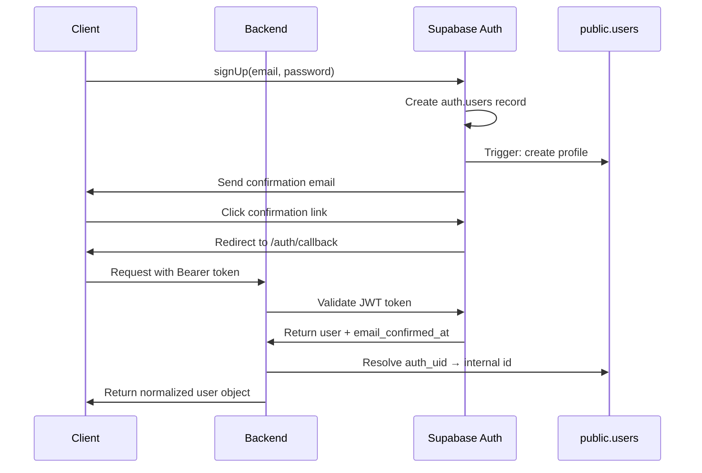
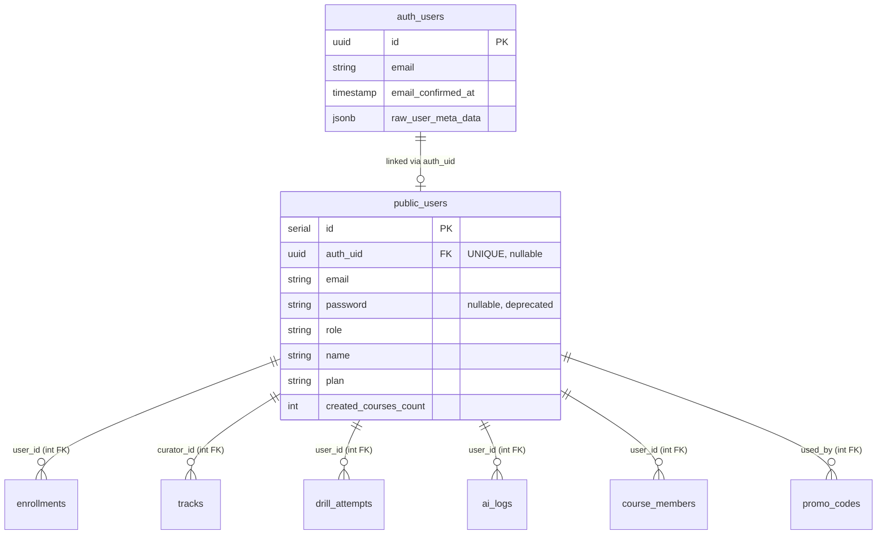

# Schema Migration & Auth Synchronization Design

## Overview

This design addresses authentication synchronization between Supabase Auth and the application's public schema, eliminating "Unexpected token Unauthorized" errors, fixing email confirmation flows, and establishing Supabase Auth as the single source of truth for authentication while maintaining backward compatibility with existing integer-based foreign keys.

## Problem Statement

### Current Issues

1. **Auth Desynchronization**: Supabase Auth (`auth.users`) and application tables (`public.users`) exist as separate, unsynchronized systems
2. **JSON Parse Errors**: Backend returns `res.sendStatus(401)` causing frontend to fail parsing with "Unexpected token … Unauthorized … is not valid JSON"
3. **Email Confirmation Failures**: 
   - `/auth/callback` returns 403 or `otp_expired` errors
   - Direct URL access to `/auth/callback` fails with 404 (SPA routing issue)
   - Email confirmation links don't complete successfully
4. **Dual Authentication Logic**: Password validation and email verification exist in both Supabase Auth and `public.users`, causing "incorrect password after registration" issues
5. **Foreign Key Dependencies**: All application tables reference `users.id` (serial integer), making a direct migration to UUID foreign keys disruptive

### Current Architecture Problems

- `public.users` stores password hashes (duplicating Supabase Auth responsibility)
- Email verification state tracked in both systems
- No linkage between `auth.users.id` (UUID) and `public.users.id` (serial)
- Inconsistent API error responses (plaintext vs JSON)
- Backend uses Passport.js session-based auth instead of JWT validation

## Target Architecture

### Authentication Flow



### Data Model Relationship



### Principles

1. **Single Source of Truth**: Supabase Auth owns email, password, and email verification status
2. **Profile Separation**: `public.users` serves as profile storage (role, plan, limits, preferences)
3. **Backward Compatible**: Existing integer FKs remain unchanged; `auth_uid` serves as bridge column
4. **JWT-Based**: Replace Passport.js session auth with Supabase JWT validation
5. **Consistent API**: All errors return JSON with `{ code, message }` structure

## Migration Strategy

### Phase 1: Schema Evolution (SQL Migrations)

#### A. Add Bridge Column

Add `auth_uid` to link `public.users` with `auth.users`:

**Migration: 0004_add_auth_uid_bridge.sql**

| Operation | Description | Blocking | Rollback Strategy |
|-----------|-------------|----------|-------------------|
| Add Column | `ALTER TABLE public.users ADD COLUMN auth_uid uuid` | No | Drop column |
| Create Index | `CREATE UNIQUE INDEX CONCURRENTLY idx_users_auth_uid_unique ON public.users(auth_uid) WHERE auth_uid IS NOT NULL` | No | Drop index |
| Add Index | `CREATE INDEX CONCURRENTLY idx_users_email_lower ON public.users(LOWER(email))` | No | Drop index |
| Relax Constraint | `ALTER TABLE public.users ALTER COLUMN password DROP NOT NULL` | Brief lock | Restore NOT NULL (if safe) |
| Add FK (optional) | `ALTER TABLE public.users ADD CONSTRAINT users_auth_uid_fkey FOREIGN KEY (auth_uid) REFERENCES auth.users(id) ON DELETE SET NULL` | Depends on permissions | Drop constraint |

**Note on Foreign Key**: If Supabase permissions block cross-schema FK, skip this constraint and rely on unique index + trigger validation.

#### B. Backfill Existing Users

Synchronize existing users by matching emails (case-insensitive):

**Operation**: Update `public.users.auth_uid` for existing matches

| Step | Query | Purpose |
|------|-------|---------|
| Link existing | `UPDATE public.users u SET auth_uid = a.id FROM auth.users a WHERE u.auth_uid IS NULL AND LOWER(u.email) = LOWER(a.email)` | Match by email |
| Diagnostic | `SELECT email FROM public.users WHERE auth_uid IS NULL` | Identify orphaned profiles |
| Diagnostic | `SELECT email FROM auth.users WHERE id NOT IN (SELECT auth_uid FROM public.users WHERE auth_uid IS NOT NULL)` | Identify auth users without profiles |

**Expected Outcome**: Most existing users linked; orphaned records logged for manual review.

#### C. Auto-Create Profile Trigger

Ensure every new Supabase Auth user automatically gets a profile:

**Function: `public.handle_new_auth_user()`**

Trigger on `auth.users` INSERT:

| Scenario | Action |
|----------|--------|
| Profile exists with matching email | Update `auth_uid` if null |
| Profile doesn't exist | Insert new profile with email, name (from metadata), role='employee', password=NULL |
| Name missing in metadata | Use email prefix as default name |
| Role in metadata | Use it; default to 'employee' |

**Trigger Creation**:
```
CREATE TRIGGER on_auth_user_created
AFTER INSERT ON auth.users
FOR EACH ROW
EXECUTE FUNCTION public.handle_new_auth_user();
```

#### D. Email Sync Trigger (Optional but Recommended)

Keep email in sync if changed in Supabase Auth:

**Function: `public.sync_auth_email()`**

Trigger on `auth.users` UPDATE when email changes:

| Condition | Action |
|-----------|--------|
| Email changed in auth.users | Update `public.users.email` where `auth_uid = NEW.id` |

#### E. Unique Constraints Audit

Ensure application constraints prevent data corruption:

| Table | Constraint | Status |
|-------|------------|--------|
| enrollments | UNIQUE(user_id, track_id) | To be added if missing |
| course_members | UNIQUE(course_id, user_id) | Already exists |
| tracks | UNIQUE(join_code) | Already exists |

### Phase 2: Backend Authentication Refactor

#### A. JWT Middleware Architecture

Replace Passport.js with Supabase JWT validation.

**New Middleware: `authFromSupabase()`**

Applied before all route handlers.

| Step | Implementation | Error Handling |
|------|----------------|----------------|
| Extract Token | `Authorization: Bearer <token>` from request header | If missing, set `req.user = undefined` (allow requireAuth to handle) |
| Validate Token | `supabase.auth.getUser(token)` using anon key client-side or service key server-side | Return `401 { code: "UNAUTHORIZED", message: "Unauthorized" }` |
| Extract Auth Data | Get `auth_uid`, `email`, `email_confirmed_at` from validated user | Log error and return 401 |
| Resolve Profile | `SELECT * FROM public.users WHERE auth_uid = $1` | If not found, attempt email match or create |
| Create if Missing | If no profile: check email match, update `auth_uid`, or INSERT new profile | Transaction ensures consistency |
| Normalize User | Set `req.user = { id, auth_uid, email, role, name, emailConfirmed: !!email_confirmed_at }` | Compatible with existing code expectations |
| Backward Compat | `req.isAuthenticated = () => !!req.user` | Maintains Passport.js API surface |

**Supabase Client Configuration**:
- Use `@supabase/supabase-js` with anon key
- Do NOT require service role for token validation (client can self-validate)
- Server uses service role only for admin operations (user creation fallback)

#### B. Authorization Guard

**New Middleware: `requireAuth(options)`**

Options:
- `requireConfirmedEmail: boolean` (default: true)
- `role?: 'curator' | 'employee'`

| Check | Condition | Response |
|-------|-----------|----------|
| Authentication | `!req.user` | `401 { code: "UNAUTHORIZED", message: "Unauthorized" }` |
| Email Confirmation | `requireConfirmedEmail && !req.user.emailConfirmed` | `403 { code: "EMAIL_NOT_CONFIRMED", message: "Подтвердите email" }` |
| Role | `role && req.user.role !== role` | `403 { code: "FORBIDDEN", message: "Доступ запрещён" }` |

**Usage Pattern**:
```
app.get('/api/tracks/list', authFromSupabase(), requireAuth({ requireConfirmedEmail: true }), async (req, res) => { ... })
```

#### C. Global sendStatus Elimination

Replace all plaintext status responses with structured JSON.

| Current Pattern | Replacement | Files Affected |
|----------------|-------------|----------------|
| `res.sendStatus(401)` | `res.status(401).json({ code: "UNAUTHORIZED", message: "Unauthorized" })` | server/auth.ts, server/routes.ts (22+ occurrences) |
| `res.sendStatus(403)` | `res.status(403).json({ code: "FORBIDDEN", message: "Forbidden" })` | server/routes.ts |
| Manual auth checks | `requireAuth()` middleware | All protected routes |

**Error Handler Enhancement**:

Add global error handler to catch unhandled exceptions:

```
app.use((err, req, res, next) => {
  logger.error('Unhandled error', { error: err, requestId: req.id });
  res.status(500).json({ 
    code: "INTERNAL_ERROR", 
    message: "Ошибка сервера" 
  });
});
```

#### D. Remove Passport.js Dependencies

| Component | Action | Timing |
|-----------|--------|--------|
| Passport strategies | Delete LocalStrategy, remove passport imports | After JWT middleware is stable |
| Session middleware | Remove express-session | After all routes use JWT |
| /api/login endpoint | Deprecate (client uses supabase.auth.signInWithPassword) | Immediately |
| /api/register endpoint | Deprecate (client uses supabase.auth.signUp) | Immediately |
| /api/logout endpoint | Simplify (client clears supabase session) | Immediately |
| /api/user endpoint | Rename to /api/me, return req.user | Immediately |

**Note**: Keep endpoints for backward compatibility initially; add deprecation warnings in responses.

### Phase 3: Email Confirmation Flow Fix

#### A. Supabase URL Configuration

**Dashboard Settings** (Auth → URL Configuration):

| Environment | SITE_URL | Redirect URLs |
|-------------|----------|---------------|
| Local | `http://localhost:5000` | `http://localhost:5000/auth/callback` |
| Production | `https://adapt-defis.ai.ru` | `https://adapt-defis.ai.ru/auth/callback` |

**Environment Variables**:

| Variable | Purpose | Example |
|----------|---------|---------|
| APP_URL | Base URL for email links | `http://localhost:5000` |
| SUPABASE_ANON_KEY | Client-side Supabase operations | From dashboard |
| DATABASE_FILE_STORAGE_URL | Supabase project URL | `https://xxx.supabase.co` |

#### B. SPA Fallback Routing

Ensure `/auth/callback` serves the SPA on direct access.

**Server-Side (Express)**:

| Route | Handler | Purpose |
|-------|---------|---------|
| GET /auth/callback (server) | Remove or make it return 200 with minimal response | Allow frontend to handle |
| GET * (fallback) | Serve `index.html` for unmatched routes | Enable client-side routing |

**Implementation**:
- In development: Vite proxy handles SPA fallback automatically
- In production: Express must serve `index.html` for all non-API routes
- Verify with: `curl -I http://localhost:5000/auth/callback` should return 200 with HTML

#### C. Frontend /auth/callback Logic

**File**: `client/src/pages/auth-callback.tsx`

Current implementation already handles:
- Hash params (`#access_token=...`)
- Query params (`?code=...` for PKCE)
- Error codes (`otp_expired`, `access_denied`)

**Enhancement Needed**:

| Scenario | Current | Enhancement |
|----------|---------|-------------|
| otp_expired | Shows generic error | Provide clear "Link expired" message with resend button |
| Missing params | Shows "no params" | Offer resend form immediately |
| Success | Redirects to /auth?verified=true | Call `/api/me` to verify backend sees session before redirect |

**UX for Expired Links**:

| Element | Purpose |
|---------|---------|
| Error message | "Ссылка устарела или уже использована" |
| Email input field | Allow user to enter email |
| Resend button | Call `supabase.auth.resend({ type: 'signup', email })` |
| Login link | Redirect to `/auth` for users who want to login instead |

#### D. Supabase Settings Verification

**Email Auth Settings** (Dashboard → Auth → Email):

| Setting | Recommended Value | Reason |
|---------|-------------------|--------|
| Enable Email Signup | ✅ Enabled | Required for registration |
| Confirm Email | ✅ Enabled | Security requirement |
| Secure Email Change | ✅ Enabled | Prevent email hijacking |
| Email Link Validity | 24 hours | Balance security and UX |

### Phase 4: Password Validation Consolidation

#### A. Remove Local Password Checks

**Affected Components**:

| Component | Change | Rationale |
|-----------|--------|-----------|
| server/auth.ts | Remove `comparePasswords()` usage in LocalStrategy | Supabase Auth validates passwords |
| client auth flow | Use `supabase.auth.signInWithPassword()` exclusively | Single auth source |
| server/auth.ts `/api/register` | Deprecate; return 410 Gone or redirect to docs | Client should use Supabase SDK |
| server/auth.ts `/api/login` | Deprecate; return 410 Gone or redirect to docs | Client should use Supabase SDK |

#### B. Client-Side Auth Pattern

**Registration Flow**:

| Step | Action | Error Handling |
|------|--------|----------------|
| Form submit | `supabase.auth.signUp({ email, password, options: { data: { name, role } } })` | Display Supabase error message |
| Success | Show "Check your email" message | Guide user to email |
| Email click | Supabase redirects to /auth/callback | Frontend handles token/code |

**Login Flow**:

| Step | Action | Error Handling |
|------|--------|----------------|
| Form submit | `supabase.auth.signInWithPassword({ email, password })` | Check `error.message` |
| Email not confirmed | Display "Email not confirmed" with resend button | Call `supabase.auth.resend()` |
| Success | Store session; navigate to app | Backend middleware validates JWT automatically |

**Session Management**:

| Action | Implementation |
|--------|----------------|
| Get session | `supabase.auth.getSession()` on app load |
| Refresh token | Automatic via Supabase client |
| Logout | `supabase.auth.signOut()` + clear local state |
| API requests | Include session access_token in Authorization header |

### Phase 5: Integration Testing Strategy

#### A. Test Scenarios

| Test Case | Setup | Expected Result |
|-----------|-------|-----------------|
| API without token | Call `/api/tracks/list` with no Authorization header | 401 JSON response with `{ code: "UNAUTHORIZED" }` |
| API with invalid token | Call with fake JWT | 401 JSON response |
| API with valid token, unconfirmed email | Valid JWT but `email_confirmed_at` is null | 403 JSON response with `{ code: "EMAIL_NOT_CONFIRMED" }` |
| API with confirmed user | Valid JWT and confirmed email | 200 with data |
| New auth user | Insert into `auth.users` | Trigger creates profile in `public.users` with `auth_uid` set |
| Backfill | Run backfill query | Existing users have `auth_uid` populated |
| Duplicate prevention | Attempt to enroll user in same track twice | Constraint error or graceful handling |
| Role enforcement | Employee tries curator endpoint | 403 with `{ code: "FORBIDDEN" }` |

#### B. Test Implementation Options

| Approach | Pros | Cons |
|----------|------|------|
| Supertest + Mock Supabase | Fast, no external dependencies | Doesn't test real auth flow |
| Integration with test Supabase project | Tests real flow | Requires test credentials |
| E2E with Playwright | Tests full user journey | Slower, more complex |

**Recommended Approach**: Supertest for API contracts + manual E2E for email flow verification.

#### C. Test Fixtures

| Fixture | Data | Purpose |
|---------|------|---------|
| Valid JWT | Mocked or from test Supabase user | Test authenticated requests |
| Unconfirmed user JWT | JWT with no `email_confirmed_at` | Test confirmation enforcement |
| Expired token | Past exp claim | Test token validation |
| Role test users | Curator and employee accounts | Test role guards |

## Implementation Checklist

### Database Migrations

- [ ] Create migration 0004_add_auth_uid_bridge.sql
  - [ ] Add `auth_uid` column (nullable UUID)
  - [ ] Create unique index on `auth_uid`
  - [ ] Create index on `LOWER(email)`
  - [ ] Make `password` nullable
  - [ ] Add FK to auth.users (if permissions allow)

- [ ] Create migration 0004_backfill_auth_uid.sql (data-only)
  - [ ] Update existing users with matching auth.users
  - [ ] Log diagnostics for orphaned records

- [ ] Create migration 0004_auth_triggers.sql
  - [ ] Create `handle_new_auth_user()` function
  - [ ] Create trigger on `auth.users` INSERT
  - [ ] Create `sync_auth_email()` function (optional)
  - [ ] Create trigger on `auth.users` UPDATE

- [ ] Create migration 0004_unique_constraints.sql
  - [ ] Add UNIQUE(user_id, track_id) to enrollments if missing

### Backend Implementation

- [ ] Create `server/middleware/auth-supabase.ts`
  - [ ] Implement `authFromSupabase()` middleware
  - [ ] Implement `requireAuth(options)` guard
  - [ ] Add Supabase client initialization

- [ ] Update `server/index.ts`
  - [ ] Add `authFromSupabase()` before routes
  - [ ] Add global error handler

- [ ] Refactor `server/auth.ts`
  - [ ] Deprecate `/api/register` (return 410 or migration guide)
  - [ ] Deprecate `/api/login` (return 410 or migration guide)
  - [ ] Keep `/api/logout` (simplify to clear session hint)
  - [ ] Rename `/api/user` to `/api/me`
  - [ ] Remove Passport.js setup (after migration period)

- [ ] Refactor `server/routes.ts`
  - [ ] Replace all `sendStatus(401)` with JSON responses (22 occurrences)
  - [ ] Replace all `sendStatus(403)` with JSON responses (2 occurrences)
  - [ ] Replace manual `req.isAuthenticated()` checks with `requireAuth()`
  - [ ] Add role-specific guards where needed

- [ ] Update `server/ai/routes.ts` and `server/ai/roleplay-routes.ts`
  - [ ] Apply same sendStatus replacement pattern
  - [ ] Add auth guards

### Frontend Implementation

- [ ] Update `client/src/lib/supabase.ts`
  - [ ] Ensure proper client initialization
  - [ ] Export helper for adding auth header to fetch

- [ ] Update `client/src/pages/auth.tsx`
  - [ ] Use `supabase.auth.signUp()` for registration
  - [ ] Use `supabase.auth.signInWithPassword()` for login
  - [ ] Remove calls to `/api/register` and `/api/login`
  - [ ] Handle "email not confirmed" error with resend option

- [ ] Enhance `client/src/pages/auth-callback.tsx`
  - [ ] Improve error message for `otp_expired`
  - [ ] Add resend form to error state
  - [ ] Call `/api/me` after successful confirmation before redirect

- [ ] Update API client (`client/src/lib/api.ts` or similar)
  - [ ] Add Authorization header to all requests
  - [ ] Handle 401 by redirecting to login
  - [ ] Handle 403 EMAIL_NOT_CONFIRMED by showing confirmation prompt

### Configuration

- [ ] Update Supabase Dashboard settings
  - [ ] Set SITE_URL for each environment
  - [ ] Add redirect URLs for /auth/callback
  - [ ] Verify email auth settings (confirm enabled, 24hr validity)

- [ ] Update environment variables
  - [ ] Ensure APP_URL is set in .env
  - [ ] Verify SUPABASE_ANON_KEY is available
  - [ ] Document required variables in .env.example

- [ ] Update server routing
  - [ ] Ensure SPA fallback serves index.html for /auth/callback

### Testing

- [ ] Write integration tests
  - [ ] Test JWT validation (valid, invalid, missing)
  - [ ] Test email confirmation enforcement
  - [ ] Test role enforcement
  - [ ] Test JSON error responses

- [ ] Manual testing
  - [ ] Complete registration flow (local and prod)
  - [ ] Confirm email via link
  - [ ] Login after confirmation
  - [ ] Verify expired link behavior
  - [ ] Test API access without confirmation

- [ ] Verify trigger behavior
  - [ ] Create new user in Supabase Auth
  - [ ] Confirm profile created in public.users
  - [ ] Verify auth_uid is set

## Rollback Plan

| Phase | Rollback Action | Data Loss Risk |
|-------|----------------|----------------|
| Phase 1 (Schema) | Revert migrations in reverse order | None (columns remain) |
| Phase 2 (Backend) | Revert to Passport.js auth, re-enable old endpoints | None |
| Phase 3 (Email) | No rollback needed (config only) | None |
| Phase 4 (Password) | Re-enable local password checks temporarily | None |

**Critical Safeguards**:
- Do NOT drop `password` column (even though deprecated)
- Keep Passport.js code commented for 2 releases
- Maintain old endpoints with deprecation warnings for 1 month

## Success Criteria

| Criteria | Measurement | Target |
|----------|-------------|--------|
| Auth sync | All users have valid `auth_uid` | 100% |
| API errors | No plaintext status responses | 0 occurrences |
| Email confirmation | Users can confirm email on first try | >95% success rate |
| Password issues | "Wrong password after registration" reports | 0 reports |
| JWT validation | All authenticated requests use JWT | 100% |
| Backward compatibility | Existing int FK relationships work | No breaks |

## Performance Considerations

| Operation | Impact | Mitigation |
|-----------|--------|------------|
| JWT validation per request | +5-10ms | Acceptable for security gain; consider caching user lookups |
| Profile resolution query | +2-5ms | Index on auth_uid ensures fast lookup |
| Trigger on auth.users INSERT | +5-10ms | Lightweight; runs once per user |
| Backfill migration | 1-5s for 1000 users | Run during low-traffic window |

## Security Improvements

| Improvement | Before | After |
|-------------|--------|-------|
| Password storage | Duplicated in public.users | Only in Supabase Auth (managed, rotated keys) |
| Session management | Stateful server sessions | Stateless JWT (horizontally scalable) |
| Email verification | Custom tokens (potential vulnerabilities) | Supabase managed OTP (security hardened) |
| Token exposure | Passwords in application logs | JWTs are opaque, validated externally |

## Documentation Requirements

| Document | Audience | Content |
|----------|----------|---------|
| Migration Guide | Developers | Step-by-step execution, rollback procedures |
| API Changes | Frontend developers | New auth header requirements, deprecated endpoints |
| Environment Setup | DevOps | Required Supabase settings, environment variables |
| User Impact | Support team | What changed for end users, troubleshooting expired links |

## Post-Migration Monitoring

| Metric | Alert Threshold | Action |
|--------|----------------|--------|
| 401 error rate | >5% of requests | Check JWT validation logic |
| 403 EMAIL_NOT_CONFIRMED rate | >10% of authenticated requests | Investigate email delivery |
| Profile creation failures | >1% | Check trigger execution |
| auth_uid null count | >0 after backfill | Re-run backfill or manual fix |

## Dependencies

| Dependency | Version | Purpose |
|------------|---------|---------|
| @supabase/supabase-js | Latest stable | JWT validation, auth operations |
| express | Current | Middleware integration |
| drizzle-orm | Current | Database queries |

## Timeline Estimate

| Phase | Estimated Duration | Dependencies |
|-------|-------------------|--------------|
| Phase 1: Schema | 2-3 hours | Database access, low-traffic window |
| Phase 2: Backend | 4-6 hours | Phase 1 complete |
| Phase 3: Email Flow | 2-3 hours | Supabase dashboard access |
| Phase 4: Password | 2-3 hours | Phase 2 complete |
| Phase 5: Testing | 3-4 hours | All phases complete |
| **Total** | **13-19 hours** | Single PR, iterative deployment |

## Notes

- All changes are backward compatible during migration period
- No existing foreign keys are modified
- `auth_uid` column can be populated incrementally without blocking operations
- Triggers ensure new users are always synchronized
- Old Passport.js code can remain dormant for emergency rollback
    participant public.users

    Client->>Supabase Auth: signUp(email, password)
    Supabase Auth->>Supabase Auth: Create auth.users record
    Supabase Auth->>public.users: Trigger: create profile
    Supabase Auth->>Client: Send confirmation email
    Client->>Supabase Auth: Click confirmation link
    Supabase Auth->>Client: Redirect to /auth/callback
    Client->>Backend: Request with Bearer token
    Backend->>Supabase Auth: Validate JWT token
    Supabase Auth->>Backend: Return user + email_confirmed_at
    Backend->>public.users: Resolve auth_uid → internal id
    Backend->>Client: Return normalized user object
```

### Data Model Relationship


### Principles

1. **Single Source of Truth**: Supabase Auth owns email, password, and email verification status
2. **Profile Separation**: `public.users` serves as profile storage (role, plan, limits, preferences)
3. **Backward Compatible**: Existing integer FKs remain unchanged; `auth_uid` serves as bridge column
4. **JWT-Based**: Replace Passport.js session auth with Supabase JWT validation
5. **Consistent API**: All errors return JSON with `{ code, message }` structure

## Migration Strategy

### Phase 1: Schema Evolution (SQL Migrations)

#### A. Add Bridge Column

Add `auth_uid` to link `public.users` with `auth.users`:

**Migration: 0004_add_auth_uid_bridge.sql**

| Operation | Description | Blocking | Rollback Strategy |
|-----------|-------------|----------|-------------------|
| Add Column | `ALTER TABLE public.users ADD COLUMN auth_uid uuid` | No | Drop column |
| Create Index | `CREATE UNIQUE INDEX CONCURRENTLY idx_users_auth_uid_unique ON public.users(auth_uid) WHERE auth_uid IS NOT NULL` | No | Drop index |
| Add Index | `CREATE INDEX CONCURRENTLY idx_users_email_lower ON public.users(LOWER(email))` | No | Drop index |
| Relax Constraint | `ALTER TABLE public.users ALTER COLUMN password DROP NOT NULL` | Brief lock | Restore NOT NULL (if safe) |
| Add FK (optional) | `ALTER TABLE public.users ADD CONSTRAINT users_auth_uid_fkey FOREIGN KEY (auth_uid) REFERENCES auth.users(id) ON DELETE SET NULL` | Depends on permissions | Drop constraint |

**Note on Foreign Key**: If Supabase permissions block cross-schema FK, skip this constraint and rely on unique index + trigger validation.

#### B. Backfill Existing Users

Synchronize existing users by matching emails (case-insensitive):

**Operation**: Update `public.users.auth_uid` for existing matches

| Step | Query | Purpose |
|------|-------|---------|
| Link existing | `UPDATE public.users u SET auth_uid = a.id FROM auth.users a WHERE u.auth_uid IS NULL AND LOWER(u.email) = LOWER(a.email)` | Match by email |
| Diagnostic | `SELECT email FROM public.users WHERE auth_uid IS NULL` | Identify orphaned profiles |
| Diagnostic | `SELECT email FROM auth.users WHERE id NOT IN (SELECT auth_uid FROM public.users WHERE auth_uid IS NOT NULL)` | Identify auth users without profiles |

**Expected Outcome**: Most existing users linked; orphaned records logged for manual review.

#### C. Auto-Create Profile Trigger

Ensure every new Supabase Auth user automatically gets a profile:

**Function: `public.handle_new_auth_user()`**

Trigger on `auth.users` INSERT:

| Scenario | Action |
|----------|--------|
| Profile exists with matching email | Update `auth_uid` if null |
| Profile doesn't exist | Insert new profile with email, name (from metadata), role='employee', password=NULL |
| Name missing in metadata | Use email prefix as default name |
| Role in metadata | Use it; default to 'employee' |

**Trigger Creation**:
```
CREATE TRIGGER on_auth_user_created
AFTER INSERT ON auth.users
FOR EACH ROW
EXECUTE FUNCTION public.handle_new_auth_user();
```

#### D. Email Sync Trigger (Optional but Recommended)

Keep email in sync if changed in Supabase Auth:

**Function: `public.sync_auth_email()`**

Trigger on `auth.users` UPDATE when email changes:

| Condition | Action |
|-----------|--------|
| Email changed in auth.users | Update `public.users.email` where `auth_uid = NEW.id` |

#### E. Unique Constraints Audit

Ensure application constraints prevent data corruption:

| Table | Constraint | Status |
|-------|------------|--------|
| enrollments | UNIQUE(user_id, track_id) | To be added if missing |
| course_members | UNIQUE(course_id, user_id) | Already exists |
| tracks | UNIQUE(join_code) | Already exists |

### Phase 2: Backend Authentication Refactor

#### A. JWT Middleware Architecture

Replace Passport.js with Supabase JWT validation.

**New Middleware: `authFromSupabase()`**

Applied before all route handlers.

| Step | Implementation | Error Handling |
|------|----------------|----------------|
| Extract Token | `Authorization: Bearer <token>` from request header | If missing, set `req.user = undefined` (allow requireAuth to handle) |
| Validate Token | `supabase.auth.getUser(token)` using anon key client-side or service key server-side | Return `401 { code: "UNAUTHORIZED", message: "Unauthorized" }` |
| Extract Auth Data | Get `auth_uid`, `email`, `email_confirmed_at` from validated user | Log error and return 401 |
| Resolve Profile | `SELECT * FROM public.users WHERE auth_uid = $1` | If not found, attempt email match or create |
| Create if Missing | If no profile: check email match, update `auth_uid`, or INSERT new profile | Transaction ensures consistency |
| Normalize User | Set `req.user = { id, auth_uid, email, role, name, emailConfirmed: !!email_confirmed_at }` | Compatible with existing code expectations |
| Backward Compat | `req.isAuthenticated = () => !!req.user` | Maintains Passport.js API surface |

**Supabase Client Configuration**:
- Use `@supabase/supabase-js` with anon key
- Do NOT require service role for token validation (client can self-validate)
- Server uses service role only for admin operations (user creation fallback)

#### B. Authorization Guard

**New Middleware: `requireAuth(options)`**

Options:
- `requireConfirmedEmail: boolean` (default: true)
- `role?: 'curator' | 'employee'`

| Check | Condition | Response |
|-------|-----------|----------|
| Authentication | `!req.user` | `401 { code: "UNAUTHORIZED", message: "Unauthorized" }` |
| Email Confirmation | `requireConfirmedEmail && !req.user.emailConfirmed` | `403 { code: "EMAIL_NOT_CONFIRMED", message: "Подтвердите email" }` |
| Role | `role && req.user.role !== role` | `403 { code: "FORBIDDEN", message: "Доступ запрещён" }` |

**Usage Pattern**:
```
app.get('/api/tracks/list', authFromSupabase(), requireAuth({ requireConfirmedEmail: true }), async (req, res) => { ... })
```

#### C. Global sendStatus Elimination

Replace all plaintext status responses with structured JSON.

| Current Pattern | Replacement | Files Affected |
|----------------|-------------|----------------|
| `res.sendStatus(401)` | `res.status(401).json({ code: "UNAUTHORIZED", message: "Unauthorized" })` | server/auth.ts, server/routes.ts (22+ occurrences) |
| `res.sendStatus(403)` | `res.status(403).json({ code: "FORBIDDEN", message: "Forbidden" })` | server/routes.ts |
| Manual auth checks | `requireAuth()` middleware | All protected routes |

**Error Handler Enhancement**:

Add global error handler to catch unhandled exceptions:

```
app.use((err, req, res, next) => {
  logger.error('Unhandled error', { error: err, requestId: req.id });
  res.status(500).json({ 
    code: "INTERNAL_ERROR", 
    message: "Ошибка сервера" 
  });
});
```

#### D. Remove Passport.js Dependencies

| Component | Action | Timing |
|-----------|--------|--------|
| Passport strategies | Delete LocalStrategy, remove passport imports | After JWT middleware is stable |
| Session middleware | Remove express-session | After all routes use JWT |
| /api/login endpoint | Deprecate (client uses supabase.auth.signInWithPassword) | Immediately |
| /api/register endpoint | Deprecate (client uses supabase.auth.signUp) | Immediately |
| /api/logout endpoint | Simplify (client clears supabase session) | Immediately |
| /api/user endpoint | Rename to /api/me, return req.user | Immediately |

**Note**: Keep endpoints for backward compatibility initially; add deprecation warnings in responses.

### Phase 3: Email Confirmation Flow Fix

#### A. Supabase URL Configuration

**Dashboard Settings** (Auth → URL Configuration):

| Environment | SITE_URL | Redirect URLs |
|-------------|----------|---------------|
| Local | `http://localhost:5000` | `http://localhost:5000/auth/callback` |
| Production | `https://adapt-defis.ai.ru` | `https://adapt-defis.ai.ru/auth/callback` |

**Environment Variables**:

| Variable | Purpose | Example |
|----------|---------|---------|
| APP_URL | Base URL for email links | `http://localhost:5000` |
| SUPABASE_ANON_KEY | Client-side Supabase operations | From dashboard |
| DATABASE_FILE_STORAGE_URL | Supabase project URL | `https://xxx.supabase.co` |

#### B. SPA Fallback Routing

Ensure `/auth/callback` serves the SPA on direct access.

**Server-Side (Express)**:

| Route | Handler | Purpose |
|-------|---------|---------|
| GET /auth/callback (server) | Remove or make it return 200 with minimal response | Allow frontend to handle |
| GET * (fallback) | Serve `index.html` for unmatched routes | Enable client-side routing |

**Implementation**:
- In development: Vite proxy handles SPA fallback automatically
- In production: Express must serve `index.html` for all non-API routes
- Verify with: `curl -I http://localhost:5000/auth/callback` should return 200 with HTML

#### C. Frontend /auth/callback Logic

**File**: `client/src/pages/auth-callback.tsx`

Current implementation already handles:
- Hash params (`#access_token=...`)
- Query params (`?code=...` for PKCE)
- Error codes (`otp_expired`, `access_denied`)

**Enhancement Needed**:

| Scenario | Current | Enhancement |
|----------|---------|-------------|
| otp_expired | Shows generic error | Provide clear "Link expired" message with resend button |
| Missing params | Shows "no params" | Offer resend form immediately |
| Success | Redirects to /auth?verified=true | Call `/api/me` to verify backend sees session before redirect |

**UX for Expired Links**:

| Element | Purpose |
|---------|---------|
| Error message | "Ссылка устарела или уже использована" |
| Email input field | Allow user to enter email |
| Resend button | Call `supabase.auth.resend({ type: 'signup', email })` |
| Login link | Redirect to `/auth` for users who want to login instead |

#### D. Supabase Settings Verification

**Email Auth Settings** (Dashboard → Auth → Email):

| Setting | Recommended Value | Reason |
|---------|-------------------|--------|
| Enable Email Signup | ✅ Enabled | Required for registration |
| Confirm Email | ✅ Enabled | Security requirement |
| Secure Email Change | ✅ Enabled | Prevent email hijacking |
| Email Link Validity | 24 hours | Balance security and UX |

### Phase 4: Password Validation Consolidation

#### A. Remove Local Password Checks

**Affected Components**:

| Component | Change | Rationale |
|-----------|--------|-----------|
| server/auth.ts | Remove `comparePasswords()` usage in LocalStrategy | Supabase Auth validates passwords |
| client auth flow | Use `supabase.auth.signInWithPassword()` exclusively | Single auth source |
| server/auth.ts `/api/register` | Deprecate; return 410 Gone or redirect to docs | Client should use Supabase SDK |
| server/auth.ts `/api/login` | Deprecate; return 410 Gone or redirect to docs | Client should use Supabase SDK |

#### B. Client-Side Auth Pattern

**Registration Flow**:

| Step | Action | Error Handling |
|------|--------|----------------|
| Form submit | `supabase.auth.signUp({ email, password, options: { data: { name, role } } })` | Display Supabase error message |
| Success | Show "Check your email" message | Guide user to email |
| Email click | Supabase redirects to /auth/callback | Frontend handles token/code |

**Login Flow**:

| Step | Action | Error Handling |
|------|--------|----------------|
| Form submit | `supabase.auth.signInWithPassword({ email, password })` | Check `error.message` |
| Email not confirmed | Display "Email not confirmed" with resend button | Call `supabase.auth.resend()` |
| Success | Store session; navigate to app | Backend middleware validates JWT automatically |

**Session Management**:

| Action | Implementation |
|--------|----------------|
| Get session | `supabase.auth.getSession()` on app load |
| Refresh token | Automatic via Supabase client |
| Logout | `supabase.auth.signOut()` + clear local state |
| API requests | Include session access_token in Authorization header |

### Phase 5: Integration Testing Strategy

#### A. Test Scenarios

| Test Case | Setup | Expected Result |
|-----------|-------|-----------------|
| API without token | Call `/api/tracks/list` with no Authorization header | 401 JSON response with `{ code: "UNAUTHORIZED" }` |
| API with invalid token | Call with fake JWT | 401 JSON response |
| API with valid token, unconfirmed email | Valid JWT but `email_confirmed_at` is null | 403 JSON response with `{ code: "EMAIL_NOT_CONFIRMED" }` |
| API with confirmed user | Valid JWT and confirmed email | 200 with data |
| New auth user | Insert into `auth.users` | Trigger creates profile in `public.users` with `auth_uid` set |
| Backfill | Run backfill query | Existing users have `auth_uid` populated |
| Duplicate prevention | Attempt to enroll user in same track twice | Constraint error or graceful handling |
| Role enforcement | Employee tries curator endpoint | 403 with `{ code: "FORBIDDEN" }` |

#### B. Test Implementation Options

| Approach | Pros | Cons |
|----------|------|------|
| Supertest + Mock Supabase | Fast, no external dependencies | Doesn't test real auth flow |
| Integration with test Supabase project | Tests real flow | Requires test credentials |
| E2E with Playwright | Tests full user journey | Slower, more complex |

**Recommended Approach**: Supertest for API contracts + manual E2E for email flow verification.

#### C. Test Fixtures

| Fixture | Data | Purpose |
|---------|------|---------|
| Valid JWT | Mocked or from test Supabase user | Test authenticated requests |
| Unconfirmed user JWT | JWT with no `email_confirmed_at` | Test confirmation enforcement |
| Expired token | Past exp claim | Test token validation |
| Role test users | Curator and employee accounts | Test role guards |

## Implementation Checklist

### Database Migrations

- [ ] Create migration 0004_add_auth_uid_bridge.sql
  - [ ] Add `auth_uid` column (nullable UUID)
  - [ ] Create unique index on `auth_uid`
  - [ ] Create index on `LOWER(email)`
  - [ ] Make `password` nullable
  - [ ] Add FK to auth.users (if permissions allow)

- [ ] Create migration 0004_backfill_auth_uid.sql (data-only)
  - [ ] Update existing users with matching auth.users
  - [ ] Log diagnostics for orphaned records

- [ ] Create migration 0004_auth_triggers.sql
  - [ ] Create `handle_new_auth_user()` function
  - [ ] Create trigger on `auth.users` INSERT
  - [ ] Create `sync_auth_email()` function (optional)
  - [ ] Create trigger on `auth.users` UPDATE

- [ ] Create migration 0004_unique_constraints.sql
  - [ ] Add UNIQUE(user_id, track_id) to enrollments if missing

### Backend Implementation

- [ ] Create `server/middleware/auth-supabase.ts`
  - [ ] Implement `authFromSupabase()` middleware
  - [ ] Implement `requireAuth(options)` guard
  - [ ] Add Supabase client initialization

- [ ] Update `server/index.ts`
  - [ ] Add `authFromSupabase()` before routes
  - [ ] Add global error handler

- [ ] Refactor `server/auth.ts`
  - [ ] Deprecate `/api/register` (return 410 or migration guide)
  - [ ] Deprecate `/api/login` (return 410 or migration guide)
  - [ ] Keep `/api/logout` (simplify to clear session hint)
  - [ ] Rename `/api/user` to `/api/me`
  - [ ] Remove Passport.js setup (after migration period)

- [ ] Refactor `server/routes.ts`
  - [ ] Replace all `sendStatus(401)` with JSON responses (22 occurrences)
  - [ ] Replace all `sendStatus(403)` with JSON responses (2 occurrences)
  - [ ] Replace manual `req.isAuthenticated()` checks with `requireAuth()`
  - [ ] Add role-specific guards where needed

- [ ] Update `server/ai/routes.ts` and `server/ai/roleplay-routes.ts`
  - [ ] Apply same sendStatus replacement pattern
  - [ ] Add auth guards

### Frontend Implementation

- [ ] Update `client/src/lib/supabase.ts`
  - [ ] Ensure proper client initialization
  - [ ] Export helper for adding auth header to fetch

- [ ] Update `client/src/pages/auth.tsx`
  - [ ] Use `supabase.auth.signUp()` for registration
  - [ ] Use `supabase.auth.signInWithPassword()` for login
  - [ ] Remove calls to `/api/register` and `/api/login`
  - [ ] Handle "email not confirmed" error with resend option

- [ ] Enhance `client/src/pages/auth-callback.tsx`
  - [ ] Improve error message for `otp_expired`
  - [ ] Add resend form to error state
  - [ ] Call `/api/me` after successful confirmation before redirect

- [ ] Update API client (`client/src/lib/api.ts` or similar)
  - [ ] Add Authorization header to all requests
  - [ ] Handle 401 by redirecting to login
  - [ ] Handle 403 EMAIL_NOT_CONFIRMED by showing confirmation prompt

### Configuration

- [ ] Update Supabase Dashboard settings
  - [ ] Set SITE_URL for each environment
  - [ ] Add redirect URLs for /auth/callback
  - [ ] Verify email auth settings (confirm enabled, 24hr validity)

- [ ] Update environment variables
  - [ ] Ensure APP_URL is set in .env
  - [ ] Verify SUPABASE_ANON_KEY is available
  - [ ] Document required variables in .env.example

- [ ] Update server routing
  - [ ] Ensure SPA fallback serves index.html for /auth/callback

### Testing

- [ ] Write integration tests
  - [ ] Test JWT validation (valid, invalid, missing)
  - [ ] Test email confirmation enforcement
  - [ ] Test role enforcement
  - [ ] Test JSON error responses

- [ ] Manual testing
  - [ ] Complete registration flow (local and prod)
  - [ ] Confirm email via link
  - [ ] Login after confirmation
  - [ ] Verify expired link behavior
  - [ ] Test API access without confirmation

- [ ] Verify trigger behavior
  - [ ] Create new user in Supabase Auth
  - [ ] Confirm profile created in public.users
  - [ ] Verify auth_uid is set

## Rollback Plan

| Phase | Rollback Action | Data Loss Risk |
|-------|----------------|----------------|
| Phase 1 (Schema) | Revert migrations in reverse order | None (columns remain) |
| Phase 2 (Backend) | Revert to Passport.js auth, re-enable old endpoints | None |
| Phase 3 (Email) | No rollback needed (config only) | None |
| Phase 4 (Password) | Re-enable local password checks temporarily | None |

**Critical Safeguards**:
- Do NOT drop `password` column (even though deprecated)
- Keep Passport.js code commented for 2 releases
- Maintain old endpoints with deprecation warnings for 1 month

## Success Criteria

| Criteria | Measurement | Target |
|----------|-------------|--------|
| Auth sync | All users have valid `auth_uid` | 100% |
| API errors | No plaintext status responses | 0 occurrences |
| Email confirmation | Users can confirm email on first try | >95% success rate |
| Password issues | "Wrong password after registration" reports | 0 reports |
| JWT validation | All authenticated requests use JWT | 100% |
| Backward compatibility | Existing int FK relationships work | No breaks |

## Performance Considerations

| Operation | Impact | Mitigation |
|-----------|--------|------------|
| JWT validation per request | +5-10ms | Acceptable for security gain; consider caching user lookups |
| Profile resolution query | +2-5ms | Index on auth_uid ensures fast lookup |
| Trigger on auth.users INSERT | +5-10ms | Lightweight; runs once per user |
| Backfill migration | 1-5s for 1000 users | Run during low-traffic window |

## Security Improvements

| Improvement | Before | After |
|-------------|--------|-------|
| Password storage | Duplicated in public.users | Only in Supabase Auth (managed, rotated keys) |
| Session management | Stateful server sessions | Stateless JWT (horizontally scalable) |
| Email verification | Custom tokens (potential vulnerabilities) | Supabase managed OTP (security hardened) |
| Token exposure | Passwords in application logs | JWTs are opaque, validated externally |

## Documentation Requirements

| Document | Audience | Content |
|----------|----------|---------|
| Migration Guide | Developers | Step-by-step execution, rollback procedures |
| API Changes | Frontend developers | New auth header requirements, deprecated endpoints |
| Environment Setup | DevOps | Required Supabase settings, environment variables |
| User Impact | Support team | What changed for end users, troubleshooting expired links |

## Post-Migration Monitoring

| Metric | Alert Threshold | Action |
|--------|----------------|--------|
| 401 error rate | >5% of requests | Check JWT validation logic |
| 403 EMAIL_NOT_CONFIRMED rate | >10% of authenticated requests | Investigate email delivery |
| Profile creation failures | >1% | Check trigger execution |
| auth_uid null count | >0 after backfill | Re-run backfill or manual fix |

## Dependencies

| Dependency | Version | Purpose |
|------------|---------|---------|
| @supabase/supabase-js | Latest stable | JWT validation, auth operations |
| express | Current | Middleware integration |
| drizzle-orm | Current | Database queries |

## Timeline Estimate

| Phase | Estimated Duration | Dependencies |
|-------|-------------------|--------------|
| Phase 1: Schema | 2-3 hours | Database access, low-traffic window |
| Phase 2: Backend | 4-6 hours | Phase 1 complete |
| Phase 3: Email Flow | 2-3 hours | Supabase dashboard access |
| Phase 4: Password | 2-3 hours | Phase 2 complete |
| Phase 5: Testing | 3-4 hours | All phases complete |
| **Total** | **13-19 hours** | Single PR, iterative deployment |

## Notes

- All changes are backward compatible during migration period
- No existing foreign keys are modified
- `auth_uid` column can be populated incrementally without blocking operations
- Triggers ensure new users are always synchronized
- Old Passport.js code can remain dormant for emergency rollback
    participant public.users

    Client->>Supabase Auth: signUp(email, password)
    Supabase Auth->>Supabase Auth: Create auth.users record
    Supabase Auth->>public.users: Trigger: create profile
    Supabase Auth->>Client: Send confirmation email
    Client->>Supabase Auth: Click confirmation link
    Supabase Auth->>Client: Redirect to /auth/callback
    Client->>Backend: Request with Bearer token
    Backend->>Supabase Auth: Validate JWT token
    Supabase Auth->>Backend: Return user + email_confirmed_at
    Backend->>public.users: Resolve auth_uid → internal id
    Backend->>Client: Return normalized user object
```

### Data Model Relationship


### Principles

1. **Single Source of Truth**: Supabase Auth owns email, password, and email verification status
2. **Profile Separation**: `public.users` serves as profile storage (role, plan, limits, preferences)
3. **Backward Compatible**: Existing integer FKs remain unchanged; `auth_uid` serves as bridge column
4. **JWT-Based**: Replace Passport.js session auth with Supabase JWT validation
5. **Consistent API**: All errors return JSON with `{ code, message }` structure

## Migration Strategy

### Phase 1: Schema Evolution (SQL Migrations)

#### A. Add Bridge Column

Add `auth_uid` to link `public.users` with `auth.users`:

**Migration: 0004_add_auth_uid_bridge.sql**

| Operation | Description | Blocking | Rollback Strategy |
|-----------|-------------|----------|-------------------|
| Add Column | `ALTER TABLE public.users ADD COLUMN auth_uid uuid` | No | Drop column |
| Create Index | `CREATE UNIQUE INDEX CONCURRENTLY idx_users_auth_uid_unique ON public.users(auth_uid) WHERE auth_uid IS NOT NULL` | No | Drop index |
| Add Index | `CREATE INDEX CONCURRENTLY idx_users_email_lower ON public.users(LOWER(email))` | No | Drop index |
| Relax Constraint | `ALTER TABLE public.users ALTER COLUMN password DROP NOT NULL` | Brief lock | Restore NOT NULL (if safe) |
| Add FK (optional) | `ALTER TABLE public.users ADD CONSTRAINT users_auth_uid_fkey FOREIGN KEY (auth_uid) REFERENCES auth.users(id) ON DELETE SET NULL` | Depends on permissions | Drop constraint |

**Note on Foreign Key**: If Supabase permissions block cross-schema FK, skip this constraint and rely on unique index + trigger validation.

#### B. Backfill Existing Users

Synchronize existing users by matching emails (case-insensitive):

**Operation**: Update `public.users.auth_uid` for existing matches

| Step | Query | Purpose |
|------|-------|---------|
| Link existing | `UPDATE public.users u SET auth_uid = a.id FROM auth.users a WHERE u.auth_uid IS NULL AND LOWER(u.email) = LOWER(a.email)` | Match by email |
| Diagnostic | `SELECT email FROM public.users WHERE auth_uid IS NULL` | Identify orphaned profiles |
| Diagnostic | `SELECT email FROM auth.users WHERE id NOT IN (SELECT auth_uid FROM public.users WHERE auth_uid IS NOT NULL)` | Identify auth users without profiles |

**Expected Outcome**: Most existing users linked; orphaned records logged for manual review.

#### C. Auto-Create Profile Trigger

Ensure every new Supabase Auth user automatically gets a profile:

**Function: `public.handle_new_auth_user()`**

Trigger on `auth.users` INSERT:

| Scenario | Action |
|----------|--------|
| Profile exists with matching email | Update `auth_uid` if null |
| Profile doesn't exist | Insert new profile with email, name (from metadata), role='employee', password=NULL |
| Name missing in metadata | Use email prefix as default name |
| Role in metadata | Use it; default to 'employee' |

**Trigger Creation**:
```
CREATE TRIGGER on_auth_user_created
AFTER INSERT ON auth.users
FOR EACH ROW
EXECUTE FUNCTION public.handle_new_auth_user();
```

#### D. Email Sync Trigger (Optional but Recommended)

Keep email in sync if changed in Supabase Auth:

**Function: `public.sync_auth_email()`**

Trigger on `auth.users` UPDATE when email changes:

| Condition | Action |
|-----------|--------|
| Email changed in auth.users | Update `public.users.email` where `auth_uid = NEW.id` |

#### E. Unique Constraints Audit

Ensure application constraints prevent data corruption:

| Table | Constraint | Status |
|-------|------------|--------|
| enrollments | UNIQUE(user_id, track_id) | To be added if missing |
| course_members | UNIQUE(course_id, user_id) | Already exists |
| tracks | UNIQUE(join_code) | Already exists |

### Phase 2: Backend Authentication Refactor

#### A. JWT Middleware Architecture

Replace Passport.js with Supabase JWT validation.

**New Middleware: `authFromSupabase()`**

Applied before all route handlers.

| Step | Implementation | Error Handling |
|------|----------------|----------------|
| Extract Token | `Authorization: Bearer <token>` from request header | If missing, set `req.user = undefined` (allow requireAuth to handle) |
| Validate Token | `supabase.auth.getUser(token)` using anon key client-side or service key server-side | Return `401 { code: "UNAUTHORIZED", message: "Unauthorized" }` |
| Extract Auth Data | Get `auth_uid`, `email`, `email_confirmed_at` from validated user | Log error and return 401 |
| Resolve Profile | `SELECT * FROM public.users WHERE auth_uid = $1` | If not found, attempt email match or create |
| Create if Missing | If no profile: check email match, update `auth_uid`, or INSERT new profile | Transaction ensures consistency |
| Normalize User | Set `req.user = { id, auth_uid, email, role, name, emailConfirmed: !!email_confirmed_at }` | Compatible with existing code expectations |
| Backward Compat | `req.isAuthenticated = () => !!req.user` | Maintains Passport.js API surface |

**Supabase Client Configuration**:
- Use `@supabase/supabase-js` with anon key
- Do NOT require service role for token validation (client can self-validate)
- Server uses service role only for admin operations (user creation fallback)

#### B. Authorization Guard

**New Middleware: `requireAuth(options)`**

Options:
- `requireConfirmedEmail: boolean` (default: true)
- `role?: 'curator' | 'employee'`

| Check | Condition | Response |
|-------|-----------|----------|
| Authentication | `!req.user` | `401 { code: "UNAUTHORIZED", message: "Unauthorized" }` |
| Email Confirmation | `requireConfirmedEmail && !req.user.emailConfirmed` | `403 { code: "EMAIL_NOT_CONFIRMED", message: "Подтвердите email" }` |
| Role | `role && req.user.role !== role` | `403 { code: "FORBIDDEN", message: "Доступ запрещён" }` |

**Usage Pattern**:
```
app.get('/api/tracks/list', authFromSupabase(), requireAuth({ requireConfirmedEmail: true }), async (req, res) => { ... })
```

#### C. Global sendStatus Elimination

Replace all plaintext status responses with structured JSON.

| Current Pattern | Replacement | Files Affected |
|----------------|-------------|----------------|
| `res.sendStatus(401)` | `res.status(401).json({ code: "UNAUTHORIZED", message: "Unauthorized" })` | server/auth.ts, server/routes.ts (22+ occurrences) |
| `res.sendStatus(403)` | `res.status(403).json({ code: "FORBIDDEN", message: "Forbidden" })` | server/routes.ts |
| Manual auth checks | `requireAuth()` middleware | All protected routes |

**Error Handler Enhancement**:

Add global error handler to catch unhandled exceptions:

```
app.use((err, req, res, next) => {
  logger.error('Unhandled error', { error: err, requestId: req.id });
  res.status(500).json({ 
    code: "INTERNAL_ERROR", 
    message: "Ошибка сервера" 
  });
});
```

#### D. Remove Passport.js Dependencies

| Component | Action | Timing |
|-----------|--------|--------|
| Passport strategies | Delete LocalStrategy, remove passport imports | After JWT middleware is stable |
| Session middleware | Remove express-session | After all routes use JWT |
| /api/login endpoint | Deprecate (client uses supabase.auth.signInWithPassword) | Immediately |
| /api/register endpoint | Deprecate (client uses supabase.auth.signUp) | Immediately |
| /api/logout endpoint | Simplify (client clears supabase session) | Immediately |
| /api/user endpoint | Rename to /api/me, return req.user | Immediately |

**Note**: Keep endpoints for backward compatibility initially; add deprecation warnings in responses.

### Phase 3: Email Confirmation Flow Fix

#### A. Supabase URL Configuration

**Dashboard Settings** (Auth → URL Configuration):

| Environment | SITE_URL | Redirect URLs |
|-------------|----------|---------------|
| Local | `http://localhost:5000` | `http://localhost:5000/auth/callback` |
| Production | `https://adapt-defis.ai.ru` | `https://adapt-defis.ai.ru/auth/callback` |

**Environment Variables**:

| Variable | Purpose | Example |
|----------|---------|---------|
| APP_URL | Base URL for email links | `http://localhost:5000` |
| SUPABASE_ANON_KEY | Client-side Supabase operations | From dashboard |
| DATABASE_FILE_STORAGE_URL | Supabase project URL | `https://xxx.supabase.co` |

#### B. SPA Fallback Routing

Ensure `/auth/callback` serves the SPA on direct access.

**Server-Side (Express)**:

| Route | Handler | Purpose |
|-------|---------|---------|
| GET /auth/callback (server) | Remove or make it return 200 with minimal response | Allow frontend to handle |
| GET * (fallback) | Serve `index.html` for unmatched routes | Enable client-side routing |

**Implementation**:
- In development: Vite proxy handles SPA fallback automatically
- In production: Express must serve `index.html` for all non-API routes
- Verify with: `curl -I http://localhost:5000/auth/callback` should return 200 with HTML

#### C. Frontend /auth/callback Logic

**File**: `client/src/pages/auth-callback.tsx`

Current implementation already handles:
- Hash params (`#access_token=...`)
- Query params (`?code=...` for PKCE)
- Error codes (`otp_expired`, `access_denied`)

**Enhancement Needed**:

| Scenario | Current | Enhancement |
|----------|---------|-------------|
| otp_expired | Shows generic error | Provide clear "Link expired" message with resend button |
| Missing params | Shows "no params" | Offer resend form immediately |
| Success | Redirects to /auth?verified=true | Call `/api/me` to verify backend sees session before redirect |

**UX for Expired Links**:

| Element | Purpose |
|---------|---------|
| Error message | "Ссылка устарела или уже использована" |
| Email input field | Allow user to enter email |
| Resend button | Call `supabase.auth.resend({ type: 'signup', email })` |
| Login link | Redirect to `/auth` for users who want to login instead |

#### D. Supabase Settings Verification

**Email Auth Settings** (Dashboard → Auth → Email):

| Setting | Recommended Value | Reason |
|---------|-------------------|--------|
| Enable Email Signup | ✅ Enabled | Required for registration |
| Confirm Email | ✅ Enabled | Security requirement |
| Secure Email Change | ✅ Enabled | Prevent email hijacking |
| Email Link Validity | 24 hours | Balance security and UX |

### Phase 4: Password Validation Consolidation

#### A. Remove Local Password Checks

**Affected Components**:

| Component | Change | Rationale |
|-----------|--------|-----------|
| server/auth.ts | Remove `comparePasswords()` usage in LocalStrategy | Supabase Auth validates passwords |
| client auth flow | Use `supabase.auth.signInWithPassword()` exclusively | Single auth source |
| server/auth.ts `/api/register` | Deprecate; return 410 Gone or redirect to docs | Client should use Supabase SDK |
| server/auth.ts `/api/login` | Deprecate; return 410 Gone or redirect to docs | Client should use Supabase SDK |

#### B. Client-Side Auth Pattern

**Registration Flow**:

| Step | Action | Error Handling |
|------|--------|----------------|
| Form submit | `supabase.auth.signUp({ email, password, options: { data: { name, role } } })` | Display Supabase error message |
| Success | Show "Check your email" message | Guide user to email |
| Email click | Supabase redirects to /auth/callback | Frontend handles token/code |

**Login Flow**:

| Step | Action | Error Handling |
|------|--------|----------------|
| Form submit | `supabase.auth.signInWithPassword({ email, password })` | Check `error.message` |
| Email not confirmed | Display "Email not confirmed" with resend button | Call `supabase.auth.resend()` |
| Success | Store session; navigate to app | Backend middleware validates JWT automatically |

**Session Management**:

| Action | Implementation |
|--------|----------------|
| Get session | `supabase.auth.getSession()` on app load |
| Refresh token | Automatic via Supabase client |
| Logout | `supabase.auth.signOut()` + clear local state |
| API requests | Include session access_token in Authorization header |

### Phase 5: Integration Testing Strategy

#### A. Test Scenarios

| Test Case | Setup | Expected Result |
|-----------|-------|-----------------|
| API without token | Call `/api/tracks/list` with no Authorization header | 401 JSON response with `{ code: "UNAUTHORIZED" }` |
| API with invalid token | Call with fake JWT | 401 JSON response |
| API with valid token, unconfirmed email | Valid JWT but `email_confirmed_at` is null | 403 JSON response with `{ code: "EMAIL_NOT_CONFIRMED" }` |
| API with confirmed user | Valid JWT and confirmed email | 200 with data |
| New auth user | Insert into `auth.users` | Trigger creates profile in `public.users` with `auth_uid` set |
| Backfill | Run backfill query | Existing users have `auth_uid` populated |
| Duplicate prevention | Attempt to enroll user in same track twice | Constraint error or graceful handling |
| Role enforcement | Employee tries curator endpoint | 403 with `{ code: "FORBIDDEN" }` |

#### B. Test Implementation Options

| Approach | Pros | Cons |
|----------|------|------|
| Supertest + Mock Supabase | Fast, no external dependencies | Doesn't test real auth flow |
| Integration with test Supabase project | Tests real flow | Requires test credentials |
| E2E with Playwright | Tests full user journey | Slower, more complex |

**Recommended Approach**: Supertest for API contracts + manual E2E for email flow verification.

#### C. Test Fixtures

| Fixture | Data | Purpose |
|---------|------|---------|
| Valid JWT | Mocked or from test Supabase user | Test authenticated requests |
| Unconfirmed user JWT | JWT with no `email_confirmed_at` | Test confirmation enforcement |
| Expired token | Past exp claim | Test token validation |
| Role test users | Curator and employee accounts | Test role guards |

## Implementation Checklist

### Database Migrations

- [ ] Create migration 0004_add_auth_uid_bridge.sql
  - [ ] Add `auth_uid` column (nullable UUID)
  - [ ] Create unique index on `auth_uid`
  - [ ] Create index on `LOWER(email)`
  - [ ] Make `password` nullable
  - [ ] Add FK to auth.users (if permissions allow)

- [ ] Create migration 0004_backfill_auth_uid.sql (data-only)
  - [ ] Update existing users with matching auth.users
  - [ ] Log diagnostics for orphaned records

- [ ] Create migration 0004_auth_triggers.sql
  - [ ] Create `handle_new_auth_user()` function
  - [ ] Create trigger on `auth.users` INSERT
  - [ ] Create `sync_auth_email()` function (optional)
  - [ ] Create trigger on `auth.users` UPDATE

- [ ] Create migration 0004_unique_constraints.sql
  - [ ] Add UNIQUE(user_id, track_id) to enrollments if missing

### Backend Implementation

- [ ] Create `server/middleware/auth-supabase.ts`
  - [ ] Implement `authFromSupabase()` middleware
  - [ ] Implement `requireAuth(options)` guard
  - [ ] Add Supabase client initialization

- [ ] Update `server/index.ts`
  - [ ] Add `authFromSupabase()` before routes
  - [ ] Add global error handler

- [ ] Refactor `server/auth.ts`
  - [ ] Deprecate `/api/register` (return 410 or migration guide)
  - [ ] Deprecate `/api/login` (return 410 or migration guide)
  - [ ] Keep `/api/logout` (simplify to clear session hint)
  - [ ] Rename `/api/user` to `/api/me`
  - [ ] Remove Passport.js setup (after migration period)

- [ ] Refactor `server/routes.ts`
  - [ ] Replace all `sendStatus(401)` with JSON responses (22 occurrences)
  - [ ] Replace all `sendStatus(403)` with JSON responses (2 occurrences)
  - [ ] Replace manual `req.isAuthenticated()` checks with `requireAuth()`
  - [ ] Add role-specific guards where needed

- [ ] Update `server/ai/routes.ts` and `server/ai/roleplay-routes.ts`
  - [ ] Apply same sendStatus replacement pattern
  - [ ] Add auth guards

### Frontend Implementation

- [ ] Update `client/src/lib/supabase.ts`
  - [ ] Ensure proper client initialization
  - [ ] Export helper for adding auth header to fetch

- [ ] Update `client/src/pages/auth.tsx`
  - [ ] Use `supabase.auth.signUp()` for registration
  - [ ] Use `supabase.auth.signInWithPassword()` for login
  - [ ] Remove calls to `/api/register` and `/api/login`
  - [ ] Handle "email not confirmed" error with resend option

- [ ] Enhance `client/src/pages/auth-callback.tsx`
  - [ ] Improve error message for `otp_expired`
  - [ ] Add resend form to error state
  - [ ] Call `/api/me` after successful confirmation before redirect

- [ ] Update API client (`client/src/lib/api.ts` or similar)
  - [ ] Add Authorization header to all requests
  - [ ] Handle 401 by redirecting to login
  - [ ] Handle 403 EMAIL_NOT_CONFIRMED by showing confirmation prompt

### Configuration

- [ ] Update Supabase Dashboard settings
  - [ ] Set SITE_URL for each environment
  - [ ] Add redirect URLs for /auth/callback
  - [ ] Verify email auth settings (confirm enabled, 24hr validity)

- [ ] Update environment variables
  - [ ] Ensure APP_URL is set in .env
  - [ ] Verify SUPABASE_ANON_KEY is available
  - [ ] Document required variables in .env.example

- [ ] Update server routing
  - [ ] Ensure SPA fallback serves index.html for /auth/callback

### Testing

- [ ] Write integration tests
  - [ ] Test JWT validation (valid, invalid, missing)
  - [ ] Test email confirmation enforcement
  - [ ] Test role enforcement
  - [ ] Test JSON error responses

- [ ] Manual testing
  - [ ] Complete registration flow (local and prod)
  - [ ] Confirm email via link
  - [ ] Login after confirmation
  - [ ] Verify expired link behavior
  - [ ] Test API access without confirmation

- [ ] Verify trigger behavior
  - [ ] Create new user in Supabase Auth
  - [ ] Confirm profile created in public.users
  - [ ] Verify auth_uid is set

## Rollback Plan

| Phase | Rollback Action | Data Loss Risk |
|-------|----------------|----------------|
| Phase 1 (Schema) | Revert migrations in reverse order | None (columns remain) |
| Phase 2 (Backend) | Revert to Passport.js auth, re-enable old endpoints | None |
| Phase 3 (Email) | No rollback needed (config only) | None |
| Phase 4 (Password) | Re-enable local password checks temporarily | None |

**Critical Safeguards**:
- Do NOT drop `password` column (even though deprecated)
- Keep Passport.js code commented for 2 releases
- Maintain old endpoints with deprecation warnings for 1 month

## Success Criteria

| Criteria | Measurement | Target |
|----------|-------------|--------|
| Auth sync | All users have valid `auth_uid` | 100% |
| API errors | No plaintext status responses | 0 occurrences |
| Email confirmation | Users can confirm email on first try | >95% success rate |
| Password issues | "Wrong password after registration" reports | 0 reports |
| JWT validation | All authenticated requests use JWT | 100% |
| Backward compatibility | Existing int FK relationships work | No breaks |

## Performance Considerations

| Operation | Impact | Mitigation |
|-----------|--------|------------|
| JWT validation per request | +5-10ms | Acceptable for security gain; consider caching user lookups |
| Profile resolution query | +2-5ms | Index on auth_uid ensures fast lookup |
| Trigger on auth.users INSERT | +5-10ms | Lightweight; runs once per user |
| Backfill migration | 1-5s for 1000 users | Run during low-traffic window |

## Security Improvements

| Improvement | Before | After |
|-------------|--------|-------|
| Password storage | Duplicated in public.users | Only in Supabase Auth (managed, rotated keys) |
| Session management | Stateful server sessions | Stateless JWT (horizontally scalable) |
| Email verification | Custom tokens (potential vulnerabilities) | Supabase managed OTP (security hardened) |
| Token exposure | Passwords in application logs | JWTs are opaque, validated externally |

## Documentation Requirements

| Document | Audience | Content |
|----------|----------|---------|
| Migration Guide | Developers | Step-by-step execution, rollback procedures |
| API Changes | Frontend developers | New auth header requirements, deprecated endpoints |
| Environment Setup | DevOps | Required Supabase settings, environment variables |
| User Impact | Support team | What changed for end users, troubleshooting expired links |

## Post-Migration Monitoring

| Metric | Alert Threshold | Action |
|--------|----------------|--------|
| 401 error rate | >5% of requests | Check JWT validation logic |
| 403 EMAIL_NOT_CONFIRMED rate | >10% of authenticated requests | Investigate email delivery |
| Profile creation failures | >1% | Check trigger execution |
| auth_uid null count | >0 after backfill | Re-run backfill or manual fix |

## Dependencies

| Dependency | Version | Purpose |
|------------|---------|---------|
| @supabase/supabase-js | Latest stable | JWT validation, auth operations |
| express | Current | Middleware integration |
| drizzle-orm | Current | Database queries |

## Timeline Estimate

| Phase | Estimated Duration | Dependencies |
|-------|-------------------|--------------|
| Phase 1: Schema | 2-3 hours | Database access, low-traffic window |
| Phase 2: Backend | 4-6 hours | Phase 1 complete |
| Phase 3: Email Flow | 2-3 hours | Supabase dashboard access |
| Phase 4: Password | 2-3 hours | Phase 2 complete |
| Phase 5: Testing | 3-4 hours | All phases complete |
| **Total** | **13-19 hours** | Single PR, iterative deployment |

## Notes

- All changes are backward compatible during migration period
- No existing foreign keys are modified
- `auth_uid` column can be populated incrementally without blocking operations
- Triggers ensure new users are always synchronized
- Old Passport.js code can remain dormant for emergency rollback
