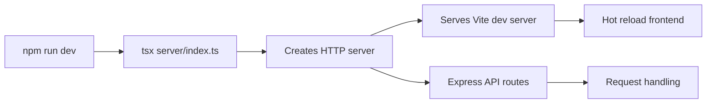
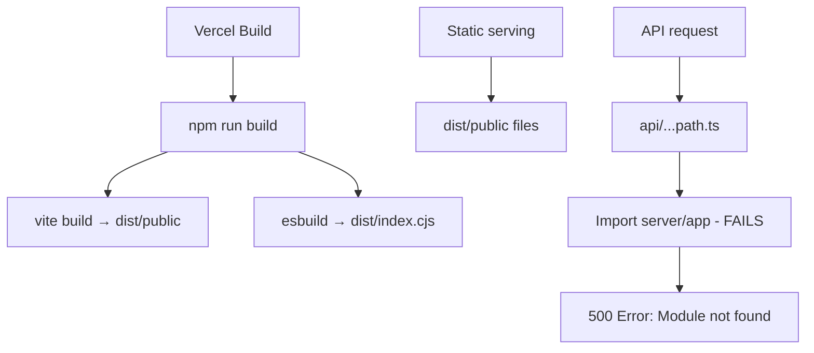

# Vercel API Deployment Fix - Design Document

## Executive Summary

This design addresses critical Vercel production deployment failures where the API returns 500 errors with module import failures and 404 errors on API routes, while the application works correctly in local development. The root causes include TypeScript compilation errors in production, incorrect serverless function imports, and missing Vercel runtime configuration.

## Problem Statement

### Current Issues

1. **500 Internal Server Error**: API routes fail with `Error [ERR_MODULE_NOT_FOUND]: Cannot find module '/var/task/server/app'`
2. **404 Not Found**: All `/api/*` routes return 404
3. **TypeScript Build Failures**:
   - `server/middleware/auth-supabase.ts`: Type predicate signature mismatch and incorrect Supabase User type usage
   - `server/storage.ts`: Drizzle ORM query builder type errors
4. **White Screen**: Frontend loads but API failures break application state
5. **Environment Variables**: Reliance on file-based `.env` reading which doesn't work in serverless

### Success Criteria

- Vercel deployment builds without TypeScript errors
- All `/api/*` endpoints return valid responses
- Frontend loads correctly and communicates with backend
- Local development and production environments both function identically
- No "works locally only" assumptions remain

## Architecture Analysis

### Current Stack

| Layer | Technology | Location |
|-------|-----------|----------|
| Frontend | React + Vite + Wouter | `client/` |
| Backend | Node.js + Express + TypeScript | `server/` |
| Database | PostgreSQL via Drizzle ORM | Supabase hosted |
| Auth | Hybrid: Supabase JWT + Passport sessions | `server/auth.ts`, `server/middleware/auth-supabase.ts` |
| Build Output | Static: `dist/public`, Server: `dist/index.cjs` | Generated by `script/build.ts` |
| Deployment | Vercel Serverless Functions | `api/[...path].ts` |

### Local Development Flow



### Current Vercel Flow



### Root Cause Analysis

#### Issue 1: Import Path Mismatch

**Problem**: `api/[...path].ts` imports `../server/app` which resolves to TypeScript source files, but Vercel runtime expects compiled JavaScript.

**Evidence**:
- Line 16 in `api/[...path].ts`: `import { createApp } from "../server/app";`
- Vercel runtime error: `Cannot find module '/var/task/server/app'`
- Build script creates `dist/index.cjs` but doesn't compile individual modules

**Root Cause**: Serverless function tries to import unbundled TypeScript source at runtime in a production environment where only compiled artifacts exist.

#### Issue 2: TypeScript Type Errors

**Problem A - auth-supabase.ts**: 
- Attempts to use `req.isAuthenticated` boolean property alongside Passport's `isAuthenticated()` method
- Accesses non-existent Supabase User properties: `emailConfirmed`, `role`

**Evidence**:
```
TS2717: isAuthenticated type mismatch
TS2322: () => true not assignable to () => this is AuthenticatedRequest
TS2339: emailConfirmed does not exist on User
TS2339: role does not exist on User
```

**Problem B - storage.ts**:
- Drizzle query builder missing `.where()` method due to incorrect query composition

#### Issue 3: req.isAuthenticated Usage Conflict

**Problem**: Code uses `req.isAuthenticated()` (Passport method) in 25+ locations but Supabase middleware doesn't extend Express Request with this method.

**Evidence**: `grep_code` found 25 uses of `req.isAuthenticated()` across routes
- `server/routes.ts`: Lines 714, 727, 750, 808, 856, etc.
- `server/ai/routes.ts`: Lines 112, 201, 555, 693, 792, etc.

**Current middleware flow**:
1. `authFromSupabase()` sets `req.user` from JWT
2. Passport middleware provides `req.isAuthenticated()` method
3. Routes call `req.isAuthenticated()` expecting Passport behavior
4. Supabase-only requests may not have Passport initialized

## Design Solution

### Strategy: Dual-Mode Compatibility

Maintain backward compatibility with existing Passport-based routes while supporting Supabase JWT authentication. Both authentication methods must coexist seamlessly.

### Solution 1: Fix Serverless Function Import Path

#### Approach: Bundle Express App with Serverless Function

The serverless function must import a compiled, self-contained Express application.

**Option A: Import from dist/index.cjs (Recommended)**

Create a separate export in `server/app.ts` that can be compiled and imported by the serverless function.

**Implementation Pattern**:

```
server/app.ts (exports createApp)
    ↓ compiled by esbuild
dist/server-app.cjs
    ↓ imported by
api/[...path].ts
```

**Changes Required**:
- Modify `script/build.ts` to compile `server/app.ts` to `dist/server-app.cjs` separately
- Update `api/[...path].ts` to import from compiled artifact
- Ensure all dependencies are either bundled or marked as external correctly

**Alternative Option B: Inline Bundle**

Bundle `server/app.ts` directly into `api/[...path].ts` using Vercel's automatic bundling. This requires ensuring TypeScript compilation happens before deployment.

**Decision**: Use Option A for explicit control over bundling and to maintain separation between serverless entry point and application logic.

### Solution 2: Fix TypeScript Compilation Errors

#### Fix 2A: auth-supabase.ts Type Issues

**Problem Analysis**:
- Supabase `User` type from `@supabase/supabase-js` does not include custom fields
- Email confirmation is stored in `user.email_confirmed_at` (timestamp) not `emailConfirmed` (boolean)
- Role is stored in `user.user_metadata.role` or `user.app_metadata.role`

**Solution Pattern**:

Use correct Supabase User properties:
| Incorrect Access | Correct Access | Notes |
|-----------------|----------------|-------|
| `user.emailConfirmed` | `!!user.email_confirmed_at` | Convert timestamp to boolean |
| `user.role` | `user.user_metadata?.role` | Access metadata object |

**Implementation Steps**:
1. Fix line 95: Use `authUser.email_confirmed_at` instead of non-existent property
2. Remove conflicting `isAuthenticated` boolean (lines 159-176 conflict)
3. Keep `hasAuthUser()` and `getAuthUser()` type guards
4. Document that middleware sets `req.user` but does NOT provide `req.isAuthenticated()` method

#### Fix 2B: storage.ts Drizzle Query Issues

**Problem**: Query composition order issue where `.where()` is called on wrong query builder type.

**Solution Pattern**:

Ensure correct Drizzle query structure:
```
Correct: db.select().from(table).where(condition)
Incorrect: db.select({ field: aggregate() }).where() // missing .from()
```

**Analysis**: Line 508-514 in `storage.ts` shows correct usage with `.from()` before `.where()`. The error likely occurs in aggregation queries where the select uses `sql` template without proper aliasing.

**Implementation**: Review and fix any queries that use aggregations to ensure they follow the pattern:
```
select({ alias: sql<type>`expression`.as('name') })
  .from(table)
  .where(condition)
```

### Solution 3: Extend Express Request with isAuthenticated

#### Strategy: Add Type-Safe isAuthenticated Helper

Since both Passport and Supabase authentication are used, provide a unified `isAuthenticated()` helper that works with both.

**Implementation Pattern**:

Create a new utility file `server/auth-utils.ts`:

```
Purpose: Provide req.isAuthenticated() compatibility for both auth methods
Exports:
- isAuthenticated(req): boolean - checks both Passport and Supabase user
- requireAuth() - middleware enforcing authentication
```

**Logic**:
```
isAuthenticated(req) returns true if:
  - req.user exists (Passport session user OR Supabase JWT user)
  - AND user has required properties (id, email)
```

**Migration Strategy**:
- Keep existing `req.isAuthenticated?.()` calls (Passport)
- For routes that need both auth methods, replace with helper: `isAuthenticated(req)`
- Middleware order ensures both Passport and Supabase middleware run

### Solution 4: Fix Vercel Configuration

#### Current Configuration Analysis

`vercel.json`:
```json
{
  "buildCommand": "npm run build",
  "outputDirectory": "dist/public",
  "routes": [
    { "handle": "filesystem" },
    { "src": "/(.*)", "dest": "/index.html" }
  ],
  "functions": {
    "api/**/*": { "maxDuration": 60, "memory": 1024 }
  }
}
```

**Issues**:
- Routes configuration doesn't explicitly route `/api/*` to serverless function
- Catch-all route to `index.html` may intercept API calls
- No rewrites configuration for API prefix

#### Solution: Add Explicit API Routing

**Updated Configuration Pattern**:

```json
{
  "buildCommand": "npm run build",
  "outputDirectory": "dist/public",
  "rewrites": [
    { "source": "/api/:path*", "destination": "/api/:path*" }
  ],
  "routes": [
    { "handle": "filesystem" },
    { "src": "/api/(.*)", "dest": "/api/$1" },
    { "src": "/(.*)", "dest": "/index.html" }
  ],
  "functions": {
    "api/**/*.ts": { "maxDuration": 60, "memory": 1024 }
  }
}
```

**Rationale**:
- `rewrites` ensures `/api/*` paths are not caught by SPA fallback
- `routes` order: filesystem → API → SPA fallback
- Pattern `api/**/*.ts` explicitly includes TypeScript serverless functions

### Solution 5: Environment Variables Strategy

#### Problem Analysis

Local development uses `tsx --env-file=.env` to load environment variables from file. Vercel serverless functions receive environment variables through `process.env` without file reading.

**Current Risks**:
- Code that reads `.env` file directly will fail in production
- Client-side code needs `VITE_*` prefix for Vite to expose variables
- Sensitive keys must not be exposed to client

#### Solution: Environment Variable Audit and Migration

**Required Server-Side Variables** (must be set in Vercel dashboard):
| Variable | Purpose | Used By |
|----------|---------|---------|
| DATABASE_URL | PostgreSQL connection | Drizzle ORM, storage |
| DATABASE_FILE_STORAGE_URL | Supabase Storage URL | File uploads |
| DATABASE_FILE_STORAGE_KEY | Supabase service role key | File uploads |
| SUPABASE_ANON_KEY | Supabase auth JWT validation | Auth middleware |
| SESSION_SECRET | Express session signing | Passport sessions |
| YANDEX_CLOUD_API_KEY | AI generation | Course generation |
| YANDEX_CLOUD_PROJECT_FOLDER_ID | AI generation | Course generation |
| YANDEX_PROMPT_ID | AI generation | Course generation |
| SMTP_* | Email sending | Email verification |
| APP_URL | Email verification links | Must match deployment URL |
| NODE_ENV | Production mode | Set to 'production' |

**Required Client-Side Variables** (must have `VITE_` prefix):
| Variable | Purpose |
|----------|---------|
| VITE_SUPABASE_URL | Client-side Supabase init |
| VITE_SUPABASE_ANON_KEY | Client-side auth |

**Implementation**:
1. Audit all `process.env` accesses in codebase
2. Ensure no file I/O for environment variable loading in production code paths
3. Update `.env.example` with all required variables
4. Document Vercel environment variable configuration in deployment guide

### Solution 6: Build Process Optimization

#### Current Build Flow

`script/build.ts` creates:
1. `dist/public/*` - Vite static build
2. `dist/index.cjs` - Server bundle for standalone deployment

**Issue**: Serverless function needs access to Express app, but `dist/index.cjs` includes HTTP server setup (not needed for serverless).

#### Solution: Create Serverless-Specific Bundle

**New Build Targets**:
1. `dist/public/*` - Frontend static files (unchanged)
2. `dist/index.cjs` - Standalone server (for local production mode)
3. `dist/server-app.cjs` - Express app only (for serverless import)

**Build Script Modifications**:

Add second esbuild entry:
```
Entry: server/app.ts
Output: dist/server-app.cjs
Purpose: Exports createApp() function without HTTP server setup
External: Same as main bundle
```

**Rationale**: Separation of concerns allows serverless function to import only the Express app without server lifecycle code.

## Implementation Plan

### Phase 1: Fix TypeScript Errors (Blocking)

**Priority**: Critical - prevents build

**Tasks**:
1. Fix `server/middleware/auth-supabase.ts`:
   - Replace `authUser.emailConfirmed` with `!!authUser.email_confirmed_at`
   - Replace `authUser.role` access with `authUser.user_metadata?.role || authUser.app_metadata?.role`
   - Remove any conflicting `isAuthenticated` boolean definitions
   - Add type guards for safe property access

2. Fix `server/storage.ts`:
   - Identify and fix Drizzle query composition errors
   - Ensure all queries with aggregations properly alias results
   - Add explicit `.from()` calls before `.where()`
   - Test query type inference locally

3. Create `server/auth-utils.ts`:
   - Implement `isAuthenticated(req: Request): boolean` helper
   - Implement `requireAuth(options?)` middleware
   - Export for use across routes

**Validation**:
- Run `npm run check` - must pass with zero errors
- Run `npm run build` - must complete successfully

### Phase 2: Fix Serverless Import Path

**Priority**: Critical - fixes 500 errors

**Tasks**:
1. Modify `script/build.ts`:
   - Add second esbuild configuration for `server/app.ts`
   - Output to `dist/server-app.cjs`
   - Use same external dependencies as main build
   - Ensure `createApp` is exported

2. Update `api/[...path].ts`:
   - Change import from `../server/app` to compiled artifact
   - Handle both development and production import paths
   - Add error logging for import failures

3. Test import resolution:
   - Verify compiled artifact exists after build
   - Test serverless function locally with compiled import
   - Validate no runtime module resolution errors

**Validation**:
- Build and inspect `dist/server-app.cjs` exists
- Import test: `node -e "require('./dist/server-app.cjs').createApp"`
- Deploy to Vercel preview environment and test `/api/health`

### Phase 3: Update Vercel Configuration

**Priority**: High - fixes routing

**Tasks**:
1. Update `vercel.json`:
   - Add explicit API rewrites
   - Reorder routes: filesystem → API → SPA
   - Update functions pattern to include TypeScript files

2. Test routing priority:
   - Static file requests go to filesystem
   - `/api/*` requests go to serverless function
   - All other requests go to SPA index.html

**Validation**:
- Deploy to preview and test:
  - `/` returns SPA
  - `/api/health` returns JSON
  - `/api/login` returns 200 or 401 (not 404)
  - Static assets load correctly

### Phase 4: Environment Variable Audit

**Priority**: High - prevents runtime failures

**Tasks**:
1. Audit codebase for environment variable usage:
   - Find all `process.env.*` accesses
   - Identify client-side vs server-side usage
   - Check for file-based `.env` reading

2. Update client environment variables:
   - Ensure all client vars use `VITE_` prefix
   - Remove any `process.env` access in client code
   - Use `import.meta.env` instead

3. Document required variables:
   - Update `.env.example`
   - Create Vercel deployment checklist
   - Document which variables are sensitive

**Validation**:
- Local dev works with `.env` file
- Build succeeds without `.env` file
- Deployed app logs show correct environment detection

### Phase 5: Migration Strategy for isAuthenticated

**Priority**: Medium - improves code consistency

**Tasks**:
1. Create backward-compatible helper:
   - Support both Passport and Supabase users
   - No breaking changes to existing routes
   - Add JSDoc documentation

2. Gradual migration:
   - Start with new routes using helper
   - Refactor critical routes first
   - Leave legacy routes unchanged initially

3. Testing:
   - Test with Passport session auth
   - Test with Supabase JWT auth
   - Test with no auth
   - Test mixed scenarios

**Validation**:
- All auth scenarios work correctly
- No regression in existing auth flows
- Both Passport and JWT auth functional

### Phase 6: End-to-End Testing

**Priority**: Critical - validates entire solution

**Test Scenarios**:

| Scenario | Steps | Expected Result |
|----------|-------|-----------------|
| Static Serving | Navigate to `/` | SPA loads, no console errors |
| Health Check | GET `/api/health` | 200 with JSON |
| Auth Flow | POST `/api/register`, POST `/api/login` | Users can register and login |
| Protected Routes | GET `/api/tracks/list` without auth | 401 Unauthorized |
| Protected Routes | GET `/api/tracks/list` with JWT | 200 with data or empty array |
| Course Generation | POST `/api/tracks/generate` with files | 201 with track data |
| Supabase JWT | Login with Supabase client, call API | JWT validated, user resolved |
| Passport Session | Login with credentials, call API | Session validated, user resolved |

**Validation Commands**:
```bash
# Local development
npm run dev
curl http://localhost:5000/api/health

# Local production simulation
npm run build
npm run start
curl http://localhost:5000/api/health

# Vercel preview deployment
vercel deploy
curl https://[preview-url]/api/health
```

## Rollout Strategy

### Development Environment

No changes required - development uses `tsx` with TypeScript source files directly.

### Staging/Preview Environment

1. Push changes to feature branch
2. Vercel creates preview deployment automatically
3. Run automated test suite against preview URL
4. Manual smoke testing of critical flows

### Production Environment

1. Merge to `main` branch after preview validation
2. Vercel triggers production deployment
3. Monitor deployment logs for errors
4. Smoke test production deployment
5. Monitor error tracking for runtime issues

### Rollback Plan

If production deployment fails:
1. Revert merge commit in `main`
2. Vercel automatically deploys previous version
3. Investigate failures in preview environment
4. Fix and re-test before re-deploying

## Risk Assessment

| Risk | Severity | Mitigation |
|------|----------|------------|
| Build fails with TS errors | High | Phase 1 must complete first, validate locally |
| Serverless import fails at runtime | High | Test compiled artifact import before deployment |
| API routes return 404 | High | Validate Vercel routing in preview environment |
| Session auth breaks | Medium | Maintain Passport middleware, test both flows |
| Environment variables missing | Medium | Document all required vars, validate before deploy |
| Cold start timeouts | Low | Vercel function timeout set to 60s, monitor actual durations |

## Monitoring and Validation

### Post-Deployment Checks

**Immediately After Deployment**:
1. Verify frontend loads without white screen
2. Check browser console for API errors
3. Test login flow end-to-end
4. Verify protected routes require authentication
5. Test course generation (if not trial-limited)

**Within 24 Hours**:
1. Monitor Vercel function logs for errors
2. Check error rates in Vercel analytics
3. Validate response times are acceptable
4. Review user-reported issues

### Logging Strategy

**Serverless Function Logging**:
- Log all unhandled errors with stack traces
- Log request IDs for traceability
- Log authentication method used (JWT vs session)
- Log module import success/failure

**Client-Side Logging**:
- Log API response errors
- Log authentication state changes
- Do not log sensitive tokens or passwords

### Success Metrics

**Technical Metrics**:
- Build success rate: 100%
- API 500 error rate: < 0.1%
- API 404 error rate: 0% for valid routes
- Frontend load time: < 3s
- API cold start: < 5s

**Functional Metrics**:
- User registration success rate: > 95%
- Login success rate: > 95%
- Course generation success rate: > 90%
- JWT authentication success rate: > 98%

## Appendix

### File Modifications Summary

| File | Changes | Reason |
|------|---------|--------|
| `server/middleware/auth-supabase.ts` | Fix User type property access | Resolve TS errors |
| `server/storage.ts` | Fix Drizzle query composition | Resolve TS errors |
| `server/auth-utils.ts` | NEW: Add isAuthenticated helper | Unify auth checks |
| `script/build.ts` | Add server-app.cjs build target | Enable serverless import |
| `api/[...path].ts` | Import from compiled artifact | Fix runtime import error |
| `vercel.json` | Add API rewrites and routing | Fix 404 errors |
| `.env.example` | Document all required variables | Deployment guide |

### Vercel Dashboard Configuration

**Build Settings**:
- Framework Preset: `Vite`
- Root Directory: `.` (repository root)
- Build Command: `npm run build`
- Output Directory: `dist/public`
- Install Command: `npm install`
- Node Version: `20.x` (must match development)

**Environment Variables** (Add in Vercel dashboard):
- Copy all from `.env.example`
- Set `NODE_ENV=production`
- Update `APP_URL` to production domain
- Mark sensitive vars as "secret"

**Function Settings**:
- Region: Closest to database region (minimize latency)
- Memory: 1024 MB
- Max Duration: 60 seconds

### Testing Checklist

**Pre-Deployment**:
- [ ] `npm run check` passes
- [ ] `npm run build` succeeds
- [ ] `dist/server-app.cjs` exists
- [ ] Local production mode works (`npm run start`)
- [ ] All environment variables documented

**Post-Deployment (Preview)**:
- [ ] Frontend loads without errors
- [ ] `/api/health` returns 200
- [ ] `/api/login` accepts requests (401 without creds is OK)
- [ ] Static assets load correctly
- [ ] Browser console shows no 404 errors

**Post-Deployment (Production)**:
- [ ] Repeat all preview checks
- [ ] Test with real user credentials
- [ ] Verify email verification flow
- [ ] Test course generation (if quota allows)
- [ ] Monitor logs for 24 hours

### Common Pitfalls and Solutions

**Pitfall**: Serverless function times out on cold start
**Solution**: Optimize imports, consider route-level splitting, increase timeout

**Pitfall**: Environment variables not available in build
**Solution**: Vite build-time vs runtime distinction - use `import.meta.env` for build-time

**Pitfall**: Session cookies not working on Vercel
**Solution**: Ensure `trust proxy` set, `secure: true` in production, domain matches

**Pitfall**: Database connection pool exhausted
**Solution**: Use connection pooling with `connect-pg-simple`, set max connections

**Pitfall**: CORS errors in production
**Solution**: Verify `APP_URL` matches frontend domain, check Vercel domain configuration

### Support and Escalation

**If deployment fails**:
1. Check Vercel build logs for specific error
2. Review function logs for runtime errors
3. Test preview deployment before production
4. Roll back to previous working version if critical

**If API returns unexpected errors**:
1. Check function logs in Vercel dashboard
2. Verify environment variables are set correctly
3. Test with curl to isolate frontend vs backend issue
4. Enable verbose logging temporarily

**Contact points**:
- Vercel Support: For platform-specific issues
- Supabase Support: For database/auth connectivity
- Repository maintainer: For application logic issues

**Priority**: Medium - improves code consistency

**Tasks**:
1. Create backward-compatible helper:
   - Support both Passport and Supabase users
   - No breaking changes to existing routes
   - Add JSDoc documentation

2. Gradual migration:
   - Start with new routes using helper
   - Refactor critical routes first
   - Leave legacy routes unchanged initially

3. Testing:
   - Test with Passport session auth
   - Test with Supabase JWT auth
   - Test with no auth
   - Test mixed scenarios

**Validation**:
- All auth scenarios work correctly
- No regression in existing auth flows
- Both Passport and JWT auth functional

### Phase 6: End-to-End Testing

**Priority**: Critical - validates entire solution

**Test Scenarios**:

| Scenario | Steps | Expected Result |
|----------|-------|-----------------|
| Static Serving | Navigate to `/` | SPA loads, no console errors |
| Health Check | GET `/api/health` | 200 with JSON |
| Auth Flow | POST `/api/register`, POST `/api/login` | Users can register and login |
| Protected Routes | GET `/api/tracks/list` without auth | 401 Unauthorized |
| Protected Routes | GET `/api/tracks/list` with JWT | 200 with data or empty array |
| Course Generation | POST `/api/tracks/generate` with files | 201 with track data |
| Supabase JWT | Login with Supabase client, call API | JWT validated, user resolved |
| Passport Session | Login with credentials, call API | Session validated, user resolved |

**Validation Commands**:
```bash
# Local development
npm run dev
curl http://localhost:5000/api/health

# Local production simulation
npm run build
npm run start
curl http://localhost:5000/api/health

# Vercel preview deployment
vercel deploy
curl https://[preview-url]/api/health
```

## Rollout Strategy

### Development Environment

No changes required - development uses `tsx` with TypeScript source files directly.

### Staging/Preview Environment

1. Push changes to feature branch
2. Vercel creates preview deployment automatically
3. Run automated test suite against preview URL
4. Manual smoke testing of critical flows

### Production Environment

1. Merge to `main` branch after preview validation
2. Vercel triggers production deployment
3. Monitor deployment logs for errors
4. Smoke test production deployment
5. Monitor error tracking for runtime issues

### Rollback Plan

If production deployment fails:
1. Revert merge commit in `main`
2. Vercel automatically deploys previous version
3. Investigate failures in preview environment
4. Fix and re-test before re-deploying

## Risk Assessment

| Risk | Severity | Mitigation |
|------|----------|------------|
| Build fails with TS errors | High | Phase 1 must complete first, validate locally |
| Serverless import fails at runtime | High | Test compiled artifact import before deployment |
| API routes return 404 | High | Validate Vercel routing in preview environment |
| Session auth breaks | Medium | Maintain Passport middleware, test both flows |
| Environment variables missing | Medium | Document all required vars, validate before deploy |
| Cold start timeouts | Low | Vercel function timeout set to 60s, monitor actual durations |

## Monitoring and Validation

### Post-Deployment Checks

**Immediately After Deployment**:
1. Verify frontend loads without white screen
2. Check browser console for API errors
3. Test login flow end-to-end
4. Verify protected routes require authentication
5. Test course generation (if not trial-limited)

**Within 24 Hours**:
1. Monitor Vercel function logs for errors
2. Check error rates in Vercel analytics
3. Validate response times are acceptable
4. Review user-reported issues

### Logging Strategy

**Serverless Function Logging**:
- Log all unhandled errors with stack traces
- Log request IDs for traceability
- Log authentication method used (JWT vs session)
- Log module import success/failure

**Client-Side Logging**:
- Log API response errors
- Log authentication state changes
- Do not log sensitive tokens or passwords

### Success Metrics

**Technical Metrics**:
- Build success rate: 100%
- API 500 error rate: < 0.1%
- API 404 error rate: 0% for valid routes
- Frontend load time: < 3s
- API cold start: < 5s

**Functional Metrics**:
- User registration success rate: > 95%
- Login success rate: > 95%
- Course generation success rate: > 90%
- JWT authentication success rate: > 98%

## Appendix

### File Modifications Summary

| File | Changes | Reason |
|------|---------|--------|
| `server/middleware/auth-supabase.ts` | Fix User type property access | Resolve TS errors |
| `server/storage.ts` | Fix Drizzle query composition | Resolve TS errors |
| `server/auth-utils.ts` | NEW: Add isAuthenticated helper | Unify auth checks |
| `script/build.ts` | Add server-app.cjs build target | Enable serverless import |
| `api/[...path].ts` | Import from compiled artifact | Fix runtime import error |
| `vercel.json` | Add API rewrites and routing | Fix 404 errors |
| `.env.example` | Document all required variables | Deployment guide |

### Vercel Dashboard Configuration

**Build Settings**:
- Framework Preset: `Vite`
- Root Directory: `.` (repository root)
- Build Command: `npm run build`
- Output Directory: `dist/public`
- Install Command: `npm install`
- Node Version: `20.x` (must match development)

**Environment Variables** (Add in Vercel dashboard):
- Copy all from `.env.example`
- Set `NODE_ENV=production`
- Update `APP_URL` to production domain
- Mark sensitive vars as "secret"

**Function Settings**:
- Region: Closest to database region (minimize latency)
- Memory: 1024 MB
- Max Duration: 60 seconds

### Testing Checklist

**Pre-Deployment**:
- [ ] `npm run check` passes
- [ ] `npm run build` succeeds
- [ ] `dist/server-app.cjs` exists
- [ ] Local production mode works (`npm run start`)
- [ ] All environment variables documented

**Post-Deployment (Preview)**:
- [ ] Frontend loads without errors
- [ ] `/api/health` returns 200
- [ ] `/api/login` accepts requests (401 without creds is OK)
- [ ] Static assets load correctly
- [ ] Browser console shows no 404 errors

**Post-Deployment (Production)**:
- [ ] Repeat all preview checks
- [ ] Test with real user credentials
- [ ] Verify email verification flow
- [ ] Test course generation (if quota allows)
- [ ] Monitor logs for 24 hours

### Common Pitfalls and Solutions

**Pitfall**: Serverless function times out on cold start
**Solution**: Optimize imports, consider route-level splitting, increase timeout

**Pitfall**: Environment variables not available in build
**Solution**: Vite build-time vs runtime distinction - use `import.meta.env` for build-time

**Pitfall**: Session cookies not working on Vercel
**Solution**: Ensure `trust proxy` set, `secure: true` in production, domain matches

**Pitfall**: Database connection pool exhausted
**Solution**: Use connection pooling with `connect-pg-simple`, set max connections

**Pitfall**: CORS errors in production
**Solution**: Verify `APP_URL` matches frontend domain, check Vercel domain configuration

### Support and Escalation

**If deployment fails**:
1. Check Vercel build logs for specific error
2. Review function logs for runtime errors
3. Test preview deployment before production
4. Roll back to previous working version if critical

**If API returns unexpected errors**:
1. Check function logs in Vercel dashboard
2. Verify environment variables are set correctly
3. Test with curl to isolate frontend vs backend issue
4. Enable verbose logging temporarily

**Contact points**:
- Vercel Support: For platform-specific issues
- Supabase Support: For database/auth connectivity
- Repository maintainer: For application logic issues

**Priority**: Medium - improves code consistency

**Tasks**:
1. Create backward-compatible helper:
   - Support both Passport and Supabase users
   - No breaking changes to existing routes
   - Add JSDoc documentation

2. Gradual migration:
   - Start with new routes using helper
   - Refactor critical routes first
   - Leave legacy routes unchanged initially

3. Testing:
   - Test with Passport session auth
   - Test with Supabase JWT auth
   - Test with no auth
   - Test mixed scenarios

**Validation**:
- All auth scenarios work correctly
- No regression in existing auth flows
- Both Passport and JWT auth functional

### Phase 6: End-to-End Testing

**Priority**: Critical - validates entire solution

**Test Scenarios**:

| Scenario | Steps | Expected Result |
|----------|-------|-----------------|
| Static Serving | Navigate to `/` | SPA loads, no console errors |
| Health Check | GET `/api/health` | 200 with JSON |
| Auth Flow | POST `/api/register`, POST `/api/login` | Users can register and login |
| Protected Routes | GET `/api/tracks/list` without auth | 401 Unauthorized |
| Protected Routes | GET `/api/tracks/list` with JWT | 200 with data or empty array |
| Course Generation | POST `/api/tracks/generate` with files | 201 with track data |
| Supabase JWT | Login with Supabase client, call API | JWT validated, user resolved |
| Passport Session | Login with credentials, call API | Session validated, user resolved |

**Validation Commands**:
```bash
# Local development
npm run dev
curl http://localhost:5000/api/health

# Local production simulation
npm run build
npm run start
curl http://localhost:5000/api/health

# Vercel preview deployment
vercel deploy
curl https://[preview-url]/api/health
```

## Rollout Strategy

### Development Environment

No changes required - development uses `tsx` with TypeScript source files directly.

### Staging/Preview Environment

1. Push changes to feature branch
2. Vercel creates preview deployment automatically
3. Run automated test suite against preview URL
4. Manual smoke testing of critical flows

### Production Environment

1. Merge to `main` branch after preview validation
2. Vercel triggers production deployment
3. Monitor deployment logs for errors
4. Smoke test production deployment
5. Monitor error tracking for runtime issues

### Rollback Plan

If production deployment fails:
1. Revert merge commit in `main`
2. Vercel automatically deploys previous version
3. Investigate failures in preview environment
4. Fix and re-test before re-deploying

## Risk Assessment

| Risk | Severity | Mitigation |
|------|----------|------------|
| Build fails with TS errors | High | Phase 1 must complete first, validate locally |
| Serverless import fails at runtime | High | Test compiled artifact import before deployment |
| API routes return 404 | High | Validate Vercel routing in preview environment |
| Session auth breaks | Medium | Maintain Passport middleware, test both flows |
| Environment variables missing | Medium | Document all required vars, validate before deploy |
| Cold start timeouts | Low | Vercel function timeout set to 60s, monitor actual durations |

## Monitoring and Validation

### Post-Deployment Checks

**Immediately After Deployment**:
1. Verify frontend loads without white screen
2. Check browser console for API errors
3. Test login flow end-to-end
4. Verify protected routes require authentication
5. Test course generation (if not trial-limited)

**Within 24 Hours**:
1. Monitor Vercel function logs for errors
2. Check error rates in Vercel analytics
3. Validate response times are acceptable
4. Review user-reported issues

### Logging Strategy

**Serverless Function Logging**:
- Log all unhandled errors with stack traces
- Log request IDs for traceability
- Log authentication method used (JWT vs session)
- Log module import success/failure

**Client-Side Logging**:
- Log API response errors
- Log authentication state changes
- Do not log sensitive tokens or passwords

### Success Metrics

**Technical Metrics**:
- Build success rate: 100%
- API 500 error rate: < 0.1%
- API 404 error rate: 0% for valid routes
- Frontend load time: < 3s
- API cold start: < 5s

**Functional Metrics**:
- User registration success rate: > 95%
- Login success rate: > 95%
- Course generation success rate: > 90%
- JWT authentication success rate: > 98%

## Appendix

### File Modifications Summary

| File | Changes | Reason |
|------|---------|--------|
| `server/middleware/auth-supabase.ts` | Fix User type property access | Resolve TS errors |
| `server/storage.ts` | Fix Drizzle query composition | Resolve TS errors |
| `server/auth-utils.ts` | NEW: Add isAuthenticated helper | Unify auth checks |
| `script/build.ts` | Add server-app.cjs build target | Enable serverless import |
| `api/[...path].ts` | Import from compiled artifact | Fix runtime import error |
| `vercel.json` | Add API rewrites and routing | Fix 404 errors |
| `.env.example` | Document all required variables | Deployment guide |

### Vercel Dashboard Configuration

**Build Settings**:
- Framework Preset: `Vite`
- Root Directory: `.` (repository root)
- Build Command: `npm run build`
- Output Directory: `dist/public`
- Install Command: `npm install`
- Node Version: `20.x` (must match development)

**Environment Variables** (Add in Vercel dashboard):
- Copy all from `.env.example`
- Set `NODE_ENV=production`
- Update `APP_URL` to production domain
- Mark sensitive vars as "secret"

**Function Settings**:
- Region: Closest to database region (minimize latency)
- Memory: 1024 MB
- Max Duration: 60 seconds

### Testing Checklist

**Pre-Deployment**:
- [ ] `npm run check` passes
- [ ] `npm run build` succeeds
- [ ] `dist/server-app.cjs` exists
- [ ] Local production mode works (`npm run start`)
- [ ] All environment variables documented

**Post-Deployment (Preview)**:
- [ ] Frontend loads without errors
- [ ] `/api/health` returns 200
- [ ] `/api/login` accepts requests (401 without creds is OK)
- [ ] Static assets load correctly
- [ ] Browser console shows no 404 errors

**Post-Deployment (Production)**:
- [ ] Repeat all preview checks
- [ ] Test with real user credentials
- [ ] Verify email verification flow
- [ ] Test course generation (if quota allows)
- [ ] Monitor logs for 24 hours

### Common Pitfalls and Solutions

**Pitfall**: Serverless function times out on cold start
**Solution**: Optimize imports, consider route-level splitting, increase timeout

**Pitfall**: Environment variables not available in build
**Solution**: Vite build-time vs runtime distinction - use `import.meta.env` for build-time

**Pitfall**: Session cookies not working on Vercel
**Solution**: Ensure `trust proxy` set, `secure: true` in production, domain matches

**Pitfall**: Database connection pool exhausted
**Solution**: Use connection pooling with `connect-pg-simple`, set max connections

**Pitfall**: CORS errors in production
**Solution**: Verify `APP_URL` matches frontend domain, check Vercel domain configuration

### Support and Escalation

**If deployment fails**:
1. Check Vercel build logs for specific error
2. Review function logs for runtime errors
3. Test preview deployment before production
4. Roll back to previous working version if critical

**If API returns unexpected errors**:
1. Check function logs in Vercel dashboard
2. Verify environment variables are set correctly
3. Test with curl to isolate frontend vs backend issue
4. Enable verbose logging temporarily

**Contact points**:
- Vercel Support: For platform-specific issues
- Supabase Support: For database/auth connectivity
- Repository maintainer: For application logic issues
